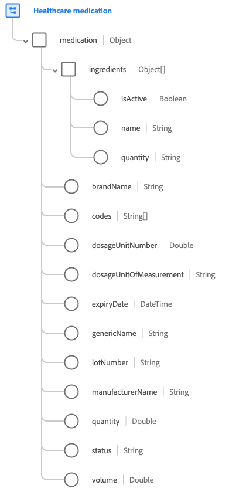

# [!UICONTROL Arzneimittel] Schemafeldgruppe

[!UICONTROL Arzneimittel] ist eine Standardschemafeldgruppe für die [[!UICONTROL Medizin] class](../../classes/medication.md). Es wird ein einzelnes Feld vom Typ Objekt bereitgestellt `medication` erfasst Details wie Markenname, Losnummer und Menge.

| Eigenschaft | Datentyp | Beschreibung |
| --- | --- | --- |
| `ingredients` | Array von Objekten | Listet die im Arzneimittel vorhandenen Bestandteile auf. Jedes Objekt enthält die folgenden Eigenschaften: <ul><li>`isActive`: (Boolesch) Gibt an, ob dieser Wirkstoff noch aktiv in dieser Medikation verwendet wird.</li><li>`name`: (String) Der Name der Zutat.</li><li>`quantity`: (String) Die Menge des Inhaltsstoffes, der in der Medikation vorhanden ist.</li></ul> |
| `brandName` | Zeichenfolge | Der Markenname des Medikaments. |
| `codes` | Zeichenfolgen-Array | Eine Liste von Codes, die dieses Medikament identifizieren. |
| `dosageUnitNumber` | Double | Die Nummer der Dosiereinheit für das Arzneimittel. |
| `dosageUnitOfMeasurement` | Zeichenfolge | Die Maßeinheit für die Dosiernummer. |
| `expiryDate` | DateTime | Verfalldatum des Arzneimittels. |
| `genericName` | Zeichenfolge | Der generische Name des Arzneimittels. |
| `lotNumber` | Zeichenfolge | Die eindeutige Kennung für den Arzneimittelstapel. |
| `manufacturerName` | Zeichenfolge | Der Name des Arzneimittelherstellers. |
| `quantity` | Double | Die Menge des Arzneimittels in der Packung. |
| `status` | Zeichenfolge | Allgemeiner Status, der angibt, ob das Arzneimittel/Medikament aktiv ist oder nicht. |
| `volume` | Double | Das Arzneimittelvolumen. |

{style=&quot;table-layout:auto&quot;}

Weitere Informationen zur Feldergruppe finden Sie im Abschnitt [öffentliches XDM-Repository](https://github.com/adobe/xdm/blob/master/components/fieldgroups/medication/healthcare-medication.schema.json).
