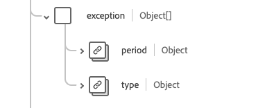
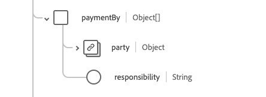

# [!UICONTROL Abdeckung] Schemafeldgruppe

[!UICONTROL Abdeckung] ist eine Standardschemafeldgruppe für die [[!DNL Plan] Klasse](../../classes/plan.md). Es bietet ein einzelnes Objektfeld `healthcareCoverage`, mit dem die allgemeinen Kennungen und Deskriptoren eines Versicherungsplans bereitgestellt werden sollen, in der Regel die Informationen, die auf einer Versicherungskarte erscheinen und die dazu verwendet werden können, die Bereitstellung von Gesundheitsprodukten und -dienstleistungen ganz oder teilweise zu bezahlen.

| Anzeigename | Eigenschaft | Datentyp | Beschreibung |
| --- | --- | --- | --- |
| [!UICONTROL Zuschussempfänger planen] | `beneficiary` | [[!UICONTROL Referenz]](../../data-types/healthcare/reference.md) | Der Versicherungsversicherer und der Patient, wenn Produkte oder Dienstleistungen erbracht werden. |
| [!UICONTROL Klasse] | `class` | Array von Objekten | Eine Suite von versichererspezifischen Klassifikatoren. Weitere Informationen finden Sie im Abschnitt [unter ](#class) . |
| [!UICONTROL Contact] | `contract` | Array von [[!UICONTROL Verweis]](../../data-types/healthcare/reference.md) | Die Versicherungspolice(en), die diesen Versicherungsschutz darstellen. |
| [!UICONTROL Kosten für den Begünstigten] | `costToBeneficiary` | Array von Objekten | Eine Suite von Codes, die die Kostenstelle und den zugehörigen Betrag angeben, die in der Richtlinie beschrieben und möglicherweise auf der Gesundheitskarte enthalten waren. Weitere Informationen finden Sie im Abschnitt [unter ](#cost-to-beneficiary) . |
| [!UICONTROL Exception] | `exception` | Array von Objekten | Eine Suite von Codes, die Ausnahmen oder Ermäßigungen für die Patientenkosten und deren effektive Zeiträume angeben. Weitere Informationen finden Sie im Abschnitt [unter ](#exception) . |
| [!UICONTROL ID] | `identifier` | Array von [[!UICONTROL Bezeichner]](../../data-types/healthcare/identifier.md) | Die vom Versicherer ausgestellte Deckungskennung. |
| [!UICONTROL Versicherungsplan] | `insurancePlan` | [[!UICONTROL Referenz]](../../data-types/healthcare/reference.md) | Im Versicherungsplan werden Einzelheiten, Vorteile und Kosten aufgeführt, die diesen Versicherungsschutz ausmachen. |
| [!UICONTROL Versicherung] | `insurer` | [[!UICONTROL Referenz]](../../data-types/healthcare/reference.md) | Das Programm oder der Plan-Unterzeichner, Zahler oder Versicherungsunternehmen. |
| [!UICONTROL Zahlung durch ] | `paymentBy` | Array von Objekten | Der Link zur Zahlstelle und optional, was sie zu zahlen haben. Weitere Informationen finden Sie im Abschnitt [unter ](#payment-by) . |
| [!UICONTROL Beginn- und Enddaten abdecken] | `period` | [[!UICONTROL Zeitraum]](../../data-types/healthcare/period.md) | Der Zeitraum, in dem die Abdeckung aktiv ist. Ein fehlendes Startdatum gibt an, dass das Startdatum nicht bekannt ist, ein fehlendes Enddatum bedeutet, dass die Abdeckung fortgesetzt wird. |
| [!UICONTROL Policy Holder] | `policyHolder` | [[!UICONTROL Referenz]](../../data-types/healthcare/reference.md) | Die Partei, die die Versicherungspolice besitzt. |
| [!UICONTROL Beziehung des Zuschussempfängers] | `relationship` | [[!UICONTROL Codeable Concept]](../../data-types/healthcare/codeable-concept.md) | Beziehung des Empfängers zum Abonnenten. |
| [!UICONTROL Abonnent] | `subscriber` | [[!UICONTROL Referenz]](../../data-types/healthcare/reference.md) | Die Partei, die das vertragliche Verhältnis zur Police hat. |
| [!UICONTROL Abonnenten-ID] | `subscriberId` | Array von [[!UICONTROL Bezeichner]](../../data-types/healthcare/identifier.md) | Der Versicherer hat die ID des Abonnenten zugewiesen. |
| [!UICONTROL Typ] | `type` | [[!UICONTROL Codeable Concept]](../../data-types/healthcare/codeable-concept.md) | Die Art der Abdeckung. |
| [!UICONTROL Abhängige Zahl] | `dependent` | String | Der Bezeichner für eine abhängige Person unter der Abdeckung. |
| [!UICONTROL Kind] | `kind` | String | Die Art der Berichterstattung. Der Wert dieser Eigenschaft muss mit einem der folgenden bekannten Enum-Werte übereinstimmen. <li> `insurance` </li> <li> `self-pay` </li> <li> `other` </li> |
| [!UICONTROL Versicherungsnetzwerk] | `network` | String | Das Netz von Anbietern, für die der Begünstigte eine Behandlung beantragen kann, die zum Netztarif abgedeckt wird, da ansonsten die Bedingungen für die Nichtnetznutzung gelten. |
| [!UICONTROL Erfassungsreihenfolge] | `order` | Ganzzahl | Die relative Reihenfolge der Abdeckung mit einem Mindestwert von `0`. |
| [!UICONTROL Status] | `status` | String | Der Status der Abdeckung. Der Wert dieser Eigenschaft muss mit einem der folgenden bekannten Enum-Werte übereinstimmen. <li> `active` </li> <li> `cancelled` </li> <li> `draft` </li> <li> `entered-in-error` </li> |
| [!UICONTROL Subrogation] | `subrogation` | Boolesch | Wenn `true`, wurde diese Versicherungsinstanz nicht zur Entscheidungsfindung hinzugefügt, sondern um den Versicherern die Details zur Kostenerstattung zur Verfügung zu stellen. |

Weitere Informationen zur Feldergruppe finden Sie im öffentlichen XDM-Repository:

* [Ausgefülltes Beispiel](https://github.com/adobe/xdm/blob/master/extensions/industry/healthcare/fhir/fieldgroups/coverage.example.1.json)
* [Vollständiges Schema](https://github.com/adobe/xdm/blob/master/extensions/industry/healthcare/fhir/fieldgroups/coverage.schema.json)

## `class` {#class}

`class` wird als Array von Objekten bereitgestellt. Die Struktur der einzelnen Objekte wird nachfolgend beschrieben.

| Anzeigename | Eigenschaft | Datentyp | Beschreibung |
| --- | --- | --- | --- |
| [!UICONTROL Typ] | `type` | Array von [[!UICONTROL Codeable Concept]](../../data-types/healthcare/codeable-concept.md) | Der Klassifizierungstyp, für den eine versichererspezifische Klassenbezeichnung oder eine Nummer und ein optionaler Name angegeben ist. Beispielsweise kann der Typ verwendet werden, um eine Deckungsklasse, eine Arbeitgebergruppe, eine Richtlinie oder einen Plan zu identifizieren. |
| [!UICONTROL Wert] | `value` | [[!UICONTROL ID]](../../data-types/healthcare/identifier.md) | Die alphanumerische Kennung, die mit dem vom Versicherer ausgestellten Titel verknüpft ist. |
| [!UICONTROL Name] | `name` | String | Eine kurze Beschreibung für die Klasse. |

## `costToBeneficiary` {#cost-to-beneficiary}

`costToBeneficiary` wird als Array von Objekten bereitgestellt. Die Struktur der einzelnen Objekte wird nachfolgend beschrieben.

| Anzeigename | Eigenschaft | Datentyp | Beschreibung |
| --- | --- | --- | --- |
| [!UICONTROL Kategorie] | `category` | [[!UICONTROL Codeable Concept]](../../data-types/healthcare/codeable-concept.md) | Der Code zur Bestimmung der allgemeinen Art der Vorteile, unter denen Produkte und Dienstleistungen erbracht werden. |
| [!UICONTROL Netzwerk] | `network` | [[!UICONTROL Codeable Concept]](../../data-types/healthcare/codeable-concept.md) | Der Code, der angibt, ob sich die Vorteile auf netzwerkinterne oder nicht netzwerkfähige Anbieter beziehen. |
| [!UICONTROL Begriff] | `term` | [[!UICONTROL Codeable Concept]](../../data-types/healthcare/codeable-concept.md) | Die Dauer der Werte, z. B. der maximale Lebenszeitnutzen. |
| [!UICONTROL Typ] | `type` | [[!UICONTROL Codeable Concept]](../../data-types/healthcare/codeable-concept.md) | Die Kategorie der patientenorientierten Kosten im Zusammenhang mit der Behandlung. |
| [!UICONTROL Unit] | `unit` | [[!UICONTROL Codeable Concept]](../../data-types/healthcare/codeable-concept.md) | Gibt an, ob die Leistungen für eine Person oder die Familie gelten. |

## `exception` {#exception}

`exception` wird als Array von Objekten bereitgestellt. Die Struktur der einzelnen Objekte wird nachfolgend beschrieben.

| Anzeigename | Eigenschaft | Datentyp | Beschreibung |
| --- | --- | --- | --- |
| [!UICONTROL Typ] | `type` | [[!UICONTROL Codeable Concept]](../../data-types/healthcare/codeable-concept.md) | Der Code für die spezifische Ausnahme. |
| [!UICONTROL Zeitraum] | `period` | [[!UICONTROL Zeitraum]](../../data-types/healthcare/period.md) | Der Zeitrahmen, in dem die Ausnahme aktiv ist. |

## `paymentBy` {#payment-by}

`paymentBy` wird als Array von Objekten bereitgestellt. Die Struktur der einzelnen Objekte wird nachfolgend beschrieben.

| Anzeigename | Eigenschaft | Datentyp | Beschreibung |
| --- | --- | --- | --- |
| [!UICONTROL Party] | `party` | [[!UICONTROL Referenz]](../../data-types/healthcare/reference.md) | Liste der Parteien, die nichtversicherungsbezogene Zahlungen für die Behandlungskosten leisten. |
| [!UICONTROL Verantwortung] | `responsibility` | String | Beschreibung der finanziellen Verantwortung. |
