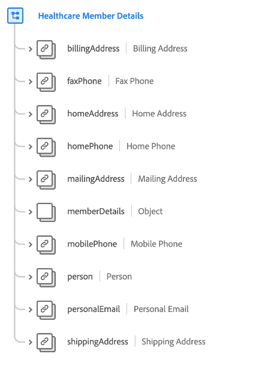

# [!UICONTROL Schemafeldgruppe &quot;Details des Gesundheitsversorgers&quot;]

[!UICONTROL Details des Mitglieds der Gesundheitsfürsorge] ist eine Standardschemafeldgruppe für die [[!DNL XDM Individual Profile] Klasse](../../classes/individual-profile.md) , die Details einer Person erfasst, die medizinische Dienste oder Behandlungen hat oder erhalten wird, wie Kontaktinformationen, Primärmediziner und Planinformationen.

| Eigenschaft | Datentyp | Beschreibung |
| --- | --- | --- |
| `billingAddress` | [[!UICONTROL Postanschrift]](../../data-types/postal-address.md) | Die Rechnungsadresse der Person. |
| `faxPhone` | [[!UICONTROL Telefonnummer]](../../data-types/phone-number.md) | Die Faxnummer der Person. |
| `homeAddress` | [[!UICONTROL Postanschrift]](../../data-types/postal-address.md) | Die Privatadresse der Person. |
| `homePhone` | [[!UICONTROL Telefonnummer]](../../data-types/phone-number.md) | Die Privattelefonnummer der Person. |
| `mailingAddress` | [[!UICONTROL Postanschrift]](../../data-types/postal-address.md) | Die Postanschrift der Person. |
| `memberDetails` | Objekt | Ein Objekt, das detaillierte Informationen zu den gesundheitsbezogenen Attributen und Beziehungen der Person enthält. Weitere Informationen zur Objektstruktur finden Sie im Unterabschnitt [unter ](#memberDetails) . |
| `mobilePhone` | [[!UICONTROL Telefonnummer]](../../data-types/phone-number.md) | Die Mobiltelefonnummer der Person. |
| `person` | [[!UICONTROL Person]](../../data-types/person.md) | Ein einzelner Akteur, Ansprechpartner oder Eigentümer im Zusammenhang mit der Mitgliedschaft der Person im Gesundheitswesen. |
| `personalEmail` | [[!UICONTROL E-Mail-Adresse]](../../data-types/email-address.md) | Die persönliche E-Mail-Adresse der Person. |
| `shippingAddress` | [[!UICONTROL Postanschrift]](../../data-types/postal-address.md) | Die Lieferadresse der Person. |

{style="table-layout:auto"}

## `memberDetails` {#memberDetails}

`memberDetails` ist ein Objekt, das detaillierte Informationen über die Attribute und Beziehungen der Person im Zusammenhang mit der Gesundheitsversorgung enthält. Die Struktur von `memberDetails` wird unten beschrieben.

| Eigenschaft | Datentyp | Beschreibung |
| --- | --- | --- |
| `emergencyContact` | Objekt | Erfasst die folgenden Kontaktdaten für den Notfall für die Person: <ul><li>`fullName`: (String) Der vollständige Name des Notfallkontakts.</li><li>`phone`: (String) Die Telefonnummer für den Notkontakt.</li><li>`relationshipToMember`: (String) Die Beziehung des Notfallkontakts zur Person.</li></ul> |
| `medications` | Array von Objekten | Führt die Details der aktuellen und früheren Arzneimittel auf, die mit der Person verbunden sind. Jedes Array-Element ist ein Objekt, das die folgenden Details erfasst: <ul><li>`refillLocation`: ([[!UICONTROL Postanschrift]](../../data-types/postal-address.md)) Der Ort, an dem das Medikament neu aufgefüllt wird.</li><li>`ID`: (String) Medication ID.</li><li>`isCurrent`: (Boolesch) Gibt an, ob die Medikation aktuell oder vergangen ist.</li><li>`numberOfRefills`: (Integer) Die Anzahl der Nachfüllungen, die vom Anbieter dieses Arzneimittels verschrieben wurden.</li><li>`startDate`: (DateTime) Das Datum, an dem die Person mit der Einnahme des Arzneimittels begann.</li></ul> |
| `multipleBirth` | Objekt | Erfasst Details zu Mehrfachgeburten: <ul><li>`isMultipleBirth`: (Boolesch) Gibt an, ob die Person mehrere Geburten gegeben hat.</li><li>`multipleBirthNumber`: (Integer) Die Anzahl der Babys, die geboren werden, wenn `isMultipleBirth` wahr ist.</li></ul> |
| `plans` | Array von Objekten | Führt die Details der aktuellen und früheren medizinischen Pläne auf, die mit der Person verbunden sind. Jedes Array-Element ist ein Objekt, das die folgenden Details erfasst: <ul><li>`coverageEndDate`: (DateTime) Das Datum, an dem die Abdeckung des Plans endet.</li><li>`coverageStartDate`: (DateTime) Das Datum, an dem die Abdeckung des Plans beginnt.</li><li>`isActive`: (Boolesch) Gibt an, ob der Plan aktiv ist.</li><li>`planId`: (String) Die Plan-ID.</li></ul> |
| `primaryCarePhysicians` | Array von Objekten | Führt die Details der mit der Person in Verbindung stehenden Ärzte der Primärversorgung auf. Jedes Array-Element ist ein Objekt, das die folgenden Details erfasst: <ul><li>`endDate`: (DateTime) Das Datum, an dem der primäre Pflegearzt die Person beendete.</li><li>`fullname`: (String) Der vollständige Name des Arztes.</li><li>`providerId`: (String) Eine eindeutige Kennung für den Arzt.</li><li>`startDate`: (DateTime) Das Datum, an dem der Primärmediziner mit der Betreuung der Person begonnen hat.</li></ul> |
| `specialists` | Array von Objekten | Führt die Details der Gesundheitsexperten auf, die mit der Person verbunden sind. Jedes Array-Element ist ein Objekt, das die folgenden Details erfasst: <ul><li>`fullname`: (String) Der vollständige Name des Spezialisten.</li><li>`providerId`: (String) Eine eindeutige Kennung für den Spezialisten.</li><li>`specialty`: (String) Die Spezialität des Anbieters (z. B. Anästhesiologie, Urologie, Radiologie, Dermatologie usw.).</li></ul> |
| `beneficiaryRelationship` | Zeichenfolge | Die Empfängerbeziehung zum Mitglied der Gesundheitsversorgung, wenn die Person abhängig ist (Beispiele sind Selbstunterhalt, Ehegatte, Kind usw.). |
| `billingAccountID` | Zeichenfolge | Eine eindeutige Kennung für das Rechnungskonto der Person. |
| `dateAgeCollected` | DateTime | Das Datum, an dem das Alter der Person gesammelt wurde. |
| `deceasedDate` | DateTime | Das Datum, an dem die Person gestorben ist, wenn sie verstorben ist. |
| `isDeceased` | Boolesch | Gibt an, ob die Person verstorben ist. |
| `isDependent` | Boolesch | Gibt an, ob die Person abhängig ist. |
| `nationality` | Zeichenfolge | Die Rechtsbeziehung zwischen dem Betroffenen und seinem Staat, vertreten durch den ISO-3166-1-Alpha-2-Code. |
| `preferredAvailability` | Zeichenfolge | Die bevorzugte Tages- und Uhrzeitverfügbarkeit der Person für einen Termin. |
| `primaryMemberID` | Zeichenfolge | Eine eindeutige Kennung des primären Abonnenten, wenn die Person abhängig ist. |

{style="table-layout:auto"}

Weitere Informationen zur Feldergruppe finden Sie im öffentlichen XDM-Repository:

* [Ausgefülltes Beispiel](https://github.com/adobe/xdm/blob/master/components/fieldgroups/profile/profile-healthcare-member.example.1.json)
* [Vollständiges Schema](https://github.com/adobe/xdm/blob/master/components/fieldgroups/profile/profile-healthcare-member.schema.json)

Weitere Informationen dazu, wie diese Feldergruppe zur Bereitstellung häufiger [Anwendungsfälle der Gesundheitsbranche](../../schema/industries/healthcare.md) verwendet werden kann, finden Sie in der Dokumentation zum Branchenschema .
