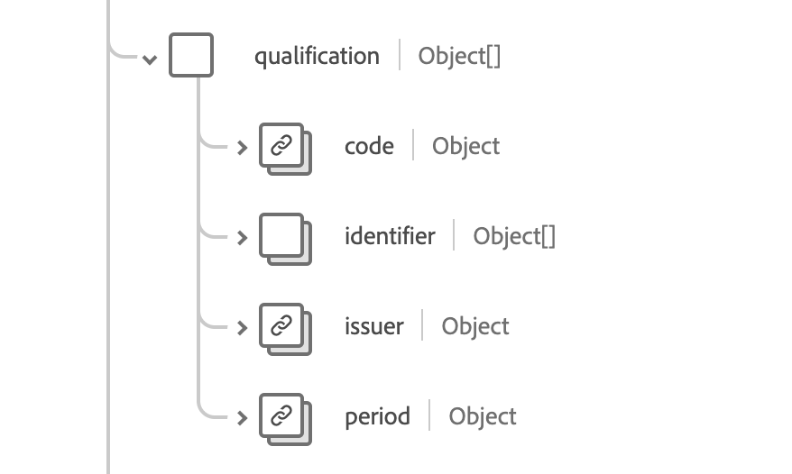

# [!UICONTROL Organisation] Schemafeldgruppe

[!UICONTROL Organisation] ist eine Standardschemafeldgruppe für die [[!DNL XDM Individual Profile] Klasse](../../classes/individual-profile.md) und die [[!DNL Provider class]](../../classes/provider.md). Es stellt ein einzelnes Objektfeld `healthcareOrganization` bereit, das Informationen zu Personengruppen oder Organisationen mit einem gemeinsamen Zweck enthält.

| Anzeigename | Eigenschaft | Datentyp | Beschreibung |
| ---| --- | --- | --- |
| [!UICONTROL Kontaktdetails] | `contact` | Array von [[!UICONTROL erweiterten Kontaktdetails]](../../data-types/healthcare/extended-contact-detail.md) | Die Kontaktdaten der für die jeweilige Organisation verfügbaren Kommunikationsgeräte. Dazu können Adressen, Telefonnummern, Faxnummern, Mobiltelefonnummern, E-Mail-Adressen und Websites gehören. |
| [!UICONTROL Endpunkt] | `endpoint` | Array von [[!UICONTROL Verweis]](../../data-types/healthcare/reference.md) | Technische Endpunkte, die Zugriff auf die für die Organisation betriebenen Dienste bieten. |
| [!UICONTROL ID] | `indentifier` | Array von [[!UICONTROL Bezeichner]](../../data-types/healthcare/identifier.md) | Die Kennung, mit der die Organisation über mehrere verschiedene Systeme hinweg identifiziert wird. |
| [!UICONTROL Teil der Organisation] | `partOf` | [[!UICONTROL Referenz]](../../data-types/healthcare/reference.md) | Die Organisation, zu der diese Organisation gehört. |
| [!UICONTROL Qualifikation] | `qualification` | Array von Objekten | Die amtlichen Zertifizierungen, Akkreditierungen, Schulungen, Bezeichnungen und Lizenzen, die die Betreuung durch die Organisation zulassen und/oder anderweitig bestätigen. Weitere Informationen finden Sie im Abschnitt [unter ](#qualification) . |
| [!UICONTROL Typ] | `type` | Array von [[!UICONTROL Codeable Concept]](../../data-types/healthcare/codeable-concept.md) | Die Art von Organisation. |
| [!UICONTROL Aktiv] | `active` | Boolesch | Gibt an, ob der Datensatz der Organisation noch aktiv verwendet wird. |
| [!UICONTROL alias] | `alias` | Zeichenfolgen-Array | Eine Liste mit alternativen Namen, die die Organisation als bezeichnet oder in der Vergangenheit als bekannt war. |
| [!UICONTROL Beschreibung] | `description` | String | Die Beschreibung der Organisation, die dazu beiträgt, einen allgemeinen Kontext bereitzustellen, um sicherzustellen, dass die richtige Organisation ausgewählt ist. |
| [!UICONTROL Name] | `name` | String | Der mit der Organisation verknüpfte Name. |

Weitere Informationen zur Feldergruppe finden Sie im öffentlichen XDM-Repository:

* [Ausgefülltes Beispiel](https://github.com/adobe/xdm/blob/master/extensions/industry/healthcare/fhir/fieldgroups/coverage.example.1.json)
* [Vollständiges Schema](https://github.com/adobe/xdm/blob/master/extensions/industry/healthcare/fhir/fieldgroups/coverage.schema.json)

## `qualification` {#qualification}

`qualification` wird als Array von Objekten bereitgestellt. Die Struktur der einzelnen Objekte wird nachfolgend beschrieben.

| Anzeigename | Eigenschaft | Datentyp | Beschreibung |
| --- | --- | --- | --- |
| [!UICONTROL Code] | `code` | [[!UICONTROL Codeable Concept]](../../data-types/healthcare/codeable-concept.md) | Codierte Darstellung der Qualifikation. |
| [!UICONTROL ID] | `identifier` | Array von [[!UICONTROL Bezeichner]](../../data-types/healthcare/identifier.md) | Eine dieser Qualifikation für diese Organisation zugewiesene Kennung. |
| [!UICONTROL Aussteller] | `issuer` | [[!UICONTROL Referenz]](../../data-types/healthcare/reference.md) | Organisation, die die Qualifikation regelt und ausstellt. |
| [!UICONTROL Zeitraum] | `period` | [[!UICONTROL Zeitraum]](../../data-types/healthcare/period.md) | Gültigkeitszeitraum der Qualifikation. |
