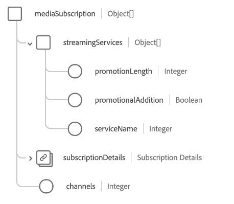

# [!UICONTROL Telekom-Abonnement] Schemafeldgruppe

>[!NOTE]
>
>Die Namen verschiedener Schemafeldgruppen wurden geändert. Weitere Informationen finden Sie im Dokument zu den [Namensaktualisierungen für Feldgruppen](../name-updates.md).

[!UICONTROL Telekom-Abonnement] ist eine Standardschemafeldgruppe für die [[!DNL XDM Individual Profile] class](../../classes/individual-profile.md) beschreibt den Telekom-Abonnementplan eines Kunden, einschließlich Preisen, Paketen und individuellen Produktabonnements.

Die Feldergruppe stellt ein einzelnes Feld vom Typ Objekt bereit, `telecomSubscription`, deren Eigenschaften nachfolgend beschrieben werden.

| Eigenschaft | Datentyp | Beschreibung |
| --- | --- | --- |
| `internetSubscription` | Array von Objekten | Beschreibt Details zum Internet-Abonnementplan wie Datenbegrenzung, Verbindungstyp und Geschwindigkeitsinformationen. Siehe [Abschnitt unten](#internetSubscription) für weitere Informationen. |
| `landlineSubscription` | Array von Objekten | Beschreibt Details zum Festnetzabonnementplan, einschließlich ausgewählter Funktionen, Minuten und Wählplänen. Siehe [Abschnitt unten](#landlineSubscription) für weitere Informationen. |
| `mediaSubscription` | Array von Objekten | Beschreibt Details zum Abonnementplan für Medien, einschließlich der Anzahl der Kanäle und der enthaltenen Streaming-Dienste. Siehe [Abschnitt unten](#mediaSubscription) für weitere Informationen. |
| `mobileSubscription` | Array von Objekten | Beschreibt Details zum Mobile-Abonnementplan, einschließlich der Anzahl der Zeilen, Datenraten, Kosten und mehr. Siehe [Abschnitt unten](#mobileSubscription) für weitere Informationen. |
| `primarySubscriber` | [[!UICONTROL Person]](../../data-types/person.md) | Beschreibt den Inhaber des Abonnements. |
| `bundleName` | Zeichenfolge | Erfasst den Namen aller Arten von Abonnement-Bundles, für die der Kunde angemeldet ist, z. B. `Internet + Media`. |
| `primaryPartyID` | Zeichenfolge | Eine Kennung für die primäre Person, die für das Abonnement verantwortlich ist. Dabei kann es sich in der Regel um ihre Telefonnummer des Geräts handeln. |

{style=&quot;table-layout:auto&quot;}

Weitere Informationen zur Feldergruppe finden Sie im öffentlichen XDM-Repository:

* [Ausgefülltes Beispiel](https://github.com/adobe/xdm/blob/master/components/fieldgroups/profile/profile-personal-details.example.1.json)
* [Vollständiges Schema](https://github.com/adobe/xdm/blob/master/components/fieldgroups/profile/profile-personal-details.schema.json)

## `internetSubscription` {#internetSubscription}

`internetSubscription` wird als Array von Objekten bereitgestellt. Die Struktur der einzelnen Objekte wird nachfolgend beschrieben.

| Eigenschaft | Datentyp | Beschreibung |
| --- | --- | --- |
| `subscriptionDetails` | [[!UICONTROL Telekom-Abonnement]](../../data-types/telecom-subscription.md) | Beschreibt allgemeine Details zum Abonnement, einschließlich Abonnementlänge, Gebühren, Status und mehr. Beschreibt allgemeine Details zum Abonnement, einschließlich Abonnementlänge, Gebühren, Status und mehr. |
| `connectionType` | Zeichenfolge | Der Verbindungstyp für das Abonnement. |
| `dataCap` | Ganzzahl | Die maximale Datenmenge für das Konto in Megabyte (MB). |
| `downloadSpeed` | Ganzzahl | Die maximale Download-Geschwindigkeit für das Abonnement in Megabyte (MB). |
| `selfSetup` | Boolesch | Gibt an, ob ein Kunde ohne Besuch eines Technikers für die Interneteinrichtung berechtigt ist. |
| `uploadSpeed` | Ganzzahl | Die maximale Upload-Geschwindigkeit, die für das Abonnement verfügbar ist, in Megabyte (MB). |

{style=&quot;table-layout:auto&quot;}

## `landlineSubscription` {#landlineSubscription}

`landlineSubscription` wird als Array von Objekten bereitgestellt. Die Struktur der einzelnen Objekte wird nachfolgend beschrieben.

| Eigenschaft | Datentyp | Beschreibung |
| --- | --- | --- |
| `phoneNumber` | [[!UICONTROL Telefonnummer]](../../data-types/telecom-subscription.md) | Die diesem Abonnement zugewiesene Telefonnummer. |
| `subscriptionDetails` | [[!UICONTROL Telekom-Abonnement]](../../data-types/telecom-subscription.md) | Beschreibt allgemeine Details zum Abonnement, einschließlich Abonnementlänge, Gebühren, Status und mehr. |
| `callBlocking` | Boolesch | Gibt an, ob die Festnetz-Abonnement-Funktionen eine Aufrufblockierung enthalten. |
| `callForwarding` | Boolesch | Gibt an, ob die Festnetz-Abonnementfunktionen die Anrufweiterleitung enthalten. |
| `callWaiting` | Boolesch | Gibt an, ob die Festnetz-Abonnementfunktionen das Warten auf Anrufe enthalten. |
| `callerID` | Boolesch | Gibt an, ob die Festnetz-Abonnementfunktionen die Anrufer-ID enthalten. |
| `internationalCalling` | Boolesch | Gibt an, ob die Festnetz-Abonnementfunktionen internationale Anrufe umfassen. |
| `minutes` | Ganzzahl | Die Anzahl der monatlichen Minuten, die innerhalb des Abonnements verfügbar sind. |
| `threeWayCalling` | Boolesch | Gibt an, ob die Festnetz-Abonnement-Funktionen einen Drei-Wege-Aufruf beinhalten. |
| `unlimitedDomesticLongDistance` | Boolesch | Gibt an, ob die Festnetz-Abonnementfunktionen unbegrenzte Inlandsgespräche über Ferngespräche umfassen. |
| `unlimitedLocalCalling` | Boolesch | Gibt an, ob die Festnetz-Abonnementfunktionen einen unbegrenzten lokalen Aufruf enthalten. |
| `voicemail` | Boolesch | Gibt an, ob die Festnetz-Abonnementfunktionen Voicemail enthalten. |

{style=&quot;table-layout:auto&quot;}

## `mediaSubscription` {#mediaSubscription}

`mediaSubscription` wird als Array von Objekten bereitgestellt. Die Struktur der einzelnen Objekte wird nachfolgend beschrieben.

| Eigenschaft | Datentyp | Beschreibung |
| --- | --- | --- |
| `streamingServices` | Array von Objekten | Eine Liste aller Streaming-Dienste, die im Abonnement enthalten sind. Jedes Array-Element enthält die folgenden Eigenschaften: <ul><li>`promotionLength`: Die Dauer der Promotion in Monaten, wenn der Streaming-Dienst im Rahmen einer Promotion hinzugefügt wurde.</li><li>`promotionalAddition`: Gibt an, ob der Streaming-Dienst im Rahmen einer Promotion hinzugefügt wurde.</li><li>`serviceName`: Der Name des Streaming-Dienstes.</li></ul> |
| `subscriptionDetails` | [[!UICONTROL Telekom-Abonnement]](../../data-types/telecom-subscription.md) | Beschreibt allgemeine Details zum Abonnement, einschließlich Abonnementlänge, Gebühren, Status und mehr. |
| `channels` | Ganzzahl | Die Anzahl der im Medienabonnement enthaltenen Kanäle. |

{style=&quot;table-layout:auto&quot;}

## `mobileSubscription` {#mobileSubscription}

`mobileSubscription` wird als Array von Objekten bereitgestellt. Die Struktur der einzelnen Objekte wird nachfolgend beschrieben.

| Eigenschaft | Datentyp | Beschreibung |
| --- | --- | --- |
| `phoneNumber` | [[!UICONTROL Telefonnummer]](../../data-types/telecom-subscription.md) | Die diesem Abonnement zugewiesene Telefonnummer. |
| `subscriptionDetails` | [[!UICONTROL Telekom-Abonnement]](../../data-types/telecom-subscription.md) | Beschreibt allgemeine Details zum Abonnement, einschließlich Abonnementlänge, Gebühren, Status und mehr. |
| `earlyUpgradeEnrollment` | Boolesch | Gibt an, ob der Kunde sich für frühe Aktualisierungen anmeldet. |
| `planLevel` | Zeichenfolge | Der Name des Mobile-Plans, der diesem Abonnement zugewiesen ist. |
| `portedNumber` | Boolesch | Gibt an, ob der Kunde seine Nummer von einem anderen Netzbetreiber aus anbietet. |

{style=&quot;table-layout:auto&quot;}
