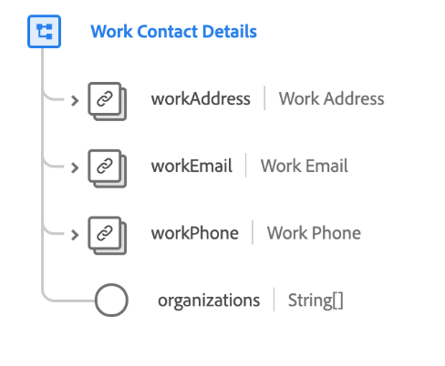

# [!UICONTROL Kontaktangaben für Arbeitskontakte] Schemafeldgruppe

>[!NOTE]
>
>Die Namen verschiedener Schemafeldgruppen wurden geändert. Weitere Informationen finden Sie im Dokument zu den [Namensaktualisierungen für Feldgruppen](../name-updates.md).

[!UICONTROL Kontaktangaben für Arbeitskontakte] ist eine Standardschemafeldgruppe für die [[!DNL XDM Individual Profile] class](../../classes/individual-profile.md). Die Feldergruppe bietet mehrere Felder, die berufsbezogene Informationen über eine Person erfassen, z. B. Arbeitsadresse, Arbeits-E-Mail, Berufs-Telefonnummer und Organisationen, zu denen die Person gehört.

| Eigenschaft | Datentyp | Beschreibung |
| --- | --- | --- |
| `workAddress` | [Postadresse](../../data-types/postal-address.md) | Beschreibt die Arbeitsadresse der Person. |
| `workEmail` | [E-Mail-Adresse](../../data-types/email-address.md) | Beschreibt die geschäftliche E-Mail-Adresse der Person. |
| `workPhone` | [Telefonnummer](../../data-types/phone-number.md) | Beschreibt die Telefonnummer der Person am Arbeitsplatz. |
| `organizations` | Zeichenfolge (Array) | Ein Array von Freiform-Zeichenfolgen, die die Organisationen darstellen, zu denen die Person gehört. |

{style=&quot;table-layout:auto&quot;}

Weitere Informationen zur Feldergruppe finden Sie im öffentlichen XDM-Repository:

* [Ausgefülltes Beispiel](https://github.com/adobe/xdm/blob/master/components/fieldgroups/profile/profile-work-details.example.1.json)
* [Vollständiges Schema](https://github.com/adobe/xdm/blob/master/components/fieldgroups/profile/profile-work-details.schema.json)
