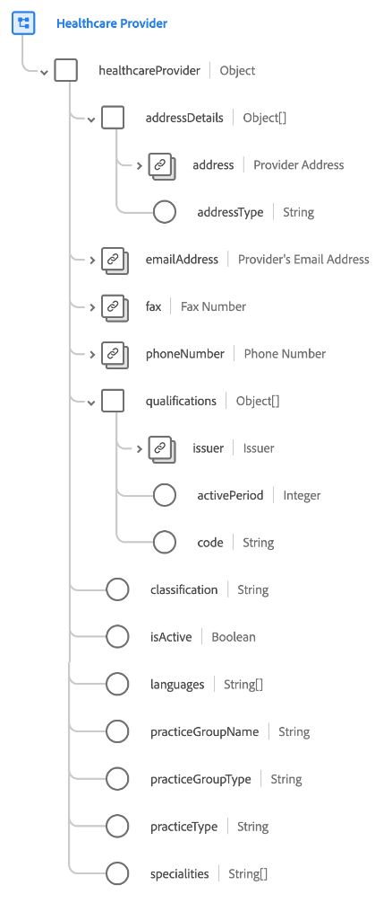

# [!UICONTROL Gesundheitsdienstleister] Schemafeldgruppe

[!UICONTROL Gesundheitsdienstleister] ist eine Standardschemafeldgruppe für die Klasse [[!UICONTROL Anbieter]](../../classes/provider.md). Sie bietet ein einzelnes Objekttyp-Feld, `healthcareProvider` Eigenschaften erfasst, die sich auf einen individuellen Gesundheitsberuf oder eine Gesundheitseinrichtung beziehen, der bzw. die für die Erbringung von Diagnosen und Therapiediensten zugelassen ist.

| Eigenschaft | Datentyp | Beschreibung |
| --- | --- | --- |
| `addressDetails` | Array von Objekten | Listet die Adressdetails für den Provider auf. Jedes Objekt enthält die folgenden Eigenschaften: <ul><li>`address`: ([[!UICONTROL Postanschrift]](../../data-types/postal-address.md)): Die Postanschrift für den Anbieter.</li><li>`addressType`: (String) Der Adresstyp, der angibt, wo der Anbieter Dienste bereitstellt.</li></ul> |
| `emailAddress` | [[!UICONTROL E-Mail-Adresse]](../../data-types/email-address.md) | Die E-Mail-Adresse des Anbieters. |
| `fax` | [[!UICONTROL Telefonnummer]](../../data-types/phone-number.md) | Die Faxnummer des Anbieters. |
| `phoneNumber` | [[!UICONTROL Telefonnummer]](../../data-types/phone-number.md) | Die Telefonnummer des Anbieters. |
| `qualifications` | Array von Objekten | Listet die Zertifizierungen, Lizenzen oder Schulungen im Zusammenhang mit der Bereitstellung von Pflege auf. Jedes Objekt enthält die folgenden Eigenschaften: <ul><li>`issuer`: ([[!UICONTROL Kontodetails]](../../data-types/account-details.md)): Die Organisation, die die Qualifizierung reguliert und ausstellt.</li><li>`activePeriod`: (Integer) Das Jahr, bis zu dem die Qualifizierung gültig ist.</li><li>`code`: (String) Eine codierte Darstellung der Qualifizierung.</li></ul> |
| `classification` | String | Die Klassifizierung des Dienstleisters nach Klasse oder Kategorie (z. B. Patientenversorgung, ambulante Pflege usw.). |
| `isActive` | Boolesch | Gibt an, ob der Anbieter aktiv ist. |
| `languages` | Zeichenfolgen-Array | Eine Liste der Sprachen, unter denen der Anbieter Vorgänge durchführt. |
| `practiceGroupName` | String | Der Name der Übungsgruppe für den Dienstleister. |
| `practiceGroupType` | String | Der Übungsgruppentyp für den Dienstleister. |
| `practiceType` | String | Der Übungstyp für den Dienstleister. |
| `specialties` | Zeichenfolgen-Array | Eine Liste der Spezialitäten dieses Anbieters. |

{style="table-layout:auto"}

Weitere Informationen zur Feldergruppe finden Sie unter [öffentliches XDM-Repository](https://github.com/adobe/xdm/blob/master/components/fieldgroups/provider/healthcare-provider-details.schema.json).
