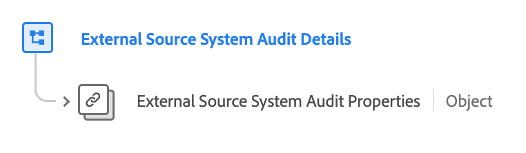

# [!UICONTROL External Source System Audit Details] Feldergruppe

[!UICONTROL External Source System Audit Details] ist eine standardmäßige Experience-Datenmodell (XDM)-Feldergruppe, die den zentralen Datentyp „External Source System Audit Attributes“ erweitert, indem auf seine Eigenschaften verwiesen und kontextuelle Metadaten hinzugefügt werden. Dies ermöglicht ein detailliertes Audit-Tracking und eine flexible Datenintegration aus externen Quellen.

| Anzeigename | Eigenschaft | Datentyp | Beschreibung |
| -------------------------------------------------| ---------------------------------------- | --------- | --- |
| [!UICONTROL External Source System Audit Details] | `external-source-system-audit-details` | [[!UICONTROL External Source System Audit Attributes]](../../data-types/external-source-system-audit-attributes.md) | Die Feldergruppe &quot;[!UICONTROL External Source System Audit Details]&quot; erweitert den grundlegenden Datentyp „External Source System Audit Attributes“, indem sie auf dessen Eigenschaften verweist und kontextuelle Metadaten hinzufügt. Dies erleichtert die detaillierte Überwachung und flexible Datenintegration für externe Quellen und berücksichtigt den asynchronen Charakter der Profilaufnahme. |

{style="table-layout:auto"}

Weitere Informationen zum Datentyp finden Sie im öffentlichen XDM-Repository:

* [Vollständiges Schema](https://github.com/adobe/xdm/blob/master/docs/reference/fieldgroups/shared/external-source-system-audit-details.schema.json)
