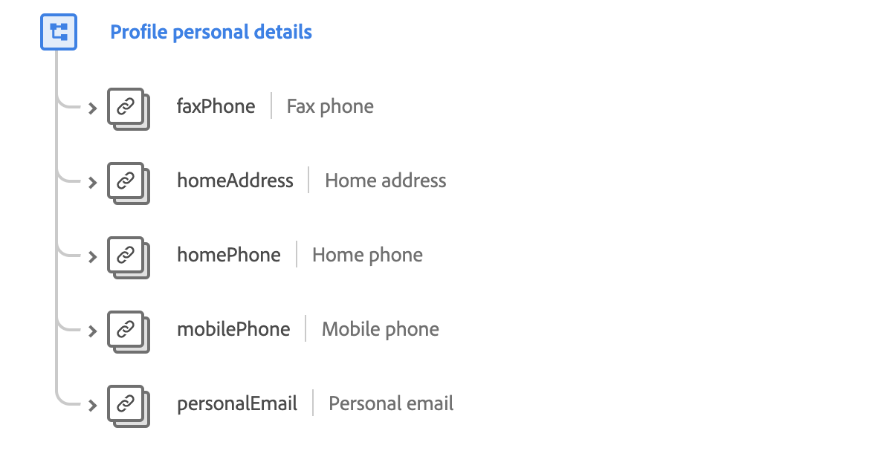

# [!UICONTROL Personal Contact ] DetailsMixin

>[!NOTE]
>
>Die Namen mehrerer Mixins haben sich geändert. Weitere Informationen finden Sie im Dokument [mixin name updates](../name-updates.md).

[!UICONTROL Persönliche Kontaktinformationen ] sind ein Standardmix für die  [[!DNL XDM Individual Profile] ](../../classes/individual-profile.md) Klasse, der die Kontaktdaten für eine Person beschreibt.

 

| Eigenschaft | Datentyp | Beschreibung |
| --- | --- | --- |
| `faxPhone` | [Telefonnummer](../../data-types/phone-number.md) | Beschreibt die Faxnummer der Person. |
| `homeAddress` | [Postadresse](../../data-types/postal-address.md) | Beschreibt die Wohnadresse der Person. |
| `homePhone` | [Telefonnummer](../../data-types/phone-number.md) | Beschreibt die Telefonnummer der Person. |
| `mobilePhone` | [Telefonnummer](../../data-types/phone-number.md) | Beschreibt die Handynummer der Person. |
| `personalEmail` | [E-Mail-Adresse](../../data-types/email-address.md) | Beschreibt die E-Mail-Adresse der Person. |

Weitere Informationen zum Mixin finden Sie im öffentlichen XDM-Repository:

* [Ausgefülltes Beispiel](https://github.com/adobe/xdm/blob/master/components/mixins/profile/profile-personal-details.example.1.json)
* [Vollständiges Schema](https://github.com/adobe/xdm/blob/master/components/mixins/profile/profile-personal-details.schema.json)
