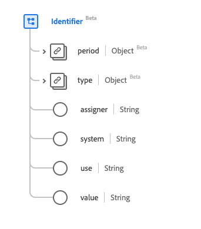

# [!UICONTROL Kennung] Datentyp

[!UICONTROL Identifier] ist ein standardmäßiger Experience-Datenmodell (XDM)-Datentyp, der eine für die Berechnung bestimmte Kennung bereitstellt. Dieser Datentyp wird gemäß den HL7 FHIR Release 5-Spezifikationen erstellt.

| Anzeigename | Eigenschaft | Datentyp | Beschreibung |
| --- | --- | --- | --- |
| [!UICONTROL Zeitraum] | `period` | [[!UICONTROL Zeitraum]](../data-types/period.md) | Der Zeitraum, in dem die ID gültig ist oder war. |
| [!UICONTROL Typ] | `type` | [[!UICONTROL Codeable Concept]](../data-types/codeable-concept.md) | Die Beschreibung der Kennung. |
| [!UICONTROL Verantwortlicher] | `assigner` | String | Die Organisation, die die ID ausgestellt hat. |
| [!UICONTROL System] | `system` | String | Der Namespace für den Kennungswert, dargestellt als URI. |
| [!UICONTROL Verwenden] | `use` | String | Die Verwendung der Kennung. Die Werte dieser Eigenschaft müssen mindestens einem der folgenden bekannten Enum-Werte entsprechen. <li> `usual` </li> <li> `offical` </li> <li> `temp` </li> <li> `secondary` </li> <li> `old` </li> |
| [!UICONTROL Wert] | `value` | String | Der eindeutige Wert der ID. |

Weitere Informationen zum Datentyp finden Sie im öffentlichen XDM-Repository:

* [Ausgefülltes Beispiel](https://github.com/adobe/xdm/blob/master/extensions/industry/healthcare/fhir/datatypes/identifier.example.1.json)
* [Vollständiges Schema](https://github.com/adobe/xdm/blob/master/extensions/industry/healthcare/fhir/datatypes/identifier.schema.json)
