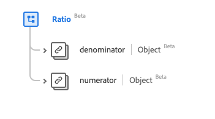

# [!UICONTROL Verhältnis] Datentyp

[!UICONTROL Ratio] ist ein standardmäßiger Experience-Datenmodell (XDM)-Datentyp, der ein Verhältnis von zwei [[!UICONTROL Quantity]](../data-types/quantity.md)-Werten über einen Zähler und einen Nenner bereitstellt. Dieser Datentyp wird gemäß den HL7 FHIR Release 5-Spezifikationen erstellt.

| Anzeigename | Eigenschaft | Datentyp | Beschreibung |
| --- | --- | --- | --- |
| [!UICONTROL Nenner] | `denominator` | [[!UICONTROL Einfache Menge]](../data-types/simple-quantity.md) | Der Wert des Nenners. |
| [!UICONTROL Zähler] | `numerator` | [[!UICONTROL Menge]](../data-types/quantity.md) | Der Wert des Zählers. |

>[!NOTE]
>
> `denominator` und `numerator` haben aufgrund der Spezifikation, die gemäß HL7 FHIR Release 5 erstellt wurde, unterschiedliche Datentypen.

Weitere Informationen zum Datentyp finden Sie im öffentlichen XDM-Repository:

* [Ausgefülltes Beispiel](https://github.com/adobe/xdm/blob/master/extensions/industry/healthcare/fhir/datatypes/ratio.example.1.json)
* [Vollständiges Schema](https://github.com/adobe/xdm/blob/master/extensions/industry/healthcare/fhir/datatypes/ratio.schema.json)
