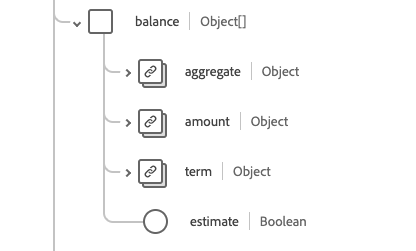
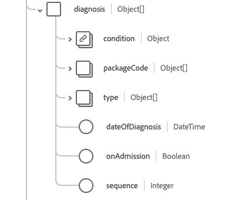

# [!UICONTROL Konto] Schemafeldgruppe

[!UICONTROL Konto] ist eine Standardschemafeldgruppe für die [[!DNL XDM Individual Profile] Klasse](../../../classes/individual-profile.md) und die [[!DNL Provider class]](../../../classes/provider.md). Es bietet ein einzelnes Objektfeld `healthcareAccount` , das zur Aufzeichnung von Transaktionen, Dienstleistungen und anderen Finanzinformationen im Zusammenhang mit Gesundheitsdienstleistungen verwendet wird, die einem Patienten oder einer Gruppe von Personen erbracht werden (z. B. für Versicherungs- oder Abrechnungszwecke).

| Anzeigename | Eigenschaft | Datentyp | Beschreibung |
| --- | --- | --- | --- |
| [!UICONTROL Balance] | `balance` | Array von Objekten | Die vom Finanzsystem berechneten und verarbeiteten Kontoguthaben. Weitere Informationen finden Sie im Abschnitt [unter ](#balances) . |
| [!UICONTROL Rechnungsstatus] | `billingStatus` | [[!UICONTROL Codeable Concept]](../data-types/codeable-concept.md) | Dadurch wird der Lebenszyklus des Kontos während des Abrechnungsprozesses verfolgt. Er gibt an, wie Transaktionen behandelt werden, wenn sie dem Konto zugeordnet werden. |
| [!UICONTROL Abdeckung] | `coverage` | Array von Objekten | Die für die Deckung der Kosten dieses Kontos verantwortliche(n) Partei(en) und in welcher Reihenfolge diese geltend gemacht werden sollen. Weitere Informationen finden Sie im Abschnitt [unter ](#coverage) . |
| [!UICONTROL Währung] | `currency` | [[!UICONTROL Codeable Concept]](../data-types/codeable-concept.md) | Die Standardwährung für das Konto. |
| [!UICONTROL Diagnose] | `diagnosis` | Array von Objekten | Die Diagnosen, die für die Abrechnung relevant sind, werden hier auf dem Konto gespeichert, auf dem sie vor der Verarbeitung angemessen sequenziert werden können, um Ansprüche zu erzeugen. Weitere Informationen finden Sie im Abschnitt [unter ](#diagnosis) . |
| [!UICONTROL Guarantor] | `guarantor` | Array von Objekten | Die für den Kontoausgleich verantwortlichen Parteien, falls andere Zahlungsoptionen nicht ausreichen. Weitere Informationen finden Sie im Abschnitt [unter ](#guarantor) . |
| [!UICONTROL ID] | `identifier` | Array von [[!UICONTROL Bezeichner]](../data-types/identifier.md) | Eine eindeutige Kennung, mit der auf das Konto verwiesen wird. Sie kann für den menschlichen Gebrauch bestimmt sein (z. B. Kreditkartennummer). |
| [!UICONTROL Inhaber] | `owner` | [[!UICONTROL Referenz]](../data-types/reference.md) | Gibt die Servicebranche, das Krankenhaus, die Abteilung usw. an. mit Verantwortung für die Kontoverwaltung. |
| [!UICONTROL Verfahren] | `procedure` | Array von Objekten | Die für die Abrechnung relevanten Verfahren werden hier auf dem Konto gespeichert, auf dem sie vor der Verarbeitung zur Herstellung von Ansprüchen angemessen sequenziert werden können. Weitere Informationen finden Sie im Abschnitt [unter ](#procedure) . |
| [!UICONTROL Verwandtes Konto] | `relatedAccount` | Array von Objekten | Andere verbundene Konten im Zusammenhang mit diesem Konto. Weitere Informationen finden Sie im Abschnitt [unter ](#related-account) . |
| [!UICONTROL Dienstzeitraum] | `servicePeriod` | [[!UICONTROL Zeitraum]](../data-types/period.md) | Der Datumsbereich der mit diesem Konto verknüpften Dienste. |
| [!UICONTROL Betreff] | `subject` | Array von [[!UICONTROL Verweis]](../data-types/reference.md) | Identifiziert das Unternehmen, das die Ausgaben erhält. Während die unmittelbaren Empfänger von Dienstleistungen oder Gütern mit dem Gegenstand zusammenhängende Einrichtungen sein könnten, entstanden die Ausgaben letztlich durch den Kontengegenstand. |
| [!UICONTROL Typ] | `type` | [[!UICONTROL Codeable Concept]](../data-types/codeable-concept.md) | Kategorisiert das Konto zu Berichts- und Suchzwecken. |
| [!UICONTROL Berechnet am] | `calculatedAt` | DateTime | Der Zeitpunkt der Berechnung des Saldos. |
| [!UICONTROL Beschreibung] | `description` | String | Bietet zusätzliche Informationen darüber, was das Konto verfolgt und wie es verwendet wird. |
| [!UICONTROL Name] | `name` | String | Der Name des Kontos. |
| [!UICONTROL Status] | `status` | String | Der Status des Kontos. Der Wert dieser Eigenschaft muss mit einem der folgenden bekannten Enum-Werte übereinstimmen. <li> `active` </li> <li> `inactive` </li> <li> `entered-in-error` </li> <li> `on-hold` </li> <li> `unknown`</li> |

Weitere Informationen zur Feldergruppe finden Sie im öffentlichen XDM-Repository:

* [Ausgefülltes Beispiel](https://github.com/adobe/xdm/blob/master/extensions/industry/healthcare/fhir/fieldgroups/account.example.1.json)
* [Vollständiges Schema](https://github.com/adobe/xdm/blob/master/extensions/industry/healthcare/fhir/fieldgroups/account.schema.json)

## `balances` {#balances}

`balances` wird als Array von Objekten bereitgestellt. Die Struktur der einzelnen Objekte wird nachfolgend beschrieben.

| Anzeigename | Eigenschaft | Datentyp | Beschreibung |
| --- | --- | --- | --- |
| [!UICONTROL Aggregat] | `aggregate` | [[!UICONTROL Codeable Concept]](../data-types/codeable-concept.md) | Wer soll diesen Teil des Saldos bezahlen? |
| [!UICONTROL Betrag] | `amount` | [[!UICONTROL Money]](../data-types/money.md) | Der tatsächliche Saldo, der für das im Begriff Eigenschaft definierte Alter berechnet wird. |
| [!UICONTROL Begriff] | `term` | [[!UICONTROL Codeable Concept]](../data-types/codeable-concept.md) | Die Laufzeit des Kontos. |
| [!UICONTROL Schätzen] | `estimate` | Boolesch | Wenn der Betrag ein geschätzter Wert ist. |

## `coverage` {#coverage}

`coverage` wird als Array von Objekten bereitgestellt. Die Struktur der einzelnen Objekte wird nachfolgend beschrieben.

| Anzeigename | Eigenschaft | Datentyp | Beschreibung |
| --- | --- | --- | --- |
| [!UICONTROL Abdeckung] | `coverage` | [[!UICONTROL Referenz]](../data-types/reference.md) | Die für die Deckung der Kosten dieses Kontos verantwortliche(n) Partei(en) und in welcher Reihenfolge diese geltend gemacht werden sollen. |
| [!UICONTROL Priorität] | `priority` | Ganzzahl | Die Priorität der Abdeckung im Kontext dieses Kontos mit einem Mindestwert von `0`. |

## `diagnosis` {#diagnosis}

`diagnosis` wird als Array von Objekten bereitgestellt. Die Struktur der einzelnen Objekte wird nachfolgend beschrieben.

| Anzeigename | Eigenschaft | Datentyp | Beschreibung |
| --- | --- | --- | --- |
| [!UICONTROL Bedingung] | `condition` | [[!UICONTROL Codeable Reference]](../data-types/codeable-reference.md) | Die für das Konto relevante Diagnose. |
| [!UICONTROL Paketcode] | `packageCode` | Array von [[!UICONTROL Codeable Concept]](../data-types/codeable-concept.md) | Der Package-Code kann zur Gruppierung von Diagnosen verwendet werden, die als einzelnes Produkt (z. B. DRGs) zu einem Preis oder zu einem bestimmten Zeitpunkt geliefert werden können. |
| [!UICONTROL Typ] | `type` | Array von [[!UICONTROL Codeable Concept]](../data-types/codeable-concept.md) | Geben Sie ein, dass diese Diagnose für das Konto relevant ist (z. B. Zulassung, Rechnungsstellung, Entladung ...). |
| [!UICONTROL Datum der Diagnose] | `dateOfDiagnosis` | DateTime | Datum der Diagnose (bei kodierter Diagnose). |
| [!UICONTROL Bei Eintritt] | `onAdmission` | Boolesch | Ob die Diagnose bei der Zulassung gestellt wurde. |
| [!UICONTROL squence] | `sequence` | Ganzzahl | Rangfolge der Diagnose (für jeden Typ) mit einem Mindestwert von `0`. |

## `guarantor` {#guarantor}

`guarantor` wird als Array von Objekten bereitgestellt. Die Struktur der einzelnen Objekte wird nachfolgend beschrieben.

| Anzeigename | Eigenschaft | Datentyp | Beschreibung |
| --- | --- | --- | --- |
| [!UICONTROL Party] | `party` | [[!UICONTROL Referenz]](../data-types/reference.md) | Die verantwortliche Entität. |
| [!UICONTROL Zeitraum] | `period` | [[!UICONTROL Zeitraum]](../data-types/period.md) | Der Zeitraum, in dem der Garantiegeber die Verantwortung für das Konto übernimmt. |
| [!UICONTROL Auf Halten] | `onHold` | Boolesch | Ein Garantiegeber kann eine Kreditklemme in Anspruch nehmen oder seine Rolle vorübergehend aussetzen lassen. |

## `procedure` {#procedure}

`procedure` wird als Array von Objekten bereitgestellt. Die Struktur der einzelnen Objekte wird nachfolgend beschrieben.

| Anzeigename | Eigenschaft | Datentyp | Beschreibung |
| --- | --- | --- | --- |
| [!UICONTROL Code] | `code` | [[!UICONTROL Codeable Reference]](../data-types/codeable-reference.md) | Das für das Konto relevante Verfahren. |
| [!UICONTROL Gerät] | `device` | Array von [[!UICONTROL Verweis]](../data-types/reference.md) | Alle Geräte, die mit dem für das Konto relevanten Verfahren verknüpft waren. |
| [!UICONTROL Typ] | `type` | Array von [[!UICONTROL Codeable Concept]](../data-types/codeable-concept.md) | Verwendung des Prozedurwerts bei der Anrechnung des Kontos. |
| [!UICONTROL Paketcode] | `packageCode` | Array von [[!UICONTROL Codeable Concept]](../data-types/codeable-concept.md) | Der Paketcode kann verwendet werden, um Verfahren zu gruppieren, die als Einzelprodukt (z. B. DRGs) in Rechnung gestellt oder geliefert werden können. |
| [!UICONTROL  Datum des Diensts] | `dateOfService` | DateTime | Das Datum bei Verwendung einer codierten Prozedur. Wenn Sie einen Verweis auf ein Verfahren verwenden, sollte das Datum des Verfahrens verwendet werden. |
| [!UICONTROL Sequenz] | `sequence` | Ganzzahl | Rangfolge des Verfahrens (für jeden Typ) mit einem Mindestwert von `0`. |

## `relatedAccount` {#related-account}

`relatedAccount` wird als Array von Objekten bereitgestellt. Die Struktur der einzelnen Objekte wird nachfolgend beschrieben.

| Anzeigename | Eigenschaft | Datentyp | Beschreibung |
| --- | --- | --- | --- |
| [!UICONTROL Konto] | `account` | [[!UICONTROL Referenz]](../data-types/reference.md) | Verweis auf ein verknüpftes Konto. |
| [!UICONTROL Beziehung] | `relationship` | [[!UICONTROL Codeable Concept]](../data-types/codeable-concept.md) | Beziehung des zugehörigen Kontos. |
