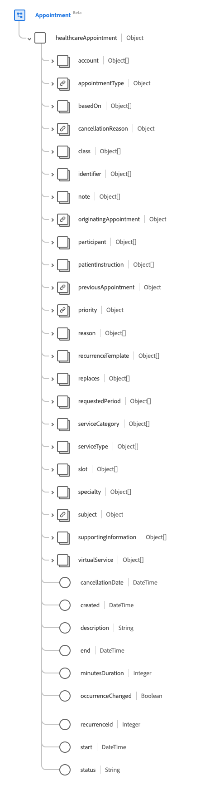
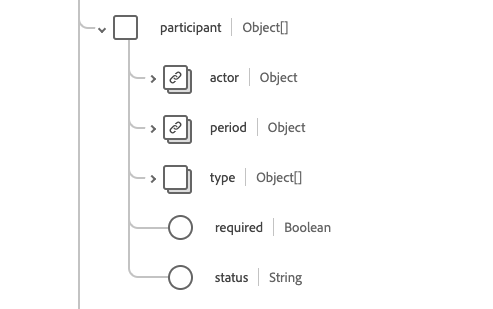

# [!UICONTROL Termin] Schemafeldgruppe

[!UICONTROL Termin] ist eine Standardschemafeldgruppe für die [[!DNL XDM Individual Profile] Klasse](../../../classes/individual-profile.md) und die [[!DNL Provider class]](../../../classes/provider.md). Es bietet ein einzelnes Objekttyp-`healthcareAppointment`, das Informationen über eine Buchung eines Gesundheitsereignisses unter Patienten, Ärzten, nahestehenden Personen und/oder Geräten für ein bestimmtes Datum und eine bestimmte Uhrzeit enthält.

| Anzeigename | Eigenschaft | Datentyp | Beschreibung |
| --- | --- | --- | --- |
| [!UICONTROL Konto] | `account` | Array von [[!UICONTROL Referenz]](../data-types/reference.md) | Die Gruppe von Konten, die für die Abrechnung verwendet werden sollen. |
| [!UICONTROL Termintyp] | `appointmentType` | [[!UICONTROL Codeable Concept]](../data-types/codeable-concept.md) | Der Stil des Termins oder Patienten, der im Steckplatz gebucht wurde (nicht Servicetyp). |
| [!UICONTROL basierend auf] | `basedOn` | Array von [[!UICONTROL Referenz]](../data-types/reference.md) | Der Antrag, den der Termin bewertet, z. B. ein Verfahrensantrag. |
| [!UICONTROL Stornierungsgrund] | `cancellationReason` | Array von [[!UICONTROL Codeable Concept]](../data-types/codeable-concept.md) | Der codierte Grund für die Absage des Termins. Dies wird häufig bei der Berichterstellung, Abrechnung oder Verarbeitung verwendet, um zu bestimmen, ob weitere Aktionen erforderlich sind oder ob bestimmte Gebühren anfallen. |
| [!UICONTROL Klasse] | `class` | Array von [[!UICONTROL Codeable Concept]](../data-types/codeable-concept.md) | Konzepte, die die Klassifizierung einer Patientenbegegnung wie ambulant, ambulant, stationär oder Notfall darstellen. |
| [!UICONTROL ID] | `identifier` | Array von [[!UICONTROL Identifier]](../data-types/identifier.md) | Eine Liste eindeutiger Kennungen, die mit dem Termin verknüpft sind. Diese Kennungen werden auf der Grundlage von Geschäftsregeln zugewiesen oder wenn ein direkter URL-Link zum Termin nicht geeignet ist. |
| [!UICONTROL Hinweis] | `note` | Array von [[!UICONTROL Anmerkung]](../data-types/annotation.md) | Zusätzliche Hinweise oder Kommentare zum Termin. |
| [!UICONTROL Ursprungsdatum] | `originatingAppointment` | [[!UICONTROL Referenz]](../data-types/reference.md) | Der ursprüngliche Termin in einem wiederkehrenden Satz verwandter Termine. |
| [!UICONTROL Teilnehmer] | `participant` | Array von Objekten | Eine Liste der an dem Termin beteiligten Teilnehmer. Weitere Informationen finden [ im ](#participant) Abschnitt unten. |
| [!UICONTROL Patientenanleitung] | `patientInstruction` | Array von [[!UICONTROL Codeable Reference]](../data-types/reference.md) | Die Diagnose, die für den Termin relevant ist. |
| [!UICONTROL Vorheriger Termin] | `previousAppointment` | [[!UICONTROL Referenz]](../data-types/reference.md) | Der vorherige Termin in einer Reihe verwandter Termine. |
| [!UICONTROL Priorität] | `priority` | [[!UICONTROL Codeable Concept]](../data-types/codeable-concept.md) | Die Priorität der Ernennung, die genutzt werden kann, um fundierte Entscheidungen zu treffen, wenn Ernennungen neu priorisiert werden müssen. Der iCal-Standard gibt `0` als undefiniert, als höchste Priorität `1` als niedrigste Priorität `9`. |
| [!UICONTROL Grund] | `reason` | Array von [[!UICONTROL Codeable Concept]](../data-types/codeable-concept.md) | Der Grund, warum der Termin geplant wird, was normalerweise eine Bedingung oder ein Verfahren ist. |
| [!UICONTROL Wiederholungsvorlage] | `recurrenceTemplate` | Array von Objekten | Enthält Details des Wiederholungsmusters oder der Vorlage zum Erstellen wiederkehrender Termine.  Weitere Informationen finden [ im ](#recurrence) Abschnitt unten. |
| [!UICONTROL ersetzt] | `replaces` | Array von [[!UICONTROL Referenz]](../data-types/reference.md) | Der durch diesen Termin ersetzte Termin. Im Falle eines Abbruchs finden Sie die Details des Abbruchs in der `cancellationReason`-Eigenschaft der referenzierten Ressource. |
| [!UICONTROL Angeforderter Zeitraum] | `requestedPeriod` | Array von [[!UICONTROL Zeitraum]](../data-types/period.md) | Eine Reihe von Datumsbereichen (möglicherweise einschließlich Zeiten), in denen der Termin vorzugsweise geplant wird. |
| [!UICONTROL Service-Kategorie] | `serviceCategory` | Array von [[!UICONTROL Codeable Concept]](../data-types/codeable-concept.md) | Eine breite Kategorisierung des Dienstes, der während des Termins ausgeführt werden soll. |
| [!UICONTROL Service-Typ] | `serviceType` | Array von [[!UICONTROL Codeable Reference]](../data-types/codeable-reference.md) | Der spezifische Service, der während des Termins ausgeführt werden soll. |
| [!UICONTROL Slot] | `slot` | Array von [[!UICONTROL Referenz]](../data-types/reference.md) | Die Zeitfenster aus den Zeitplänen der Teilnehmer, die durch den Termin gefüllt werden. |
| [!UICONTROL Fachgebiet] | `speciality` | Array von [[!UICONTROL Codeable Concept]](../data-types/codeable-concept.md) | Die Spezialität eines Praktikers, der erforderlich ist, um die in diesem Termin verlangte Dienstleistung zu erbringen. |
| [!UICONTROL Betreff] | `subject` | Array von [[!UICONTROL Referenz]](../data-types/reference.md) | Der Patient oder die Gruppe, die mit dem Termin verbunden ist. |
| [!UICONTROL unterstützende Informationen] | `supportingInformation` | Array von [[!UICONTROL Referenz]](../data-types/reference.md) | Zusätzliche Informationen, die bei der Ernennung zur Unterstützung der IT bereitgestellt werden. |
| [!UICONTROL Virtueller Service] | `virtualService` | Array von [[!UICONTROL Virtual Service Detail]](../data-types/virtual-service-detail.md) | Verbindungsdetails eines virtuellen Services, z. B. einer Konferenzschaltung. |
| [!UICONTROL Stornierungsdatum] | `cancellationDate` | DateTime | Datum und Uhrzeit der Absage des Termins. |
| [!UICONTROL Erstellt] | `created` | DateTime | Datum und Uhrzeit der Erstellung des Termins. |
| [!UICONTROL Beschreibung] | `description` | String | Eine kurze Beschreibung des Termins. Detaillierte oder erweiterte Informationen sollten in das Feld `note` eingegeben werden. |
| [!UICONTROL Ende] | `end` | DateTime | Datum und Uhrzeit des Abschlusses des Termins. |
| [!UICONTROL Minuten Dauer] | `minutesDuration` | Ganzzahl | Die Anzahl der Minuten, die der Termin dauern wird. Dies kann kürzer sein als die Dauer zwischen der Start- und der Endzeit. Der akzeptierte Mindestwert ist `0`. |
| [!UICONTROL Vorkommen geändert] | `occurenceChanged` | Boolesch | Eine Markierung, die angibt, ob sich dieser Termin vom wiederkehrenden Muster unterscheidet. |
| [!UICONTROL RecurrenceId] | `RecurrenceId` | Ganzzahl | Die Sequenznummer, die einen bestimmten Termin in einem wiederkehrenden Muster identifiziert. Der Mindestwert ist `0`. |
| [!UICONTROL Starten] | `start` | DateTime | Datum und Uhrzeit des Termins. |
| [!UICONTROL Status] | `status` | String | Der Status des Termins. Der Wert dieser Eigenschaft muss einem der folgenden bekannten Enum-Werte entsprechen: <li> `proposed` </li> <li> `pending` </li> <li> `booked` </li> <li> `arrived` </li> <li> `fulfilled` </li> <li> `cancelled` </li> <li> `noshow` </li> <li> `entered-in-error` </li> <li> `checked-in` </li> <li> `waitlist` </li> |

Weitere Informationen zur Feldergruppe finden Sie im öffentlichen XDM-Repository:

* [Ausgefülltes Beispiel](https://github.com/adobe/xdm/blob/master/extensions/industry/healthcare/fhir/fieldgroups/appointment.example.1.json)
* [Vollständiges Schema](https://github.com/adobe/xdm/blob/master/extensions/industry/healthcare/fhir/fieldgroups/appointment.schema.json)

## `participant` {#participant}

`participant` wird als Array von -Objekten bereitgestellt. Im Folgenden wird die Struktur der einzelnen Objekte beschrieben.

| Anzeigename | Eigenschaft | Datentyp | Beschreibung |
| --- | --- | --- | --- |
| [!UICONTROL Schauspieler] | `actor` | [[!UICONTROL Referenz]](../data-types/reference.md) | Die Person, das Gerät, der Standort oder der Service, die bzw. der an dem Termin teilnimmt. |
| [!UICONTROL Zeitraum] | `period` | [[!UICONTROL Zeitraum]](../data-types/period.md) | Der Zeitraum, in dem der Teilnehmer (Akteur) an dem Termin beteiligt ist. |
| [!UICONTROL Typ] | `type` | Array von [[!UICONTROL Codeable Concept]](../data-types/codeable-concept.md) | Die Rolle des Teilnehmers (Akteurs) bei der Ernennung. |
| [!UICONTROL Erforderlich] | `required` | Boolesch | Ob dieser Teilnehmer anwesend sein muss. |
| [!UICONTROL status] | `status` | String | Der Akzeptanzstatus des Teilnehmers. Der Wert dieser Eigenschaft muss einem der folgenden bekannten Enum-Werte entsprechen: <li> `accepted` </li> <li> `declined` </li> <li> `tentative` </li> <li> `needs-action` </li> |

## `recurrenceTemplate` {#recurrence}

`recurrenceTemplate` wird als Array von -Objekten bereitgestellt. Im Folgenden wird die Struktur der einzelnen Objekte beschrieben.

| Anzeigename | Eigenschaft | Datentyp | Beschreibung |
| --- | --- | --- | --- |
| [!UICONTROL Monthly Template] | `monthlyTemplate` | Array von Objekten | Informationen zu monatlichen wiederkehrenden Terminen. Weitere Informationen finden [ im ](#monthly-template) Abschnitt unten. |
| [!UICONTROL Wiederholungstyp] | `recurrenceType` | [[!UICONTROL Codeable Concept]](../data-types/codeable-concept.md) | Wie oft die Terminserie wiederholt werden soll, z. B. wöchentlich, monatlich oder jährlich. |
| [!UICONTROL Zeitzone] | `timezone` | [[!UICONTROL Codeable Concept]](../data-types/codeable-concept.md) | Die Zeitzone des wiederkehrenden Termins. |
| [!UICONTROL Wöchentliche Vorlage] | `weeklyTemplate` | Array von Objekten | Informationen zu wöchentlichen wiederkehrenden Terminen. Weitere Informationen finden [ im ](#weekly-template) Abschnitt unten. |
| [!UICONTROL Jährliche Vorlage] | `yearlyTemplate` | Objekt | Informationen über jährliche wiederkehrende Termine. Enthält eine Eigenschaft, `yearInterval`, die einen ganzzahligen Wert enthält, der jedes n. Jahr angibt, in dem der Termin wiederholt wird. |
| [!UICONTROL Ohne Datum] | `excludingDate` | Array von Datumsangaben | Alle Daten, z. B. Feiertage, die von der Wiederholung ausgeschlossen werden sollen. |
| [!UICONTROL Ausschließen der Wiederholungs-ID] | `excludingRecurrenceId` | Array von Ganzzahlen | Alle Wiederholungs-IDs, die von der Wiederholung ausgeschlossen werden sollen. Dies ist eine Alternative zu `excludingDate`, bei der Sie den `reccurenceID` des auszuschließenden Termins angeben. |
| [!UICONTROL Datum des letzten Auftretens] | `lastOccurenceDate` | Datum | Das Datum, nach dem keine weiteren wiederkehrenden Termine geplant werden. |
| [!UICONTROL Anzahl Vorfälle] | `occurenceCount` | Ganzzahl | Wie viele Termine sind in der Wiederholung geplant? Der Mindestwert ist `0`. |
| [!UICONTROL Auftrittsdatum] | `occurenceDate` | Array von Datumsangaben | Eine Liste bestimmter Termine, zu denen Termine geplant sind. |

## `weeklyTemplate` {#weekly-template}

`weeklyTemplate` wird als Array von -Objekten bereitgestellt. Im Folgenden wird die Struktur der einzelnen Objekte beschrieben.

| Anzeigename | Eigenschaft | Datentyp | Beschreibung |
| --- | --- | --- | --- |
| [!UICONTROL Freitag] | `friday` | Boolesch | Gibt an, dass wiederkehrende Termine freitags stattfinden sollen. |
| [!UICONTROL Montag] | `monday` | Boolesch | Gibt an, dass wiederkehrende Termine montags stattfinden sollten. |
| [!UICONTROL Samstag] | `saturday` | Boolesch | Gibt an, dass wiederkehrende Termine samstags stattfinden sollen. |
| [!UICONTROL Sonntag] | `sunday` | Boolesch | Gibt an, dass wiederkehrende Termine sonntags stattfinden sollen. |
| [!UICONTROL Donnerstag] | `thursday` | Boolesch | Gibt an, dass wiederkehrende Termine donnerstags stattfinden sollen. |
| [!UICONTROL Dienstag] | `tuesday` | Boolesch | Zeigt an, dass wiederkehrende Termine dienstags stattfinden sollten. |
| [!UICONTROL Mittwoch] | `wednesday` | Boolesch | Gibt an, dass wiederkehrende Termine mittwochs stattfinden sollen. |
| [!UICONTROL Wochenintervall] | `weekInterval` | Ganzzahl | Gibt an, wie oft die Termine alle n Wochen wiederholt werden. Der Standardwert ist jede Woche, sodass der typische Wert 2 oder höher ist. |

## `monthlyTemplate` {#monthly-template}

`monthlyTemplate` wird als Array von -Objekten bereitgestellt. Im Folgenden wird die Struktur der einzelnen Objekte beschrieben.

| Anzeigename | Eigenschaft | Datentyp | Beschreibung |
| --- | --- | --- | --- |
| [!UICONTROL Wochentag] | `dayOfWeek` | [[!UICONTROL Kodierung]] | Gibt an, dass Termine an diesem bestimmten Wochentag stattfinden sollen. |
| [!UICONTROL . Woche des Monats] | `nthWeekOfMonth` | [[!UICONTROL Kodierung]](../data-types/coding.md) | Gibt die n-te Woche des Monats an, in dem der Termin wiederholt werden soll. |
| [!UICONTROL Tag des Monats] | `dayOfMonth` | Ganzzahl | Gibt an, dass Termine an diesem bestimmten Tag des Monats erfolgen sollen. |
| [!UICONTROL Monatsintervall] | `monthInterval` | Ganzzahl | Gibt an, dass wiederkehrende Termine jeden n. Monat stattfinden sollen. |

