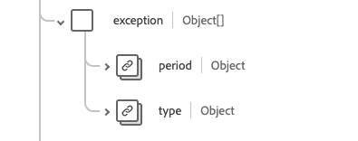

# [!UICONTROL Abdeckung] Schemafeldgruppe

[!UICONTROL Abdeckung] ist eine Standardschemafeldgruppe für die Klasse [[!DNL Plan] &#x200B;](../../../classes/plan.md). Sie enthält ein einheitliches Feld vom Typ „Objekt“, `healthcareCoverage` dem die übergeordneten Kennungen und Deskriptoren eines Versicherungsplans bereitgestellt werden sollen, in der Regel die Informationen, die auf einer Versicherungskarte erscheinen würden und die verwendet werden können, um ganz oder teilweise die Bereitstellung von Gesundheitsprodukten und -dienstleistungen zu bezahlen.

| Anzeigename | Eigenschaft | Datentyp | Beschreibung |
| --- | --- | --- | --- |
| [!UICONTROL Planbegünstigter] | `beneficiary` | [[!UICONTROL Referenz]](../data-types/reference.md) | Die Partei, die vom Versicherungsschutz profitiert, und der Patient, wenn Produkte oder Dienstleistungen erbracht werden. |
| [!UICONTROL Klasse] | `class` | Array von Objekten | Eine Suite von Underwriter-spezifischen Klassifikatoren. Weitere Informationen finden [&#x200B; im &#x200B;](#class) Abschnitt unten. |
| [!UICONTROL Kontakt] | `contract` | Array von [[!UICONTROL Referenz]](../data-types/reference.md) | Die Police(s), die diesen Versicherungsschutz bilden. |
| [!UICONTROL Kosten für den Begünstigten] | `costToBeneficiary` | Array von Objekten | Eine Suite von Codes, die die Kostenkategorie und den zugehörigen Betrag angeben, die in der Richtlinie detailliert beschrieben und möglicherweise auf der Gesundheitskarte enthalten sind. Weitere Informationen finden [&#x200B; im &#x200B;](#cost-to-beneficiary) Abschnitt unten. |
| [!UICONTROL Ausnahme] | `exception` | Array von Objekten | Eine Reihe von Codes, die Ausnahmen oder Ermäßigungen der Patientenkosten und ihrer effektiven Zeiträume angeben. Weitere Informationen finden [&#x200B; im &#x200B;](#exception) Abschnitt unten. |
| [!UICONTROL ID] | `identifier` | Array von [[!UICONTROL Identifier]](../data-types/identifier.md) | Die Kennung der vom Versicherer ausgestellten Deckung. |
| [!UICONTROL Versicherungsplan] | `insurancePlan` | [[!UICONTROL Referenz]](../data-types/reference.md) | Im Versicherungsplan sind die Einzelheiten, die Vorteile und die Kosten aufgeführt, die diesen Versicherungsschutz ausmachen. |
| [!UICONTROL Versicherer] | `insurer` | [[!UICONTROL Referenz]](../data-types/reference.md) | Programm- oder Planversicherer, Zahler oder Versicherungsgesellschaft. |
| [!UICONTROL Zahlung bis] | `paymentBy` | Array von Objekten | Der Link zur Zahlstelle und optional das, was diese zu zahlen hat. Weitere Informationen finden [&#x200B; im &#x200B;](#payment-by) Abschnitt unten. |
| [!UICONTROL Start- und Enddatum des Leistungsanspruchs] | `period` | [[!UICONTROL Zeitraum]](../data-types/period.md) | Der Zeitraum, in dem die Abdeckung aktiv ist. Ein fehlendes Startdatum bedeutet, dass das Startdatum nicht bekannt ist. Ein fehlendes Enddatum bedeutet, dass die Abdeckung noch läuft. |
| [!UICONTROL Versicherungsnehmer] | `policyHolder` | [[!UICONTROL Referenz]](../data-types/reference.md) | Die Partei, die die Versicherungspolice besitzt. |
| [!UICONTROL Beziehung zum Begünstigten] | `relationship` | [[!UICONTROL Codeable Concept]](../data-types/codeable-concept.md) | Die Beziehung des Begünstigten zum Teilnehmer. |
| [!UICONTROL Abonnent] | `subscriber` | [[!UICONTROL Referenz]](../data-types/reference.md) | Die Partei, die die vertragliche Beziehung zur Police hält. |
| [!UICONTROL Abonnentenkennung] | `subscriberId` | Array von [[!UICONTROL Identifier]](../data-types/identifier.md) | Der Versicherer hat die ID des Abonnenten zugewiesen. |
| [!UICONTROL Typ] | `type` | [[!UICONTROL Codeable Concept]](../data-types/codeable-concept.md) | Die Art der Abdeckung. |
| [!UICONTROL Abhängige Zahl] | `dependent` | String | Der Bezeichner für eine abhängige Person unter der Abdeckung. |
| [!UICONTROL Kind] | `kind` | String | Die Art der Abdeckung. Der Wert dieser Eigenschaft muss einem der folgenden bekannten Enum-Werte entsprechen. <li> `insurance` </li> <li> `self-pay` </li> <li> `other` </li> |
| [!UICONTROL Versicherungsnetz] | `network` | String | Das Netz der Anbieter, bei denen der Begünstigte eine Behandlung beantragen kann, die zum netzinternen Tarif abgedeckt wird, andernfalls gelten die Bedingungen für netzfremde Dienste. |
| [!UICONTROL Erfassungsreihenfolge] | `order` | Ganzzahl | Die relative Reihenfolge der Abdeckung mit einem Mindestwert von `0`. |
| [!UICONTROL Status] | `status` | String | Der Status der Abdeckung. Der Wert dieser Eigenschaft muss einem der folgenden bekannten Enum-Werte entsprechen. <li> `active` </li> <li> `cancelled` </li> <li> `draft` </li> <li> `entered-in-error` </li> |
| [!UICONTROL Forderungsübergang] | `subrogation` | Boolesch | Wenn `true`, wurde diese Versicherungsinstanz nicht zur gerichtlichen Entscheidung einbezogen, sondern um den Versicherern die Details zur Kostendeckung zur Verfügung zu stellen. |

Weitere Informationen zur Feldergruppe finden Sie im öffentlichen XDM-Repository:

* [Ausgefülltes Beispiel](https://github.com/adobe/xdm/blob/master/extensions/industry/healthcare/fhir/fieldgroups/coverage.example.1.json)
* [Vollständiges Schema](https://github.com/adobe/xdm/blob/master/extensions/industry/healthcare/fhir/fieldgroups/coverage.schema.json)

## `class` {#class}

`class` wird als Array von -Objekten bereitgestellt. Im Folgenden wird die Struktur der einzelnen Objekte beschrieben.

| Anzeigename | Eigenschaft | Datentyp | Beschreibung |
| --- | --- | --- | --- |
| [!UICONTROL Typ] | `type` | Array von [[!UICONTROL Codeable Concept]](../data-types/codeable-concept.md) | Die Art der Klassifizierung, für die ein versichererspezifisches Klassenlabel oder eine Nummer und ein optionaler Name angegeben sind. Beispielsweise kann „Typ“ verwendet werden, um eine Klasse von Abdeckung, Arbeitgebergruppe, Richtlinie oder Plan zu identifizieren. |
| [!UICONTROL Wert] | `value` | [[!UICONTROL ID]](../data-types/identifier.md) | Die alphanumerische Kennung, die mit der vom Versicherer ausgestellten Kennzeichnung verbunden ist. |
| [!UICONTROL Name] | `name` | String | Eine kurze Beschreibung für die Klasse. |

## `costToBeneficiary` {#cost-to-beneficiary}

`costToBeneficiary` wird als Array von -Objekten bereitgestellt. Im Folgenden wird die Struktur der einzelnen Objekte beschrieben.

| Anzeigename | Eigenschaft | Datentyp | Beschreibung |
| --- | --- | --- | --- |
| [!UICONTROL Kategorie] | `category` | [[!UICONTROL Codeable Concept]](../data-types/codeable-concept.md) | Der Code zur Identifizierung der allgemeinen Art der Leistungen, unter denen Produkte und Dienstleistungen erbracht werden. |
| [!UICONTROL Netzwerk] | `network` | [[!UICONTROL Codeable Concept]](../data-types/codeable-concept.md) | Der Code, der angibt, ob sich die Vorteile auf netzwerkinterne oder netzwerkexterne Anbieter beziehen. |
| [!UICONTROL Begriff] | `term` | [[!UICONTROL Codeable Concept]](../data-types/codeable-concept.md) | Die Laufzeit der Werte, z. B. maximale Leistung während der Lebensdauer. |
| [!UICONTROL Typ] | `type` | [[!UICONTROL Codeable Concept]](../data-types/codeable-concept.md) | Die Kategorie der patientenorientierten Kosten im Zusammenhang mit der Behandlung. |
| [!UICONTROL Einheit] | `unit` | [[!UICONTROL Codeable Concept]](../data-types/codeable-concept.md) | Gibt an, ob die Leistungen für eine Einzelperson oder für die Familie gelten. |

## `exception` {#exception}

`exception` wird als Array von -Objekten bereitgestellt. Im Folgenden wird die Struktur der einzelnen Objekte beschrieben.

| Anzeigename | Eigenschaft | Datentyp | Beschreibung |
| --- | --- | --- | --- |
| [!UICONTROL Typ] | `type` | [[!UICONTROL Codeable Concept]](../data-types/codeable-concept.md) | Der Code für die spezifische Ausnahme. |
| [!UICONTROL Zeitraum] | `period` | [[!UICONTROL Zeitraum]](../data-types/period.md) | Der Zeitrahmen, in dem die Ausnahme aktiv ist. |

## `paymentBy` {#payment-by}

`paymentBy` wird als Array von -Objekten bereitgestellt. Im Folgenden wird die Struktur der einzelnen Objekte beschrieben.

| Anzeigename | Eigenschaft | Datentyp | Beschreibung |
| --- | --- | --- | --- |
| [!UICONTROL Party] | `party` | [[!UICONTROL Referenz]](../data-types/reference.md) | Die Liste der Parteien, die nicht versicherungstechnische Zahlungen für die Behandlungskosten leisten. |
| [!UICONTROL Verantwortung] | `responsibility` | String | Die Beschreibung der finanziellen Verantwortung. |
