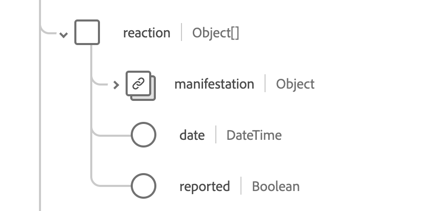

# [!UICONTROL Immunisierung] Schemafeldgruppe

[!UICONTROL Immunisierung] ist eine Standardschemafeldgruppe für die Klasse [[!DNL XDM Experience Event] &#x200B;](../../../classes/experienceevent.md). Es bietet ein einzelnes Feld vom Typ „Objekt“, `healthcareImmunization` Informationen zu Immunisierungsereignissen erfasst.

| Anzeigename | Eigenschaft | Datentyp | Beschreibung |
| --- | --- | --- | --- |
| [!UICONTROL Verabreichtes Produkt] | `administeredProduct` | [[!UICONTROL Codeable Reference]](../data-types/codeable-reference.md) | Das verabreichte Produkt. |
| [!UICONTROL basierend auf] | `basedOn` | Array von [[!UICONTROL Referenz]](../data-types/reference.md) | Die Autorität, auf der das Immunisierungsereignis basiert. |
| [!UICONTROL Dosismenge] | `doseQuantity` | [[!UICONTROL Einfache Menge]](../data-types/simple-quantity.md) | Die Menge des verabreichten Impfstoffs. |
| [!UICONTROL Begegnung] | `encounter` | [[!UICONTROL Referenz]](../data-types/reference.md) | Die Begegnung mit der Impfung war ein Teil davon. |
| [!UICONTROL Finanzierung von Source] | `fundingSource` | [[!UICONTROL Codeable Concept]](../data-types/codeable-concept.md) | Die Finanzierungsquelle für den Impfstoff. |
| [!UICONTROL ID] | `identifier` | Array von [[!UICONTROL Identifier]](../data-types/identifier.md) | Die Geschäftskennung. |
| [!UICONTROL Informationen Source] | `informationSource` | [[!UICONTROL Codeable Reference]](../data-types/codeable-reference.md) | Gibt die Quelle des gemeldeten Datensatzes an. |
| [!UICONTROL Ort] | `location` | [[!UICONTROL Referenz]](../data-types/reference.md) | Der Ort, an dem die Impfung stattfand. |
| [!UICONTROL Hersteller] | `manufacturer` | [[!UICONTROL Codeable Reference]](../data-types/codeable-reference.md) | Der Impfstoffhersteller. |
| [!UICONTROL Hinweis] | `note` | Array von [[!UICONTROL Anmerkung]](../data-types/annotation.md) | Zusätzliche Impfhinweise. |
| [!UICONTROL Patient] | `patient` | [[!UICONTROL Referenz]](../data-types/reference.md) | Wer wurde immunisiert. |
| [!UICONTROL Batch] | `performer` | Array von Objekten | Wer hat das Immunisierungs-Ereignis durchgeführt. Weitere Informationen finden [&#x200B; im &#x200B;](#performer) Abschnitt unten. |
| [!UICONTROL Programmeignung] | `programEligibility` | Array von Objekten | Die Eignung des Patienten für ein spezifisches Impfprogramm. Weitere Informationen finden [&#x200B; im &#x200B;](#program-eligibility) Abschnitt unten. |
| [!UICONTROL Protokoll angewendet] | `protocolApplied` | Array von Objekten | Das vom Anbieter bereitgestellte Protokoll. Weitere Informationen finden [&#x200B; im &#x200B;](#protocol-applied) Abschnitt unten. |
| [!UICONTROL Reaktion] | `reaction` | Array von Objekten | Die Details einer Reaktion nach der Impfung. Weitere Informationen finden [&#x200B; im &#x200B;](#reaction) Abschnitt unten. |
| [!UICONTROL Grund] | `reason` | Array von [[!UICONTROL Codeable Reference]](../data-types/codeable-reference.md) | Der Grund für die Impfung. |
| [!UICONTROL Route] | `route` | [[!UICONTROL Codeable Concept]](../data-types/codeable-concept.md) | Wie der Impfstoff in den Körper gelangt ist. |
| [!UICONTROL Site] | `site` | [[!UICONTROL Codeable Concept]](../data-types/codeable-concept.md) | Die Stelle im Körper, an der der Impfstoff verabreicht wurde |
| [!UICONTROL Statusgrund] | `statusReason` | [[!UICONTROL Codeable Concept]](../data-types/codeable-concept.md) | Der Grund für den aktuellen Status. |
| [!UICONTROL subpotenter Grund] | `subpotentReason` | Array von [[!UICONTROL Codeable Concept]](../data-types/codeable-concept.md) | Der Grund für die Subpotenz des Impfstoffs. |
| [!UICONTROL unterstützende Informationen] | `supportingInformation` | Array von [[!UICONTROL Referenz]](../data-types/reference.md) | Zusätzliche Informationen zur Unterstützung der Immunisierung. |
| [!UICONTROL Impfcode] | `vaccineCode` | [[!UICONTROL Codeable Concept]](../data-types/codeable-concept.md) | Der Code für den verabreichten Impfstoff. |
| [!UICONTROL Ablaufdatum] | `expirationDate` | Datum | Das Verfallsdatum des Impfstoffs. |
| [!UICONTROL Ist subpotent] | `isSubpotent` | Boolesch | Der Indikator dafür, ob der Impfstoff subpotent ist. |
| [!UICONTROL Losnummer] | `lotNumber` | String | Die Losnummer des Impfstoffs. |
| [!UICONTROL Auftritt DatumUhrzeit] | `occurenceDateTime` | DateTime | Datum der Impfstoffverabreichung. |
| [!UICONTROL Vorkommnis-String] | `occurenceString` | String | Datum der Impfstoffverabreichung. |
| [!UICONTROL Primäres Source] | `primarySource` | Boolesch | Gibt an, ob die Daten aus einer primären Quelle erfasst wurden. |
| [!UICONTROL Status] | `status` | String | Der Status der Impfung. Der Wert dieser Eigenschaft muss einem der folgenden bekannten Enum-Werte entsprechen. <li> `completed` </li> <li> `entered-in-error` </li> <li> `not-done` </li> |

Weitere Informationen zur Feldergruppe finden Sie im öffentlichen XDM-Repository:

* [Ausgefülltes Beispiel](https://github.com/adobe/xdm/blob/master/extensions/industry/healthcare/fhir/fieldgroups/immunization.example.1.json)
* [Vollständiges Schema](https://github.com/adobe/xdm/blob/master/extensions/industry/healthcare/fhir/fieldgroups/immunization.schema.json)

## `performer` {#performer}

`performer` wird als Array von -Objekten bereitgestellt. Im Folgenden wird die Struktur der einzelnen Objekte beschrieben.

| Anzeigename | Eigenschaft | Datentyp | Beschreibung |
| --- | --- | --- | --- |
| [!UICONTROL Schauspieler] | `actor` | [[!UICONTROL Referenz]](../data-types/reference.md) | Die Person oder Organisation, die die Performance ausgeführt hat. |
| [!UICONTROL Funktion] | `function` | [[!UICONTROL Codeable Concept]](../data-types/codeable-concept.md) | Welche Art von Leistung wurde ausgeführt. |

## `programEligibility` {#program-eligibility}

`programEligibility` wird als Array von -Objekten bereitgestellt. Im Folgenden wird die Struktur der einzelnen Objekte beschrieben.

| Anzeigename | Eigenschaft | Datentyp | Beschreibung |
| --- | --- | --- | --- |
| [!UICONTROL Programm] | `program` | [[!UICONTROL Codeable Concept]](../data-types/codeable-concept.md) | Das Programm, für das die Berechtigung erklärt wurde. |
| [!UICONTROL Programmstatus] | `programStatus` | [[!UICONTROL Codeable Concept]](../data-types/codeable-concept.md) | Der Status des Patienten für das Programm. |

## `protocolApplied` {#protocol-applied}

`protocolApplied` wird als Array von -Objekten bereitgestellt. Im Folgenden wird die Struktur der einzelnen Objekte beschrieben.

| Anzeigename | Eigenschaft | Datentyp | Beschreibung |
| --- | --- | --- | --- |
| [!UICONTROL AUTORITÄT] | `authority` | [[!UICONTROL Referenz]](../data-types/reference.md) | Wer ist für die Veröffentlichung der Empfehlungen verantwortlich? |
| [!UICONTROL Target-Krankheit] | `targetDisease` | Array von [[!UICONTROL Codeable Concept]](../data-types/codeable-concept.md) | Die vermeidbare Krankheit, gegen die der Impfstoff gerichtet ist. |
| [!UICONTROL Dosisnummer] | `doseNumber` | String | Die Dosisnummer innerhalb der Serie. |
| [!UICONTROL Serie] | `series` | String | Der Name der Impfstoffserie. |
| [!UICONTROL Serie Dosen] | `seriesDoses` | String | Empfohlene Anzahl von Dosen für die Immunität. |

## `reaction` {#reaction}

`reaction` wird als Array von -Objekten bereitgestellt. Im Folgenden wird die Struktur der einzelnen Objekte beschrieben.

| Anzeigename | Eigenschaft | Datentyp | Beschreibung |
| --- | --- | --- | --- |
| [!UICONTROL Manifestation] | `manifestation` | [[!UICONTROL Codeable Reference]](../data-types/codeable-concept.md) | Zusätzliche Informationen zur Reaktion. |
| [!UICONTROL Datum] | `date` | DateTime | Wann die Reaktion begann. |
| [!UICONTROL Gemeldet] | `reported` | String | Gibt an, ob die Reaktion selbst berichtet wurde. |
