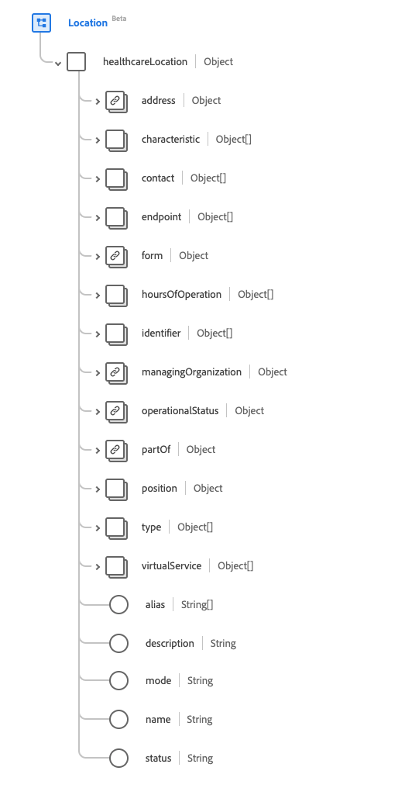

# [!UICONTROL Position] Schemafeldgruppe

[!UICONTROL Position] ist eine Standardschemafeldgruppe für die [[!DNL Location] Klasse](../classes/location.md). Es stellt ein einzelnes Objektfeld `healthcareLocation` bereit, das Details und Positionsinformationen für einen Ort erfasst.

| Anzeigename | Eigenschaft | Datentyp | Beschreibung |
| --- | --- | --- | --- |
| [!UICONTROL Adresse] | `address` | [[!UICONTROL Adresse]](../data-types/address.md) | Die Adresse des physischen Standorts. |
| [!UICONTROL CharacterIST] | `characteristic` | Array von [[!UICONTROL Codeable Concept]](../data-types/codeable-concept.md) | Eine Sammlung der Standortmerkmale. |
| [!UICONTROL Contact] | `contact` | Array von [[!UICONTROL erweiterten Kontaktdetails]](../data-types/extended-contact-detail.md) | Die Kontaktdaten für den Standort. |
| [!UICONTROL Endpunkt] | `endpoint` | Array von [[!UICONTROL Verweis]](../data-types/reference.md) | Die technischen Endpunkte, die Zugriff auf Betriebsdienste für den Standort bieten. |
| [!UICONTROL Formular] | `form` | [[!UICONTROL Codeable Concept]](../data-types/codeable-concept.md) | Die physische Form des Standorts. |
| [!UICONTROL Betriebsstunden] | `hoursOfOperation` | Array von [[!UICONTROL Verfügbarkeit]](../data-types/availability.md) | Welche Tage und Uhrzeiten dieser Ort normalerweise geöffnet ist (einschließlich Ausnahmen). |
| [!UICONTROL ID] | `identifier` | Array von [[!UICONTROL Bezeichner]](../data-types/identifier.md) | Der eindeutige Code oder die eindeutige Nummer, mit dem/der der Standort identifiziert wird. |
| [!UICONTROL Verwalten der Organisation] | `managingOrganization` | [[!UICONTROL Referenz]](../data-types/reference.md) | Die für die Bereitstellung und Wartung zuständige Organisation. |
| [!UICONTROL Betriebsstatus] | `operationalStatus` | [[!UICONTROL Kodierung]](../data-types/coding.md) | Der Betriebsstatus für den Standort. |
| [!UICONTROL Teil des Standorts] | `partOf` | [[!UICONTROL Referenz]](../data-types/reference.md) | Der Ort, zu dem dieser Standort gehört. |
| [!UICONTROL Position] | `position` | Objekt | Der absolute geografische Standort. Enthält drei Eigenschaften im Doppelformat: <li>`longitude`: Längengrad mit WGS84-Datum</li> <li>`latitude`: Breitengrad mit WGS84-Datum.</li> <li>`altitude`: Höhe mit WGS84-Datum.</li> |
| [!UICONTROL Typ] | `type` | Array von [[!UICONTROL Codeable Concept]](../data-types/codeable-concept.md) | Der Typ der Funktion, die am Speicherort ausgeführt wird. |
| [!UICONTROL Virtual Service] | `virtualService` | Array von [[!UICONTROL Virtual Service Detail]](../data-types/virtual-service-detail.md) | Die Verbindungsdetails eines virtuellen Dienstes. |
| [!UICONTROL alias] | `alias` | Zeichenfolgen-Array | Eine Liste mit alternativen Namen, die der Standort ist oder war. |
| [!UICONTROL Beschreibung] | `description` | String | Weitere Informationen zur Identifizierung des Standorts über seinen Namen hinaus. |
| [!UICONTROL mode] | `mode` | String | Der Modus des Standorts. Der Wert dieser Eigenschaft muss mit einem der folgenden bekannten Enum-Werte übereinstimmen. <li> `instance` </li> <li> `kind` </li> |
| [!UICONTROL Name] | `name` | String | Der Name des Standorts. |
| [!UICONTROL Status] | `status` | String | Der Status des Standorts. Der Wert dieser Eigenschaft muss mit einem der folgenden bekannten Enum-Werte übereinstimmen. <li> `active` </li> <li> `inactive` </li> <li> `suspended` </li> |

Weitere Informationen zur Feldergruppe finden Sie im öffentlichen XDM-Repository:

* [Ausgefülltes Beispiel](https://github.com/adobe/xdm/blob/master/extensions/industry/healthcare/fhir/fieldgroups/location.example.1.json)
* [Vollständiges Schema](https://github.com/adobe/xdm/blob/master/extensions/industry/healthcare/fhir/fieldgroups/location.schema.json)
