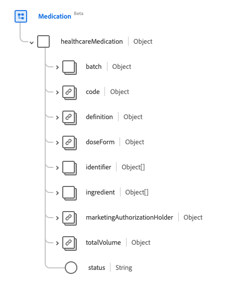

# [!UICONTROL Meditation] Schemafeldgruppe

[!UICONTROL Meditation] ist eine Standardschemafeldgruppe für die [[!DNL Medication] Klasse](../../../classes/medication.md). Es stellt ein einzelnes Objekt-Feld `healthcareMedication` bereit, das die Informationen eines Medikaments erfasst.

| Anzeigename | Eigenschaft | Datentyp | Beschreibung |
| ---|  --- | --- | --- |
| [!UICONTROL Batch] | `batch` | Objekt | Details zu einem verpackten Arzneimittel. Enthält zwei Eigenschaften: <li>`lotNumber`: Ein string -Wert für die Kennung, die dem Batch zugewiesen ist.</li> <li>`expirationDate`: Ein DateTime -Wert für den Zeitpunkt, zu dem der Batch abläuft.</li> |
| [!UICONTROL Code] | `code` | [[!UICONTROL Codeable Concept]](../data-types/codeable-concept.md) | Der Code, der dieses Medikament identifiziert. |
| [!UICONTROL Definition] | `definition` | [[!UICONTROL Referenz]](../data-types/reference.md) | Definition des Arzneimittels. |
| [!UICONTROL Dosierungsformular] | `doseForm` | [[!UICONTROL Codeable Concept]](../data-types/codeable-concept.md) | Beschreibt die Dosierungsform des Arzneimittels, wie Tabletten oder Kapseln. |
| [!UICONTROL ID] | `identifier` | Array von [[!UICONTROL Bezeichner]](../data-types/identifier.md) | Ein Identifikator für die Medikation. |
| [!UICONTROL Ingredient] | `ingredient` | Array von Objekten | Beschreibt Informationen über Inhaltsstoffe für das Arzneimittel. Weitere Informationen finden Sie im Abschnitt [unter ](#ingredient) . |
| [!UICONTROL Inhaber der Genehmigung für das Inverkehrbringen] | `marketingAuthorizationHolder` | [[!UICONTROL Referenz]](../data-types/reference.md) | Die Organisation, die die Genehmigung zum Inverkehrbringen des Arzneimittels besitzt. |
| [!UICONTROL Gesamtvolumen] | `totalVolume` | [[!UICONTROL Quantity]](../data-types/quantity.md) | Die Menge des Arzneimittels, wenn der Produktcode keine Packungsgröße ergibt. |
| [!UICONTROL Status] | `status` | String | Der Status des Arzneimittels. Der Wert dieser Eigenschaft muss mit einem der folgenden bekannten Enum-Werte übereinstimmen. <li> `active` </li> <li> `inactive` </li> <li> `entered-in-error` </li> |

Weitere Informationen zur Feldergruppe finden Sie im öffentlichen XDM-Repository:

* [Ausgefülltes Beispiel](https://github.com/adobe/xdm/blob/master/extensions/industry/healthcare/fhir/fieldgroups/medication.example.1.json)
* [Vollständiges Schema](https://github.com/adobe/xdm/blob/master/extensions/industry/healthcare/fhir/fieldgroups/medication.schema.json)

## `ingredient` {#ingredient}

`ingredient` wird als Array von Objekten bereitgestellt. Die Struktur der einzelnen Objekte wird nachfolgend beschrieben.

| Anzeigename | Eigenschaft | Datentyp | Beschreibung |
| --- | --- | --- | --- |
| [!UICONTROL Item] | `item` | [[!UICONTROL Codeable Reference]](../data-types/codeable-reference.md) | Der zu beschreibende Bestandteil. |
| [!UICONTROL Stärke Codeable Concept] | `strengthCodeableConcept` | [[!UICONTROL Codeable Concept]](../data-types/codeable-concept.md) | Die Menge des vorhandenen Bestandteils, ausgedrückt in einer systemdefinierten Terminologie. |
| [!UICONTROL Strength Quantity] | `strengthQuantity` | [[!UICONTROL Quantity]](../data-types/quantity.md) | Die Menge der vorhandenen Zutat. |
| [!UICONTROL Strength Ratio] | `strengthRatio` | [[!UICONTROL Verhältnis]](../data-types/ratio.md) | Das Verhältnis des vorhandenen Bestandteils. |
| [!UICONTROL ist aktiv] | `isActive` | Boolesch | Gibt an, ob der Inhaltsstoff aktiv ist. |
