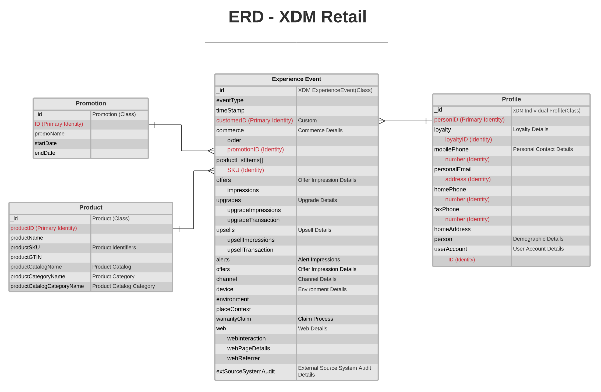

# [!UICONTROL Einzelhandel] Datenmodell der Branche

Das folgende Entitätsbeziehungsdiagramm (ERD) stellt ein standardisiertes Datenmodell für die Einzelhandelsbranche dar. Der ERD wird absichtlich denormalisiert und unter Berücksichtigung der Speicherung von Daten in Adobe Experience Platform präsentiert.

>[!NOTE]
>
>Der ERD wie beschrieben ist eine Empfehlung, wie Sie Ihre Daten für diesen branchenspezifischen Anwendungsfall modellieren sollten. Um dieses Datenmodell in Platform nutzen zu können, müssen Sie die empfohlenen Schemas und deren Beziehungen selbst erstellen. Siehe Handbücher zur Verwaltung [Schemas](../../ui/resources/schemas.md) und [Beziehungen](../../tutorials/relationship-ui.md) in der Benutzeroberfläche für weitere Informationen.

Verwenden Sie die folgende Legende, um diese ERD zu interpretieren:

* Jede in angezeigte Entität basiert auf einem zugrunde liegenden [Experience-Datenmodell (XDM)-Klasse](../composition.md#class).
* Für eine bestimmte Entität jede Zeile, die in **fett** stellt eine Feldergruppe oder einen Datentyp mit den entsprechenden Feldern dar, die unten im unfetteten Text aufgeführt sind.
* Die wichtigsten Felder für eine bestimmte Entität sind rot hervorgehoben.
* Alle Eigenschaften, die zur Identifizierung einzelner Kunden verwendet werden können, werden als &quot;Identität&quot;gekennzeichnet, wobei eine dieser Eigenschaften als &quot;primäre Identität&quot;markiert ist.
* Entitätsbeziehungen werden als nicht abhängig markiert, da Cookie-basierte Ereignisse häufig nicht die Person oder Person bestimmen können, die die Transaktion getätigt hat.

>[!NOTE]
>
>Die Entität &quot;Erlebnisereignis&quot;enthält ein Feld &quot;_ID&quot;, das die eindeutige Kennung (`_id`), das von der XDM ExperienceEvent-Klasse bereitgestellt wird. Siehe Referenzdokument unter [XDM ExperienceEvent](../../classes/experienceevent.md) für weitere Details darüber, was für diesen Wert erwartet wird.

## [!UICONTROL Einzelhandel] Anwendungsfälle

In der folgenden Tabelle sind die empfohlenen Klassen und Schemafeldgruppen für verschiedene gängige Einzelhandelsanwendungsfälle aufgeführt.

| Anwendungsfall | Empfohlene Klassen und Feldergruppen |
| --- | --- |
| Kombinieren Sie Online- und Offline-Datenquellen und lösen Sie geräteübergreifende und Online-/Offline-Identitäten auf, um eine ganzheitliche kanalübergreifende und geräteübergreifende Attributionsberichterstellung bereitzustellen. | <ul><li>**[XDM ExperienceEvent](../../classes/experienceevent.md)**:<ul><li>[Handelsdetails](../../field-groups/event/commerce-details.md)</li><li>[Web-Details](../../field-groups/event/web-details.md)</li></ul></li><li>**[Produkt](../../classes/product.md)**:<ul><li>[Produktkatalog](../../field-groups/product/product-catalog.md)</li><li>[Produktkategorie](../../field-groups/product/product-category.md)</li></ul></li></ul> |
| Stellen Sie zielgerichtete und personalisierte Erlebnisse für verschiedene Segmente bereit, um den Umsatz zu steigern und die Plattform bei der Omnichannel-Orchestrierung zu erweitern. | <ul><li>**[XDM ExperienceEvent](../../classes/experienceevent.md)**:<ul><li>[Kampagnen-Marketing-Details](../../field-groups/event/campaign-marketing-details.md)</li><li>[Kanaldetails](../../field-groups/event/channel-details.md)</li><li>[Handelsdetails](../../field-groups/event/commerce-details.md)</li><li>[Umgebungsdetails](../../field-groups/event/environment-details.md)</li><li>[Web-Details](../../field-groups/event/web-details.md)</li></ul></li><li>**[Individuelles XDM-Profil](../../classes/individual-profile.md)**:<ul><li>[Demografische Details](../../field-groups/profile/demographic-details.md)</li><li>[Persönliche Kontaktdaten](../../field-groups/profile/personal-contact-details.md)</li><li>[Details zu Arbeitskontakten](../../field-groups/profile/work-contact-details.md)</li></ul></li></ul> |
| Analysieren Sie die Multitouch-Attribution, um die Marketingeffizienz zu verbessern. | <ul><li>**[XDM ExperienceEvent](../../classes/experienceevent.md)**:<ul><li>[Kampagnen-Marketing-Details](../../field-groups/event/campaign-marketing-details.md)</li><li>[Kanaldetails](../../field-groups/event/channel-details.md)</li><li>[Handelsdetails](../../field-groups/event/commerce-details.md)</li></ul></li><li>**[Individuelles XDM-Profil](../../classes/individual-profile.md)**:<ul><li>[Demografische Details](../../field-groups/profile/demographic-details.md)</li></ul></li></ul> |
| Verbessern der E-Mail-Relevanz durch verbesserte Segmentierung von Männern und Frauen. | <ul><li>**[XDM ExperienceEvent](../../classes/experienceevent.md)**:<ul><li>[Handelsdetails](../../field-groups/event/commerce-details.md)</li></ul></li><li>**[Individuelles XDM-Profil](../../classes/individual-profile.md)**:<ul><li>[Demografische Details](../../field-groups/profile/demographic-details.md)</li></ul></li><li>**[Produkt](../../classes/product.md)**:<ul><li>[Produktkatalog](../../field-groups/product/product-catalog.md)</li><li>[Produktkategorie](../../field-groups/product/product-category.md)</li></ul></li></ul> |
| Erfassen Sie Loyalitätsdaten (Partner), um relevante Produktinformationen über Web-, E-Mail- und digitale Marketingkanäle hinweg zu verbessern. | <ul><li>**[XDM ExperienceEvent](../../classes/experienceevent.md)**:<ul><li>[Web-Details](../../field-groups/event/web-details.md)</li></ul></li><li>**[Individuelles XDM-Profil](../../classes/individual-profile.md)**:<ul><li>[Demografische Details](../../field-groups/profile/demographic-details.md)</li><li>[Treuedetails](../../field-groups/profile/loyalty-details.md)</li></ul></li><li>**[Produkt](../../classes/product.md)**:<ul><li>[Produktkatalog](../../field-groups/product/product-catalog.md)</li><li>[Produktkategorie](../../field-groups/product/product-category.md)</li></ul></li></ul> |
| Retargeting von Warenkorbabbrüchen durch automatisierte und personalisierte E-Mails. | <ul><li>**[XDM ExperienceEvent](../../classes/experienceevent.md)**:<ul><li>[Handelsdetails](../../field-groups/event/commerce-details.md)</li><li>[Web-Details](../../field-groups/event/web-details.md)</li></ul></li><li>**[Produkt](../../classes/product.md)**:<ul><li>[Produktkatalog](../../field-groups/product/product-catalog.md)</li><li>[Produktkategorie](../../field-groups/product/product-category.md)</li></ul></li></ul> |

{style="table-layout:auto"}
