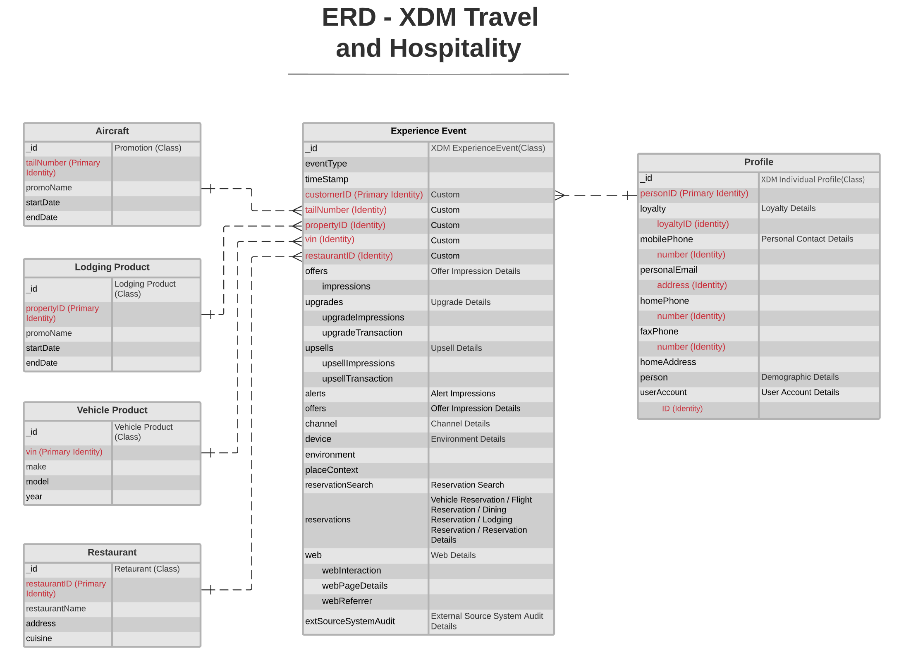

# [!UICONTROL Reise und Gastfreundschaft] Branchendatenmodell ERD

Das folgende Entitätsbeziehungsdiagramm (ERD) stellt ein standardisiertes Datenmodell für die Reise- und Gastgewerbe dar. Der ERD wird absichtlich denormalisiert und unter Berücksichtigung der Art und Weise, wie Daten in Adobe Experience Platform gespeichert werden, präsentiert.

>[!NOTE]
>
>Der ERD wie beschrieben ist eine Empfehlung, wie Sie Ihre Daten für diesen branchenspezifischen Anwendungsfall modellieren sollten. Um dieses Datenmodell in Platform nutzen zu können, müssen Sie die empfohlenen Schemas und deren Beziehungen selbst erstellen. Siehe Handbücher zur Verwaltung [Schemas](../../ui/resources/schemas.md) und [Beziehungen](../../tutorials/relationship-ui.md) in der Benutzeroberfläche für weitere Informationen.

Verwenden Sie die folgende Legende, um diese ERD zu interpretieren:

* Jede in angezeigte Entität basiert auf einem zugrunde liegenden [Experience-Datenmodell (XDM)-Klasse](../composition.md#class).
* Für eine bestimmte Entität jede Zeile, die in **fett** stellt eine Feldergruppe oder einen Datentyp mit den entsprechenden Feldern dar, die unten im unfetteten Text aufgeführt sind.
* Die wichtigsten Felder für eine bestimmte Entität sind rot hervorgehoben.
* Alle Eigenschaften, die zur Identifizierung einzelner Kunden verwendet werden können, werden als &quot;Identität&quot;gekennzeichnet, wobei eine dieser Eigenschaften als &quot;primäre Identität&quot;markiert ist.
* Entitätsbeziehungen werden als nicht abhängig markiert, da Cookie-basierte Ereignisse häufig nicht die Person oder Person bestimmen können, die die Transaktion getätigt hat.

>[!NOTE]
>
>Die Entität &quot;Erlebnisereignis&quot;enthält ein Feld &quot;_ID&quot;, das die eindeutige Kennung (`_id`), das von der XDM ExperienceEvent-Klasse bereitgestellt wird. Siehe Referenzdokument unter [XDM ExperienceEvent](../../classes/experienceevent.md) für weitere Details darüber, was für diesen Wert erwartet wird.

## [!UICONTROL Reise und Gastfreundschaft] Anwendungsfälle

In der folgenden Tabelle sind die empfohlenen Klassen und Schemafeldgruppen für verschiedene gängige Anwendungsfälle für die Reise- und Gastgewerbe aufgeführt.

| Anwendungsfall | Empfohlene Klassen und Feldergruppen |
| --- | --- |
| Gastfreundschaft und andere Anziehungsmöglichkeiten für Gäste und Gäste mit bevorstehender Hotelreservierung. | <ul><li>**[XDM ExperienceEvent](../../classes/experienceevent.md)**:<ul><li>[Reservierungsdetails](../../field-groups/event/reservation-details.md)</li><li>[Unterkunftsreservierung](../../field-groups/event/lodging-reservation.md)</li><li>[Restaurantreservierung](../../field-groups/event/dining-reservation.md)</li></ul></li><li>**[Individuelles XDM-Profil](../../classes/individual-profile.md)**:<ul><li>[Demografische Details](../../field-groups/profile/demographic-details.md)</li><li>[Persönliche Kontaktdaten](../../field-groups/profile/personal-contact-details.md)</li><li>[Details zu Arbeitskontakten](../../field-groups/profile/work-contact-details.md)</li></ul></li></ul> |
| Gastfreundschaft und andere Anziehungsmöglichkeiten für Gäste und Gäste mit bevorstehender Hotelreservierung. | <ul><li>**[XDM ExperienceEvent](../../classes/experienceevent.md)**:<ul><li>[Reservierungsdetails](../../field-groups/event/reservation-details.md)</li><li>[Restaurantreservierung](../../field-groups/event/dining-reservation.md)</li></ul></li><li>**[Individuelles XDM-Profil](../../classes/individual-profile.md)**:<ul><li>[Demografische Details](../../field-groups/profile/demographic-details.md)</li><li>[Persönliche Kontaktdaten](../../field-groups/profile/personal-contact-details.md)</li><li>[Details zu Arbeitskontakten](../../field-groups/profile/work-contact-details.md)</li><li>[Treuedetails](../../field-groups/profile/loyalty-details.md)</li></ul></li></ul> |
| Hotel und andere Anziehungsmöglichkeiten für Gäste und Gäste mit bevorstehender Hotelreservierung. | <ul><li>**[XDM ExperienceEvent](../../classes/experienceevent.md)**:<ul><li>[Reservierungsdetails](../../field-groups/event/reservation-details.md)</li><li>[Unterkunftsreservierung](../../field-groups/event/lodging-reservation.md)</li></ul></li><li>**[Individuelles XDM-Profil](../../classes/individual-profile.md)**:<ul><li>[Demografische Details](../../field-groups/profile/demographic-details.md)</li><li>[Persönliche Kontaktdaten](../../field-groups/profile/personal-contact-details.md)</li><li>[Details zu Arbeitskontakten](../../field-groups/profile/work-contact-details.md)</li><li>[Treuedetails](../../field-groups/profile/loyalty-details.md)</li></ul></li></ul> |
| Up-Sell-Flug und andere lokale Attraktionen für Gäste und Gäste mit bevorstehender Hotelreservierung. | <ul><li>**[XDM ExperienceEvent](../../classes/experienceevent.md)**:<ul><li>[Reservierungsdetails](../../field-groups/event/reservation-details.md)</li><li>[Flugreservierung](../../field-groups/event/flight-reservation.md)</li></ul></li><li>**[Individuelles XDM-Profil](../../classes/individual-profile.md)**:<ul><li>[Demografische Details](../../field-groups/profile/demographic-details.md)</li><li>[Persönliche Kontaktdaten](../../field-groups/profile/personal-contact-details.md)</li><li>[Details zu Arbeitskontakten](../../field-groups/profile/work-contact-details.md)</li><li>[Treuedetails](../../field-groups/profile/loyalty-details.md)</li></ul></li></ul> |

{style="table-layout:auto"}
