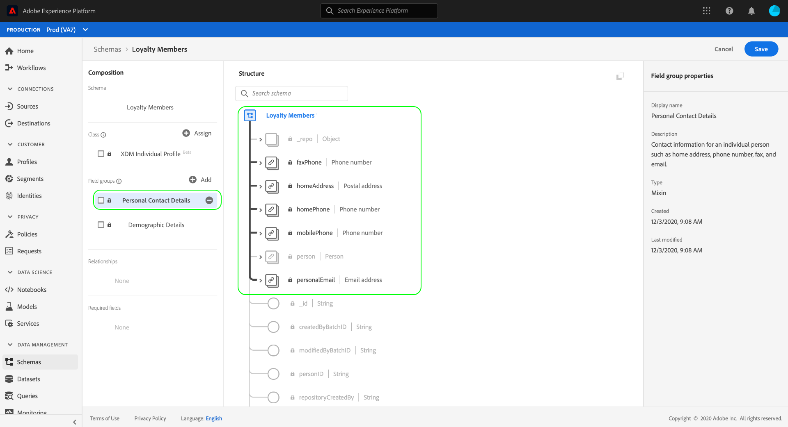
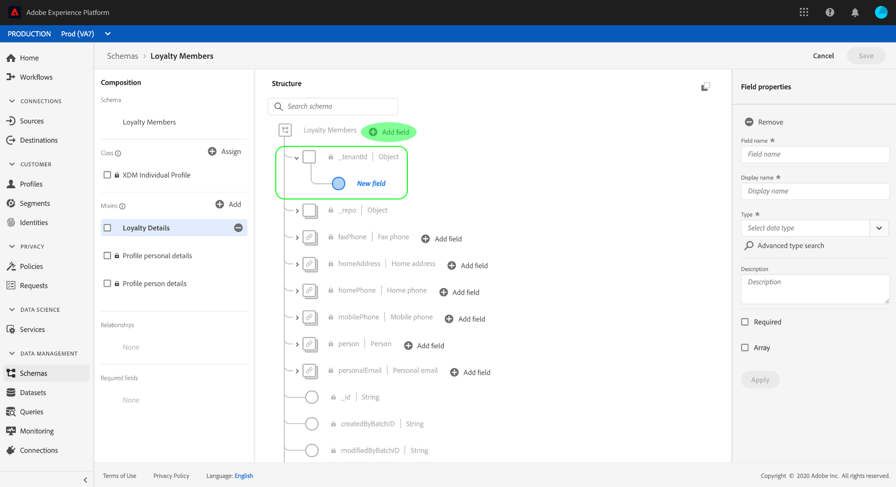
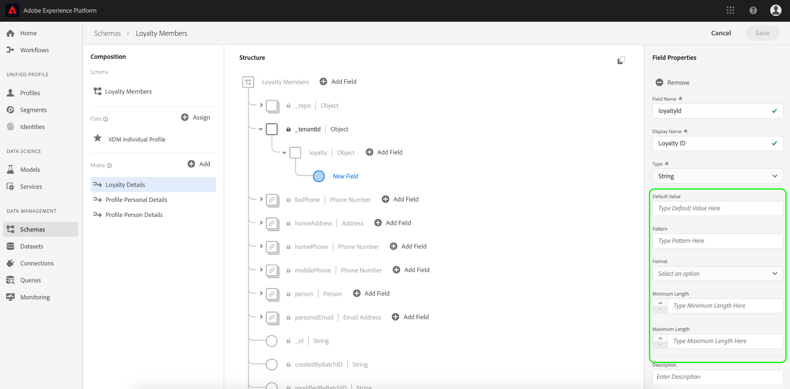
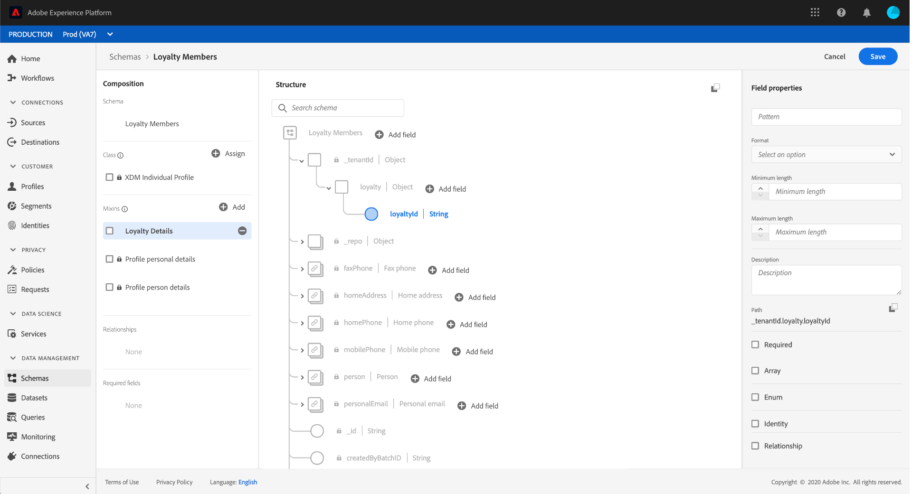
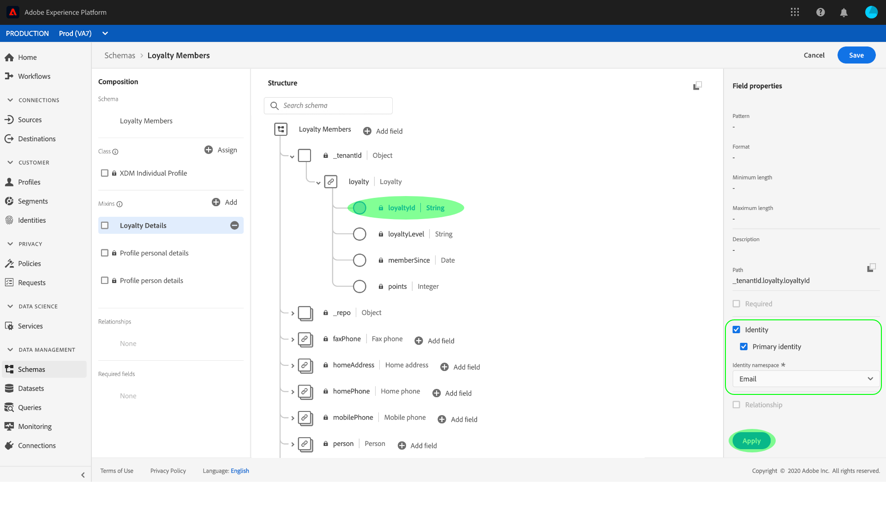

# Erstellen Sie ein Schema mit dem [!DNL Schema Editor]

In der Benutzeroberfläche von Adobe Experience Platform können Sie [!DNL Experience Data Model] (XDM)-Schemas in einer interaktiven visuellen Arbeitsfläche namens [!DNL Schema Editor]. In diesem Tutorial wird beschrieben, wie Sie ein Schema mit dem [!DNL Schema Editor].

>[!NOTE]
>
>Zu Demonstrationszwecken wird in diesem Tutorial ein Beispielschema erstellt, in dem die Mitglieder eines Kundentreueprogramms beschrieben werden. Sie können diese Schritte zwar verwenden, um ein anderes Schema für Ihre eigenen Zwecke zu erstellen, es wird jedoch empfohlen, zunächst das Beispielschema zu erstellen, um mehr über die Funktionen des [!DNL Schema Editor].

Wenn Sie lieber ein Schema mit der [!DNL Schema Registry] API stattdessen verwenden, indem Sie die [[!DNL Schema Registry] Entwicklerhandbuch](../api/getting-started.md) vor dem Versuch des Tutorials auf [Erstellen eines Schemas mithilfe der API](create-schema-api.md).

## Erste Schritte

Dieses Tutorial setzt ein Verständnis der verschiedenen Aspekte von Adobe Experience Platform voraus, die an der Schemaerstellung beteiligt sind. Bevor Sie mit diesem Tutorial beginnen, lesen Sie die Dokumentation für die folgenden Konzepte:

* [[!DNL Experience Data Model (XDM)]](../home.md): Das standardisierte Framework, mit dem Kundenerlebnisdaten von [!DNL Platform] organisiert werden.
   * [Grundlagen der Schemakomposition](../schema/composition.md): Eine Übersicht über XDM-Schemas und ihre Bausteine, einschließlich Klassen, Schemafeldgruppen, Datentypen und einzelner Felder.
* [[!DNL Real-time Customer Profile]](../../profile/home.md): Bietet ein einheitliches Echtzeit-Kundenprofil, das auf aggregierten Daten aus verschiedenen Quellen basiert.

## Öffnen Sie die [!UICONTROL Schemas] Arbeitsbereich {#browse}

Die [!UICONTROL Schemas] Arbeitsbereich im [!DNL Platform] Die Benutzeroberfläche bietet eine Visualisierung der [!DNL Schema Library], mit dem Sie die für Ihre Organisation verfügbaren Schemas anzeigen können. Der Arbeitsbereich umfasst auch die [!DNL Schema Editor], die Arbeitsfläche, auf der Sie in diesem Tutorial ein Schema erstellen können.

Nach der Anmeldung bei [!DNL Experience Platform]auswählen **[!UICONTROL Schemas]** im linken Navigationsbereich, um die **[!UICONTROL Schemas]** Arbeitsbereich. Die **[!UICONTROL Durchsuchen]** zeigt eine Liste von Schemas an (eine Darstellung der [!DNL Schema Library]), die Sie anzeigen und anpassen können. Die Liste umfasst den Namen, den Typ, die Klasse und das Verhalten (Datensatz oder Zeitreihen), auf denen das Schema basiert, sowie das Datum und die Uhrzeit der letzten Änderung des Schemas.

Siehe Handbuch unter [Erkunden vorhandener XDM-Ressourcen in der Benutzeroberfläche](../ui/explore.md) für weitere Informationen.

## Erstellen und Benennen eines Schemas {#create}

Um mit der Erstellung eines Schemas zu beginnen, wählen Sie **[!UICONTROL Schema erstellen]** in der oberen rechten Ecke der **[!UICONTROL Schemas]** Arbeitsbereich. Ein Dropdown-Menü wird angezeigt, in dem Sie zwischen den Hauptklassen wählen können [!UICONTROL XDM Individual Profile] und [!UICONTROL XDM ExperienceEvent]. Wenn diese Klassen nicht zu Ihren Zwecken passen, können Sie auch **[!UICONTROL Durchsuchen]** zur Auswahl aus anderen verfügbaren Klassen oder [eine neue Klasse erstellen](#create-new-class).

Wählen Sie für die Zwecke dieses Tutorials **[!UICONTROL XDM Individual Profile]**.

Da Sie eine standardmäßige XDM-Klasse ausgewählt haben, auf der das Schema basieren soll, wird die **[!UICONTROL Feldergruppe hinzufügen]** angezeigt, sodass Sie sofort mit dem Hinzufügen von Feldern zum Schema beginnen können. Wählen Sie zunächst **[!UICONTROL Abbrechen]** , um das Dialogfeld zu verlassen.

Die [!DNL Schema Editor] angezeigt. Dies ist die Arbeitsfläche, auf der Sie Ihr Schema zusammenstellen. Ein unbenanntes Schema wird automatisch im **[!UICONTROL Struktur]** -Abschnitt der Arbeitsfläche, wenn Sie im Editor ankommen, zusammen mit den Standardfeldern, die in allen Schemas enthalten sind, die auf dieser Klasse basieren. Die zugewiesene Klasse für das Schema wird auch unter **[!UICONTROL Klasse]** in **[!UICONTROL Komposition]** Abschnitt.

>[!NOTE]
>
> Sie können [die Klasse eines Schemas](#change-class) jederzeit während des anfänglichen Kompositionsprozesses ändern, bevor das Schema gespeichert wird. Dies sollte jedoch mit größter Vorsicht geschehen. Feldergruppen sind nur mit bestimmten Klassen kompatibel. Daher werden die Arbeitsfläche und alle von Ihnen hinzugefügten Felder durch Ändern der Klasse zurückgesetzt.

Verwenden Sie die Felder auf der rechten Seite des Editors, um einen Anzeigenamen und eine optionale Beschreibung für das Schema anzugeben. Sobald ein Name eingegeben wurde, wird die Arbeitsfläche aktualisiert und gibt den neuen Namen des Schemas wieder.

Bei der Entscheidung über einen Namen für Ihr Schema sind einige wichtige Aspekte zu beachten:

* Schemanamen sollten kurz und beschreibend sein, damit das Schema später leicht zu finden ist.
* Die Namen der Schemas müssen eindeutig sein, d. h. sie sollten so spezifisch sein, dass sie in Zukunft nicht wiederverwendet werden. Wenn Ihr Unternehmen z. B. über separate Loyalitätsprogramme für verschiedene Marken verfügt, wäre es ratsam, Ihr Schema mit „Loyalitätsmitglieder, Marke A“ zu benennen, damit Sie dieses leicht von anderen Loyalitätsschemas unterscheiden können, die Sie u. U. später definieren.
* Sie können die Schemabeschreibung auch verwenden, um zusätzliche kontextbezogene Informationen zum Schema bereitzustellen.

In diesem Tutorial wird ein Schema zum Erfassen von Daten zu Mitgliedern eines Treueprogramms zusammengestellt, weshalb das Schema &quot;Mitglieder des Treueprogramms&quot;heißt.

## Feldergruppe hinzufügen {#field-group}

Sie können nun mit dem Hinzufügen von Feldern zum Schema beginnen, indem Sie Feldergruppen hinzufügen. Eine Feldergruppe ist eine Gruppe aus einem oder mehreren Feldern, die häufig zusammen zur Beschreibung eines bestimmten Konzepts verwendet werden. In diesem Tutorial werden Feldgruppen verwendet, um die Mitglieder des Treueprogramms zu beschreiben und wichtige Informationen wie Name, Geburtstag, Telefonnummer, Adresse und mehr zu erfassen.

Um eine Feldergruppe hinzuzufügen, wählen Sie **[!UICONTROL Hinzufügen]** im **[!UICONTROL Feldergruppen]** Unterabschnitt.

Es wird ein neues Dialogfeld mit einer Liste der verfügbaren Feldergruppen angezeigt. Jede Feldergruppe ist nur für die Verwendung mit einer bestimmten Klasse vorgesehen. Daher listet das Dialogfeld nur Feldergruppen auf, die mit der ausgewählten Klasse kompatibel sind (in diesem Fall die [!DNL XDM Individual Profile] -Klasse). Wenn Sie eine Standard-XDM-Klasse verwenden, wird die Liste der Feldergruppen basierend auf der Nutzungspopularität intelligent sortiert.

Wenn Sie eine Feldergruppe aus der Liste auswählen, wird sie in der rechten Leiste angezeigt. Sie können bei Bedarf mehrere Feldergruppen auswählen und jede Feldergruppe zur Liste in der rechten Leiste hinzufügen, bevor Sie die Bestätigung vornehmen. Darüber hinaus wird rechts neben der aktuell ausgewählten Feldergruppe ein Symbol angezeigt, über das Sie die Struktur der darin enthaltenen Felder in der Vorschau anzeigen können.

Bei der Vorschau einer Feldergruppe wird in der rechten Leiste eine detaillierte Beschreibung des Schemas der Feldergruppe bereitgestellt. Sie können auch durch die Felder der Feldergruppe in der bereitgestellten Arbeitsfläche navigieren. Wenn Sie verschiedene Felder auswählen, wird die rechte Leiste aktualisiert, um Details zum betreffenden Feld anzuzeigen. Auswählen **[!UICONTROL Zurück]** wenn Sie mit der Vorschau fertig sind, um zum Dialogfeld für die Feldergruppenauswahl zurückzukehren.

Wählen Sie für dieses Tutorial die **[!UICONTROL Demografische Details]** Feldergruppe und wählen Sie **[!UICONTROL Feldergruppe hinzufügen]**.

Die Arbeitsfläche des Schemas wird wieder angezeigt. Die **[!UICONTROL Feldergruppen]** -Abschnitt wird jetzt aufgeführt[!UICONTROL Demografische Details]&quot; und **[!UICONTROL Struktur]** enthält die von der Feldergruppe hinzugefügten Felder. Sie können den Namen der Feldergruppe unter dem **[!UICONTROL Feldergruppen]** , um die spezifischen Felder zu markieren, die auf der Arbeitsfläche bereitgestellt werden.

Diese Feldergruppe trägt mehrere Felder unter dem Namen der obersten Ebene ein. `person` mit dem Datentyp &quot;[!UICONTROL Person]&quot;. Diese Gruppe von Feldern beschreibt Informationen zu einer Person, einschließlich Name, Geburtsdatum und Geschlecht.

>[!NOTE]
>
>Denken Sie daran, dass Felder skalare Typen (wie Zeichenfolge, Ganzzahl, Array oder Datum) sowie beliebige Datentypen (eine Gruppe von Feldern, die ein gemeinsames Konzept darstellen) verwenden können, die innerhalb der Variablen [!DNL Schema Registry].

Beachten Sie, dass `name` -Feld den Datentyp &quot;[!UICONTROL Personenname]&quot;, d. h. es beschreibt auch ein gemeinsames Konzept und enthält namensbezogene Unterfelder wie Vorname, Nachname, Höflichkeitstitel und Suffix.

Wählen Sie die verschiedenen Felder auf der Arbeitsfläche aus, um zusätzliche Felder anzuzeigen, die sie zur Schemastruktur beitragen.

## Hinzufügen einer weiteren Feldergruppe {#field-group-2}

Sie können nun dieselben Schritte wiederholen, um eine weitere Feldergruppe hinzuzufügen. Wenn Sie die **[!UICONTROL Feldergruppe hinzufügen]** Dieses Mal sehen Sie, dass das[!UICONTROL Demografische Details]&quot; Feldergruppe wurde ausgegraut und das Kontrollkästchen daneben kann nicht ausgewählt werden. Dadurch wird verhindert, dass Sie versehentlich Feldgruppen duplizieren, die bereits im aktuellen Schema enthalten sind.

Wählen Sie für dieses Tutorial den[!DNL Personal Contact Details]&quot; Feldergruppe aus dem Dialogfeld und wählen Sie **[!UICONTROL Feldergruppe hinzufügen]** , um sie dem Schema hinzuzufügen.

Nach dem Hinzufügen wird die Arbeitsfläche wieder angezeigt. &quot;[!UICONTROL Persönliche Kontaktangaben]&quot; ist jetzt unter aufgeführt **[!UICONTROL Feldergruppen]** im **[!UICONTROL Komposition]** -Abschnitt und Felder für Hausadresse, Mobiltelefon und mehr wurden hinzugefügt unter **[!UICONTROL Struktur]**.

Ähnlich wie bei `name` -Feld entsprechen die soeben hinzugefügten Felder Konzepten mit mehreren Feldern. Beispiel: `homeAddress` hat den Datentyp &quot;[!UICONTROL Postanschrift]&quot; und `mobilePhone` hat den Datentyp &quot;[!UICONTROL Telefonnummer]&quot;. Sie können jedes dieser Felder auswählen, um es zu erweitern und die zusätzlichen Felder anzuzeigen, die im Datentyp enthalten sind.

## Benutzerdefinierte Feldergruppe definieren {#define-field-group}

Die &quot;[!UICONTROL Mitglieder des Treueprogramms]Das Schema ist dazu gedacht, Daten zu den Mitgliedern eines Treueprogramms zu erfassen, sodass es einige spezifische loyalitätsbezogene Felder erfordert.

Es gibt einen Standard [!UICONTROL Treuedetails] Feldergruppe, die Sie zum Schema hinzufügen können, um allgemeine Felder im Zusammenhang mit einem Treueprogramm zu erfassen. Es wird dringend empfohlen, Standardfeldgruppen zur Darstellung von Konzepten zu verwenden, die von Ihren Schemas erfasst werden. Die Struktur der Standardfeldgruppe für das Treueprogramm kann jedoch möglicherweise nicht alle relevanten Daten für Ihr bestimmtes Treueprogramm erfassen. In diesem Szenario können Sie eine neue benutzerdefinierte Feldergruppe definieren, um diese Felder stattdessen zu erfassen.

Öffnen Sie die **[!UICONTROL Feldergruppe hinzufügen]** erneut anzeigen, aber dieses Mal auswählen **[!UICONTROL Neue Feldergruppe erstellen]** oben. Anschließend werden Sie aufgefordert, einen Anzeigenamen und eine Beschreibung für Ihre Feldergruppe anzugeben.

Wie bei Klassennamen sollte der Feldergruppenname kurz und einfach sein und beschreiben, was die Feldergruppe zum Schema beitragen wird. Auch diese sind eindeutig, sodass Sie den Namen nicht wiederverwenden können und daher sicherstellen müssen, dass er spezifisch genug ist.

Nennen Sie für dieses Tutorial die neue Feldergruppe &quot;Loyalitätsdetails&quot;.

Auswählen **[!UICONTROL Feldergruppe hinzufügen]** , um zur [!DNL Schema Editor]. &quot;[!UICONTROL Treuedetails]&quot; sollte jetzt unter **[!UICONTROL Feldergruppen]** auf der linken Seite der Arbeitsfläche, es sind jedoch noch keine Felder damit verknüpft und daher werden keine neuen Felder unter **[!UICONTROL Struktur]**.

## Fügen Sie Felder zur Feldergruppe hinzu {#field-group-fields}

Nachdem Sie die Feldergruppe &quot;Loyalitätsdetails&quot;erstellt haben, ist es an der Zeit, die Felder zu definieren, die die Feldergruppe zum Schema beitragen wird.

Wählen Sie zunächst den Namen der Feldergruppe im **[!UICONTROL Feldergruppen]** Abschnitt. Anschließend werden die Eigenschaften der Feldergruppe auf der rechten Seite des Editors angezeigt und ein **plus (+)** neben dem Namen des Schemas unter **[!UICONTROL Struktur]**.

Wählen Sie die **plus (+)** Symbol neben &quot;[!DNL Loyalty Members]&quot;, um einen neuen Knoten in der Struktur zu erstellen. Dieser Knoten (namens `_tenantId` in diesem Beispiel) die Mandantenkennung Ihrer IMS-Organisation darstellt, der ein Unterstrich vorangestellt ist. Das Vorhandensein der Mandanten-ID zeigt an, dass die Felder, die Sie hinzufügen, im Namensraum Ihres Unternehmens enthalten sind.

Die Felder, die Sie hinzufügen, sind für Ihre Organisation eindeutig und werden im [!DNL Schema Registry] in einem bestimmten Bereich, der nur für Ihre Organisation zugänglich ist. Felder, die Sie definieren, müssen Ihrem Mandanten-Namespace immer hinzugefügt werden, um Kollisionen mit Namen anderer Standardklassen, Feldgruppen, Datentypen und Felder zu verhindern.

Innerhalb dieses Namensraum-Knotens befindet sich ein &quot;[!UICONTROL Neues Feld]&quot;. Dies ist der Anfang des[!UICONTROL Treuedetails]&quot;.

Erstellen Sie mit den Steuerelementen auf der rechten Seite des Editors eine `loyalty` Feld mit Typ &quot;[!UICONTROL Objekt]&quot;, das für Ihre loyalitätsbezogenen Felder verwendet wird. Wenn Sie fertig sind, wählen Sie **[!UICONTROL Anwenden]**.

Die Änderungen werden angewendet und die neu erstellten `loyalty` -Objekt angezeigt. Wählen Sie die **plus (+)** neben dem Objekt, um weitere loyalitätsbezogene Felder hinzuzufügen. A[!UICONTROL Neues Feld]&quot; angezeigt und die **[!UICONTROL Feldeigenschaften]** -Bereich ist auf der rechten Seite der Arbeitsfläche sichtbar.

Für jedes Feld sind die folgenden Informationen erforderlich:

* **[!UICONTROL Feldname]:** Der Name des Felds, in Binnenmajuskel-Schreibweise geschrieben. Beispiel: LoyalitätsStufe
* **[!UICONTROL Anzeigename]:** Der Name des Felds, in Titelschreibweise geschrieben. Beispiel: Loyalitäts-Stufe
* **[!UICONTROL Typ]:** Der Datentyp des Felds. Dazu gehören grundlegende Skalartypen und alle Datentypen, die in der Variablen [!DNL Schema Registry]. Beispiele: [!UICONTROL Zeichenfolge], [!UICONTROL Ganzzahl], [!UICONTROL Boolesch], [!UICONTROL Person], [!UICONTROL Adresse], [!UICONTROL Telefonnummer], usw.
* **[!UICONTROL Beschreibung]:** Eine optionale Beschreibung des Felds sollte in Satzschreibweise mit maximal 200 Zeichen eingefügt werden.

Das erste Feld für die `Loyalty` -Objekt eine Zeichenfolge namens `loyaltyId`. Wenn der Typ des neuen Felds auf &quot;[!UICONTROL Zeichenfolge]&quot;, **[!UICONTROL Feldeigenschaften]** -Abschnitt enthält mehrere Optionen zum Anwenden von Einschränkungen, einschließlich Standardwert, Format und maximale Länge.

Je nach ausgewähltem Datentyp stehen verschiedene Einschränkungsoptionen zur Verfügung. Seit `loyaltyId` wird eine E-Mail-Adresse sein, wählen Sie &quot;[!UICONTROL email]&quot; aus dem **[!UICONTROL Format]** Dropdown-Menü. Wählen Sie **[!UICONTROL Übernehmen]**, um Ihre Änderungen anzuwenden.

## Hinzufügen weiterer Felder zur Feldergruppe {#field-group-fields-2}

Nachdem Sie nun die `loyaltyId` können Sie zusätzliche Felder hinzufügen, um loyalitätsbezogene Informationen zu erfassen, z. B.:

* Punkte (Ganzzahl)
* Mitglied seit (Datum)

Um jedes Feld zum Schema hinzuzufügen, wählen Sie die **plus (+)** Symbol neben `loyalty` Objekt ein und füllen Sie die erforderlichen Informationen aus.

Nach Abschluss des Vorgangs enthält das Loyalitätsobjekt Felder für die Treueprogramm-ID, Punkte und Mitglied-seit.

## Hinzufügen eines Enum-Felds zur Feldergruppe {#enum}

Beim Definieren von Feldern in der [!DNL Schema Editor]Es gibt einige zusätzliche Optionen, die Sie auf grundlegende Feldtypen anwenden können, um weitere Einschränkungen für die Daten bereitzustellen, die das Feld enthalten kann. Die Anwendungsfälle für diese Einschränkungen werden in der folgenden Tabelle erläutert:

| Einschränkung | Beschreibung |
| --- | --- |
| [!UICONTROL Erforderlich] | Gibt an, dass das Feld für die Datenerfassung erforderlich ist. Daten, die auf Grundlage dieses Schemas in einen Datensatz hochgeladen wurden und dieses Feld nicht enthalten, schlagen bei der Aufnahme fehl. |
| [!UICONTROL Array] | Gibt an, dass das Feld ein Array von Werten mit jeweils dem angegebenen Datentyp enthält. Verwenden Sie diese Einschränkung beispielsweise für ein Feld mit dem Datentyp &quot;[!UICONTROL Zeichenfolge]&quot; gibt an, dass das Feld ein Array von Zeichenfolgen enthält. |
| [!UICONTROL Enum] | Gibt an, dass dieses Feld einen der Werte aus einer nummerierten Liste möglicher Werte enthalten muss. |
| [!UICONTROL Identität] | Gibt an, dass dieses Feld ein Identitätsfeld ist. Weitere Informationen zu Identitätsfeldern finden Sie [weiter unten in diesem Tutorial](#identity-field). |
| [!UICONTROL Beziehung] | Während Schemabeziehungen durch die Verwendung des Vereinigungsschemas und [!DNL Real-time Customer Profile], gilt dies nur für Schemas, die dieselbe Klasse teilen. Die [!UICONTROL Beziehung] -Beschränkung gibt an, dass dieses Feld auf die primäre Identität eines Schemas verweist, das auf einer anderen Klasse basiert, was eine Beziehung zwischen den beiden Schemas impliziert. Siehe Tutorial zu [Relation definieren](./relationship-ui.md) für weitere Informationen. |

{style=&quot;table-layout:auto&quot;}

>[!NOTE]
>
>Alle erforderlichen, Identitäts- oder Beziehungsfelder werden in der linken Leiste angezeigt, sodass Sie diese Felder unabhängig von der Komplexität des Schemas leicht finden können.
>
>

In diesem Tutorial wird die [!DNL "loyalty"] -Objekt im Schema erfordert ein neues Aufzählungsfeld, das die &quot;Treuestufe&quot;eines Kunden beschreibt, wobei der Wert nur eine von vier möglichen Optionen sein kann. Um dieses Feld zum Schema hinzuzufügen, wählen Sie die **plus (+)** neben dem `loyalty` Objekt erstellen und die erforderlichen Felder für **[!UICONTROL Feldname]** und **[!UICONTROL Anzeigename]**. Für **[!UICONTROL Typ]**, wählen Sie &quot;[!UICONTROL Zeichenfolge]&quot;.

Zusätzliche Kontrollkästchen werden für das Feld angezeigt, nachdem der Typ ausgewählt wurde, einschließlich der Kontrollkästchen für **[!UICONTROL Array]**, **[!UICONTROL Enum]** und **[!UICONTROL Identität]**.

Wählen Sie die **[!UICONTROL Enum]** Kontrollkästchen zum Öffnen der **[!UICONTROL Enum-Werte]** unten. Hier können Sie für jede akzeptable Loyalitätsstufe den **[!UICONTROL Wert]** (in Binnenmajuskel-Schreibweise) und die **[!UICONTROL Bezeichnung]** (einen optionalen, leserfreundlichen Namen in der Titelschreibweise) eingeben.

Wenn Sie alle Feldeigenschaften abgeschlossen haben, wählen Sie **[!UICONTROL Anwenden]** , um die[!DNL loyaltyLevel]&quot; in das Feld `loyalty` -Objekt.

## Konvertieren eines Objekts mit mehreren Feldern in einen Datentyp {#datatype}

Die `loyalty` -Objekt enthält jetzt mehrere loyalitätsspezifische Felder und stellt eine gemeinsame Datenstruktur dar, die in anderen Schemas nützlich sein könnte. Die [!DNL Schema Editor] ermöglicht Ihnen das einfache Anwenden wiederverwendbarer Mehrfeld-Objekte durch Konvertieren der Struktur dieser Objekte in Datentypen.

Datentypen ermöglichen die konsistente Verwendung von Strukturen mit mehreren Feldern und bieten mehr Flexibilität als eine Feldergruppe, da sie überall in einem Schema verwendet werden können. Dies geschieht durch Festlegen der **[!UICONTROL Typ]** -Wert auf den Wert eines Datentyps zu setzen, der in der Variablen [!DNL Schema Registry].

So konvertieren Sie die `loyalty` -Objekt auf einen Datentyp verweist, wählen Sie die `loyalty` Feld unter **[!UICONTROL Struktur]**, wählen Sie **[!UICONTROL In neuen Datentyp konvertieren]** auf der rechten Seite des Editors unter **[!UICONTROL Feldeigenschaften]**. Es wird ein grünes Popup angezeigt, in dem bestätigt wird, dass das Objekt erfolgreich konvertiert wurde.

Wenn Sie jetzt unter schauen **[!UICONTROL Struktur]**, können Sie sehen, dass die Variable `loyalty` -Feld den Datentyp &quot;[!DNL Loyalty]&quot; und die Felder haben neben ihnen kleine Sperrsymbole, die darauf hinweisen, dass es sich nicht mehr um einzelne Felder, sondern um Bereiche eines Datentyps mit mehreren Feldern handelt.

In einem zukünftigen Schema können Sie nun ein Feld als[!DNL Loyalty]Typ und würde automatisch Felder für ID, Treuestufe, Mitglied seit und Punkte enthalten.

>[!NOTE]
>
>Sie können benutzerdefinierte Datentypen auch unabhängig von der Bearbeitung von Schemata erstellen und bearbeiten. Siehe Handbuch unter [Erstellen und Bearbeiten von Datentypen](../ui/resources/data-types.md) für weitere Informationen.

## Suchen und Filtern von Schemafeldern

Ihr Schema enthält jetzt zusätzlich zu den von der Basisklasse bereitgestellten Feldern mehrere Feldergruppen. Wenn Sie mit größeren Schemas arbeiten, können Sie die Kontrollkästchen neben den Feldergruppennamen in der linken Leiste auswählen, um die angezeigten Felder nur nach den Feldern zu filtern, die von den gewünschten Feldergruppen bereitgestellt werden.

Wenn Sie nach einem bestimmten Feld in Ihrem Schema suchen, können Sie die Suchleiste auch verwenden, um die angezeigten Felder nach Namen zu filtern, unabhängig davon, unter welcher Feldergruppe sie bereitgestellt werden.

>[!IMPORTANT]
>
>Die Suchfunktion berücksichtigt alle ausgewählten Feldgruppenfilter bei der Anzeige übereinstimmender Felder. Wenn in einer Suchabfrage nicht die erwarteten Ergebnisse angezeigt werden, müssen Sie möglicherweise überprüfen, ob Sie keine relevanten Feldergruppen herausfiltern.

## Festlegen eines Schemafelds als Identitätsfeld {#identity-field}

Die Standarddatenstruktur, die Schemas bereitstellen, kann genutzt werden, um Daten zu identifizieren, die zu derselben Person gehören, und zwar aus mehreren Quellen. Dies ermöglicht verschiedene nachgelagerte Anwendungsfälle wie Segmentierung, Berichterstellung, Datenwissenschaftsanalyse und mehr. Um Daten basierend auf individuellen Identitäten zuzuordnen, müssen Schlüsselfelder als [!UICONTROL Identität] Felder in anwendbaren Schemata.

[!DNL Experience Platform] erleichtert die Kennzeichnung eines Identitätsfelds mithilfe eines **[!UICONTROL Identität]** im [!DNL Schema Editor]. Basierend auf der Art Ihrer Daten müssen Sie jedoch festlegen, welches Feld als Identität am besten geeignet ist.

So kann es beispielsweise Tausende von Mitgliedern des Treueprogramms geben, die derselben &quot;Treuestufe&quot;angehören, aber jedes Mitglied des Treueprogramms verfügt über eine eindeutige `loyaltyId` (in diesem Fall ist die E-Mail-Adresse des jeweiligen Mitglieds). Die Tatsache, dass `loyaltyId` ist eine eindeutige Kennung für jedes Mitglied, die es zu einem guten Kandidaten für ein Identitätsfeld macht, während `loyaltyLevel` ist nicht.

>[!IMPORTANT]
>
>Die folgenden Schritte beschreiben, wie Sie einem vorhandenen Schemafeld einen Identitätsdeskriptor hinzufügen. Alternativ zur Definition von Identitätsfeldern innerhalb der Struktur des Schemas selbst können Sie auch eine `identityMap` -Feld, um stattdessen Identitätsinformationen zu enthalten.
>
>Wenn Sie planen, `identityMap`Beachten Sie, dass dadurch alle primären Identitäten außer Kraft gesetzt werden, die Sie direkt zum Schema hinzufügen. Siehe Abschnitt zu `identityMap` im [Grundlagen der Anleitung zur Schemakomposition](../schema/composition.md#identityMap) für weitere Informationen.

Im **[!UICONTROL Struktur]** Wählen Sie im Editor die `loyaltyId` und **[!UICONTROL Identität]** Kontrollkästchen wird unter **[!UICONTROL Feldeigenschaften]**. Aktivieren Sie das Kontrollkästchen und die Option, dies als **[!UICONTROL Primäre Identität]** angezeigt. Wählen Sie auch dieses Feld aus.

>[!NOTE]
>
>Jedes Schema darf nur ein primäres Identitätsfeld enthalten. Nachdem ein Schemafeld als primäre Identität festgelegt wurde, erhalten Sie eine Fehlermeldung, wenn Sie später versuchen, ein anderes Identitätsfeld im Schema als primäres Feld festzulegen.

Als Nächstes müssen Sie eine **[!UICONTROL Identitäts-Namespace]** aus der Liste der vordefinierten Namespaces im Dropdown-Menü. Seit `loyaltyId` die E-Mail-Adresse des Kunden ist, wählen Sie &quot;[!UICONTROL Email]&quot; aus der Dropdown-Liste. Auswählen **[!UICONTROL Anwenden]** zur Bestätigung der Aktualisierungen der `loyaltyId` -Feld.

>[!NOTE]
>
>Eine Liste der Standard-Namespaces und ihrer Definitionen finden Sie im Abschnitt [[!DNL Identity Service] Dokumentation](../../identity-service/troubleshooting-guide.md#standard-namespaces).

Nach Anwendung der Änderung wird das Symbol für `loyaltyId` zeigt ein Fingerabdrucksymbol an, das angibt, dass es sich jetzt um ein Identitätsfeld handelt.

Jetzt werden alle Daten in die `loyaltyId` wird verwendet, um diese Person zu identifizieren und eine einzelne Ansicht des Kunden zusammenzufügen. Weitere Informationen zum Arbeiten mit Identitäten finden Sie unter [!DNL Experience Platform], lesen Sie bitte die [[!DNL Identity Service]](../../identity-service/home.md) Dokumentation.

## Aktivieren Sie das Schema zur Verwendung in [!DNL Real-time Customer Profile] {#profile}

[[!DNL Real-time Customer Profile]](../../profile/home.md) nutzt Identitätsdaten in [!DNL Experience Platform] um einen ganzheitlichen Überblick über jeden einzelnen Kunden zu bieten. Der Dienst erstellt robuste 360°-Profile mit Kundenattributen sowie mit Zeitstempel versehene Konten für jede Interaktion, die Kunden über ein in [!DNL Experience Platform].

Damit ein Schema für die Verwendung mit aktiviert wird [!DNL Real-time Customer Profile]muss eine primäre Identität definiert sein. Sie erhalten eine Fehlermeldung, wenn Sie versuchen, ein Schema zu aktivieren, ohne zuvor eine primäre Identität zu definieren.

 

So aktivieren Sie das Schema &quot;Mitglieder des Treueprogramms&quot;zur Verwendung in [!DNL Profile]Wählen Sie zunächst &quot;[!DNL Loyalty Members]&quot; in der **[!UICONTROL Struktur]** des Editors.

Auf der rechten Seite des Editors werden Informationen zum Schema angezeigt, einschließlich Anzeigename, Beschreibung und Typ. Zusätzlich zu diesen Informationen gibt es eine **[!UICONTROL Profil]** Schaltfläche ein/aus.

Auswählen **[!UICONTROL Profil]** und ein Popup angezeigt wird, in dem Sie aufgefordert werden zu bestätigen, dass Sie das Schema für [!DNL Profile].

 

>[!WARNING]
>
>Sobald ein Schema für [!DNL Real-time Customer Profile] und gespeichert werden, kann sie nicht deaktiviert werden.

Auswählen **[!UICONTROL Aktivieren]** um Ihre Wahl zu bestätigen. Sie können die **[!UICONTROL Profil]** Schalten Sie das Schema wieder ein, um es zu deaktivieren, wenn Sie es wünschen, aber sobald das Schema gespeichert wurde, während [!DNL Profile] aktiviert ist, kann sie nicht mehr deaktiviert werden.

## Nächste Schritte und zusätzliche Ressourcen

Nachdem Sie das Schema fertig gestellt haben, können Sie das vollständige Schema auf der Arbeitsfläche sehen. Auswählen **[!UICONTROL Speichern]** und das Schema im [!DNL Schema Library], damit sie für [!DNL Schema Registry].

Ihr neues Schema kann jetzt zur Aufnahme von Daten in [!DNL Platform]. Denken Sie daran, dass nach Verwendung des Schemas zur Datenaufnahme nur noch Ergänzungen vorgenommen werden können. Weitere Informationen zur Schemaversionierung finden Sie in den [Grundlagen der Schema-Komposition](../schema/composition.md).

Sie können nun dem Tutorial folgen auf [Definieren einer Schemabeziehung in der Benutzeroberfläche](./relationship-ui.md) , um dem Schema &quot;Mitglieder des Treueprogramms&quot;ein neues Beziehungsfeld hinzuzufügen.

Das Schema &quot;Mitglieder des Treueprogramms&quot;kann auch über die [!DNL Schema Registry] API. Um mit der API zu arbeiten, lesen Sie zunächst die [[!DNL Schema Registry API] Entwicklerhandbuch](../api/getting-started.md).

### Videoressourcen

>[!WARNING]
>
>Die [!DNL Platform] Die Benutzeroberfläche, die in den folgenden Videos angezeigt wird, ist veraltet. Die neuesten Screenshots und Funktionen der Benutzeroberfläche finden Sie in der obigen Dokumentation.

Das folgende Video zeigt, wie ein einfaches Schema im [!DNL Platform] Benutzeroberfläche.

>[!VIDEO](https://video.tv.adobe.com/v/27012?quality=12&learn=on)

Das folgende Video soll Ihr Verständnis für die Arbeit mit Feldergruppen und Klassen verbessern.

>[!VIDEO](https://video.tv.adobe.com/v/27013?quality=12&learn=on)

## Anhang

Die folgenden Abschnitte enthalten zusätzliche Informationen zur Verwendung der [!DNL Schema Editor].

### Neue Klasse erstellen {#create-new-class}

[!DNL Experience Platform] bietet die Flexibilität, ein Schema auf der Grundlage einer Klasse zu definieren, die eindeutig für Ihr Unternehmen ist. Informationen zum Erstellen einer neuen Klasse finden Sie im Handbuch unter [Erstellen und Bearbeiten von Klassen in der Benutzeroberfläche](../ui/resources/classes.md#create).

### Klasse eines Schemas ändern {#change-class}

Sie können die Klasse eines Schemas jederzeit während des anfänglichen Kompositionsprozesses ändern, bevor das Schema gespeichert wurde.

>[!WARNING]
>
>Die Neuzuweisung der Klasse für ein Schema sollte mit äußerster Vorsicht erfolgen. Feldergruppen sind nur mit bestimmten Klassen kompatibel. Daher werden die Arbeitsfläche und alle von Ihnen hinzugefügten Felder durch Ändern der Klasse zurückgesetzt.

Informationen zum Ändern der Klasse eines Schemas finden Sie im Handbuch unter [Verwalten von Schemata in der Benutzeroberfläche](../ui/resources/schemas.md).
