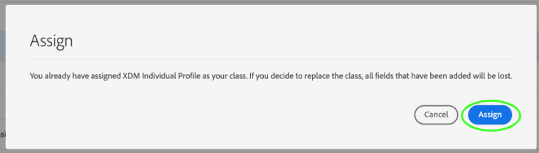

# Create a schema using the [!DNL Schema Editor]

Die Adobe Experience Platform-Benutzeroberfläche ermöglicht Ihnen das Erstellen und Verwalten von [!DNL Experience Data Model] (XDM-)Schemas in einer interaktiven visuellen Arbeitsfläche, der so genannten [!DNL Schema Editor]. In diesem Lernprogramm wird beschrieben, wie Sie ein Schema mit dem [!DNL Schema Editor]erstellen.

>[!NOTE]
>
>Zu Demonstrationszwecken wird in diesem Lernprogramm ein Schema erstellt, in dem die Mitglieder eines Kundentreue-Programms beschrieben werden. Während Sie mit diesen Schritten ein anderes Schema für Ihre eigenen Zwecke erstellen können, sollten Sie zunächst das Schema zum Erstellen des Beispiels verwenden, um die Funktionen des  zu erlernen [!DNL Schema Editor].

If you prefer to compose a schema using the [!DNL Schema Registry] API instead, start by reading the [[!DNL Schema Registry] developer guide](../api/getting-started.md) before attempting the tutorial on [creating a schema using the API](create-schema-api.md).

## Erste Schritte

Dieses Tutorial erfordert ein Verständnis der verschiedenen Aspekte der Adobe Experience Platform, die an der Schaffung von Schemas beteiligt sind. Bevor Sie mit diesem Tutorial beginnen, lesen Sie die Dokumentation für die folgenden Konzepte:

* [[!DNL Experience Data Model (XDM)]](../home.md): Das standardisierte Framework, mit dem [!DNL Platform] Kundenerlebnisdaten organisiert.
   * [Grundlagen der Schema-Zusammensetzung](../schema/composition.md): Eine Übersicht über XDM-Schemas und ihre Bausteine, einschließlich Klassen, Mixins, Datentypen und Feldern.
* [[!DNL Real-time Customer Profile]](../../profile/home.md): Bietet ein einheitliches, Echtzeit-Profil für Kunden, das auf aggregierten Daten aus mehreren Quellen basiert.

## Öffnen des Arbeitsbereichs [!UICONTROL Schemas] {#browse}

Der Arbeitsbereich &quot; [!UICONTROL Schemas] &quot;in der [!DNL Platform] Benutzeroberfläche bietet eine Visualisierung des Berichts [!DNL Schema Library], sodass Sie die für Ihr Unternehmen verfügbaren Schema mithilfe der Ansicht verwalten können. The workspace also includes the [!DNL Schema Editor], the canvas on which you can compose a schema throughout this tutorial.

Wählen Sie nach dem Anmelden [!DNL Experience Platform]im linken Navigationsbereich die Option &quot; **[!UICONTROL Schema]** &quot;, um den Arbeitsbereich &quot; **[!UICONTROL Schemas]** &quot;zu öffnen. Auf der Registerkarte &quot; **[!UICONTROL Durchsuchen]** &quot;wird eine Liste von Schemas angezeigt (eine Darstellung der [!DNL Schema Library]), die Sie Ansicht und Anpassung vornehmen können. Die Liste umfasst den Namen, den Typ, die Klasse und das Verhalten (Datensatz oder Zeitreihen), auf denen das Schema basiert, sowie das Datum und die Uhrzeit der letzten Änderung des Schemas.

Weitere Informationen finden Sie im Handbuch zur [Erforschung vorhandener XDM-Ressourcen in der Benutzeroberfläche](./explore.md) .

## Erstellen und Benennen eines Schemas {#create}

To begin composing a schema, select **[!UICONTROL Create schema]** in the top-right corner of the **[!UICONTROL Schemas]** workspace. Es wird ein Dropdown-Menü angezeigt, in dem Sie zwischen den Hauptklassen [!UICONTROL XDM Individual Profil] und [!UICONTROL XDM ExperienceEvent]wählen können. Wenn diese Klassen Ihren Zwecken nicht entsprechen, können Sie auch &quot; **[!UICONTROL Durchsuchen]** &quot;auswählen, um aus anderen verfügbaren Klassen zu wählen, oder eine neue Klasse [erstellen](#create-new-class).

Wählen Sie für diese Übung **[!UICONTROL XDM Individuelles Profil]**.

The [!DNL Schema Editor] appears. Dies ist die Arbeitsfläche, auf der Sie Ihr Schema zusammenstellen. Da Sie eine Standard-XDM-Klasse gewählt haben, auf der das Schema basieren soll, wird automatisch ein unbenanntes Schema im Bereich &quot; **[!UICONTROL Struktur]** &quot;der Arbeitsfläche erstellt, wenn Sie im Editor ankommen, zusammen mit den Standardfeldern, die in allen Schemas, die auf dieser Klasse basieren, enthalten sind. Die zugewiesene Klasse für das Schema wird auch unter **[!UICONTROL Klasse]** im Abschnitt **[!UICONTROL Komposition]** aufgeführt.

>[!NOTE]
>
> Sie können [die Klasse eines Schemas](#change-class) jederzeit während des anfänglichen Kompositionsprozesses ändern, bevor das Schema gespeichert wird. Dies sollte jedoch mit größter Vorsicht geschehen. Mixins sind nur mit bestimmten Klassen kompatibel. Wenn Sie also die Klasse ändern, werden die Arbeitsfläche und alle hinzugefügten Felder zurückgesetzt.

Verwenden Sie die Felder auf der rechten Seite des Editors, um einen Anzeigenamen und eine optionale Beschreibung für das Schema anzugeben. Sobald ein Name eingegeben wurde, wird die Arbeitsfläche aktualisiert und gibt den neuen Namen des Schemas wieder.

Bei der Entscheidung über einen Namen für Ihr Schema sind einige wichtige Aspekte zu beachten:

* Schema-Namen sollten kurz und beschreibend sein, damit das Schema später leicht zu finden ist.
* Die Namen der Schemas müssen eindeutig sein, d. h. sie sollten so spezifisch sein, dass sie in Zukunft nicht wiederverwendet werden. Wenn Ihr Unternehmen z. B. über separate Loyalitätsprogramme für verschiedene Marken verfügt, wäre es ratsam, Ihr Schema mit „Loyalitätsmitglieder, Marke A“ zu benennen, damit Sie dieses leicht von anderen Loyalitätsschemas unterscheiden können, die Sie u. U. später definieren.
* Sie können die Beschreibung des Schemas auch verwenden, um zusätzliche Kontextinformationen zum Schema bereitzustellen.

Dieses Tutorial stellt ein Schema zum Erfassen von Daten zu den Mitgliedern eines Treueanschlusses vor, und deshalb heißt das Schema &quot;Treueanwärter&quot;.

## Hinzufügen eines Mixins {#mixin}

Sie können nun beginnen, Ihrem Schema Felder hinzuzufügen, indem Sie Mixins hinzufügen. Ein Mixin ist eine Gruppe aus einem oder mehreren Feldern, die häufig zusammen verwendet werden, um ein bestimmtes Konzept zu beschreiben. In diesem Tutorial werden Mixins verwendet, um die Mitglieder des Loyalitätsprogramms zu beschreiben und wichtige Informationen wie Name, Geburtstag, Telefonnummer, Adresse und mehr zu erfassen.

To add a mixin, select **[!UICONTROL Add]** in the **[!UICONTROL Mixins]** sub-section.

Ein neues Dialogfeld mit einer Liste der verfügbaren Mixins wird angezeigt. Jedes Mixin ist nur für die Verwendung mit einer bestimmten Klasse vorgesehen. Daher ist der Dialog nur für Listen-Mixins gedacht, die mit der von Ihnen gewählten Klasse (in diesem Fall der [!DNL XDM Individual Profile] Klasse) kompatibel sind. Wenn Sie eine Standard-XDM-Klasse verwenden, wird die Liste der Mixins basierend auf der Beliebtheit der Verwendung intelligent sortiert.

Wenn Sie eine Mischung aus der Liste auswählen, wird sie in der rechten Leiste angezeigt. Sie können bei Bedarf mehrere Mixins auswählen und diese der Liste in der rechten Leiste hinzufügen, bevor Sie sie bestätigen. Darüber hinaus wird auf der rechten Seite des aktuell ausgewählten Mixins ein Symbol angezeigt, mit dem Sie die Vorschau der Feldstruktur, die es bietet, vornehmen können.

Bei der Vorschau eines Mixins wird das Schema des Mixins in der rechten Leiste ausführlich beschrieben. Sie können auch durch die Felder des Mixins in der bereitgestellten Arbeitsfläche navigieren. Wenn Sie verschiedene Felder auswählen, wird die rechte Leiste aktualisiert, um Details zum betreffenden Feld anzuzeigen. Wählen Sie **[!UICONTROL Zurück]** , wenn Sie die Vorschau abgeschlossen haben, um zum Dialogfeld für die Mixinauswahl zurückzukehren.

Wählen Sie für dieses Tutorial das **[!UICONTROL Demografische Details]** -Mixin und wählen Sie dann **[!UICONTROL Hinzufügen Mixin]**.

Die Arbeitsfläche des Schemas wird wieder angezeigt. The **[!UICONTROL Mixins]** section now lists &quot;[!UICONTROL Demographic Details]&quot; and the **[!UICONTROL Structure]** section includes the fields contributed by the mixin. Sie können den Namen des Mixins unter dem Abschnitt &quot; **[!UICONTROL Mixins]** &quot;auswählen, um die spezifischen Felder zu markieren, die es auf der Arbeitsfläche bereitstellt.

This mixin contributes several fields under the top-level name `person` with the data type &quot;[!UICONTROL Person]&quot;. Diese Gruppe von Feldern beschreibt Informationen zu einer Person, einschließlich Name, Geburtsdatum und Geschlecht.

>[!NOTE]
>
>Remember that fields may use scalar types (such as string, integer, array, or date), as well as any data type (a group of fields representing a common concept) defined within the [!DNL Schema Registry].

Notice that the `name` field has a data type of &quot;[!UICONTROL Person name]&quot;, meaning it too describes a common concept and contains name-related sub-fields such as first name, last name, courtesy title, and suffix.

Wählen Sie die verschiedenen Felder auf der Arbeitsfläche aus, um alle weiteren Felder anzuzeigen, die sie zur Schema-Struktur beitragen.

## Hinzufügen eines weiteren Mixins {#mixin-2}

Sie können jetzt dieselben Schritte wiederholen, um ein weiteres Mixin hinzuzufügen. When you view the **[!UICONTROL Add mixin]** dialog this time, notice that the &quot;[!UICONTROL Demographic Details]&quot; mixin has been greyed out and the checkbox next to it cannot be selected. Dadurch wird verhindert, dass Mixins, die bereits in Ihrem aktuellen Schema enthalten sind, versehentlich dupliziert werden.

Wählen Sie für dieses Tutorial im Dialogfeld das[!DNL Personal Contact Details]&quot;mixin&quot;und wählen Sie dann **[!UICONTROL Hinzufügen mixin]** aus, um es dem Schema hinzuzufügen.

Nach dem Hinzufügen wird die Arbeitsfläche wieder angezeigt. &quot;[!UICONTROL Personal Contact Details]&quot; is now listed under **[!UICONTROL Mixins]** in the **[!UICONTROL Composition]** section, and fields for home address, mobile phone, and more have been added under **[!UICONTROL Structure]**.

Similar to the `name` field, the fields you just added represent multi-field concepts. For example, `homeAddress` has a data type of &quot;[!UICONTROL Postal address]&quot; and `mobilePhone` has a data type of &quot;[!UICONTROL Phone number]&quot;. Sie können jedes dieser Felder auswählen, um sie zu erweitern und die zusätzlichen Felder anzuzeigen, die im Datentyp enthalten sind.

## Definieren eines neuen Mixins {#define-mixin}

The &quot;[!UICONTROL Loyalty Members]&quot; schema is meant to capture data related to the members of a loyalty program, so it will require some specific loyalty-related fields. Es gibt keine standardmäßigen Mixins, die die erforderlichen Felder enthalten. Daher müssen Sie ein neues Mixin definieren.

Wenn Sie dieses Mal das Dialogfeld **[!UICONTROL Mixin hinzufügen]** öffnen, wählen Sie **[!UICONTROL Neues Mixin erstellen]**. Sie werden dann aufgefordert, einen Anzeigenamen und eine Beschreibung für Ihr Mixin anzugeben.

Wie bei Klassennamen sollte der Name des Mixins kurz und einfach sein und beschreiben, was das Mixin zum Schema beiträgt. Auch diese sind einzigartig, sodass Sie den Namen nicht wiederverwenden können und daher sicherstellen müssen, dass er spezifisch genug ist.

Nennen Sie für dieses Tutorial das neue Mixin „Loyalitätsdetails“.

Select **[!UICONTROL Add mixin]** to return to the [!DNL Schema Editor]. &quot;[!UICONTROL Loyalty Details]&quot; should now appear under **[!UICONTROL Mixins]** on the left-side of the canvas, but there are no fields associated with it yet and therefore no new fields appear under **[!UICONTROL Structure]**.

## Hinzufügen von Feldern zum Mixin {#mixin-fields}

Nachdem Sie jetzt das Mixin „Loyalitätsdetails“ erstellt haben, können Sie die Felder definieren, die das Mixin zum Schema beitragen wird.

To begin, select the mixin name in the **[!UICONTROL Mixins]** section. Danach werden die Eigenschaften des Mixins auf der rechten Seite des Editors angezeigt. Neben dem Namen des Schemas wird ein **Pluszeichen (+)** unter &quot; **[!UICONTROL Struktur]**&quot;angezeigt.

Wählen Sie das **Pluszeichen (+)** neben &quot;[!DNL Loyalty Members]&quot;, um einen neuen Knoten in der Struktur zu erstellen. This node (called `_tenantId` in this example) represents your IMS Organization&#39;s tenant ID, preceded by an underscore. Das Vorhandensein der Mandanten-ID zeigt an, dass die Felder, die Sie hinzufügen, im Namensraum Ihres Unternehmens enthalten sind.

Mit anderen Worten, die Felder, die Sie hinzufügen, sind für Ihr Unternehmen eindeutig und werden in einem bestimmten Bereich gespeichert, der nur für Ihr Unternehmen zugänglich ist, [!DNL Schema Registry] . Felder, die Sie definieren, müssen immer Ihrem Pächter-Namensraum hinzugefügt werden, um Kollisionen mit Namen anderer Standardklassen, Mixins, Datentypen und Felder zu verhindern.

Inside that namespaced node is a &quot;[!UICONTROL New Field]&quot;. This is the beginning of the &quot;[!UICONTROL Loyalty Details]&quot; mixin.

Using the controls on the right-hand side of the editor, start by creating a `loyalty` field with type &quot;[!UICONTROL Object]&quot; that will be used to hold your loyalty-related fields. When finished, select **[!UICONTROL Apply]**.

The changes are applied and the newly created `loyalty` object appears. Klicken Sie auf das **Pluszeichen (+)** neben dem Objekt, um weitere treuebezogene Felder hinzuzufügen. A &quot;[!UICONTROL New Field]&quot; appears and the **[!UICONTROL Field properties]** section is visible on the right-hand side of the canvas.

Für jedes Feld sind die folgenden Informationen erforderlich:

* **[!UICONTROL Feldname]:** Der Name des Felds, in Kamelschreibweise geschrieben. Beispiel: LoyalitätsStufe
* **[!UICONTROL Anzeigename]:** Der Name des Felds, in der Titelschrift geschrieben. Beispiel: Loyalitäts-Stufe
* **[!UICONTROL Typ]:** Der Datentyp des Felds. This includes basic scalar types and any data types defined in the [!DNL Schema Registry]. Examples: [!UICONTROL String], [!UICONTROL Integer], [!UICONTROL Boolean], [!UICONTROL Person], [!UICONTROL Address], [!UICONTROL Phone number], etc.
* **[!UICONTROL Beschreibung]:** Es sollte eine optionale Beschreibung des Felds mit maximal 200 Zeichen in Satzform eingefügt werden.

The first field for the `Loyalty` object will be a string called `loyaltyId`. When setting the new field&#39;s type to &quot;[!UICONTROL String]&quot;, the **[!UICONTROL Field properties]** section becomes populated with several options for applying constraints, including default value, format, and maximum length.

Je nach ausgewähltem Datentyp stehen verschiedene Einschränkungsoptionen zur Verfügung. Since `loyaltyId` will be an email address, select &quot;[!UICONTROL email]&quot; from the **[!UICONTROL Format]** dropdown menu. Wählen Sie **[!UICONTROL Übernehmen]**, um Ihre Änderungen anzuwenden.

## Add more fields to the mixin {#mixin-fields-2}

Now that you have added the `loyaltyId` field, you can add additional fields to capture loyalty-related information such as:

* Punkte (Ganzzahl)
* Mitglied seit (Datum)

Um die einzelnen Felder dem Schema hinzuzufügen, wählen Sie das **Pluszeichen (+)** neben dem `loyalty` Objekt und geben Sie die erforderlichen Informationen ein.

Nach Abschluss des Vorgangs enthält das Treueobjekt die Felder für die Loyalität-ID, die Punkte und das Mitglied-seit.

## hinzufügen eines Enum-Felds mit der Mischung {#enum}

When defining fields in the [!DNL Schema Editor], there are some additional options that you can apply to basic field types in order to provide further constraints on the data the field can contain. Die Anwendungsfälle für diese Beschränkungen werden in der folgenden Tabelle erläutert:

| Constraint | Beschreibung |
| --- | --- |
| [!UICONTROL Erforderlich] | Gibt an, dass das Feld für die Datenerfassung erforderlich ist. Daten, die auf Grundlage dieses Schemas in einen Datensatz hochgeladen wurden und dieses Feld nicht enthalten, schlagen bei der Aufnahme fehl. |
| [!UICONTROL Array] | Gibt an, dass das Feld ein Array von Werten mit jeweils dem angegebenen Datentyp enthält. Wenn Sie diese Einschränkung beispielsweise für ein Feld mit dem Datentyp &quot;[!UICONTROL String]&quot;verwenden, gibt das Feld ein Zeichenfolgenarray an. |
| [!UICONTROL Enum] | Gibt an, dass dieses Feld einen der Werte aus einer nummerierten Liste möglicher Werte enthalten muss. |
| [!UICONTROL Identität] | Gibt an, dass dieses Feld ein Identitätsfeld ist. Weitere Informationen zu Identitätsfeldern finden Sie [weiter unten in diesem Tutorial](#identity-field). |
| [!UICONTROL Beziehung] | Während Schema-Beziehungen durch die Verwendung des Vereinigung-Schemas abgeleitet werden können, gilt [!DNL Real-time Customer Profile]dies nur für Schema, die dieselbe Klasse gemeinsam haben. Die [!UICONTROL Beziehungsbeschränkung] gibt an, dass dieses Feld auf die primäre Identität eines Schemas verweist, das auf einer anderen Klasse basiert, was eine Beziehung zwischen den beiden Schemas impliziert. See the tutorial on [defining a relationship](./relationship-ui.md) for more information. |

Für dieses Lernprogramm ist für das [!DNL "loyalty"] Objekt im Schema ein neues Enum-Feld erforderlich, das die &quot;Treuestufe&quot;eines Kunden beschreibt, bei dem der Wert nur eine von vier möglichen Optionen sein kann. Um dieses Feld dem Schema hinzuzufügen, wählen Sie das **Pluszeichen (+)** neben dem `loyalty` Objekt aus und füllen die erforderlichen Felder für **[!UICONTROL Feldname]** und **[!UICONTROL Anzeigename]** aus. Wählen Sie als **[!UICONTROL Typ]**&quot;[!UICONTROL Zeichenfolge]&quot;aus.

Zusätzliche Kontrollkästchen werden für das Feld angezeigt, nachdem der Typ ausgewählt wurde, einschließlich der Kontrollkästchen für **[!UICONTROL Array]**, **[!UICONTROL Enum]** und **[!UICONTROL Identity]**.

Select the **[!UICONTROL Enum]** checkbox to open the **[!UICONTROL Enum values]** section below. Hier können Sie für jede akzeptable Loyalitätsstufe den **[!UICONTROL Wert]** (in Binnenmajuskel-Schreibweise) und die **[!UICONTROL Bezeichnung]** (einen optionalen, leserfreundlichen Namen in der Titelschreibweise) eingeben.

Wenn Sie alle Feldeigenschaften abgeschlossen haben, wählen Sie &quot; **[!UICONTROL Übernehmen]** &quot;, um das Feld &quot;[!DNL loyaltyLevel]&quot; zum `loyalty` Objekt hinzuzufügen.

## Konvertieren eines Objekts mit mehreren Feldern in einen Datentyp {#datatype}

Das `loyalty` Objekt enthält jetzt mehrere treuespezifische Felder und stellt eine gemeinsame Datenstruktur dar, die in anderen Schemas nützlich sein könnte. Mit dem [!DNL Schema Editor] können Sie wiederverwendbare Objekte mit mehreren Feldern einfach anwenden, indem Sie die Struktur dieser Objekte in Datentypen konvertieren.

Datentypen ermöglichen den konsistenten Einsatz von Strukturen mit mehreren Feldern und bieten mehr Flexibilität als ein Mixin, da sie überall in einem Schema verwendet werden können. Dies geschieht, indem Sie den **[!UICONTROL Typ]** -Wert des Felds auf den Wert eines Datentyps festlegen, der im [!DNL Schema Registry]Feld definiert ist.

To convert the `loyalty` object to a data type, select the `loyalty` field under **[!UICONTROL Structure]**, then select **[!UICONTROL Convert to new data type]** on the right-hand side of the editor under **[!UICONTROL Field properties]**. Es wird ein grünes Popup angezeigt, das bestätigt, dass das Objekt erfolgreich konvertiert wurde.

Now, when you look under **[!UICONTROL Structure]**, you can see that the `loyalty` field has a data type of &quot;[!DNL Loyalty]&quot; and the fields have small lock icons beside them, indicating they are no longer individual fields but rather part of a multi-field data type.

In einem zukünftigen Schema können Sie nun ein Feld als &quot;[!DNL Loyalty]&quot;Typ zuweisen und es enthält automatisch Felder für ID, Treuestufe, Mitglied seit und Punkte.

>[!NOTE]
>
>Sie können benutzerdefinierte Datentypen auch unabhängig von der Bearbeitung von Schemas erstellen und bearbeiten. Weitere Informationen finden Sie im Lernprogramm zum [Erstellen und Bearbeiten von Datentypen](./create-data-type.md) .

## Suchen und Filtern von Schema-Feldern

Ihr Schema enthält jetzt neben den von der Basisklasse bereitgestellten Feldern mehrere Mixins. Wenn Sie mit größeren Schemas arbeiten, können Sie die Kontrollkästchen neben den Namen von Mixins in der linken Leiste aktivieren, um die angezeigten Felder auf diejenigen zu filtern, die von den Mixins bereitgestellt werden, die Sie interessieren.

Wenn Sie nach einem bestimmten Feld in Ihrem Schema suchen, können Sie die Suchleiste auch verwenden, um die angezeigten Felder nach Namen zu filtern, unabhängig davon, unter welcher Mischung sie angezeigt werden.

>[!IMPORTANT]
>
>Die Suchfunktion berücksichtigt alle ausgewählten Mix-in-Filter, wenn die passenden Felder angezeigt werden. Wenn eine Abfrage nicht die erwarteten Ergebnisse anzeigt, müssen Sie ggf. die Dublette prüfen, ob Sie keine relevanten Mixins herausfiltern.

## Festlegen eines Schemafelds als Identitätsfeld {#identity-field}

Die Standarddatenstruktur, die Schema bereitstellen, kann genutzt werden, um Daten zu identifizieren, die über mehrere Quellen hinweg zu einer Person gehören. Dies ermöglicht verschiedene nachgelagerte Anwendungsfälle wie Segmentierung, Berichte, Analyse der Datenwissenschaften und mehr. Um Daten basierend auf individuellen Identitäten zu verknüpfen, müssen Schlüsselfelder innerhalb der jeweiligen Schema als [!UICONTROL Identitätsfelder] gekennzeichnet werden.

[!DNL Experience Platform] erleichtert die Identifizierung eines Identitätsfelds mithilfe eines **[!UICONTROL Identitäts]** -Kontrollkästchens im [!DNL Schema Editor]. Sie müssen jedoch festlegen, welches Feld basierend auf der Art Ihrer Daten am besten als Identität verwendet werden soll.

For example, there may be thousands of loyalty program members belonging to the same &quot;loyalty level&quot;, but each member of the loyalty program has a unique `loyaltyId` (which in this instance is the individual member&#39;s email address). The fact that `loyaltyId` is a unique identifier for each member makes it a good candidate for an identity field, whereas `loyaltyLevel` is not.

>[!IMPORTANT]
>
>Die folgenden Schritte beschreiben, wie einem vorhandenen Schema-Feld ein Identitätsdeskriptor hinzugefügt wird. Alternativ zur Definition von Identitätsfeldern innerhalb der Struktur des Schemas können Sie stattdessen auch ein `identityMap` Feld verwenden, um Identitätsinformationen zu enthalten.
>
>Wenn Sie planen, `identityMap`die primäre Identität, die Sie dem Schema direkt hinzufügen, zu überschreiben. Weitere Informationen finden Sie im Abschnitt zu `identityMap` den [Grundlagen der Erstellung von Schemas](../schema/composition.md#identityMap) .

Wählen Sie im Editor im Bereich &quot; **[!UICONTROL Struktur]** &quot;das `loyaltyId` Feld und das Kontrollkästchen &quot; **[!UICONTROL Identität]** &quot;wird unter den **[!UICONTROL Feldeigenschaften]** angezeigt. Check the box and the option to set this as the **[!UICONTROL Primary identity]** appears. Wählen Sie auch dieses Kontrollkästchen aus.

>[!NOTE]
>
>Jedes Schema darf nur ein primäres Identitätsfeld enthalten. Nachdem ein Schema als primäre Identität festgelegt wurde, erhalten Sie eine Fehlermeldung, wenn Sie später versuchen, ein anderes Identitätsfeld im Schema als primäre Identität festzulegen.

Als Nächstes müssen Sie einen **[!UICONTROL Identitäts-Namensraum]** aus der Liste vordefinierter Namensraum in der Dropdown-Liste angeben. Da `loyaltyId` die E-Mail-Adresse des Kunden angegeben ist, wählen Sie &quot;[!UICONTROL E-Mail]&quot;aus der Dropdownliste. Wählen Sie **[!UICONTROL Übernehmen]** , um die Aktualisierungen des `loyaltyId` Felds zu bestätigen.

>[!NOTE]
>
>Eine Liste der Standarddefinitionen und -definitionen finden Sie in der [[!DNL Identity Service] Dokumentation](../../identity-service/troubleshooting-guide.md#standard-namespaces).

Nach dem Anwenden der Änderung `loyaltyId` wird auf dem Symbol ein Fingerabdrucksymbol angezeigt, das angibt, dass es sich jetzt um ein Identitätsfeld handelt.

Now all data ingested into the `loyaltyId` field will be used to help identify that individual and stitch together a single view of that customer. To learn more about working with identities in [!DNL Experience Platform], please review the [[!DNL Identity Service]](../../identity-service/home.md) documentation.

## Schema zur Verwendung in [!DNL Real-time Customer Profile] {#profile}

[[!DNL Real-time Customer Profile]](../../profile/home.md) nutzt Identitätsdaten, um eine ganzheitliche Ansicht der einzelnen Kunden [!DNL Experience Platform] zu ermöglichen. Der Dienst erstellt robuste 360° Profil von Kundenattributen sowie zeitgestempelte Konten für jede Interaktion, die Kunden über ein in [!DNL Experience Platform]das System integriertes System hatten.

In order for a schema to be enabled for use with [!DNL Real-time Customer Profile], it must have a primary identity defined. Sie erhalten eine Fehlermeldung, wenn Sie versuchen, ein Schema zu aktivieren, ohne vorher eine primäre Identität zu definieren.

 

To enable the &quot;Loyalty Members&quot; schema for use in [!DNL Profile], begin by selecting &quot;[!DNL Loyalty Members]&quot; in the **[!UICONTROL Structure]** section of the editor.

Auf der rechten Seite des Editors werden Informationen zum Schema angezeigt, einschließlich Anzeigename, Beschreibung und Typ. Zusätzlich zu diesen Informationen gibt es eine **[!UICONTROL Profil-Umschalter]** .

Select **[!UICONTROL Profile]** and a popover appears, asking you to confirm that you wish to enable the schema for [!DNL Profile].

 

>[!WARNING]
>
>Once a schema has been enabled for [!DNL Real-time Customer Profile] and saved, it cannot be disabled.

Wählen Sie **[!UICONTROL Aktivieren]** , um Ihre Auswahl zu bestätigen. Sie können den **[!UICONTROL Profil]** -Umschalter erneut aktivieren, um das Schema zu deaktivieren, wenn Sie es wünschen. Sobald das Schema jedoch gespeichert wurde, während es aktiviert [!DNL Profile] ist, kann es nicht mehr deaktiviert werden.

## Nächste Schritte und zusätzliche Ressourcen

Nachdem Sie das Schema fertig gestellt haben, können Sie das komplette Schema auf der Arbeitsfläche sehen. Select **[!UICONTROL Save]** and the schema will be saved to the [!DNL Schema Library], making it accessible by the [!DNL Schema Registry].

Ihr neues Schema kann jetzt verwendet werden, um Daten zu erfassen [!DNL Platform]. Denken Sie daran, dass nach Verwendung des Schemas zur Datenaufnahme nur noch Ergänzungen vorgenommen werden können. Weitere Informationen zur Schemaversionierung finden Sie in den [Grundlagen der Schema-Komposition](../schema/composition.md).

Sie können nun dem Tutorial zum [Definieren einer Beziehung zwischen Schemas in der Benutzeroberfläche](./relationship-ui.md) folgen, um dem Schema &quot;Treuemitglieder&quot;ein neues Beziehungsfeld hinzuzufügen.

The &quot;Loyalty Members&quot; schema is also available to be viewed and managed using the [!DNL Schema Registry] API. To begin working with the API, start by reading the [[!DNL Schema Registry API] developer guide](../api/getting-started.md).

### Videoressourcen

>[!WARNING]
>
>Die in den folgenden Videos dargestellte [!DNL Platform] Benutzeroberfläche ist veraltet. Die neuesten Screenshots und Funktionen der Benutzeroberfläche finden Sie in der obigen Dokumentation.

Das folgende Video zeigt, wie Sie ein einfaches Schema in der [!DNL Platform] Benutzeroberfläche erstellen.

>[!VIDEO](https://video.tv.adobe.com/v/27012?quality=12&learn=on)

Das folgende Video soll Ihnen die Arbeit mit Mixins und Klassen erleichtern.

>[!VIDEO](https://video.tv.adobe.com/v/27013?quality=12&learn=on)

## Anhang

Die folgenden Abschnitte enthalten zusätzliche Informationen zur Verwendung der [!DNL Schema Editor].

### Neue Klasse erstellen {#create-new-class}

[!DNL Experience Platform] bietet die Flexibilität, ein Schema auf der Grundlage einer Klasse zu definieren, die spezifisch für Ihr Unternehmen ist.

Wählen Sie im Arbeitsbereich **[!UICONTROL Schemas]** die Option Schema **** erstellen und wählen Sie dann **[!UICONTROL Durchsuchen]** aus der Dropdownliste.

Es wird ein Dialogfeld angezeigt, in dem Sie aus einer Liste verfügbarer Klassen auswählen können. Wählen Sie oben im Dialogfeld die Option **[!UICONTROL Neue Klasse]** erstellen. You can then give your new class a display name (a short, descriptive, unique, and user-friendly name for the class), a description, and a behavior (&quot;[!UICONTROL Record]&quot; or &quot;[!UICONTROL Time Series]&quot;) for the data the schema will define.

>[!IMPORTANT]
>
> Denken Sie beim Erstellen eines Schemas, das eine von Ihrem Unternehmen definierte Klasse implementiert, daran, dass Mixins nur für kompatible Klassen verfügbar sind. Since the class you defined is new, there are no compatible mixins listed in the **[!UICONTROL Add mixin]** dialog. Instead, you will need to select **[!UICONTROL Create new mixin]** and define a mixin for use with that class. Wenn Sie das nächste Mal ein Schema erstellen, das die neue Klasse implementiert, wird das von Ihnen definierte Mixin aufgelistet und ist zur Verwendung verfügbar.

### Klasse eines Schemas ändern {#change-class}

Sie können die Klasse eines Schemas jederzeit während des anfänglichen Kompositionsprozesses ändern, bevor das Schema gespeichert wurde.

>[!WARNING]
>
>Die erneute Zuweisung der Klasse zu einem Schema sollte mit größter Vorsicht erfolgen. Mixins sind nur mit bestimmten Klassen kompatibel. Wenn Sie also die Klasse ändern, werden die Arbeitsfläche und alle hinzugefügten Felder zurückgesetzt.

Um eine Klasse neu zuzuweisen, wählen Sie auf der linken Seite der Arbeitsfläche die Option &quot; **[!UICONTROL Zuweisen]** &quot;aus.

A dialog appears that displays a list of all available classes, including any defined by your organization (the owner being &quot;[!UICONTROL Customer]&quot;) as well as standard classes defined by Adobe.

Wählen Sie eine Liste aus, um die zugehörige Beschreibung auf der rechten Seite des Dialogfelds anzuzeigen. You can also select **[!UICONTROL Preview class structure]** to see the fields and metadata associated with the class. Wählen Sie **[!UICONTROL Klasse]** zuweisen, um fortzufahren.

Es wird ein neues Dialogfeld geöffnet, in dem Sie bestätigen müssen, dass Sie eine neue Klasse zuweisen möchten. Wählen Sie **[!UICONTROL Zuweisen]** zur Bestätigung.

Nachdem Sie die Klassenänderung bestätigt haben, wird die Arbeitsfläche zurückgesetzt und der gesamte Kompositionsfortschritt geht verloren.