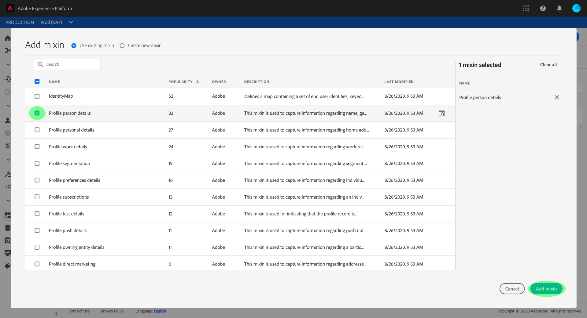
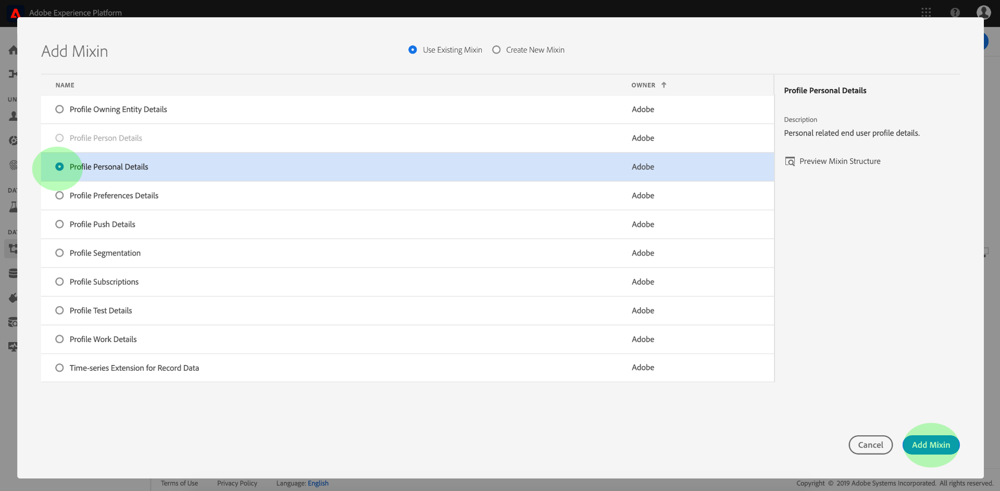

# Erstellen eines Schemas mit dem Schema-Editor.

Die Schema Registry bietet eine Benutzeroberfläche und RESTful-API, über die Sie alle Ressourcen in der Adobe Experience Platform Schema Library Ansicht und verwalten können. Die Schema-Bibliothek enthält Ressourcen, die Ihnen von Adobe, Experience Platform-Partnern und Anbietern, deren Anwendungen Sie verwenden, zur Verfügung gestellt werden, sowie Ressourcen, die Sie definieren und in der Schema-Registrierung speichern.

In diesem Lernprogramm werden die Schritte zum Erstellen eines Schemas mit dem Schema-Editor in der Experience Platform beschrieben. Wenn Sie lieber ein Schema mit der Schema Registry-API erstellen möchten, lesen Sie zunächst das Entwicklerhandbuch [für die](../api/getting-started.md) Schema-Registrierung, bevor Sie versuchen, ein Schema mithilfe der API [zu](create-schema-api.md)erstellen.

Dieses Lernprogramm enthält außerdem Schritte zum [Definieren einer neuen Klasse](#create-new-class) , die Sie dann zum Erstellen eines Schemas verwenden können.

## Erste Schritte

Dieses Lernprogramm erfordert ein Verständnis der verschiedenen Aspekte der Adobe Experience Platform, die mit der Verwendung des Schema-Editors verbunden sind. Bevor Sie mit diesem Lernprogramm beginnen, lesen Sie bitte die Dokumentation für die folgenden Konzepte:

* [Erlebnisdatenmodell (XDM)](../home.md): Das standardisierte Framework, mit dem Platform Kundenerlebnisdaten organisiert.
* [Grundlagen der Zusammensetzung](../schema/composition.md)des Schemas: Eine Übersicht über XDM-Schema und ihre Bausteine, einschließlich Klassen, Mixins, Datentypen und Felder.
* [Echtzeit-Profil](../../profile/home.md): Bietet ein einheitliches, Echtzeit-Profil für Kunden, das auf aggregierten Daten aus mehreren Quellen basiert.

Für dieses Lernprogramm benötigen Sie Zugriff auf die Experience Platform. Wenn Sie keinen Zugriff auf eine IMS-Organisation in Experience Platform haben, wenden Sie sich an Ihren Systemadministrator, bevor Sie fortfahren.

## Vorhandene Schema im Arbeitsbereich &quot;Schemas&quot;durchsuchen {#browse}

Der Arbeitsbereich &quot;Schemas&quot;in der Experience Platform bietet eine Visualisierung der Schema-Bibliothek, mit der Sie alle verfügbaren Schema Ansicht und verwalten sowie neue erstellen können. Der Arbeitsbereich umfasst auch den Schema-Editor, die Arbeitsfläche, auf der Sie ein Schema während dieses Lernprogramms erstellen werden.

Nachdem Sie sich bei der Experience Platform angemeldet haben, klicken Sie im linken Navigationsbereich auf **Schemas** und Sie gelangen zum Arbeitsbereich &quot;Schemas&quot;. Daraufhin wird eine Liste von Schemas angezeigt (eine Darstellung der Schema-Bibliothek), in denen Sie alle verfügbaren Schema Ansicht, Verwaltung und Anpassung vornehmen können. Die Liste umfasst den Namen, den Typ, die Klasse und das Verhalten (Datensatz oder Zeitreihen), auf dem das Schema basiert, sowie das Datum und die Uhrzeit der letzten Änderung des Schemas.

Klicken Sie auf das Filtersymbol neben der Suchleiste, um Filterfunktionen für alle Ressourcen in der Registrierung zu verwenden, einschließlich Klassen, Mixins und Datentypen.

## Erstellen und Benennen eines Schemas {#create}

Um mit dem Erstellen eines Schemas zu beginnen, klicken Sie rechts oben im Arbeitsbereich &quot;Schemas&quot;auf Schema **** erstellen.

Der *Schema-Editor* wird angezeigt. Dies ist die Arbeitsfläche, auf der Sie Ihr Schema zusammenstellen werden. Wenn Sie zum Editor gelangen, wird automatisch ein &quot;Unbenanntes Schema&quot;im Bereich &quot; *Struktur* &quot;der Arbeitsfläche erstellt, damit Sie mit der Anpassung beginnen können.

Auf der rechten Seite des Editors befinden sich die *Schema-Eigenschaften* , in denen Sie einen Namen für das Schema angeben können (mithilfe des Felds **Anzeigename** ). Sobald ein Name eingegeben wurde, wird die Arbeitsfläche aktualisiert, um den neuen Namen des Schemas wiederzugeben.

Bei der Entscheidung über einen Namen für Ihr Schema sind einige wichtige Aspekte zu beachten:

* Schema-Namen sollten kurz und beschreibend sein, damit das Schema später leicht in der Bibliothek gefunden werden kann.
* Die Namen der Schemas müssen eindeutig sein, d. h. sie sollten so spezifisch sein, dass sie in Zukunft nicht wiederverwendet werden. Wenn Ihr Unternehmen z. B. über separate Programme zur Treue für verschiedene Marken verfügt, wäre es ratsam, Ihr Schema mit &quot;Markenmitglieder einer Treue&quot;zu benennen, damit Sie leicht von anderen treuhänderischen Schemas unterscheiden können, die Sie später definieren.
* Optional können Sie im Feld **Beschreibung** weitere Informationen zum Schema angeben.

Dieses Tutorial stellt ein Schema zum Erfassen von Daten über die Mitglieder eines Treueanschlusses vor, daher heißt das Schema &quot;Treueanwärter&quot;.

## Klasse zuweisen {#class}

Auf der linken Seite des Editors befindet sich der Abschnitt &quot; *Komposition* &quot;. Es enthält derzeit zwei Unterabschnitte: *Schema* und *Klasse*.

Da das Schema nun einen Namen hat, ist es an der Zeit, die Klasse zuzuweisen, die vom Schema implementiert wird. Klicken Sie auf **Zuweisen** neben *Klasse*.

Das Dialogfeld &quot;Klasse *zuweisen* &quot;wird angezeigt. In diesem Fenster wird eine Liste aller verfügbaren Klassen angezeigt, einschließlich aller von Ihrem Unternehmen definierten Klassen (der Inhaber ist &quot;Kunde&quot;) sowie der von Adobe definierten Standardklassen.

Klicken Sie auf den Klassennamen, um die Beschreibung der Klasse anzuzeigen. Sie können auch die **Klassenstruktur** auswählen, um die mit der Klasse verknüpften Felder und Metadaten anzuzeigen.

Dieses Lernprogramm verwendet die XDM Individual Profil-Klasse. Klicken Sie auf das Optionsfeld neben der Klasse, um sie auszuwählen, und klicken Sie dann auf Klasse **zuweisen**.

Die Arbeitsfläche wird wieder angezeigt. Der *Klassenabschnitt* enthält nun die von Ihnen ausgewählte Klasse (XDM Individuelles Profil) und die von der XDM Individual Profil-Klasse hinzugefügten Felder sind jetzt im Abschnitt *Struktur* sichtbar.

Die Felder werden im Format &quot;fieldName&quot;angezeigt | Datentyp&quot;. Die Schritte zum Definieren von Schema-Feldern in der Benutzeroberfläche finden Sie weiter unten in diesem Lernprogramm.

>[!NOTE]
>
>Sie können die Klasse eines Schemas [jederzeit während des anfänglichen Kompositionsprozesses](#change-class) ändern, bevor das Schema gespeichert wurde. Dies sollte jedoch mit größter Vorsicht geschehen. Mixins sind nur mit bestimmten Klassen kompatibel. Daher wird die Arbeitsfläche und alle hinzugefügten Felder durch Ändern der Klasse zurückgesetzt.

## Hinzufügen einer Mischung {#mixin}

Nachdem eine Klasse zugewiesen wurde, enthält der Abschnitt &quot; *Komposition* &quot;einen dritten Unterabschnitt: *Mixins*.

Sie können nun beginnen, Ihrem Schema Felder hinzuzufügen, indem Sie Mixins hinzufügen. Ein Mixin ist eine Gruppe aus einem oder mehreren Feldern, die ein bestimmtes Konzept beschreiben. In diesem Lernprogramm werden Mixins verwendet, um die Mitglieder des Programms zu beschreiben und wichtige Informationen wie Name, Geburtstag, Telefonnummer, Adresse und mehr zu erfassen.

Um ein Mixin hinzuzufügen, klicken Sie auf **Hinzufügen** im Unterabschnitt &quot; *Mixins* &quot;.

Das Dialogfeld *Hinzufügen Mixin* wird angezeigt. Mixins sind nur für bestimmte Klassen vorgesehen. Daher zeigt die Liste von Mixins nur die Mixins an, die mit der von Ihnen gewählten Profil-Klasse kompatibel sind (in diesem Fall die XDM Individual-Klasse).

Wenn Sie das Optionsfeld neben einem Mixin wählen, können Sie die **Vorschau Mixin Structure** wählen. Wählen Sie das Mixin &quot;Profil Person Details&quot; und klicken Sie dann auf **Hinzufügen Mixin**.

Die Arbeitsfläche des Schemas wird wieder angezeigt. Im Bereich *Mixins* wird nun das Mixin &quot;Profil Person Details&quot;Liste und im Abschnitt *Struktur* werden die vom Mixin hinzugefügten Felder angezeigt.

Diese Mischung trägt mehrere Felder unter dem Namen der obersten Ebene &quot;Person&quot;mit dem Datentyp &quot;Person&quot;ein. Diese Gruppe von Feldern beschreibt Informationen zu einer Person, einschließlich Name, Geburtsdatum und Geschlecht.

>[!NOTE]
>
>Denken Sie daran, dass Felder skalare Typen (z. B. String, Ganzzahl, Array oder Datum) als Datentyp sowie alle &quot;Datentypen&quot;(eine Feldgruppe, die ein gemeinsames Konzept darstellt) in der Schema-Registrierung verwenden können.

Beachten Sie, dass das Feld &quot;Name&quot;einen Datentyp von &quot;Personenname&quot;hat, d. h., es beschreibt auch ein gemeinsames Konzept und enthält namensbezogene Unterfelder wie Vorname, Nachname und vollständiger Name.

Klicken Sie auf verschiedene Felder auf der Arbeitsfläche, um weitere Felder anzuzeigen, die sie zur Schema-Struktur beitragen.

## Hinzufügen einer anderen Mischung {#mixin-2}

Sie können jetzt dieselben Schritte wiederholen, um eine weitere Mixin hinzuzufügen. Wenn Sie dieses Mal das *Hinzufügen Mixin* -Dialogfeld Ansicht haben, beachten Sie, dass das Mixin &quot;Profil-Personendetails&quot;ausgegraut wurde und das Optionsfeld daneben nicht ausgewählt werden kann. Dadurch wird verhindert, dass Mixins, die Sie bereits im aktuellen Schema enthalten haben, versehentlich dupliziert werden.

Sie können nun das Mixin &quot;Profil Persönliche Details&quot;aus dem *Hinzufügen Mixin* hinzufügen.

Nach dem Hinzufügen wird die Arbeitsfläche wieder angezeigt. Die &quot;Profil Persönliche Daten&quot;sind jetzt unter *Mixins* im Bereich *Komposition* aufgelistet, und die Felder für die Hausanschrift, das Handy und mehr wurden unter *Struktur* hinzugefügt.

Ähnlich wie beim Feld &quot;Name&quot;stellen die soeben hinzugefügten Felder Konzepte für mehrere Felder dar. Beispielsweise hat &quot;homeAddress&quot;den Datentyp &quot;Address&quot;und &quot;mobilePhone&quot;den Datentyp &quot;Phone Number&quot;. Sie können auf jedes dieser Felder klicken, um sie zu erweitern und die zusätzlichen Felder im Datentyp anzuzeigen.

## Definieren eines neuen Mixins {#define-mixin}

Das Schema &quot;Treueanwärter&quot;ist dazu gedacht, Daten über die Mitglieder eines Treueanschlusses zu erfassen, sodass es einige spezifische treuebezogene Programme erfordert. Es gibt keine standardmäßigen Mixins, die die erforderlichen Felder enthalten. Daher müssen Sie ein neues Mixin definieren.

Wenn Sie dieses Mal das Dialogfeld *Hinzufügen Mixin* öffnen, wählen Sie &quot;Neues Mixin **erstellen&quot;**. Sie werden dann aufgefordert, einen **Anzeigenamen** und eine **Beschreibung** für Ihr Mixin anzugeben.

Wie bei Klassennamen sollte der Name des Mixins kurz und einfach sein und beschreiben, was das Mixin zum Schema beitragen wird. Auch diese sind einzigartig, sodass Sie den Namen nicht wiederverwenden können und daher sicherstellen müssen, dass er spezifisch genug ist.

Benennen Sie für dieses Tutorial das neue Mixin &quot;Loyalitätsdetails&quot;.

Klicken Sie auf **Hinzufügen Mixin** , um zum Schema-Editor zurückzukehren. &quot;Treuedetails&quot;sollten jetzt auf der linken Seite der Arbeitsfläche unter *Mixins* angezeigt werden, es sind jedoch noch keine Felder mit ihr verknüpft und daher werden keine neuen Felder unter *Struktur* angezeigt.

## Hinzufügen von Feldern zur Mischung {#mixin-fields}

Nachdem Sie jetzt das Mixin &quot;Loyalitätsdetails&quot;erstellt haben, ist es an der Zeit, die Felder zu definieren, die das Mixin zum Schema beitragen wird.

Klicken Sie zunächst auf den Namen des Mixins im Abschnitt *Mixins* . Danach werden die *Mixin-Eigenschaften* auf der rechten Seite des Editors angezeigt. Neben dem Namen des Schemas wird eine Schaltfläche &quot; **Hinzufügen Feld** &quot;unter &quot; *Struktur*&quot;angezeigt.

Klicken Sie auf **Hinzufügen Feld** neben &quot;Treuemitglieder&quot;, um einen neuen Knoten in der Struktur zu erstellen. Dieser Knoten (in diesem Beispiel mit der Bezeichnung &quot;_tenantId&quot;) stellt die Mandant-ID Ihres IMS-Unternehmens dar, der ein Unterstrich vorangestellt ist. Das Vorhandensein der Mandanten-ID zeigt an, dass die Felder, die Sie hinzufügen, im Namensraum Ihres Unternehmens enthalten sind.

Mit anderen Worten, die von Ihnen hinzugefügten Felder sind für Ihr Unternehmen eindeutig und werden in der Schema-Registrierung in einem bestimmten Bereich gespeichert, der nur für Ihren IMS-Dienst zugänglich ist. Felder, die Sie definieren, müssen Ihrem Namensraum immer hinzugefügt werden, um Kollisionen mit Namen anderer Standardklassen, Mixins, Datentypen und Felder zu verhindern.

Innerhalb dieses Namespaced-Knotens ist ein &quot;Neues Feld&quot;. Dies ist der Anfang des Mixins &quot;Loyalitätsdetails&quot;.

Mithilfe der *Feldeigenschaften* auf der rechten Seite des Editors erstellen Sie ein Treuefeld mit dem Typ &quot;Objekt&quot;, das zur Speicherung Ihrer treuebezogenen Felder verwendet wird. When finished, click **Apply**.

Die Änderungen werden angewendet und das neu erstellte Objekt &quot;Treue&quot;wird angezeigt. Klicken Sie auf **Hinzufügen Feld** neben dem Objekt, um weitere treuebezogene Felder hinzuzufügen. Ein &quot;Neues Feld&quot;wird angezeigt und der Abschnitt &quot; *Feldeigenschaften* &quot;ist rechts auf der Arbeitsfläche sichtbar.

Für jedes Feld sind die folgenden Informationen erforderlich:

* **Feldname:** Der Name des Felds, in Kamelschreibweise geschrieben. Beispiel: loyaltyLevel
* **Anzeigename:** Der Name des Felds, in der Titelschrift geschrieben. Beispiel: Treuestufe
* **Typ:** Der Datentyp des Felds. Dazu gehören grundlegende Skalartypen und alle Datentypen, die in der Schema-Registrierung definiert sind. Beispiele: Zeichenfolge, Ganzzahl, Boolescher Wert, Person, Adresse, Telefonnummer usw.
* **Beschreibung:** Es sollte eine optionale Beschreibung des Feldes eingefügt werden, die im Satzfall verfasst ist. (max. 200 Zeichen)

Das erste Feld für das Loyalitätsobjekt ist eine Zeichenfolge namens &quot;loyaltyId&quot;. Wenn Sie den Typ des neuen Felds auf &quot;String&quot;einstellen, werden im Fenster &quot; *Feldeigenschaften* &quot;verschiedene Optionen zum Anwenden von Einschränkungen angezeigt, darunter **Standardwert**, **Format** und **Maximale Länge**.

Je nach ausgewähltem Datentyp stehen verschiedene Einschränkungsoptionen zur Verfügung. Da &quot;loyaltyId&quot;eine E-Mail-Adresse sein wird, wählen Sie &quot;email&quot;aus dem Dropdown-Menü &quot; **Format** &quot;aus. Wählen Sie **Übernehmen** , um Ihre Änderungen anzuwenden.

## Hinzufügen von mehr Feldern zum Mixen {#mixin-fields-2}

Nachdem Sie jetzt das Feld &quot;loyaltyId&quot;hinzugefügt haben, können Sie zusätzliche Felder hinzufügen, um treuebezogene Informationen zu erfassen, z. B.:

* Punkte (Integer)
* Mitglied seit (Datum)

Jedes Feld wird hinzugefügt, indem Sie auf **Hinzufügen Feld** auf dem Treueobjekt klicken und die erforderlichen Informationen eingeben.

Nach Abschluss des Vorgangs enthält das Treueobjekt Felder für: Loyalität-ID, Punkte und Mitglied-seit.

## Feld &#39;enum&#39; Hinzufügen mixin {#enum}

Beim Definieren von Feldern im Schema-Editor gibt es einige zusätzliche Optionen, die Sie auf einfache Feldtypen anwenden können, um weitere Einschränkungen für die Daten, die das Feld enthalten kann, bereitzustellen.

Ein Beispiel dafür wäre ein Feld &quot;Treuestufe&quot;, bei dem der Wert nur eine von vier möglichen Optionen sein kann. Um dieses Feld zum Schema hinzuzufügen, klicken Sie auf **Hinzufügen Feld** neben dem Objekt &quot;Loyalität&quot;und füllen Sie die erforderlichen Felder unter *Feldeigenschaften* aus.

Wählen Sie für **Typ**&quot;Zeichenfolge&quot;und Sie sehen zusätzliche Kontrollkästchen für **Array**, **Enum** und **Identity**.

Aktivieren Sie das Kontrollkästchen **Enum** , um den Abschnitt *Enum Values* zu öffnen. Hier können Sie für jede akzeptable Treuestufe den **Wert** (in camelCase) und das **Label** (einen optionalen, leserfreundlichen Namen im Titel Case) eingeben.

Wenn Sie alle Feldeigenschaften abgeschlossen haben, klicken Sie auf &quot; **Übernehmen** &quot;und das Feld &quot;loyaltyLevel&quot;wird dem Objekt &quot;Loyalität&quot;hinzugefügt.

Weitere Informationen zu verfügbaren zusätzlichen Einschränkungen:

* **Erforderlich:** Gibt an, dass das Feld für die Datenerfassung erforderlich ist. Daten, die auf Grundlage dieses Schemas in einen Datensatz hochgeladen wurden, der dieses Feld nicht enthält, schlagen bei der Erfassung fehl.
* **Array:** Gibt an, dass das Feld ein Array von Werten mit jeweils dem angegebenen Datentyp enthält. Wenn Sie beispielsweise den Datentyp &quot;String&quot;auswählen und das Kontrollkästchen &quot;Array&quot;aktivieren, enthält das Feld ein Zeichenfolgen-Array.
* **Enum:** Gibt an, dass dieses Feld einen der Werte aus einer aufgezählten Liste möglicher Werte enthalten muss.
* **Identität:** Gibt an, dass dieses Feld ein Identitätsfeld ist. Weitere Informationen zu Identitätsfeldern finden Sie [weiter unten in dieser Übung](#identity-field).

## Konvertieren eines Objekts mit mehreren Feldern in einen Datentyp {#datatype}

Nachdem mehrere treuespezifische Felder hinzugefügt wurden, enthält das Objekt &quot;Loyalität&quot;jetzt eine gemeinsame Datenstruktur, die in anderen Schemas nützlich sein könnte.

Wenn Sie der Meinung sind, dass eine mehrfeldige Struktur wiederverwendbar sein könnte, und Sie die Flexibilität haben möchten, dieselbe Datenstruktur an anderer Stelle zu verwenden, ermöglicht der Schema-Editor die Konvertierung dieser Struktur in einen Datentyp.

Datentypen ermöglichen den konsistenten Einsatz von Strukturen mit mehreren Feldern und bieten mehr Flexibilität als ein Mixin, da sie überall in einem Schema verwendet werden können. Dies geschieht, indem der **Typ** eines Felds in einer Mischung mit dem Datentyp festgelegt wird, der in der Registrierung definiert wurde.

Um das Objekt &quot;Loyalität&quot;in einen Datentyp umzuwandeln, klicken Sie auf das Feld &quot;Loyalität&quot;unter &quot; *Struktur* &quot;und wählen Sie **In neuen Datentyp** konvertieren auf der rechten Seite des Editors unter &quot; *Feldeigenschaften*&quot;aus. Es wird ein kleines grünes Popup mit der Bestätigung &quot;In Datentyp konvertiertes Objekt&quot;angezeigt.

Wenn Sie nun unter *Struktur* nachsehen, können Sie sehen, dass das Feld &quot;Loyalität&quot;einen Datentyp von &quot;Loyalität&quot;hat und die Felder über kleine Sperrsymbole verfügen, die darauf hinweisen, dass es sich nicht mehr um einzelne Felder, sondern um Bereiche mit mehreren Feldern handelt.

In einem zukünftigen Schema können Sie nun einem Feld den **Typ** &quot;Loyalität&quot;zuweisen und es enthält automatisch die Felder &quot;Treue-Stufe&quot;, &quot;Punkte&quot;, &quot;Mitglied seit&quot;und &quot;Kundentreue-ID&quot;.

## Festlegen eines Schema-Felds als Identitätsfeld {#identity-field}

Schema werden für die Erfassung von Daten in die Experience Platform verwendet, und diese Daten werden letztendlich verwendet, um Einzelpersonen zu identifizieren und Informationen aus mehreren Quellen zusammenzuführen. Um diesen Prozess zu unterstützen, können Schlüsselfelder als &quot;Identitätsfelder&quot;markiert werden.

Mit Experience Platform können Sie ein Identitätsfeld ganz einfach über das Kontrollkästchen &quot; **Identität** &quot;im Schema-Editor kennzeichnen.

So kann es beispielsweise Tausende von Mitgliedern des Treuebereichs geben, die derselben &quot;Ebene&quot;angehören, aber jedes Mitglied des Treuebereichs-Programms hat eine eindeutige &quot;loyaltyId&quot;(E-Mail-Adresse des jeweiligen Mitglieds). Die Tatsache, dass &quot;loyaltyId&quot;eine eindeutige Kennung für jedes Mitglied ist, macht es zu einem guten Kandidaten für ein Identitätsfeld, während &quot;level&quot;dies nicht tut.

Klicken Sie im Editor im Bereich *Struktur* auf das von Ihnen erstellte Feld &quot;loyaltyId&quot;. Das Kontrollkästchen **Identität** wird unter *Feldeigenschaften* angezeigt. Markieren Sie das Kästchen und Sie haben die Möglichkeit, dies als **Primär Identity** festzulegen. Markieren Sie auch dieses Kästchen.

Als Nächstes müssen Sie einen **Identitätsnamen angeben**. Es gibt mehrere vordefinierte Namensraum. Da &quot;loyaltyId&quot;jedoch die E-Mail-Adresse des Mitglieds ist, wählen Sie &quot;E-Mail&quot;aus der Dropdown-Liste. Sie können jetzt auf **Übernehmen** klicken, um die Aktualisierungen im Feld &quot;loyaltyId&quot;zu bestätigen.

Jetzt werden alle Daten, die in das Feld &quot;loyaltyId&quot;eingegeben werden, verwendet, um diese Person zu identifizieren und eine Ansicht des Kunden zusammenzufügen.

>[!NOTE]
>
>Nachdem ein Schema als primäre Identität festgelegt wurde, erhalten Sie eine Fehlermeldung, wenn Sie später versuchen, ein anderes Feld im Schema als primäres Feld festzulegen. Jedes Schema darf nur ein primäres Identitätsfeld enthalten.

Weitere Informationen zum Arbeiten mit Identitäten finden Sie in der Dokumentation zum [Identitätsdienst](../../identity-service/home.md) .

<!-- ## Relationship

Schemas define a static view of a concept, but do not provide specific details on how data based on these schemas (datasets, etc) may relate to one another. Adobe Experience Platform allows you to describe these relationships through the **Relationship** checkbox in the schema editor. 

In order to define a relationship, click on the field and check the **Relationship** checkbox on the right-side of the canvas. 

More information about relationships and other schema metadata can be found in the [Schema Registry API Developer Guide](../schema_registry_developer_guide.md). -->

## Aktivieren des Schemas zur Verwendung im Echtzeit-Profil {#profile}

Der Schema-Editor bietet die Möglichkeit, ein Schema für die Verwendung mit [Echtzeit-Kundendaten](../../profile/home.md)zu aktivieren. Profil bietet eine ganzheitliche Ansicht der einzelnen Kunden, indem es ein robustes, 360°-Profil von Kundenattributen sowie eine zeitgestempelte Übersicht über jede Interaktion erstellt, die der Kunde über ein mit der Experience Platform integriertes System hatte.

Damit ein Schema für die Verwendung mit Echtzeit-Kundendaten aktiviert werden kann, muss eine primäre Identität definiert sein. Sie erhalten die Fehlermeldung &quot;Fehlende Primär-Identität&quot;, wenn Sie versuchen, ein Schema zu aktivieren, ohne vorher eine primäre Identität zu definieren.

Um das Schema &quot;Treueanwärter&quot;für die Verwendung in Profil zu aktivieren, klicken Sie zunächst auf &quot;Treueanwärter&quot;im Bereich &quot; *Struktur* &quot;des Editors.

Auf der rechten Seite des Editors werden unter *Schema-Eigenschaften* Informationen zum Schema angezeigt, einschließlich Anzeigename, Beschreibung und Typ. Zusätzlich zu diesen Informationen gibt es eine Schaltfläche mit der Bezeichnung &quot; **Profil**&quot;.

Klicken Sie auf **Profil** , und es wird ein Popup angezeigt, in dem Sie aufgefordert werden zu bestätigen, dass Sie das Schema zum Profil aktivieren möchten.

>[!NOTE]
>
>Nachdem ein Schema für Echtzeit-Kundendaten aktiviert und gespeichert wurde, kann es nicht deaktiviert werden.

## Nächste Schritte und zusätzliche Ressourcen

Nachdem Sie das Schema &quot;Treuemitglieder&quot;fertig gestellt haben, können Sie das vollständige Schema im Bereich &quot; *Struktur* &quot;des Editors sehen. Klicken Sie auf **Speichern** , und das Schema wird in der Schema-Bibliothek gespeichert, damit es von der Schema-Registrierung aufgerufen werden kann.

Ihr neues Schema kann jetzt verwendet werden, um Daten in die Platform zu erfassen. Denken Sie daran, dass nach Verwendung des Schemas zur Datenerfassung nur noch zusätzliche Änderungen vorgenommen werden dürfen. Weitere Informationen zur Schema-Versionierung finden Sie in den [Grundlagen der Schema-Komposition](../schema/composition.md) .

Das Schema &quot;Treuemitglieder&quot;steht auch zur Ansicht und Verwaltung mit der Schema Registry-API zur Verfügung. Um mit der API zu arbeiten, lesen Sie Beginn im Entwicklerhandbuch für die [Schema-Registrierungs-API](../api/getting-started.md).

>[!WARNING]
>
>Die in den folgenden Videos dargestellte [!DNL Platform] Benutzeroberfläche ist veraltet. Die neuesten Screenshots und Funktionen der Benutzeroberfläche finden Sie in der obigen Dokumentation.

Das folgende Video zeigt, wie Sie ein einfaches Schema in der [!DNL Platform] Benutzeroberfläche erstellen.

>[!VIDEO](https://video.tv.adobe.com/v/27012?quality=12&learn=on)

Das folgende Video soll Ihnen die Arbeit mit Mixins und Klassen erleichtern.

>[!VIDEO](https://video.tv.adobe.com/v/27013?quality=12&learn=on)

## Anhang

Die folgenden Informationen ergänzen das Schema Editor Tutorial.

### Create a new class {#create-new-class}

Experience Platform bietet die Flexibilität, ein Schema auf der Grundlage einer für Ihr Unternehmen spezifischen Klasse zu definieren.

Öffnen Sie das Dialogfeld *Klasse* zuweisen, indem Sie im Schema-Editor im Abschnitt &quot; **Klasse** &quot;auf *Zuweisen* klicken. Wählen Sie im Dialogfeld &quot;Neue Klasse **erstellen&quot;**.

Anschließend können Sie der neuen Klasse einen **Anzeigenamen** (einen kurzen, beschreibenden, eindeutigen und benutzerfreundlichen Namen für die Klasse), eine **Beschreibung** und ein **Verhalten** (&quot;Datensatz&quot;oder &quot;Zeitreihe&quot;) für die vom Schema definierten Daten geben.

>[!NOTE]
>
>Denken Sie beim Erstellen eines Schemas, das eine von Ihrem Unternehmen definierte Klasse implementiert, daran, dass Mixins nur für kompatible Klassen verfügbar sind. Da die von Ihnen definierte Klasse neu ist, sind keine kompatiblen Mixins im Dialogfeld *Hinzufügen Mixin* aufgeführt. Stattdessen müssen Sie &quot;Neues Mixin **erstellen&quot;auswählen** und ein Mixin definieren, das mit dieser Klasse verwendet werden soll. Wenn Sie das nächste Mal ein Schema erstellen, das die neue Klasse implementiert, wird das von Ihnen definierte Mixin aufgelistet und zur Verwendung verfügbar.

### Klasse eines Schemas ändern {#change-class}

Sie können jederzeit während der anfänglichen Erstellung des Schemas vor dem Speichern des Schemas die Klasse ändern, auf der das Schema basiert.

>[!WARNING]
>
>Üben Sie bitte Vorsicht, bevor Sie den Unterricht wechseln. Mixins sind nur mit bestimmten Klassen kompatibel. Wenn Sie die Klasse ändern, wird die Arbeitsfläche zurückgesetzt und alle Felder, die Sie zu diesem Punkt hinzugefügt haben, werden entfernt.

Um die Klasse zu ändern, klicken Sie im Editor im Abschnitt &quot; **Komposition** &quot;neben *Klasse* auf *Zuweisen* .

Wenn das Dialogfeld &quot;Klasse *zuweisen* &quot;geöffnet wird, können Sie eine neue Klasse aus der verfügbaren Liste auswählen. Klicken Sie auf Klasse **zuweisen** . Daraufhin wird ein neues Dialogfeld mit der Aufforderung angezeigt, zu bestätigen, dass Sie eine neue Klasse zuweisen möchten.

Wenn Sie die Klassenänderung bestätigen, wird die Arbeitsfläche zurückgesetzt und der gesamte Kompositionsprozess geht verloren.