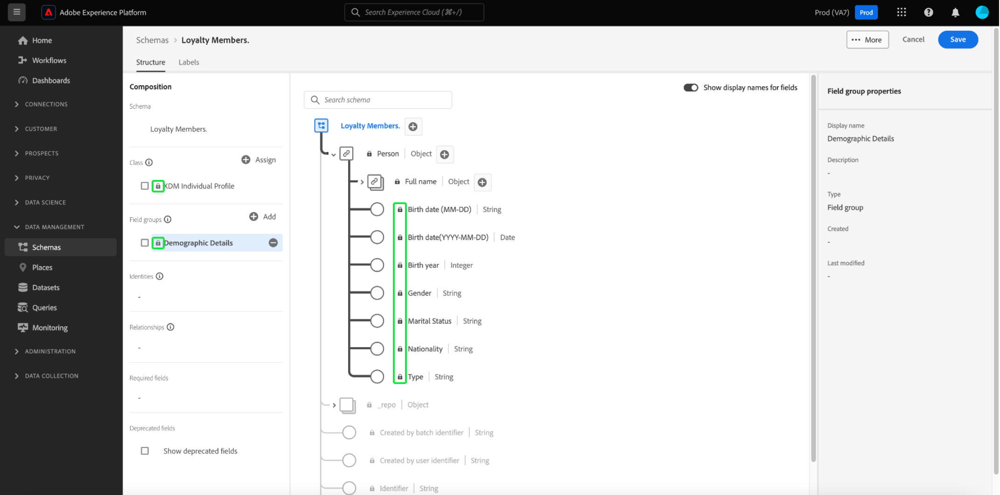
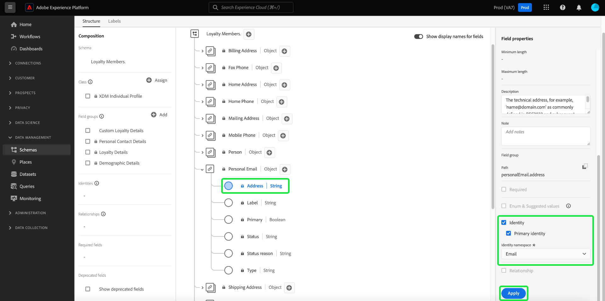

# Erstellen eines Schemas mit dem [!DNL Schema Editor]

In der Benutzeroberfläche von Adobe Experience Platform können Sie [!DNL Experience Data Model] (XDM)-Schemata in einer interaktiven visuellen Arbeitsfläche namens [!DNL Schema Editor] erstellen und verwalten. In diesem Tutorial wird beschrieben, wie Sie ein Schema mit dem [!DNL Schema Editor] erstellen.

Zu Demonstrationszwecken wird in diesem Tutorial ein Beispielschema erstellt, in dem die Mitglieder eines Kundentreueprogramms beschrieben werden. Sie können diese Schritte zwar verwenden, um ein anderes Schema für Ihre eigenen Zwecke zu erstellen, es wird jedoch empfohlen, zunächst das Beispielschema zu erstellen, um mehr über die Funktionen des [!DNL Schema Editor] zu erfahren.

>[!NOTE]
>
>Wenn Sie CSV-Daten in Platform aufnehmen, können Sie [diese Daten einem XDM-Schema zuordnen, das durch KI-generierte Empfehlungen erstellt wurde](../../ingestion/tutorials/map-csv/recommendations.md) (aktuell in der Beta-Phase), ohne das Schema manuell selbst erstellen zu müssen.
>
>Wenn Sie lieber ein Schema mit der [!DNL Schema Registry]-API erstellen möchten, lesen Sie zunächst das [[!DNL Schema Registry] Entwicklerhandbuch](../api/getting-started.md), bevor Sie das Tutorial [Erstellen eines Schemas mithilfe der API](create-schema-api.md) angehen.

## Erste Schritte

Dieses Tutorial erfordert ein Grundverständnis der verschiedenen Aspekte von Adobe Experience Platform, die mit der Schema-Erstellung verbunden sind. Bevor Sie mit diesem Tutorial beginnen, lesen Sie die Dokumentation für die folgenden Konzepte:

* [[!DNL Experience Data Model (XDM)]](../home.md): Das standardisierte Framework, mit dem Kundenerlebnisdaten von [!DNL Platform] organisiert werden.
   * [Grundlagen der Schema-Komposition](../schema/composition.md): Eine Übersicht über XDM-Schemata und ihre Bausteine, einschließlich Klassen, Schemafeldgruppen, Datentypen und einzelner Felder.
* [[!DNL Real-Time Customer Profile]](../../profile/home.md): Bietet ein einheitliches Echtzeit-Kundenprofil, das auf aggregierten Daten aus verschiedenen Quellen basiert.

## Öffnen des Arbeitsbereichs [!UICONTROL Schemata] {#browse}

Der Arbeitsbereich [!UICONTROL Schemata] in der [!DNL Platform]-Benutzeroberfläche bietet eine Visualisierung der [!DNL Schema Library], mit der Sie die für Ihr Unternehmen verfügbaren Schemata anzeigen und verwalten können. Der Arbeitsbereich umfasst auch den [!DNL Schema Editor], die Arbeitsfläche, in der Sie während dieses Tutorials ein Schema erstellen.

Wählen Sie nach der Anmeldung bei [!DNL Experience Platform] im linken Navigationsbereich die Option **[!UICONTROL Schemata]** aus, um den Arbeitsbereich **[!UICONTROL Schemata]** zu öffnen. Die **[!UICONTROL Durchsuchen]** zeigt eine Liste von Schemas an (eine Darstellung der [!DNL Schema Library]), damit Sie sie anzeigen und anpassen können. Die Liste umfasst den Namen, den Typ, die Klasse und das Verhalten (Datensatz oder Zeitreihen), auf denen das Schema basiert, sowie das Datum und die Uhrzeit der letzten Änderung des Schemas.

Weitere Informationen finden Sie im Handbuch zu [Erkunden vorhandener XDM-Ressourcen in der Benutzeroberfläche](../ui/explore.md).

## Erstellen und Benennen eines Schemas {#create}

Um mit der Erstellung eines Schemas zu beginnen, wählen Sie **[!UICONTROL Schema erstellen]** in der oberen rechten Ecke der **[!UICONTROL Schemas]** Arbeitsbereich.

![Die [!UICONTROL Schemas] Arbeitsbereich [!UICONTROL Durchsuchen] Registerkarte mit [!UICONTROL Schema erstellen] hervorgehoben.](../images/tutorials/create-schema/create-schema-button.png)

Die [!UICONTROL Schema erstellen] Workflow angezeigt. Wählen Sie anschließend eine Basisklasse für das Schema aus. Sie können zwischen den Hauptklassen von [!UICONTROL Individuelles XDM-Profil] und [!UICONTROL XDM ExperienceEvent]oder [!UICONTROL Sonstiges] , wenn diese Klassen nicht Ihren Zwecken entsprechen. Die [!UICONTROL Sonstiges] Mit der Option Klassen können Sie entweder [eine neue Klasse erstellen](#create-new-class) oder wählen Sie aus anderen bereits vorhandenen Klassen.

Siehe [XDM-individuelles Profil](../classes/individual-profile.md) und [XDM ExperienceEvent](../classes/experienceevent.md) Dokumentation finden Sie weitere Informationen zu diesen Klassen. Wählen Sie für diese Anleitung **[!UICONTROL Individuelles XDM-Profil]** gefolgt von **[!UICONTROL Nächste]**.

<!--  -->

<!-- You can  by selecting either **[!UICONTROL Individual Profile]**, **[!UICONTROL Experience Event]**, or **[!UICONTROL Other]**, followed by **[!UICONTROL Next]** to confirm your choice.  -->

![Die [!UICONTROL Schema erstellen] Workflow mit dem [!UICONTROL XDM-individuelles Profil] Optionen und [!UICONTROL Nächste] hervorgehoben.](../images/tutorials/create-schema/individual-profile-base-class.png)

Nachdem Sie eine Klasse ausgewählt haben, wird die [!UICONTROL Name und Überprüfung] angezeigt. In diesem Abschnitt geben Sie einen Namen und eine Beschreibung ein, um Ihr Schema zu identifizieren. Bei der Entscheidung über einen Namen für Ihr Schema sind einige wichtige Aspekte zu beachten:

* Schemanamen sollten kurz und beschreibend sein, damit das Schema später leicht gefunden werden kann.
* Die Namen der Schemas müssen eindeutig sein, d. h. sie sollten so spezifisch sein, dass sie in Zukunft nicht wiederverwendet werden. Wenn Ihr Unternehmen z. B. über separate Loyalitätsprogramme für verschiedene Marken verfügt, wäre es ratsam, Ihr Schema mit „Loyalitätsmitglieder, Marke A“ zu benennen, damit Sie dieses leicht von anderen Loyalitätsschemata unterscheiden können, die Sie u. U. später definieren.
* Sie können die Schemabeschreibung auch verwenden, um zusätzliche kontextuelle Informationen zum Schema bereitzustellen.

In diesem Tutorial wird ein Schema zur Aufnahme von Daten über die Mitglieder eines Treueprogramms zusammengestellt. Daher heißt das Schema „[!DNL Loyalty Members]“.

&#x200B; Die (von der Klasse bereitgestellte) Basisstruktur des Schemas wird auf der Arbeitsfläche angezeigt, damit Sie Ihre ausgewählte Klasse und Schemastruktur überprüfen und überprüfen können.

Geben Sie einen benutzerfreundlichen [!UICONTROL Anzeigename des Schemas] im Textfeld. Geben Sie anschließend eine Beschreibung ein, die die Identifizierung Ihres Schemas erleichtert. Wenn Sie Ihre Schemastruktur überprüft haben und mit Ihren Einstellungen zufrieden sind, wählen Sie **[!UICONTROL Beenden]** , um Ihr Schema zu erstellen.

![Die [!UICONTROL Name und Überprüfung] Abschnitt [!UICONTROL Schema erstellen] Workflow mit dem [!UICONTROL Anzeigename des Schemas], [!UICONTROL Beschreibung], und [!UICONTROL Beenden] hervorgehoben.](../images/ui/resources/schemas/name-and-review.png)

Der [!DNL Schema Editor] wird angezeigt. Dies ist die Arbeitsfläche, auf der Sie Ihr Schema zusammenstellen. Das selbstbenannte Schema wird automatisch im **[!UICONTROL Struktur]** -Abschnitt der Arbeitsfläche zusammen mit den Standardfeldern in der von Ihnen ausgewählten Basisklasse angezeigt. Die zugewiesene Klasse für das Schema wird auch im Abschnitt **[!UICONTROL Komposition]** unter **[!UICONTROL Klasse]** aufgelistet.

>[!NOTE]
>
>Sie können den Anzeigenamen und die optionale Beschreibung für das Schema im  **[!UICONTROL Schemaeigenschaften]** Seitenleiste. Sobald ein neuer Name eingegeben wurde, wird die Arbeitsfläche automatisch aktualisiert, um den neuen Namen des Schemas widerzuspiegeln.

>[!NOTE]
>
>Sie können [die Klasse eines Schemas](#change-class) während des anfänglichen Kompositionsprozesses jederzeit ändern, bevor das Schema gespeichert wird. Dies sollte jedoch mit größter Vorsicht geschehen. Feldergruppen sind nur mit bestimmten Klassen kompatibel. Daher werden die Arbeitsfläche und alle von Ihnen hinzugefügten Felder beim Ändern der Klasse zurückgesetzt.

## Hinzufügen einer Feldergruppe {#field-group}

Sie können nun beginnen, Ihrem Schema Felder hinzuzufügen, indem Sie Feldergruppen hinzufügen. Eine Feldergruppe ist eine Gruppe aus einem oder mehreren Feldern, die häufig zusammen zur Beschreibung eines bestimmten Konzepts verwendet werden. In diesem Tutorial werden Feldergruppen verwendet, um die Mitglieder des Treueprogramms zu beschreiben und wichtige Informationen wie Name, Geburtsdatum, Telefonnummer, Adresse usw. zu erfassen.

Um eine Feldergruppe hinzuzufügen, wählen Sie im Unterabschnitt **[!UICONTROL Feldergruppen]** die Option **[!UICONTROL Hinzufügen]** aus.

Es wird ein neues Dialogfeld mit einer Liste der verfügbaren Feldergruppen angezeigt. Jede Feldergruppe ist nur für die Verwendung mit einer bestimmten Klasse vorgesehen. Daher listet das Dialogfeld nur Feldergruppen auf, die mit der ausgewählten Klasse kompatibel sind (in diesem Fall die Klasse [!DNL XDM Individual Profile]). Wenn Sie eine XDM-Standardklasse verwenden, wird die Liste der Feldergruppen basierend auf der Nutzungshäufigkeit intelligent sortiert.

![Die [!UICONTROL Feldergruppen hinzufügen] angezeigt.](../images/tutorials/create-schema/field-group-popularity.png)

Sie können in der linken Leiste einen der Filter auswählen, um die Liste der Standardfeldgruppen auf bestimmte [Branchen](../schema/industries/overview.md) wie Einzelhandel, Finanzdienstleistungen und Gesundheitswesen einzugrenzen.

![Die [!UICONTROL Feldergruppen hinzufügen] Dialog mit den Branchengruppen hervorgehoben.](../images/tutorials/create-schema/industry-field-groups.png)

Wenn Sie eine Feldergruppe aus der Liste auswählen, wird sie in der rechten Leiste angezeigt. Sie können bei Bedarf mehrere Feldergruppen auswählen und jede Feldergruppe zur Liste in der rechten Leiste hinzufügen, bevor Sie den Vorgang bestätigen. Darüber hinaus wird rechts neben der aktuell ausgewählten Feldgruppe ein Symbol angezeigt, über das Sie die Struktur der darin enthaltenen Felder in einer Vorschau anzeigen können.

![Die [!UICONTROL Feldergruppen hinzufügen] angezeigt, wobei das Vorschausymbol für die ausgewählte Feldergruppe hervorgehoben ist.](../images/tutorials/create-schema/preview-field-group-button.png)

Bei der Vorschau einer Feldergruppe wird in der rechten Leiste eine detaillierte Beschreibung des Schemas der Feldergruppe bereitgestellt. Sie können auch durch die Felder der Feldergruppe in der bereitgestellten Arbeitsfläche navigieren. Wenn Sie verschiedene Felder auswählen, wird die rechte Leiste aktualisiert, um Details zum betreffenden Feld anzuzeigen. Wählen Sie **[!UICONTROL Zurück]** aus, wenn Sie mit der Vorschau fertig sind, um zum Dialogfeld für die Feldergruppenauswahl zurückzukehren.

![Die [!UICONTROL Feldergruppe in der Vorschau] Dialogfeld mit der Feldergruppe Demografische Details angezeigt.](../images/tutorials/create-schema/preview-field-group.png)

Wählen Sie für dieses Tutorial die Feldergruppe **[!UICONTROL Demografische Details]** und dann **[!UICONTROL Feldergruppe hinzufügen]** aus.

![Die [!UICONTROL Feldergruppen hinzufügen] Dialogfeld mit der ausgewählten Feldergruppe Demografische Details und [!UICONTROL Feldergruppen hinzufügen] hervorgehoben.](../images/tutorials/create-schema/demographic-details.png)

Die Arbeitsfläche des Schemas wird wieder angezeigt. Im Abschnitt **[!UICONTROL Feldergruppen]** wird jetzt „[!UICONTROL Demografische Details]“ aufgeführt, und der Abschnitt **[!UICONTROL Struktur]** enthält die von der Feldergruppe bereitgestellten Felder. Sie können den Namen der Feldergruppe unter dem Abschnitt **[!UICONTROL Feldergruppen]** auswählen, um die spezifischen Felder hervorzuheben, die auf der Arbeitsfläche bereitgestellt werden.

>[!NOTE]
>
>Im Schema Editor werden Standardklassen (Adobe-generierte) und Feldgruppen mit dem Vorhängeschloss-Symbol (. Das Vorhängeschloss wird in der linken Leiste neben dem Namen der Klasse oder Feldergruppe sowie neben jedem Feld im Schemadiagramm angezeigt, das Teil einer systemgenerierten Ressource ist.
>
>

Diese Feldergruppe stellt mehrere Felder unter dem übergeordneten Namen `person` mit dem Datentyp „[!UICONTROL Person]“ bereit. Diese Gruppe von Feldern beschreibt Informationen zu einer Person, einschließlich Name, Geburtsdatum und Geschlecht.

>[!NOTE]
>
>Denken Sie daran, dass Felder Skalartypen (z. B. Zeichenfolge, Ganzzahl, Array oder Datum) sowie beliebige Datentypen (eine Feldergruppe, die ein gemeinsames Konzept darstellt) in der [!DNL Schema Registry] verwenden können.

Beachten Sie, dass das Feld `name` den Datentyp „[!UICONTROL Vollständiger Name]“ aufweist, d. h., es beschreibt auch ein gemeinsames Konzept und enthält namensbezogene Unterfelder wie Vorname, Nachname, Höflichkeits- oder Ehrentitel und Suffix.

Wählen Sie verschiedene Felder auf der Arbeitsfläche aus, um weitere Felder anzuzeigen, die sie für die Schemastruktur bereitstellen.

## Hinzufügen weiterer Feldergruppen {#field-group-2}

Sie können jetzt dieselben Schritte wiederholen, um eine weitere Feldergruppe hinzuzufügen. Dieses Mal sehen Sie im Dialogfeld **[!UICONTROL Feldergruppe hinzufügen]**, dass die Feldergruppe „[!UICONTROL Demografische Details]“ ausgegraut ist und das Kontrollkästchen daneben nicht ausgewählt werden kann. Dadurch wird verhindert, dass Feldergruppen, die bereits in Ihrem aktuellen Schema enthalten sind, versehentlich dupliziert werden.

Wählen Sie für dieses Tutorial die Standardfeldgruppen **[!UICONTROL Persönliche Kontaktdaten]** und **[!UICONTROL Treuedetails]** aus der Liste und dann **[!UICONTROL Feldergruppen hinzufügen]** aus, um sie dem Schema hinzuzufügen.

![Die [!UICONTROL Feldergruppen hinzufügen] Dialogfeld mit zwei neuen Feldergruppen ausgewählt und [!UICONTROL Feldergruppen hinzufügen] hervorgehoben.](../images/tutorials/create-schema/more-field-groups.png)

Die Arbeitsfläche wird erneut mit den hinzugefügten Feldergruppen, die im Abschnitt **[!UICONTROL Komposition]** unter **[!UICONTROL Feldergruppen]** aufgelistet sind, und deren verbundenen Feldern, die der Schemastruktur hinzugefügt wurden, angezeigt.

## Definieren einer benutzerdefinierten Feldergruppe {#define-field-group}

Das Schema [!UICONTROL Mitglieder des Treueprogramms] soll Daten erfassen, die sich auf die Mitglieder eines Treueprogramms beziehen, und die Standardfeldgruppe [!UICONTROL Treuedetails], die Sie zum Schema hinzugefügt haben, enthält die meisten davon, darunter Programmtyp, Punkte, Beitrittsdatum usw.

Es kann jedoch vorkommen, dass Sie für Anwendungsfälle zusätzliche benutzerdefinierte Felder hinzufügen möchten, die nicht von Standardfeldgruppen abgedeckt werden. Beim Hinzufügen benutzerdefinierter Treuefelder haben Sie zwei Möglichkeiten:

1. Erstellen einer neuen benutzerdefinierten Feldergruppe, um diese Felder zu erfassen. Dies ist die Methode, die in diesem Tutorial behandelt wird.
1. Erweitern der Standardfeldgruppe [!UICONTROL Treuedetails] mit benutzerdefinierten Feldern. Dies führt dazu, dass [!UICONTROL Treuedetails] in eine benutzerdefinierte Feldergruppe konvertiert wird und dass die ursprüngliche Standardfeldgruppe nicht mehr verfügbar ist. Im Handbuch für die Benutzeroberfläche [!UICONTROL Schemata] finden Sie weitere Informationen zum [Hinzufügen benutzerdefinierter Felder zur Struktur von Standardfeldgruppen](../ui/resources/schemas.md#custom-fields-for-standard-groups).

Um eine neue Feldergruppe zu erstellen, wählen Sie wie zuvor im Unterabschnitt **[!UICONTROL Feldergruppen]** die Option **[!UICONTROL Hinzufügen]** aus. Aber dieses Mal wählen Sie am oberen Rand des angezeigten Dialogfelds die Option **[!UICONTROL Neue Feldergruppe erstellen]** aus. Anschließend werden Sie aufgefordert, einen Anzeigenamen und eine Beschreibung für die neue Feldergruppe anzugeben. Nennen Sie für dieses Tutorial die neue Feldergruppe „[!DNL Custom Loyalty Details]“ und wählen Sie dann **[!UICONTROL Feldergruppen hinzufügen]** aus.

![Die [!UICONTROL Feldergruppen hinzufügen] Dialogfeld mit [!UICONTROL Neue Feldergruppe erstellen], [!UICONTROL Anzeigename] und [!UICONTROL Beschreibung] hervorgehoben.](../images/tutorials/create-schema/create-new-field-group.png)

>[!NOTE]
>
>Wie bei Klassennamen sollte der Name der Feldergruppe kurz und einfach sein und beschreiben, was die Feldergruppe zum Schema beiträgt. Auch diese sind eindeutig, sodass Sie den Namen nicht wiederverwenden können und daher sicherstellen müssen, dass er spezifisch genug ist.

„[!DNL Custom Loyalty Details]“ sollte jetzt auf der linken Seite der Arbeitsfläche unter **[!UICONTROL Feldergruppe]** angezeigt werden. Es sind jedoch noch keine Felder damit verknüpft und daher werden keine neuen Felder unter **[!UICONTROL Struktur]** angezeigt.

## Hinzufügen von Feldern zur Feldergruppe {#field-group-fields}

Nachdem Sie jetzt die Feldergruppe „[!DNL Custom Loyalty Details]“ erstellt haben, können Sie die Felder definieren, die die Feldergruppe für das Schema bereitstellen wird.

Wählen Sie zunächst das Symbol **Plus (+)** neben dem Namen des Schemas auf der Arbeitsfläche.

Der Platzhalter „[!UICONTROL Nicht benanntes Feld]“ wird auf der Arbeitsfläche angezeigt, und die rechte Leiste wird aktualisiert, um Konfigurationsoptionen für das Feld anzuzeigen.

![Der Schema-Editor mit einer [!UICONTROL Unbenanntes Feld] und des Schemas [!UICONTROL Feldeigenschaften] hervorgehoben.](../images/tutorials/create-schema/untitled-field.png)

In diesem Szenario muss das Schema über ein Feld vom Typ „Objekt“ verfügen, das die aktuelle Treuestufe der Person detailliert beschreibt. Beginnen Sie mit der Erstellung eines Felds `loyaltyTier` vom Typ „[!UICONTROL Objekt]“, das zum Speichern Ihrer verwandten Felder verwendet wird.

Unter **[!UICONTROL Zuweisen zu]** müssen Sie eine Feldergruppe auswählen, der das Feld zugewiesen werden soll. Denken Sie daran, dass alle Schemafelder entweder zu einer Klasse oder zu einer Feldergruppe gehören. Da dieses Schema eine Standardklasse verwendet, besteht die einzige Option darin, eine Feldergruppe auszuwählen. Geben Sie zunächst den Namen „[!DNL Custom Loyalty Details]“ ein und wählen Sie dann die Feldergruppe aus der Liste aus.

Wenn Sie fertig sind, wählen Sie **[!UICONTROL Anwenden]** aus.

![Der Schema-Editor mit dem dem Schema hinzugefügten Loyalitätsebene-Objekt [!UICONTROL Feldeigenschaften] hervorgehoben.](../images/tutorials/create-schema/loyalty-tier-object.png)

Die Änderungen werden angewandt, und das neu erstellte `loyaltyTier`-Objekt wird angezeigt. Da es sich hierbei um ein benutzerdefiniertes Feld handelt, wird es automatisch in einem Objekt mit einem Namespace entsprechend der Mandanten-ID Ihrer Organisation und vorangestelltem Unterstrich verschachtelt (`_tenantId` in diesem Beispiel).

>[!NOTE]
>
>Das Vorhandensein des Mandanten-ID-Objekts bedeutet, dass die Felder, die Sie hinzufügen, im Namespace Ihres Unternehmens enthalten sind.
>
>Anders ausgedrückt: Die Felder, die Sie hinzufügen, sind für Ihre Organisation einzigartig und werden in der [!DNL Schema Registry] in einem bestimmten Bereich, der nur für Ihre Organisation zugänglich ist, gespeichert. Felder, die Sie definieren, müssen Ihrem Mandanten-Namespace immer hinzugefügt werden, um Konflikte mit Namen anderer Standardklassen, Feldergruppen, Datentypen und Felder zu verhindern.

Wählen Sie das Symbol **Plus (+)** neben dem `loyaltyTier`-Objekt aus, um mit dem Hinzufügen von Unterfeldern zu beginnen. Ein Platzhalter für ein neues Feld wird angezeigt, und rechts auf der Arbeitsfläche ist der Abschnitt **[!UICONTROL Feldeigenschaften]** sichtbar.

Für jedes Feld sind die folgenden Informationen erforderlich:

* **[!UICONTROL Feldname]:** Der Name des Felds, vorzugsweise in Binnenmajuskel-Schreibweise geschrieben. Leerzeichen sind nicht zulässig. Dies ist der Name, der verwendet wird, um auf das Feld im Code und in anderen nachgelagerten Anwendungen zu verweisen.
   * Beispiel: LoyalitätsStufe
* **[!UICONTROL Anzeigename]:** Der Name des Felds, mit Großschreibung des ersten Buchstaben jedes Worts. Dies ist der Name, der auf der Arbeitsfläche erscheint, wenn das Schema angezeigt oder bearbeitet wird.
   * Beispiel: Loyalitäts-Stufe
* **[!UICONTROL Typ]:** Der Datentyp des Felds. Dazu gehören grundlegende Skalartypen und alle Datentypen, die in der [!DNL Schema Registry] definiert sind. Beispiele: [!UICONTROL Zeichenfolge], [!UICONTROL Ganzzahl], [!UICONTROL Boolescher Wert], [!UICONTROL Person], [!UICONTROL Adresse], [!UICONTROL Telefonnummer] usw.
* **[!UICONTROL Beschreibung]:** Eine optionale Beschreibung des Felds mit maximal 200 Zeichen sollte enthalten sein.

Das erste Feld für das `loyaltyTier`-Objekt ist eine Zeichenfolge mit der Bezeichnung `id`, die die ID der aktuellen Stufe des Mitglieds des Treueprogramms darstellt. Die Stufen-ID ist für jedes Mitglied des Treueprogramms eindeutig, da dieses Unternehmen für jede Kundin und jeden Kunden basierend auf verschiedenen Faktoren unterschiedliche Punkteschwellenwerte für die Treuestufe festlegt. Setzen Sie den Typ des neuen Felds auf &quot;[!UICONTROL Zeichenfolge]&quot; und der **[!UICONTROL Feldeigenschaften]** -Abschnitt enthält mehrere Optionen zum Anwenden von Einschränkungen, einschließlich Standardwert, Format und maximale Länge. Siehe die Dokumentation unter [Best Practices für Datenvalidierungsfelder](../schema/best-practices.md#data-validation-fields) , um mehr zu erfahren.

Da `id` eine zufällig generierte Freiformzeichenfolge ist, sind keine weiteren Einschränkungen erforderlich. Wählen Sie **[!UICONTROL Übernehmen]**, um Ihre Änderungen anzuwenden.

## Hinzufügen weiterer Felder zur Feldergruppe {#field-group-fields-2}

Nachdem Sie jetzt das Feld `id` hinzugefügt haben, können Sie zusätzliche Felder hinzufügen, um auf die Treuestufe bezogene Informationen zu erfassen, z. B.:

* Aktueller Punkteschwellenwert (Ganzzahl): Die Mindestanzahl von Treuepunkten, die das Mitglied haben muss, um in der aktuellen Stufe zu bleiben.
* Punkteschwellenwert für nächste Stufe (Ganzzahl): Die Anzahl der Treuepunkte, die das Mitglied sammeln muss, um die nächste Stufe zu erreichen.
* Wirksamwerden (Datum/Uhrzeit): Der Zeitpunkt, zu dem das Mitglied des Treueprogramms diese Stufe erreicht hat.

Um jedes Feld zum Schema hinzuzufügen, wählen Sie das Symbol **Plus (+)** neben dem `loyalty`-Objekt aus und geben Sie die erforderlichen Informationen ein.

Nach Fertigstellung enthält das `loyaltyTier`-Objekt Felder für `id`, `currentThreshold`, `nextThreshold` und `effectiveDate`.

## Hinzufügen eines Aufzählungsfelds zur Feldergruppe {#enum}

Beim Definieren von Feldern im [!DNL Schema Editor] gibt es einige zusätzliche Optionen, die Sie auf einfache Feldtypen anwenden können, um weitere Einschränkungen für die Daten, die das Feld enthalten kann, bereitzustellen. Die Anwendungsfälle für diese Einschränkungen werden in der folgenden Tabelle erläutert:

| Beschränkung | Beschreibung |
| --- | --- |
| [!UICONTROL Erforderlich] | Gibt an, dass das Feld für die Datenaufnahme erforderlich ist. Daten, die auf Grundlage dieses Schemas in einen Datensatz hochgeladen wurden und dieses Feld nicht enthalten, schlagen bei der Aufnahme fehl. |
| [!UICONTROL Array] | Gibt an, dass das Feld ein Array von Werten jeweils mit dem angegebenen Datentyp enthält. Verwenden Sie diese Einschränkung beispielsweise für ein Feld mit dem Datentyp „[!UICONTROL Zeichenfolge]“, gibt dies an, dass das Feld ein Zeichenfolgen-Array enthält. |
| [!UICONTROL Aufzählung und vorgeschlagene Werte] | Eine Aufzählung gibt an, dass dieses Feld einen der Werte aus einer Aufzählungsliste möglicher Werte enthalten muss. Als Alternative können Sie diese Option auch verwenden, um nur eine Liste der empfohlenen Werte für ein Zeichenfolgenfeld bereitzustellen, ohne das Feld auf diese Werte zu beschränken. |
| [!UICONTROL Identität] | Gibt an, dass dieses Feld ein Identitätsfeld ist. Weitere Informationen zu Identitätsfeldern finden Sie [weiter unten in diesem Tutorial](#identity-field). |
| [!UICONTROL Beziehung] | Während Schemabeziehungen durch die Verwendung des Vereinigungsschemas und [!DNL Real-Time Customer Profile] abgeleitet werden können, gilt dies nur für Schemata einer gemeinsamen Klasse. Die Einschränkung [!UICONTROL Beziehung] gibt an, dass dieses Feld auf die primäre Identität eines Schemas verweist, das auf einer anderen Klasse basiert, was eine Beziehung zwischen den beiden Schemata impliziert. Weiterführende Informationen finden Sie im Tutorial zum [Definieren von Beziehungen](./relationship-ui.md). |

{style="table-layout:auto"}

>[!NOTE]
>
>Alle erforderlichen Identitäts- oder Beziehungsfelder werden in den entsprechenden Abschnitten in der linken Leiste aufgelistet, sodass Sie diese Felder unabhängig von der Komplexität des Schemas problemlos finden können.

In diesem Tutorial erfordert das `loyaltyTier`-Objekt im Schema ein neues Aufzählungsfeld, das die Stufenklasse beschreibt, wobei der Wert nur eine von vier möglichen Optionen sein kann. Um dieses Feld zum Schema hinzuzufügen, wählen Sie das Symbol **Plus (+)** neben dem `loyaltyTier`-Objekt aus und füllen Sie die erforderlichen Felder für **[!UICONTROL Feldname]** und **[!UICONTROL Anzeigename]** aus. Wählen Sie für **[!UICONTROL Typ]** die Option „[!UICONTROL Zeichenfolge]“ aus.

![Der Schema Editor mit dem Tier Class -Objekt, das im [!UICONTROL Feldeigenschaften].](../images/tutorials/create-schema/tier-class-type.png)

Zusätzliche Kontrollkästchen werden für das Feld angezeigt, nachdem der Typ ausgewählt wurde, einschließlich der Kontrollkästchen für **[!UICONTROL Array]**, **[!UICONTROL Aufzählung und vorgeschlagene Werte]**, **[!UICONTROL Identität]** und **[!UICONTROL Beziehung]**.

Aktivieren Sie das Kontrollkästchen **[!UICONTROL Aufzählung und empfohlene Werte]** und wählen Sie dann **[!UICONTROL Aufzählung]** aus. Hier können Sie für jede akzeptable Treuestufe den **[!UICONTROL Wert]** (in Binnenmajuskel-Schreibweise) und den **[!UICONTROL Anzeigenamen]** (einen optionalen, leserfreundlichen Namen mit Großschreibung des jeweils ersten Buchstaben eines Worts) eingeben.

Wählen Sie nach Festlegung aller Feldeigenschaften **[!UICONTROL Anwenden]** aus, um das Feld `tierClass` zum `loyaltyTier`-Objekt hinzuzufügen.

![Die Feldeigenschaften enum und suggerieren , die mit [!UICONTROL Anwenden] hervorgehoben.](../images/tutorials/create-schema/tier-class-enum.png)

## Konvertieren eines Objekts mit mehreren Feldern in einen Datentyp {#datatype}

Das `loyaltyTier`-Objekt enthält jetzt mehrere Felder und stellt eine gemeinsame Datenstruktur dar, die in anderen Schemata nützlich sein könnte. Der [!DNL Schema Editor] ermöglicht Ihnen das einfache Anwenden wiederverwendbarer Objekte mit mehreren Feldern durch Konvertieren der Struktur dieser Objekte in Datentypen.

Datentypen ermöglichen den konsistenten Einsatz von Strukturen mit mehreren Feldern und bieten mehr Flexibilität als eine Feldergruppe, da sie überall in einem Schema verwendet werden können. Hierzu müssen Sie den Wert für den **[!UICONTROL Typ]** des Felds auf den Wert eines beliebigen der in der [!DNL Schema Registry] definierten Datentypen festlegen.

Um das `loyaltyTier`-Objekt in einen Datentyp zu konvertieren, wählen Sie auf der Arbeitsfläche das Feld `loyaltyTier` und dann rechts im Editor unter **[!UICONTROL Feldeigenschaften]** die Option **[!UICONTROL In neuen Datentyp konvertieren]** aus.

![Der Schema Editor mit dem Objekt loyaltyTier und [!UICONTROL In neuen Datentyp konvertieren] hervorgehoben.](../images/tutorials/create-schema/convert-data-type.png)

Es wird eine Benachrichtigung angezeigt, die bestätigt, dass das Objekt erfolgreich konvertiert wurde. Auf der Arbeitsfläche können Sie jetzt sehen, dass das Feld `loyaltyTier` nun ein Verknüpfungssymbol enthält, und in der rechten Leiste wird angegeben, dass es den Datentyp „[!DNL Loyalty Tier]“ hat.

In einem zukünftigen Schema können Sie nun ein Feld als Typ „[!DNL Loyalty Tier]“ zuweisen. Dies enthält dann automatisch Felder für ID, Stufenklasse, Punkteschwellenwerte und das Datum des Wirksamwerdens.

>[!NOTE]
>
>Sie können benutzerdefinierte Datentypen auch unabhängig von der Schemabearbeitung erstellen und bearbeiten. Weiterführende Informationen finden Sie im Handbuch zum [Erstellen und Bearbeiten von Datentypen](../ui/resources/data-types.md).

## Suchen und Filtern von Schemafeldern

Ihr Schema enthält jetzt zusätzlich zu den von der Basisklasse bereitgestellten Feldern mehrere Feldergruppen. Wenn Sie mit größeren Schemata arbeiten, können Sie in der linken Leiste die Kontrollkästchen neben den Namen der Feldergruppen aktivieren, um die angezeigten Felder nur nach den von den Feldergruppen bereitgestellten Feldern zu filtern, die für Sie interessant sind.

Wenn Sie nach einem bestimmten Feld in Ihrem Schema suchen, können Sie auch die Suchleiste verwenden, um die angezeigten Felder nach Namen zu filtern, unabhängig davon, unter welcher Feldergruppe sie bereitgestellt werden.

>[!IMPORTANT]
>
>Die Suchfunktion berücksichtigt alle ausgewählten Feldgruppenfilter bei der Anzeige passender Felder. Wenn in einer Suchanfrage nicht die erwarteten Ergebnisse angezeigt werden, müssen Sie möglicherweise überprüfen, ob Sie relevante Feldergruppen herausfiltern.

## Festlegen eines Schemafelds als Identitätsfeld {#identity-field}

Die Standarddatenstruktur, die Schemata bereitstellen, kann genutzt werden, um quellenübergreifed Daten zu identifizieren, die zu derselben Person gehören. Dies ermöglicht verschiedene nachgelagerte Anwendungsfälle wie Segmentierung, Reporting, Datenwissenschaftsanalyse und mehr. Um Daten basierend auf einzelnen Identitäten zusammenzufügen, müssen Schlüsselfelder in anwendbaren Schemata als [!UICONTROL Identitätsfelder] markiert werden.

Mit [!DNL Experience Platform] können Sie ein Identitätsfeld ganz einfach durch das Kontrollkästchen **[!UICONTROL Identität]** im [!DNL Schema Editor] kennzeichnen. Basierend auf der Art Ihrer Daten müssen Sie jedoch festlegen, welches Feld als Identität am besten geeignet ist.

So kann es beispielsweise Tausende von Mitgliedern des Treueprogramms geben, die derselben Treuestufe angehören, sowie mehrere Mitglieder, die dieselbe physische Adresse haben. In diesem Szenario gibt jedoch jedes Mitglied des Treueprogramms bei der Registrierung seine persönliche E-Mail-Adresse an. Da persönliche E-Mail-Adressen in der Regel von einer Person verwaltet werden, eignet sich das Feld `personalEmail.address` (bereitgestellt von der Feldergruppe [!UICONTROL Persönliche Kontaktdaten]) sehr gut als Identitätsfeld.

>[!IMPORTANT]
>
>Die folgenden Schritte beschreiben, wie Sie einem vorhandenen Schemafeld einen Identitätsdeskriptor hinzufügen. Als Alternative zur Definition von Identitätsfeldern innerhalb der Struktur des Schemas selbst können Sie stattdessen auch ein Feld `identityMap` zum Speichern der Identitätsinformationen verwenden.
>
>Wenn Sie `identityMap` verwenden möchten, denken Sie daran, dass dadurch alle primären Identitäten außer Kraft gesetzt werden, die Sie direkt zum Schema hinzufügen. Weiterführende Informationen finden Sie im Abschnitt zu `identityMap` im [Handbuch mit den Grundlagen der Schemakomposition](../schema/composition.md#identityMap).

Wählen Sie auf der Arbeitsfläche das Feld `personalEmail.address` aus. Daraufhin wird unter **[!UICONTROL Feldeigenschaften]** das Kontrollkästchen **[!UICONTROL Identität]** angezeigt. Aktivieren Sie das Kästchen. Anschließend wird die Option angezeigt, um dies als **[!UICONTROL primäre Identität]** festzulegen. Aktivieren Sie dieses Kontrollkästchen ebenfalls.

>[!NOTE]
>
>Jedes Schema darf nur ein primäres Identitätsfeld enthalten. Nachdem ein Schemafeld als primäre Identität festgelegt wurde, erhalten Sie eine Fehlermeldung, wenn Sie später versuchen, ein anderes Identitätsfeld im Schema als primär festzulegen.

Als Nächstes müssen Sie einen **[!UICONTROL Identity-Namespace]** aus der Liste der vordefinierten Namespaces im Dropdown-Menü angeben. Da dieses Feld die Kunden-E-Mail-Adresse ist, wählen Sie aus dem Dropdown-Menü die Option „[!UICONTROL E-Mail]“ aus. Wählen Sie **[!UICONTROL Anwenden]** zur Bestätigung der Aktualisierungen des Felds `personalEmail.address` aus.

>[!NOTE]
>
>Eine Liste der Standard-Namespaces und ihrer Definitionen finden Sie in der [[!DNL Identity Service] Dokumentation](../../identity-service/troubleshooting-guide.md#standard-namespaces).

Nach Anwendung der Änderung zeigt das Symbol für `personalEmail.address` ein Fingerabdrucksymbol. Dies bedeutet, dass es sich jetzt um ein Identitätsfeld handelt. Das Feld wird auch in der linken Leiste unter **[!UICONTROL Identitäten]** aufgeführt.

Nun werden alle Daten, die in das Feld `personalEmail.address` aufgenommen werden, verwendet, um diese Person zu identifizieren und eine individuelle Sicht auf diese Kundin oder diesen Kunden zu erstellen. Weitere Informationen zum Arbeiten mit Identitäten in [!DNL Experience Platform] finden Sie in der Dokumentation zu [[!DNL Identity Service]](../../identity-service/home.md).

## Aktivieren des Schemas für die Verwendung in [!DNL Real-Time Customer Profile] {#profile}

Das [[!DNL Real-Time Customer Profile]](../../profile/home.md) nutzt Identitätsdaten in [!DNL Experience Platform], um eine ganzheitliche Sicht auf jede einzelne Kundin und jeden einzelnen Kunden zu ermöglichen. Der Service erstellt robuste 360°-Profile mit Kundenattributen sowie mit Zeitstempel versehene Berichte für jede Interaktion, die Kundinnen und Kunden über eines der in [!DNL Experience Platform] integrierten Systeme hatten.

Damit ein Schema für das [!DNL Real-Time Customer Profile] aktiviert werden kann, muss eine primäre Identität dafür definiert sein. Sie erhalten eine Fehlermeldung, wenn Sie versuchen, ein Schema zu aktivieren, ohne vorher eine primäre Identität zu definieren.

Um das Schema „Mitglieder des Treueprogramms“ für das [!DNL Profile] zu aktivieren, wählen Sie zunächst den Schemanamen auf der Arbeitsfläche aus.

Rechts im Editor werden Informationen zum Schema angezeigt, einschließlich dessen Anzeigenamen, Beschreibung und Typ. Zusätzlich zu diesen Informationen gibt es eine Umschaltfläche **[!UICONTROL Profil]**.

Wählen Sie **[!UICONTROL Profil]** aus. Daraufhin wird ein Pop-up angezeigt, in dem Sie bestätigen müssen, dass Sie das Schema für das [!DNL Profile] aktivieren möchten.

>[!WARNING]
>
>Nachdem ein Schema für das [!DNL Real-Time Customer Profile] aktiviert und gespeichert wurde, kann es nicht mehr deaktiviert werden.

Wählen Sie **[!UICONTROL Aktivieren]** aus, um Ihre Wahl zu bestätigen. Sie können den Umschalter **[!UICONTROL Profil]** erneut auswählen, um ggf. das Schema zu deaktivieren. Aber sobald das Schema bei aktiviertem [!DNL Profile] gespeichert wurde, kann es nicht mehr deaktiviert werden.

## Mehr Aktionen {#more}

Im Schema Editor können Sie auch Schnellaktionen durchführen, um die JSON-Struktur des Schemas zu kopieren oder das Schema zu löschen, wenn es nicht für das Echtzeit-Kundenprofil aktiviert wurde oder über verknüpfte Datensätze verfügt. Auswählen [!UICONTROL Mehr] oben in der Ansicht ein Dropdown-Menü mit Schnellaktionen anzeigen.

Mit der Funktion JSON-Struktur kopieren können Sie sehen, wie eine Beispiel-Payload aussehen würde, während Sie das Schema und Ihre Daten-Pipelines noch erstellen. Dies ist besonders hilfreich in Situationen, in denen komplexe Objektzuordnungsstrukturen im Schema vorhanden sind, z. B. bei einer Identitätszuordnung.

## Nächste Schritte und zusätzliche Ressourcen

Nachdem Sie das Schema fertiggestellt haben, ist das vollständige Schema auf der Arbeitsfläche sichtbar. Wählen Sie **[!UICONTROL Speichern]** aus. Das Schema wird in der [!DNL Schema Library] gespeichert, sodass es von der [!DNL Schema Registry] aufgerufen werden kann.

Ihr neues Schema kann jetzt zur Aufnahme von Daten in [!DNL Platform] verwendet werden. Denken Sie daran, dass nach Verwendung des Schemas zur Datenaufnahme nur noch Ergänzungen vorgenommen werden können. Weitere Informationen zur Schemaversionierung finden Sie in den [Grundlagen der Schema-Komposition](../schema/composition.md).

Mithilfe des Tutorials [Definieren einer Schemabeziehung in der Benutzeroberfläche](./relationship-ui.md) können Sie nun dem Schema „Mitglieder des Treueprogramms“ ein neues Beziehungsfeld hinzufügen.

Das Schema „Mitglieder des Treueprogramms“ steht auch zur Ansicht und Verwaltung mit der [!DNL Schema Registry]-API zur Verfügung. Um mit der API zu arbeiten, lesen Sie zunächst das [[!DNL Schema Registry API] Entwicklerhandbuch](../api/getting-started.md).

### Videoressourcen

>[!WARNING]
>
>Die [!DNL Platform]-Benutzeroberfläche, die in den folgenden Videos angezeigt wird, ist veraltet. Die neuesten Screenshots und Funktionen der Benutzeroberfläche finden Sie in der obigen Dokumentation.

Das folgende Video zeigt, wie ein einfaches Schema in der [!DNL Platform]-Benutzeroberfläche erstellt wird.

>[!VIDEO](https://video.tv.adobe.com/v/27012?quality=12&learn=on)

Das folgende Video soll Ihr Verständnis für die Arbeit mit Feldergruppen und Klassen verbessern.

>[!VIDEO](https://video.tv.adobe.com/v/27013?quality=12&learn=on)

## Anhang

Die folgenden Abschnitte enthalten zusätzliche Informationen zur Verwendung des [!DNL Schema Editor].

### Erstellen einer neuen Klasse {#create-new-class}

[!DNL Experience Platform] bietet die Flexibilität, ein Schema auf der Grundlage einer Klasse zu definieren, die eindeutig für Ihre Organisation ist. Informationen zum Erstellen einer neuen Klasse finden Sie im Handbuch zum [Erstellen und Bearbeiten von Klassen in der Benutzeroberfläche](../ui/resources/classes.md#create).

### Ändern der Klasse eines Schemas {#change-class}

Sie können die Klasse eines Schemas während des anfänglichen Kompositionsprozesses jederzeit ändern, bevor das Schema gespeichert wurde.

>[!WARNING]
>
>Die Neuzuweisung der Klasse für ein Schema sollte mit äußerster Vorsicht erfolgen. Feldergruppen sind nur mit bestimmten Klassen kompatibel. Daher werden die Arbeitsfläche und alle von Ihnen hinzugefügten Felder beim Ändern der Klasse zurückgesetzt.

Informationen zum Ändern der Klasse eines Schemas finden Sie im Handbuch zum [Verwalten von Schemata in der Benutzeroberfläche](../ui/resources/schemas.md#change-class).
