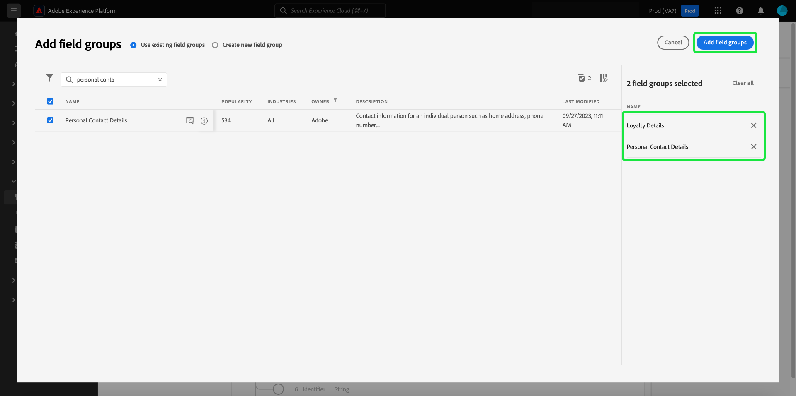
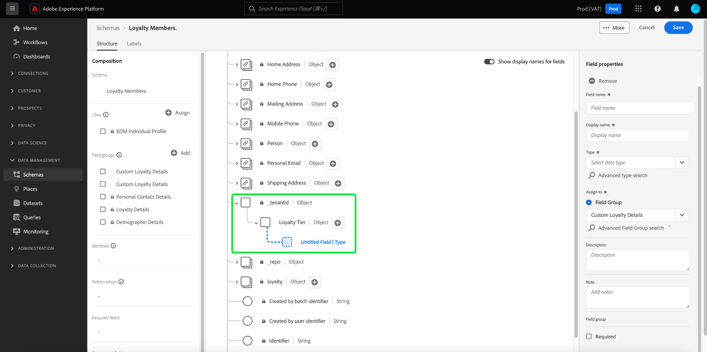

# Erstellen Sie ein Schema mit dem [!DNL Schema Editor]

In der Benutzeroberfläche von Adobe Experience Platform können Sie [!DNL Experience Data Model] (XDM)-Schemas in einer interaktiven visuellen Arbeitsfläche namens [!DNL Schema Editor]. In diesem Tutorial wird beschrieben, wie Sie ein Schema mit dem [!DNL Schema Editor].

Zu Demonstrationszwecken wird in diesem Tutorial ein Beispielschema erstellt, in dem die Mitglieder eines Kundentreueprogramms beschrieben werden. Sie können diese Schritte zwar verwenden, um ein anderes Schema für Ihre eigenen Zwecke zu erstellen, es wird jedoch empfohlen, zunächst das Beispielschema zu erstellen, um mehr über die Funktionen des [!DNL Schema Editor].

>[!NOTE]
>
>Wenn Sie CSV-Daten in Platform erfassen, können Sie [Ordnen Sie diese Daten einem XDM-Schema zu, das von AI-generierten Empfehlungen erstellt wurde.](../../ingestion/tutorials/map-csv/recommendations.md) (aktuell in der Beta-Phase), ohne das Schema manuell selbst erstellen zu müssen.
>
>Wenn Sie lieber ein Schema mit der [!DNL Schema Registry] API, lesen Sie zunächst die [[!DNL Schema Registry] Entwicklerhandbuch](../api/getting-started.md) vor dem Versuch des Tutorials auf [Erstellen eines Schemas mithilfe der API](create-schema-api.md).

## Erste Schritte

Dieses Tutorial setzt ein Verständnis der verschiedenen Aspekte von Adobe Experience Platform voraus, die an der Schemaerstellung beteiligt sind. Bevor Sie mit diesem Tutorial beginnen, lesen Sie die Dokumentation für die folgenden Konzepte:

* [[!DNL Experience Data Model (XDM)]](../home.md): Das standardisierte Framework, mit dem Kundenerlebnisdaten von [!DNL Platform] organisiert werden.
   * [Grundlagen der Schemakomposition](../schema/composition.md): Eine Übersicht über XDM-Schemas und ihre Bausteine, einschließlich Klassen, Schemafeldgruppen, Datentypen und einzelner Felder.
* [[!DNL Real-Time Customer Profile]](../../profile/home.md): Bietet ein einheitliches Echtzeit-Kundenprofil, das auf aggregierten Daten aus verschiedenen Quellen basiert.

## Öffnen Sie die [!UICONTROL Schemas] Arbeitsbereich {#browse}

Die [!UICONTROL Schemas] Arbeitsbereich im [!DNL Platform] Die Benutzeroberfläche bietet eine Visualisierung der [!DNL Schema Library], mit dem Sie die für Ihre Organisation verfügbaren Schemas anzeigen können. Der Arbeitsbereich umfasst auch die [!DNL Schema Editor], die Arbeitsfläche, auf der Sie in diesem Tutorial ein Schema erstellen können.

Nach der Anmeldung bei [!DNL Experience Platform]auswählen **[!UICONTROL Schemas]** im linken Navigationsbereich, um die **[!UICONTROL Schemas]** Arbeitsbereich. Die **[!UICONTROL Durchsuchen]** zeigt eine Liste von Schemas an (eine Darstellung der [!DNL Schema Library]), die Sie anzeigen und anpassen können. Die Liste umfasst den Namen, den Typ, die Klasse und das Verhalten (Datensatz oder Zeitreihen), auf denen das Schema basiert, sowie das Datum und die Uhrzeit der letzten Änderung des Schemas.

Siehe Handbuch unter [Erkunden vorhandener XDM-Ressourcen in der Benutzeroberfläche](../ui/explore.md) für weitere Informationen.

## Erstellen und Benennen eines Schemas {#create}

Um mit der Erstellung eines Schemas zu beginnen, wählen Sie **[!UICONTROL Schema erstellen]** in der oberen rechten Ecke der **[!UICONTROL Schemas]** Arbeitsbereich. Ein Dropdown-Menü wird angezeigt, in dem Sie zwischen den Hauptklassen wählen können [!UICONTROL XDM Individual Profile] und [!UICONTROL XDM ExperienceEvent]. Wenn diese Klassen nicht zu Ihren Zwecken passen, können Sie auch **[!UICONTROL Durchsuchen]** zur Auswahl aus anderen verfügbaren Klassen oder [eine neue Klasse erstellen](#create-new-class).

Wählen Sie für die Zwecke dieses Tutorials **[!UICONTROL XDM Individual Profile]**.

Die [!DNL Schema Editor] angezeigt. Dies ist die Arbeitsfläche, auf der Sie Ihr Schema zusammenstellen. Ein unbenanntes Schema wird automatisch im **[!UICONTROL Struktur]** -Abschnitt der Arbeitsfläche, wenn Sie im Editor ankommen, zusammen mit den Standardfeldern, die in allen Schemas enthalten sind, die auf dieser Klasse basieren. Die zugewiesene Klasse für das Schema wird auch unter **[!UICONTROL Klasse]** in **[!UICONTROL Komposition]** Abschnitt.

>[!NOTE]
>
> Sie können [die Klasse eines Schemas](#change-class) jederzeit während des anfänglichen Kompositionsprozesses ändern, bevor das Schema gespeichert wird. Dies sollte jedoch mit größter Vorsicht geschehen. Feldergruppen sind nur mit bestimmten Klassen kompatibel. Daher werden die Arbeitsfläche und alle von Ihnen hinzugefügten Felder durch Ändern der Klasse zurückgesetzt.

under **[!UICONTROL Schemaeigenschaften]**, geben Sie einen Anzeigenamen und eine optionale Beschreibung für das Schema an. Sobald ein Name eingegeben wurde, wird die Arbeitsfläche aktualisiert und gibt den neuen Namen des Schemas wieder.

Bei der Entscheidung über einen Namen für Ihr Schema sind einige wichtige Aspekte zu beachten:

* Schemanamen sollten kurz und beschreibend sein, damit das Schema später leicht zu finden ist.
* Die Namen der Schemas müssen eindeutig sein, d. h. sie sollten so spezifisch sein, dass sie in Zukunft nicht wiederverwendet werden. Wenn Ihr Unternehmen z. B. über separate Loyalitätsprogramme für verschiedene Marken verfügt, wäre es ratsam, Ihr Schema mit „Loyalitätsmitglieder, Marke A“ zu benennen, damit Sie dieses leicht von anderen Loyalitätsschemas unterscheiden können, die Sie u. U. später definieren.
* Sie können die Schemabeschreibung auch verwenden, um zusätzliche kontextbezogene Informationen zum Schema bereitzustellen.

In diesem Tutorial wird ein Schema zum Erfassen von Daten zu Mitgliedern eines Treueprogramms zusammengestellt. Daher erhält das Schema den Namen[!DNL Loyalty Members]&quot;.

## Feldergruppe hinzufügen {#field-group}

Sie können nun mit dem Hinzufügen von Feldern zum Schema beginnen, indem Sie Feldergruppen hinzufügen. Eine Feldergruppe ist eine Gruppe aus einem oder mehreren Feldern, die häufig zusammen zur Beschreibung eines bestimmten Konzepts verwendet werden. In diesem Tutorial werden Feldgruppen verwendet, um die Mitglieder des Treueprogramms zu beschreiben und wichtige Informationen wie Name, Geburtstag, Telefonnummer, Adresse und mehr zu erfassen.

Um eine Feldergruppe hinzuzufügen, wählen Sie **[!UICONTROL Hinzufügen]** im **[!UICONTROL Feldergruppen]** Unterabschnitt.

Es wird ein neues Dialogfeld mit einer Liste der verfügbaren Feldergruppen angezeigt. Jede Feldergruppe ist nur für die Verwendung mit einer bestimmten Klasse vorgesehen. Daher listet das Dialogfeld nur Feldergruppen auf, die mit der ausgewählten Klasse kompatibel sind (in diesem Fall die [!DNL XDM Individual Profile] -Klasse). Wenn Sie eine Standard-XDM-Klasse verwenden, wird die Liste der Feldergruppen basierend auf der Nutzungspopularität intelligent sortiert.

Sie können einen der Filter in der linken Leiste auswählen, um die Liste der Standardfeldgruppen auf bestimmte [Industrien](../schema/industries/overview.md) wie Einzelhandel, Finanzdienstleistungen und Gesundheitswesen.

Wenn Sie eine Feldergruppe aus der Liste auswählen, wird sie in der rechten Leiste angezeigt. Sie können bei Bedarf mehrere Feldergruppen auswählen und jede Feldergruppe zur Liste in der rechten Leiste hinzufügen, bevor Sie die Bestätigung vornehmen. Darüber hinaus wird rechts neben der aktuell ausgewählten Feldergruppe ein Symbol angezeigt, über das Sie die Struktur der darin enthaltenen Felder in der Vorschau anzeigen können.

Bei der Vorschau einer Feldergruppe wird in der rechten Leiste eine detaillierte Beschreibung des Schemas der Feldergruppe bereitgestellt. Sie können auch durch die Felder der Feldergruppe in der bereitgestellten Arbeitsfläche navigieren. Wenn Sie verschiedene Felder auswählen, wird die rechte Leiste aktualisiert, um Details zum betreffenden Feld anzuzeigen. Auswählen **[!UICONTROL Zurück]** wenn Sie mit der Vorschau fertig sind, um zum Dialogfeld für die Feldergruppenauswahl zurückzukehren.

Wählen Sie für dieses Tutorial die **[!UICONTROL Demografische Details]** Feldergruppe und wählen Sie **[!UICONTROL Feldergruppe hinzufügen]**.

Die Arbeitsfläche des Schemas wird wieder angezeigt. Die **[!UICONTROL Feldergruppen]** -Abschnitt wird jetzt aufgeführt[!UICONTROL Demografische Details]&quot; und **[!UICONTROL Struktur]** enthält die von der Feldergruppe hinzugefügten Felder. Sie können den Namen der Feldergruppe unter dem **[!UICONTROL Feldergruppen]** , um die spezifischen Felder zu markieren, die auf der Arbeitsfläche bereitgestellt werden.

Diese Feldergruppe trägt mehrere Felder unter dem Namen der obersten Ebene ein. `person` mit dem Datentyp &quot;[!UICONTROL Person]&quot;. Diese Gruppe von Feldern beschreibt Informationen zu einer Person, einschließlich Name, Geburtsdatum und Geschlecht.

>[!NOTE]
>
>Denken Sie daran, dass Felder skalare Typen (wie Zeichenfolge, Ganzzahl, Array oder Datum) sowie beliebige Datentypen (eine Gruppe von Feldern, die ein gemeinsames Konzept darstellen) verwenden können, die innerhalb der Variablen [!DNL Schema Registry].

Beachten Sie, dass `name` -Feld den Datentyp &quot;[!UICONTROL Vollständiger Name]&quot;, d. h. es beschreibt auch ein gemeinsames Konzept und enthält namensbezogene Unterfelder wie Vorname, Nachname, Höflichkeitstitel und Suffix.

Wählen Sie die verschiedenen Felder auf der Arbeitsfläche aus, um zusätzliche Felder anzuzeigen, die sie zur Schemastruktur beitragen.

## Hinzufügen weiterer Feldergruppen {#field-group-2}

Sie können nun dieselben Schritte wiederholen, um eine weitere Feldergruppe hinzuzufügen. Wenn Sie die **[!UICONTROL Feldergruppe hinzufügen]** Dieses Mal sehen Sie, dass das[!UICONTROL Demografische Details]&quot; Feldergruppe wurde ausgegraut und das Kontrollkästchen daneben kann nicht ausgewählt werden. Dadurch wird verhindert, dass Sie versehentlich Feldgruppen duplizieren, die bereits im aktuellen Schema enthalten sind.

Wählen Sie für dieses Tutorial die Standardfeldgruppen aus **[!UICONTROL Persönliche Kontaktangaben]** und **[!UICONTROL Treuedetails]** aus der Liste aus und wählen Sie **[!UICONTROL Feldergruppen hinzufügen]** , um sie dem Schema hinzuzufügen.

Die Arbeitsfläche wird mit den hinzugefügten Feldergruppen, die unter **[!UICONTROL Feldergruppen]** im **[!UICONTROL Komposition]** und deren zusammengesetzten Feldern, die der Schemastruktur hinzugefügt wurden.

## Benutzerdefinierte Feldergruppe definieren {#define-field-group}

Die [!UICONTROL Mitglieder des Treueprogramms] -Schema Daten erfassen soll, die sich auf die Mitglieder eines Treueprogramms beziehen, und die [!UICONTROL Treuedetails] Feldergruppe, die Sie zum Schema hinzugefügt haben, enthält die meisten davon, einschließlich Programmtyp, Punkte, Join-Datum und mehr.

Es kann jedoch vorkommen, dass Sie zusätzliche benutzerdefinierte Felder hinzufügen möchten, die nicht von Standardfeldgruppen abgedeckt werden, um Ihre Anwendungsfälle zu erreichen. Beim Hinzufügen benutzerdefinierter Treuefelder haben Sie zwei Möglichkeiten:

1. Erstellen Sie eine neue benutzerdefinierte Feldergruppe, um diese Felder zu erfassen. Dies ist die Methode, die in diesem Tutorial behandelt wird.
1. Standard erweitern [!UICONTROL Treuedetails] Feldergruppe mit benutzerdefinierten Feldern. Dies verursacht [!UICONTROL Treuedetails] in eine benutzerdefinierte Feldergruppe konvertiert werden, ist die ursprüngliche Standardfeldgruppe nicht mehr verfügbar. Siehe [!UICONTROL Schemas] UI-Handbuch für weitere Informationen [Hinzufügen benutzerdefinierter Felder zur Struktur von Standardfeldgruppen](../ui/resources/schemas.md#custom-fields-for-standard-groups).

Um eine neue Feldergruppe zu erstellen, wählen Sie **[!UICONTROL Hinzufügen]** im **[!UICONTROL Feldergruppen]** Unterabschnitt wie zuvor, aber diesmal wählen Sie **[!UICONTROL Neue Feldergruppe erstellen]** am oberen Rand des angezeigten Dialogfelds. Anschließend werden Sie aufgefordert, einen Anzeigenamen und eine Beschreibung für die neue Feldergruppe anzugeben. Nennen Sie für dieses Tutorial die neue Feldergruppe .[!DNL Custom Loyalty Details]&quot;, wählen Sie **[!UICONTROL Feldergruppen hinzufügen]**.

>[!NOTE]
>
>Wie bei Klassennamen sollte der Feldergruppenname kurz und einfach sein und beschreiben, was die Feldergruppe zum Schema beitragen wird. Auch diese sind eindeutig, sodass Sie den Namen nicht wiederverwenden können und daher sicherstellen müssen, dass er spezifisch genug ist.

&quot;[!DNL Custom Loyalty Details]&quot; sollte jetzt unter **[!UICONTROL Feldergruppen]** auf der linken Seite der Arbeitsfläche, es sind jedoch noch keine Felder damit verknüpft und daher werden keine neuen Felder unter **[!UICONTROL Struktur]**.

## Fügen Sie Felder zur Feldergruppe hinzu {#field-group-fields}

Nachdem Sie die[!DNL Custom Loyalty Details]&quot; Feldergruppe, ist es an der Zeit, die Felder zu definieren, die die Feldergruppe zum Schema beitragen wird.

Wählen Sie zunächst die **plus (+)** neben dem Namen des Schemas auf der Arbeitsfläche.

Ein &quot;[!UICONTROL Unbenanntes Feld]Der Platzhalter wird auf der Arbeitsfläche angezeigt und die rechte Leiste wird aktualisiert, um Konfigurationsoptionen für das Feld anzuzeigen.

In diesem Szenario muss das Schema über ein Feld vom Typ Objekt verfügen, das die aktuelle Treuestufe der Person detailliert beschreibt. Beginnen Sie mit der Erstellung eines `loyaltyTier` Feld mit Typ &quot;[!UICONTROL Objekt]&quot;, das verwendet wird, um Ihre verwandten Felder zu speichern.

under **[!UICONTROL Zuweisen zu]** müssen Sie eine Feldergruppe auswählen, der das Feld zugewiesen werden soll. Denken Sie daran, dass alle Schemafelder entweder zu einer Klasse oder zu einer Feldergruppe gehören. Da dieses Schema eine Standardklasse verwendet, besteht die einzige Option darin, eine Feldergruppe auszuwählen. Geben Sie den Namen ein.[!DNL Custom Loyalty Details]&quot;, wählen Sie dann die Feldergruppe aus der Liste aus.

Wenn Sie fertig sind, wählen Sie **[!UICONTROL Anwenden]**.

Die Änderungen werden angewendet und die neu erstellten `loyaltyTier` -Objekt angezeigt. Da es sich hierbei um ein benutzerdefiniertes Feld handelt, wird es automatisch in einer Objektbenennung verschachtelt, die der Mandanten-ID Ihres Unternehmens vorangestellt wird, gefolgt von einem Unterstrich (`_tenantId` in diesem Beispiel).

>[!NOTE]
>
>Das Vorhandensein des Mandanten-ID-Objekts zeigt an, dass die Felder, die Sie hinzufügen, im Namespace Ihres Unternehmens enthalten sind.
>
>Die Felder, die Sie hinzufügen, sind für Ihre Organisation eindeutig und werden im [!DNL Schema Registry] in einem bestimmten Bereich, der nur für Ihre Organisation zugänglich ist. Felder, die Sie definieren, müssen Ihrem Mandanten-Namespace immer hinzugefügt werden, um Kollisionen mit Namen anderer Standardklassen, Feldgruppen, Datentypen und Felder zu verhindern.

Wählen Sie die **plus (+)** Symbol neben `loyaltyTier` -Objekt, um mit dem Hinzufügen von Unterfeldern zu beginnen. Ein neuer Feld-Platzhalter wird angezeigt und die **[!UICONTROL Feldeigenschaften]** -Abschnitt auf der rechten Seite der Arbeitsfläche angezeigt.

Für jedes Feld sind die folgenden Informationen erforderlich:

* **[!UICONTROL Feldname]:** Der Name des Felds, in Binnenmajuskel-Schreibweise geschrieben. Beispiel: LoyalitätsStufe
* **[!UICONTROL Anzeigename]:** Der Name des Felds, in Titelschreibweise geschrieben. Beispiel: Loyalitäts-Stufe
* **[!UICONTROL Typ]:** Der Datentyp des Felds. Dazu gehören grundlegende Skalartypen und alle Datentypen, die in der Variablen [!DNL Schema Registry]. Beispiele: [!UICONTROL Zeichenfolge], [!UICONTROL Ganzzahl], [!UICONTROL Boolesch], [!UICONTROL Person], [!UICONTROL Adresse], [!UICONTROL Telefonnummer], usw.
* **[!UICONTROL Beschreibung]:** Eine optionale Beschreibung des Felds sollte mit maximal 200 Zeichen enthalten sein.

Das erste Feld für die `loyaltyTier` -Objekt eine Zeichenfolge namens `id`, die die ID der aktuellen Ebene des Treuemitglieds darstellt. Die Tier-ID ist für jedes Mitglied des Treueprogramms eindeutig, da dieses Unternehmen basierend auf verschiedenen Faktoren unterschiedliche Punktschwellen für die Treuestufe für jeden Kunden festlegt. Setzen Sie den Typ des neuen Felds auf &quot;[!UICONTROL Zeichenfolge]&quot; und der **[!UICONTROL Feldeigenschaften]** -Abschnitt enthält mehrere Optionen zum Anwenden von Einschränkungen, einschließlich Standardwert, Format und maximale Länge.

Seit `id` eine zufällig generierte Freiformzeichenfolge ist, sind keine weiteren Einschränkungen erforderlich. Wählen Sie **[!UICONTROL Übernehmen]**, um Ihre Änderungen anzuwenden.

## Hinzufügen weiterer Felder zur Feldergruppe {#field-group-fields-2}

Nachdem Sie nun die `id` können Sie zusätzliche Felder hinzufügen, um Informationen zur Treuestufe zu erfassen, z. B.:

* Aktueller Punktschwellenwert (Integer): Die Mindestanzahl von Treuepunkten, die das Mitglied beibehalten muss, um in der aktuellen Ebene zu bleiben.
* Schwellenwert für nächstgelegene Ebene (Integer): Die Anzahl der Treuepunkte, die das Mitglied ansammeln muss, um seinen Abschluss auf die nächste Ebene zu machen.
* Datum (Datum/Uhrzeit): Das Datum, an dem das Mitglied des Treueprogramms dieser Ebene beigetreten ist.

Um jedes Feld zum Schema hinzuzufügen, wählen Sie die **plus (+)** Symbol neben `loyalty` Objekt ein und füllen Sie die erforderlichen Informationen aus.

Wenn die `loyaltyTier` -Objekt enthält Felder für `id`, `currentThreshold`, `nextThreshold`und `effectiveDate`.

## Hinzufügen eines Enum-Felds zur Feldergruppe {#enum}

Beim Definieren von Feldern in der [!DNL Schema Editor]Es gibt einige zusätzliche Optionen, die Sie auf grundlegende Feldtypen anwenden können, um weitere Einschränkungen für die Daten bereitzustellen, die das Feld enthalten kann. Die Anwendungsfälle für diese Einschränkungen werden in der folgenden Tabelle erläutert:

| Beschränkung | Beschreibung |
| --- | --- |
| [!UICONTROL Erforderlich] | Gibt an, dass das Feld für die Datenerfassung erforderlich ist. Daten, die auf Grundlage dieses Schemas in einen Datensatz hochgeladen wurden und dieses Feld nicht enthalten, schlagen bei der Aufnahme fehl. |
| [!UICONTROL Array] | Gibt an, dass das Feld ein Array von Werten mit jeweils dem angegebenen Datentyp enthält. Verwenden Sie diese Einschränkung beispielsweise für ein Feld mit dem Datentyp &quot;[!UICONTROL Zeichenfolge]&quot; gibt an, dass das Feld ein Array von Zeichenfolgen enthält. |
| [!UICONTROL Aufzählung und empfohlene Werte] | Ein Enum gibt an, dass dieses Feld einen der Werte aus einer nummerierten Liste möglicher Werte enthalten muss. Alternativ können Sie diese Option auch verwenden, um nur eine Liste der vorgeschlagenen Werte für ein Zeichenfolgenfeld bereitzustellen, ohne das Feld auf diese Werte zu beschränken. Siehe Handbuch unter [Definieren von Auflistungen und empfohlenen Werten](../ui/fields/enum.md) für weitere Informationen zur Verwaltung dieser Arten von Feldern in der Benutzeroberfläche. |
| [!UICONTROL Identität] | Gibt an, dass dieses Feld ein Identitätsfeld ist. Weitere Informationen zu Identitätsfeldern finden Sie [weiter unten in diesem Tutorial](#identity-field). |
| [!UICONTROL Beziehung] | Während Schemabeziehungen durch die Verwendung des Vereinigungsschemas und [!DNL Real-Time Customer Profile], gilt dies nur für Schemas, die dieselbe Klasse teilen. Die [!UICONTROL Beziehung] -Beschränkung gibt an, dass dieses Feld auf die primäre Identität eines Schemas verweist, das auf einer anderen Klasse basiert, was eine Beziehung zwischen den beiden Schemas impliziert. Siehe Tutorial zu [Relation definieren](./relationship-ui.md) für weitere Informationen. |

{style=&quot;table-layout:auto&quot;}

>[!NOTE]
>
>Alle erforderlichen, Identitäts- oder Beziehungsfelder werden in den entsprechenden Abschnitten in der linken Leiste aufgelistet, sodass Sie diese Felder unabhängig von der Komplexität des Schemas leicht finden können.

In diesem Tutorial wird die `loyaltyTier` -Objekt im Schema erfordert ein neues Enum-Feld, das die Tier-Klasse beschreibt, wobei der Wert nur eine von vier möglichen Optionen sein kann. Um dieses Feld zum Schema hinzuzufügen, wählen Sie die **plus (+)** neben dem `loyaltyTier` Objekt erstellen und die erforderlichen Felder für **[!UICONTROL Feldname]** und **[!UICONTROL Anzeigename]**. Für **[!UICONTROL Typ]**, wählen Sie &quot;[!UICONTROL Zeichenfolge]&quot;.

Zusätzliche Kontrollkästchen werden für das Feld angezeigt, nachdem der Typ ausgewählt wurde, einschließlich der Kontrollkästchen für **[!UICONTROL Array]**, **[!UICONTROL Aufzählung und empfohlene Werte]**, **[!UICONTROL Identität]** und **[!UICONTROL Beziehung]**.

Wählen Sie die **[!UICONTROL Aufzählung und empfohlene Werte]** Kontrollkästchen aktivieren und dann **[!UICONTROL Enum]**. Hier können Sie die **[!UICONTROL Wert]** (in Binnenmajuskel-Schreibweise) und **[!UICONTROL Anzeigename]** (ein optionaler, leserfreundlicher Name in Titelschreibweise) für jede akzeptable Loyalitätsstufenklasse.

Wenn Sie alle Feldeigenschaften abgeschlossen haben, wählen Sie **[!UICONTROL Anwenden]** , um `tierClass` -Feld `loyaltyTier` -Objekt.

## Konvertieren eines Objekts mit mehreren Feldern in einen Datentyp {#datatype}

Die `loyaltyTier` -Objekt enthält jetzt mehrere Felder und stellt eine gemeinsame Datenstruktur dar, die in anderen Schemas nützlich sein könnte. Die [!DNL Schema Editor] ermöglicht Ihnen das einfache Anwenden wiederverwendbarer Mehrfeld-Objekte durch Konvertieren der Struktur dieser Objekte in Datentypen.

Datentypen ermöglichen die konsistente Verwendung von Strukturen mit mehreren Feldern und bieten mehr Flexibilität als eine Feldergruppe, da sie überall in einem Schema verwendet werden können. Dies geschieht durch Festlegen der **[!UICONTROL Typ]** -Wert auf den Wert eines Datentyps zu setzen, der in der Variablen [!DNL Schema Registry].

So konvertieren Sie die `loyaltyTier` -Objekt auf einen Datentyp verweist, wählen Sie die `loyaltyTier` auf der Arbeitsfläche und wählen Sie **[!UICONTROL In neuen Datentyp konvertieren]** auf der rechten Seite des Editors unter **[!UICONTROL Feldeigenschaften]**.

Es wird eine Benachrichtigung angezeigt, die bestätigt, dass das Objekt erfolgreich konvertiert wurde. Auf der Arbeitsfläche können Sie jetzt sehen, dass die `loyaltyTier` -Feld enthält jetzt ein Verknüpfungssymbol und die rechte Leiste zeigt an, dass es den Datentyp &quot;[!DNL Loyalty Tier]&quot;.

In einem zukünftigen Schema können Sie nun ein Feld als[!DNL Loyalty Tier]&quot;Typ&quot;und würde automatisch Felder für ID, Tier-Klasse, Punktschwellen und das effektive Datum enthalten.

>[!NOTE]
>
>Sie können benutzerdefinierte Datentypen auch unabhängig von der Bearbeitung von Schemata erstellen und bearbeiten. Siehe Handbuch unter [Erstellen und Bearbeiten von Datentypen](../ui/resources/data-types.md) für weitere Informationen.

## Suchen und Filtern von Schemafeldern

Ihr Schema enthält jetzt zusätzlich zu den von der Basisklasse bereitgestellten Feldern mehrere Feldergruppen. Wenn Sie mit größeren Schemas arbeiten, können Sie die Kontrollkästchen neben den Feldergruppennamen in der linken Leiste auswählen, um die angezeigten Felder nur nach den Feldern zu filtern, die von den gewünschten Feldergruppen bereitgestellt werden.

Wenn Sie nach einem bestimmten Feld in Ihrem Schema suchen, können Sie die Suchleiste auch verwenden, um die angezeigten Felder nach Namen zu filtern, unabhängig davon, unter welcher Feldergruppe sie bereitgestellt werden.

>[!IMPORTANT]
>
>Die Suchfunktion berücksichtigt alle ausgewählten Feldgruppenfilter bei der Anzeige übereinstimmender Felder. Wenn in einer Suchabfrage nicht die erwarteten Ergebnisse angezeigt werden, müssen Sie möglicherweise überprüfen, ob Sie keine relevanten Feldergruppen herausfiltern.

## Festlegen eines Schemafelds als Identitätsfeld {#identity-field}

Die Standarddatenstruktur, die Schemas bereitstellen, kann genutzt werden, um Daten zu identifizieren, die zu derselben Person gehören, und zwar aus mehreren Quellen. Dies ermöglicht verschiedene nachgelagerte Anwendungsfälle wie Segmentierung, Berichterstellung, Datenwissenschaftsanalyse und mehr. Um Daten basierend auf individuellen Identitäten zuzuordnen, müssen Schlüsselfelder als [!UICONTROL Identität] Felder in anwendbaren Schemata.

[!DNL Experience Platform] erleichtert die Kennzeichnung eines Identitätsfelds mithilfe eines **[!UICONTROL Identität]** im [!DNL Schema Editor]. Basierend auf der Art Ihrer Daten müssen Sie jedoch festlegen, welches Feld als Identität am besten geeignet ist.

So kann es beispielsweise Tausende von Mitgliedern des Treueprogramms geben, die derselben Treuestufe angehören, und mehrere, die dieselbe physische Adresse haben können. In diesem Szenario gibt jedoch jedes Mitglied des Treueprogramms bei der Registrierung seine persönliche E-Mail-Adresse an. Da persönliche E-Mail-Adressen in der Regel von einer Person verwaltet werden, wird das Feld `personalEmail.address` (gemäß [!UICONTROL Persönliche Kontaktangaben] -Feldergruppe) ist ein guter Kandidat für ein Identitätsfeld.

>[!IMPORTANT]
>
>Die folgenden Schritte beschreiben, wie Sie einem vorhandenen Schemafeld einen Identitätsdeskriptor hinzufügen. Alternativ zur Definition von Identitätsfeldern innerhalb der Struktur des Schemas selbst können Sie auch eine `identityMap` -Feld, um stattdessen Identitätsinformationen zu enthalten.
>
>Wenn Sie planen, `identityMap`Beachten Sie, dass dadurch alle primären Identitäten außer Kraft gesetzt werden, die Sie direkt zum Schema hinzufügen. Siehe Abschnitt zu `identityMap` im [Grundlagen der Anleitung zur Schemakomposition](../schema/composition.md#identityMap) für weitere Informationen.

Wählen Sie die `personalEmail.address` in der Arbeitsfläche und dem **[!UICONTROL Identität]** Kontrollkästchen wird unter **[!UICONTROL Feldeigenschaften]**. Aktivieren Sie das Kontrollkästchen und die Option, dies als **[!UICONTROL Primäre Identität]** angezeigt. Wählen Sie auch dieses Feld aus.

>[!NOTE]
>
>Jedes Schema darf nur ein primäres Identitätsfeld enthalten. Nachdem ein Schemafeld als primäre Identität festgelegt wurde, erhalten Sie eine Fehlermeldung, wenn Sie später versuchen, ein anderes Identitätsfeld im Schema als primäres Feld festzulegen.

Als Nächstes müssen Sie eine **[!UICONTROL Identitäts-Namespace]** aus der Liste der vordefinierten Namespaces im Dropdown-Menü. Da dieses Feld die E-Mail-Adresse des Kunden ist, wählen Sie &quot;[!UICONTROL Email]&quot; aus der Dropdown-Liste. Auswählen **[!UICONTROL Anwenden]** zur Bestätigung der Aktualisierungen der `personalEmail.address` -Feld.

>[!NOTE]
>
>Eine Liste der Standard-Namespaces und ihrer Definitionen finden Sie im Abschnitt [[!DNL Identity Service] Dokumentation](../../identity-service/troubleshooting-guide.md#standard-namespaces).

Nach Anwendung der Änderung wird das Symbol für `personalEmail.address` zeigt ein Fingerabdrucksymbol an, das angibt, dass es sich jetzt um ein Identitätsfeld handelt. Das Feld wird auch in der linken Leiste unter **[!UICONTROL Identitäten]**.

Jetzt werden alle Daten in die `personalEmail.address` wird verwendet, um diese Person zu identifizieren und eine einzelne Ansicht des Kunden zusammenzufügen. Weitere Informationen zum Arbeiten mit Identitäten finden Sie unter [!DNL Experience Platform], lesen Sie bitte die [[!DNL Identity Service]](../../identity-service/home.md) Dokumentation.

## Aktivieren Sie das Schema zur Verwendung in [!DNL Real-Time Customer Profile] {#profile}

[[!DNL Real-Time Customer Profile]](../../profile/home.md) nutzt Identitätsdaten in [!DNL Experience Platform] um einen ganzheitlichen Überblick über jeden einzelnen Kunden zu bieten. Der Dienst erstellt robuste 360°-Profile mit Kundenattributen sowie mit Zeitstempel versehene Konten für jede Interaktion, die Kunden über ein in [!DNL Experience Platform].

Damit ein Schema für die Verwendung mit aktiviert wird [!DNL Real-Time Customer Profile]muss eine primäre Identität definiert sein. Sie erhalten eine Fehlermeldung, wenn Sie versuchen, ein Schema zu aktivieren, ohne zuvor eine primäre Identität zu definieren.

So aktivieren Sie das Schema &quot;Mitglieder des Treueprogramms&quot;zur Verwendung in [!DNL Profile], wählen Sie zunächst den Schemanamen auf der Arbeitsfläche aus.

Auf der rechten Seite des Editors werden Informationen zum Schema angezeigt, einschließlich Anzeigename, Beschreibung und Typ. Zusätzlich zu diesen Informationen gibt es eine **[!UICONTROL Profil]** Schaltfläche ein/aus.

Auswählen **[!UICONTROL Profil]** und ein Popup angezeigt wird, in dem Sie aufgefordert werden zu bestätigen, dass Sie das Schema für [!DNL Profile].

>[!WARNING]
>
>Sobald ein Schema für [!DNL Real-Time Customer Profile] und gespeichert werden, kann sie nicht deaktiviert werden.

Auswählen **[!UICONTROL Aktivieren]** um Ihre Wahl zu bestätigen. Sie können die **[!UICONTROL Profil]** Schalten Sie das Schema wieder ein, um es zu deaktivieren, wenn Sie es wünschen, aber sobald das Schema gespeichert wurde, während [!DNL Profile] aktiviert ist, kann sie nicht mehr deaktiviert werden.

## Nächste Schritte und zusätzliche Ressourcen

Nachdem Sie das Schema fertig gestellt haben, können Sie das vollständige Schema auf der Arbeitsfläche sehen. Auswählen **[!UICONTROL Speichern]** und das Schema im [!DNL Schema Library], damit sie für [!DNL Schema Registry].

Ihr neues Schema kann jetzt zur Aufnahme von Daten in [!DNL Platform]. Denken Sie daran, dass nach Verwendung des Schemas zur Datenaufnahme nur noch Ergänzungen vorgenommen werden können. Weitere Informationen zur Schemaversionierung finden Sie in den [Grundlagen der Schema-Komposition](../schema/composition.md).

Sie können nun dem Tutorial folgen auf [Definieren einer Schemabeziehung in der Benutzeroberfläche](./relationship-ui.md) , um dem Schema &quot;Mitglieder des Treueprogramms&quot;ein neues Beziehungsfeld hinzuzufügen.

Das Schema &quot;Mitglieder des Treueprogramms&quot;kann auch über die [!DNL Schema Registry] API. Um mit der API zu arbeiten, lesen Sie zunächst die [[!DNL Schema Registry API] Entwicklerhandbuch](../api/getting-started.md).

### Videoressourcen

>[!WARNING]
>
>Die [!DNL Platform] Die Benutzeroberfläche, die in den folgenden Videos angezeigt wird, ist veraltet. Die neuesten Screenshots und Funktionen der Benutzeroberfläche finden Sie in der obigen Dokumentation.

Das folgende Video zeigt, wie ein einfaches Schema im [!DNL Platform] Benutzeroberfläche.

>[!VIDEO](https://video.tv.adobe.com/v/27012?quality=12&learn=on)

Das folgende Video soll Ihr Verständnis für die Arbeit mit Feldergruppen und Klassen verbessern.

>[!VIDEO](https://video.tv.adobe.com/v/27013?quality=12&learn=on)

## Anhang

Die folgenden Abschnitte enthalten zusätzliche Informationen zur Verwendung der [!DNL Schema Editor].

### Neue Klasse erstellen {#create-new-class}

[!DNL Experience Platform] bietet die Flexibilität, ein Schema auf der Grundlage einer Klasse zu definieren, die eindeutig für Ihr Unternehmen ist. Informationen zum Erstellen einer neuen Klasse finden Sie im Handbuch unter [Erstellen und Bearbeiten von Klassen in der Benutzeroberfläche](../ui/resources/classes.md#create).

### Klasse eines Schemas ändern {#change-class}

Sie können die Klasse eines Schemas jederzeit während des anfänglichen Kompositionsprozesses ändern, bevor das Schema gespeichert wurde.

>[!WARNING]
>
>Die Neuzuweisung der Klasse für ein Schema sollte mit äußerster Vorsicht erfolgen. Feldergruppen sind nur mit bestimmten Klassen kompatibel. Daher werden die Arbeitsfläche und alle von Ihnen hinzugefügten Felder durch Ändern der Klasse zurückgesetzt.

Informationen zum Ändern der Klasse eines Schemas finden Sie im Handbuch unter [Verwalten von Schemata in der Benutzeroberfläche](../ui/resources/schemas.md#change-class).
