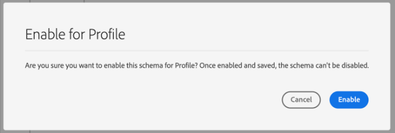

# Create a schema using the [!DNL Schema Editor]

In der Adobe Experience Platform-Benutzeroberfläche können Sie [!DNL Experience Data Model] (XDM)-Schemata in einer interaktiven visuellen Arbeitsfläche namens [!DNL Schema Editor] erstellen und verwalten. In diesem Tutorial wird beschrieben, wie Sie ein Schema mit [!DNL Schema Editor] erstellen.

>[!NOTE]
>
>Zu Demonstrationszwecken wird in diesem Tutorial ein Beispielschema erstellt, in dem die Mitglieder eines Kundentreueprogramms beschrieben werden. Sie können diese Schritte zwar verwenden, um ein anderes Schema für Ihre eigenen Zwecke zu erstellen, es wird jedoch empfohlen, zunächst das Beispielschema zu erstellen, um mehr über die Funktionen von [!DNL Schema Editor] zu erfahren.

Wenn Sie stattdessen ein Schema mit der [!DNL Schema Registry]-API erstellen möchten, lesen Sie zunächst das [[!DNL Schema Registry] Entwicklerhandbuch](../api/getting-started.md) , bevor Sie das Tutorial zum Erstellen eines Schemas mit der API](create-schema-api.md) durchführen.[

## Erste Schritte

Dieses Tutorial setzt ein Verständnis der verschiedenen Aspekte von Adobe Experience Platform voraus, die an der Schemaerstellung beteiligt sind. Bevor Sie mit diesem Tutorial beginnen, lesen Sie die Dokumentation für die folgenden Konzepte:

* [[!DNL Experience Data Model (XDM)]](../home.md): Das standardisierte Framework, mit dem [!DNL Platform] Kundenerlebnisdaten organisiert.
   * [Grundlagen der Schemakomposition](../schema/composition.md): Eine Übersicht über XDM-Schemas und ihre Bausteine, einschließlich Klassen, Schemafeldgruppen, Datentypen und einzelner Felder.
* [[!DNL Real-time Customer Profile]](../../profile/home.md): Bietet ein einheitliches Echtzeit-Kundenprofil, das auf aggregierten Daten aus verschiedenen Quellen basiert.

## Öffnen Sie den Arbeitsbereich [!UICONTROL Schemas] . {#browse}

Der Arbeitsbereich [!UICONTROL Schemas] in der [!DNL Platform]-Benutzeroberfläche bietet eine Visualisierung von [!DNL Schema Library], mit der Sie die für Ihr Unternehmen verfügbaren Schemata anzeigen können. Der Arbeitsbereich enthält auch die Arbeitsfläche [!DNL Schema Editor], auf der Sie in diesem Tutorial ein Schema erstellen können.

After logging into [!DNL Experience Platform], select **[!UICONTROL Schemas]** in the left navigation to open the **[!UICONTROL Schemas]** workspace. Die Registerkarte **[!UICONTROL Durchsuchen]** enthält eine Liste von Schemas (eine Darstellung von [!DNL Schema Library]), die Sie anzeigen und anpassen können. Die Liste umfasst den Namen, den Typ, die Klasse und das Verhalten (Datensatz oder Zeitreihen), auf denen das Schema basiert, sowie das Datum und die Uhrzeit der letzten Änderung des Schemas.

Weitere Informationen finden Sie im Handbuch zum [Erkunden vorhandener XDM-Ressourcen in der Benutzeroberfläche](../ui/explore.md) .

## Erstellen und Benennen eines Schemas {#create}

Um mit der Erstellung eines Schemas zu beginnen, wählen Sie **[!UICONTROL Schema]** in der oberen rechten Ecke des Arbeitsbereichs **[!UICONTROL Schemas]** aus. Es wird ein Dropdown-Menü angezeigt, in dem Sie zwischen den Kernklassen [!UICONTROL XDM Individual Profile] und [!UICONTROL XDM ExperienceEvent] wählen können. Wenn diese Klassen nicht Ihren Zwecken entsprechen, können Sie auch **[!UICONTROL Browse]** auswählen, um aus anderen verfügbaren Klassen auszuwählen, oder [eine neue Klasse](#create-new-class) erstellen.

Wählen Sie für diese Anleitung **[!UICONTROL XDM Individual Profile]** aus.

Da Sie eine standardmäßige XDM-Klasse ausgewählt haben, auf der das Schema basieren soll, wird das Dialogfeld **[!UICONTROL Feldergruppe hinzufügen]** angezeigt, über das Sie sofort mit dem Hinzufügen von Feldern zum Schema beginnen können. Wählen Sie zunächst **[!UICONTROL Abbrechen]** aus, um das Dialogfeld zu schließen.

[!DNL Schema Editor] wird angezeigt. Dies ist die Arbeitsfläche, auf der Sie Ihr Schema zusammenstellen. Ein unbenanntes Schema wird automatisch im Abschnitt **[!UICONTROL Struktur]** der Arbeitsfläche erstellt, wenn Sie im Editor ankommen, zusammen mit den Standardfeldern, die in allen Schemas enthalten sind, die auf dieser Klasse basieren. Die zugewiesene Klasse für das Schema wird auch unter **[!UICONTROL Klasse]** im Abschnitt **[!UICONTROL Komposition]** aufgeführt.

>[!NOTE]
>
> Sie können [die Klasse eines Schemas](#change-class) jederzeit während des anfänglichen Kompositionsprozesses ändern, bevor das Schema gespeichert wird. Dies sollte jedoch mit größter Vorsicht geschehen. Feldergruppen sind nur mit bestimmten Klassen kompatibel. Daher werden die Arbeitsfläche und alle von Ihnen hinzugefügten Felder durch Ändern der Klasse zurückgesetzt.

Verwenden Sie die Felder auf der rechten Seite des Editors, um einen Anzeigenamen und eine optionale Beschreibung für das Schema anzugeben. Sobald ein Name eingegeben wurde, wird die Arbeitsfläche aktualisiert und gibt den neuen Namen des Schemas wieder.

Bei der Entscheidung über einen Namen für Ihr Schema sind einige wichtige Aspekte zu beachten:

* Schemanamen sollten kurz und beschreibend sein, damit das Schema später leicht zu finden ist.
* Die Namen der Schemas müssen eindeutig sein, d. h. sie sollten so spezifisch sein, dass sie in Zukunft nicht wiederverwendet werden. Wenn Ihr Unternehmen z. B. über separate Loyalitätsprogramme für verschiedene Marken verfügt, wäre es ratsam, Ihr Schema mit „Loyalitätsmitglieder, Marke A“ zu benennen, damit Sie dieses leicht von anderen Loyalitätsschemas unterscheiden können, die Sie u. U. später definieren.
* Sie können die Schemabeschreibung auch verwenden, um zusätzliche kontextbezogene Informationen zum Schema bereitzustellen.

In diesem Tutorial wird ein Schema zum Erfassen von Daten zu Mitgliedern eines Treueprogramms zusammengestellt, weshalb das Schema &quot;Mitglieder des Treueprogramms&quot;heißt.

## Feldergruppe hinzufügen {#field-group}

Sie können nun mit dem Hinzufügen von Feldern zum Schema beginnen, indem Sie Feldergruppen hinzufügen. Eine Feldergruppe ist eine Gruppe aus einem oder mehreren Feldern, die häufig zusammen zur Beschreibung eines bestimmten Konzepts verwendet werden. In diesem Tutorial werden Feldgruppen verwendet, um die Mitglieder des Treueprogramms zu beschreiben und wichtige Informationen wie Name, Geburtstag, Telefonnummer, Adresse und mehr zu erfassen.

Um eine Feldergruppe hinzuzufügen, wählen Sie **[!UICONTROL Hinzufügen]** im Unterabschnitt **[!UICONTROL Feldergruppen]** aus.

Es wird ein neues Dialogfeld mit einer Liste der verfügbaren Feldergruppen angezeigt. Jede Feldergruppe ist nur für die Verwendung mit einer bestimmten Klasse vorgesehen. Daher listet das Dialogfeld nur Feldergruppen auf, die mit der von Ihnen ausgewählten Klasse kompatibel sind (in diesem Fall die Klasse [!DNL XDM Individual Profile] ). Wenn Sie eine Standard-XDM-Klasse verwenden, wird die Liste der Feldergruppen basierend auf der Nutzungspopularität intelligent sortiert.

Wenn Sie eine Feldergruppe aus der Liste auswählen, wird sie in der rechten Leiste angezeigt. Sie können bei Bedarf mehrere Feldergruppen auswählen und jede Feldergruppe zur Liste in der rechten Leiste hinzufügen, bevor Sie die Bestätigung vornehmen. Darüber hinaus wird rechts neben der aktuell ausgewählten Feldergruppe ein Symbol angezeigt, über das Sie die Struktur der darin enthaltenen Felder in der Vorschau anzeigen können.

Bei der Vorschau einer Feldergruppe wird in der rechten Leiste eine detaillierte Beschreibung des Schemas der Feldergruppe bereitgestellt. Sie können auch durch die Felder der Feldergruppe in der bereitgestellten Arbeitsfläche navigieren. Wenn Sie verschiedene Felder auswählen, wird die rechte Leiste aktualisiert, um Details zum betreffenden Feld anzuzeigen. Select **[!UICONTROL Back]** when you are finished previewing to return to the field group selection dialog.

For this tutorial, select the **[!UICONTROL Demographic Details]** field group, then select **[!UICONTROL Add field group]**.

Die Arbeitsfläche des Schemas wird wieder angezeigt. The **[!UICONTROL Field groups]** section now lists &quot;[!UICONTROL Demographic Details]&quot; and the **[!UICONTROL Structure]** section includes the fields contributed by the field group. You can select the field group&#39;s name under the **[!UICONTROL Field groups]** section to highlight the specific fields it provides within the canvas.

Diese Feldergruppe trägt mehrere Felder unter dem Namen der obersten Ebene `person` mit dem Datentyp &quot;[!UICONTROL Person]&quot;ein. Diese Gruppe von Feldern beschreibt Informationen zu einer Person, einschließlich Name, Geburtsdatum und Geschlecht.

>[!NOTE]
>
>Beachten Sie, dass Felder skalare Typen (z. B. Zeichenfolge, Ganzzahl, Array oder Datum) sowie beliebige Datentypen (eine Gruppe von Feldern, die ein gemeinsames Konzept darstellen) verwenden können, die in [!DNL Schema Registry] definiert sind.

Beachten Sie, dass das Feld `name` den Datentyp &quot;[!UICONTROL Personenname]&quot;hat, d. h., es beschreibt auch ein gemeinsames Konzept und enthält namensbezogene Unterfelder wie Vorname, Nachname, Höflichkeitstitel und Suffix.

Wählen Sie die verschiedenen Felder auf der Arbeitsfläche aus, um zusätzliche Felder anzuzeigen, die sie zur Schemastruktur beitragen.

## Hinzufügen einer weiteren Feldergruppe {#field-group-2}

Sie können nun dieselben Schritte wiederholen, um eine weitere Feldergruppe hinzuzufügen. Wenn Sie dieses Mal das Dialogfeld **[!UICONTROL Feldergruppe hinzufügen]** anzeigen, beachten Sie, dass die Feldergruppe &quot;[!UICONTROL Demografische Details]&quot;ausgegraut wurde und das Kontrollkästchen daneben nicht aktiviert werden kann. Dadurch wird verhindert, dass Sie versehentlich Feldgruppen duplizieren, die bereits im aktuellen Schema enthalten sind.

Wählen Sie für dieses Tutorial die Feldergruppe &quot;[!DNL Personal Contact Details]&quot;aus dem Dialogfeld und klicken Sie dann auf **[!UICONTROL Feldergruppe hinzufügen]** , um sie zum Schema hinzuzufügen.

Nach dem Hinzufügen wird die Arbeitsfläche wieder angezeigt. &quot;[!UICONTROL Persönliche Kontaktdetails]&quot;wird jetzt unter **[!UICONTROL Feldergruppen]** im Abschnitt **[!UICONTROL Zusammensetzung]** aufgelistet. Die Felder für Privatadresse, Mobiltelefon und mehr wurden unter **[!UICONTROL Struktur]** hinzugefügt.

Ähnlich wie beim Feld `name` stellen die soeben hinzugefügten Felder Konzepte für mehrere Felder dar. Beispielsweise hat `homeAddress` den Datentyp &quot;[!UICONTROL Postanschrift]&quot;und `mobilePhone` den Datentyp &quot;[!UICONTROL Telefonnummer]&quot;. Sie können jedes dieser Felder auswählen, um es zu erweitern und die zusätzlichen Felder anzuzeigen, die im Datentyp enthalten sind.

## Benutzerdefinierte Feldergruppe definieren {#define-field-group}

Das Schema &quot;[!UICONTROL Mitglieder des Treueprogramms]&quot;ist dazu gedacht, Daten zu den Mitgliedern eines Treueprogramms zu erfassen, sodass es einige spezifische loyalitätsbezogene Felder erfordert.

Es gibt eine standardmäßige Feldergruppe [!UICONTROL Details des Treueprogramms], die Sie zum Schema hinzufügen können, um allgemeine Felder im Zusammenhang mit einem Treueprogramm zu erfassen. Es wird dringend empfohlen, Standardfeldgruppen zur Darstellung von Konzepten zu verwenden, die von Ihren Schemas erfasst werden. Die Struktur der Standardfeldgruppe für das Treueprogramm kann jedoch möglicherweise nicht alle relevanten Daten für Ihr bestimmtes Treueprogramm erfassen. In diesem Szenario können Sie eine neue benutzerdefinierte Feldergruppe definieren, um diese Felder stattdessen zu erfassen.

Öffnen Sie das Dialogfeld **[!UICONTROL Feldergruppe hinzufügen]** erneut, aber wählen Sie dieses Mal **[!UICONTROL Neue Feldergruppe erstellen]** oben aus. Anschließend werden Sie aufgefordert, einen Anzeigenamen und eine Beschreibung für Ihre Feldergruppe anzugeben.

Wie bei Klassennamen sollte der Feldergruppenname kurz und einfach sein und beschreiben, was die Feldergruppe zum Schema beitragen wird. Auch diese sind eindeutig, sodass Sie den Namen nicht wiederverwenden können und daher sicherstellen müssen, dass er spezifisch genug ist.

Nennen Sie für dieses Tutorial die neue Feldergruppe &quot;Loyalitätsdetails&quot;.

Wählen Sie **[!UICONTROL Feldergruppe]** hinzufügen aus, um zum [!DNL Schema Editor] zurückzukehren. &quot;[!UICONTROL Loyalitätsdetails]&quot;sollte jetzt auf der linken Seite der Arbeitsfläche unter **[!UICONTROL Feldergruppen]** angezeigt werden. Es sind jedoch noch keine Felder damit verknüpft und daher werden keine neuen Felder unter **[!UICONTROL Struktur]** angezeigt.

## Felder zur Feldergruppe hinzufügen {#field-group-fields}

Nachdem Sie die Feldergruppe &quot;Loyalitätsdetails&quot;erstellt haben, ist es an der Zeit, die Felder zu definieren, die die Feldergruppe zum Schema beitragen wird.

Wählen Sie zunächst den Feldergruppennamen im Abschnitt **[!UICONTROL Feldergruppen]** aus. Danach werden die Eigenschaften der Feldergruppe auf der rechten Seite des Editors angezeigt und neben dem Namen des Schemas unter **[!UICONTROL Struktur]** wird ein **Plus-Symbol (+)** angezeigt.

Wählen Sie das Symbol **plus (+)** neben &quot;[!DNL Loyalty Members]&quot;aus, um einen neuen Knoten in der Struktur zu erstellen. Dieser Knoten (in diesem Beispiel `_tenantId` genannt) stellt die Mandanten-ID Ihrer IMS-Organisation dar, der ein Unterstrich vorangestellt ist. Das Vorhandensein der Mandanten-ID zeigt an, dass die Felder, die Sie hinzufügen, im Namensraum Ihres Unternehmens enthalten sind.

In other words, the fields you are adding are unique to your organization and are going to be saved in the [!DNL Schema Registry] in a specific area accessible only to your organization. Fields you define must always be added to your tenant namespace to prevent collisions with names from other standard classes, field groups, data types, and fields.

Inside that namespaced node is a &quot;[!UICONTROL New Field]&quot;. Dies ist der Anfang der Feldergruppe &quot;[!UICONTROL Loyalitätsdetails]&quot;.

Erstellen Sie mithilfe der Steuerelemente auf der rechten Seite des Editors ein `loyalty`-Feld mit dem Typ &quot;[!UICONTROL Objekt]&quot;, das für loyalitätsbezogene Felder verwendet wird. Wenn Sie fertig sind, wählen Sie **[!UICONTROL Apply]**.

Die Änderungen werden angewendet und das neu erstellte `loyalty`-Objekt wird angezeigt. Klicken Sie auf das Symbol **plus (+)** neben dem Objekt, um weitere loyalitätsbezogene Felder hinzuzufügen. Ein &quot;[!UICONTROL Neues Feld]&quot;wird angezeigt und der Abschnitt **[!UICONTROL Feldeigenschaften]** ist auf der rechten Seite der Arbeitsfläche sichtbar.

Für jedes Feld sind die folgenden Informationen erforderlich:

* **[!UICONTROL Feldname]:** Der Name des Felds, in Binnenmajuskel-Schreibweise geschrieben. Beispiel: LoyalitätsStufe
* **[!UICONTROL Anzeigename]:** Der Name des Felds, in Titelschreibweise geschrieben. Beispiel: Loyalitäts-Stufe
* **[!UICONTROL Typ]:** Der Datentyp des Felds. Dazu gehören grundlegende Skalartypen und alle Datentypen, die in [!DNL Schema Registry] definiert sind. Beispiele: [!UICONTROL String], [!UICONTROL Integer], [!UICONTROL Boolesch], [!UICONTROL Person], [!UICONTROL Adresse], [!UICONTROL Telefonnummer] usw.
* **[!UICONTROL Beschreibung]:** Eine optionale Beschreibung des Felds sollte in Satzschreibweise mit maximal 200 Zeichen eingefügt werden.

Das erste Feld für das `Loyalty`-Objekt ist eine Zeichenfolge namens `loyaltyId`. Wenn Sie den Typ des neuen Felds auf &quot;[!UICONTROL String]&quot;festlegen, werden im Abschnitt **[!UICONTROL Feldeigenschaften]** mehrere Optionen zum Anwenden von Einschränkungen angezeigt, darunter Standardwert, Format und maximale Länge.

Je nach ausgewähltem Datentyp stehen verschiedene Einschränkungsoptionen zur Verfügung. Da `loyaltyId` eine E-Mail-Adresse sein wird, wählen Sie &quot;[!UICONTROL email]&quot;aus dem Dropdown-Menü **[!UICONTROL Format]**. Wählen Sie **[!UICONTROL Übernehmen]**, um Ihre Änderungen anzuwenden.

## Hinzufügen weiterer Felder zur Feldergruppe {#field-group-fields-2}

Nachdem Sie jetzt das Feld `loyaltyId` hinzugefügt haben, können Sie zusätzliche Felder hinzufügen, um loyalitätsbezogene Informationen zu erfassen, z. B.:

* Punkte (Ganzzahl)
* Mitglied seit (Datum)

Um jedes Feld zum Schema hinzuzufügen, wählen Sie das Symbol **plus (+)** neben dem Objekt `loyalty` aus und geben Sie die erforderlichen Informationen ein.

Nach Abschluss des Vorgangs enthält das Loyalitätsobjekt Felder für die Treueprogramm-ID, Punkte und Mitglied-seit.

## Hinzufügen eines Enum-Felds zur Feldergruppe {#enum}

Beim Definieren von Feldern in [!DNL Schema Editor] gibt es einige zusätzliche Optionen, die Sie auf grundlegende Feldtypen anwenden können, um weitere Einschränkungen für die Daten bereitzustellen, die das Feld enthalten kann. Die Anwendungsfälle für diese Einschränkungen werden in der folgenden Tabelle erläutert:

| Einschränkung | Beschreibung |
| --- | --- |
| [!UICONTROL Erforderlich] | Gibt an, dass das Feld für die Datenerfassung erforderlich ist. Daten, die auf Grundlage dieses Schemas in einen Datensatz hochgeladen wurden und dieses Feld nicht enthalten, schlagen bei der Aufnahme fehl. |
| [!UICONTROL Array] | Gibt an, dass das Feld ein Array von Werten mit jeweils dem angegebenen Datentyp enthält. Wenn Sie diese Einschränkung beispielsweise für ein Feld mit dem Datentyp &quot;[!UICONTROL String]&quot;verwenden, wird angegeben, dass das Feld ein Zeichenfolgen-Array enthalten wird. |
| [!UICONTROL Enum] | Gibt an, dass dieses Feld einen der Werte aus einer nummerierten Liste möglicher Werte enthalten muss. |
| [!UICONTROL Identität] | Gibt an, dass dieses Feld ein Identitätsfeld ist. Weitere Informationen zu Identitätsfeldern finden Sie [weiter unten in diesem Tutorial](#identity-field). |
| [!UICONTROL Beziehung] | Während Schemabeziehungen durch die Verwendung des Vereinigungsschemas und [!DNL Real-time Customer Profile] abgeleitet werden können, gilt dies nur für Schemas, die dieselbe Klasse aufweisen. Die [!UICONTROL Relationship]-Beschränkung gibt an, dass dieses Feld auf die primäre Identität eines Schemas verweist, das auf einer anderen Klasse basiert, was eine Beziehung zwischen den beiden Schemas impliziert. Weitere Informationen finden Sie im Tutorial zu [Definieren einer Beziehung](./relationship-ui.md) . |

{style=&quot;table-layout:auto&quot;}

>[!NOTE]
>
>Alle erforderlichen, Identitäts- oder Beziehungsfelder werden in der linken Leiste angezeigt, sodass Sie diese Felder unabhängig von der Komplexität des Schemas leicht finden können.
>
>

Für dieses Tutorial erfordert das [!DNL "loyalty"]-Objekt im Schema ein neues Enum-Feld, das die &quot;Treuestufe&quot;eines Kunden beschreibt, wobei der Wert nur eine von vier möglichen Optionen sein kann. Um dieses Feld zum Schema hinzuzufügen, wählen Sie das Symbol **plus (+)** neben dem Objekt `loyalty` aus und füllen Sie die erforderlichen Felder für **[!UICONTROL Feldname]** und **[!UICONTROL Anzeigename]** aus. Wählen Sie für **[!UICONTROL Typ]** &quot;[!UICONTROL String]&quot;.

Zusätzliche Kontrollkästchen werden für das Feld angezeigt, nachdem der Typ ausgewählt wurde, einschließlich der Kontrollkästchen für **[!UICONTROL Array]**, **[!UICONTROL Enum]** und **[!UICONTROL Identität]**.

Aktivieren Sie das Kontrollkästchen **[!UICONTROL Enum]** , um den Abschnitt **[!UICONTROL Enum values]** unten zu öffnen. Hier können Sie für jede akzeptable Loyalitätsstufe den **[!UICONTROL Wert]** (in Binnenmajuskel-Schreibweise) und die **[!UICONTROL Bezeichnung]** (einen optionalen, leserfreundlichen Namen in der Titelschreibweise) eingeben.

Wenn Sie alle Feldeigenschaften abgeschlossen haben, wählen Sie **[!UICONTROL Anwenden]** aus, um das Feld &quot;[!DNL loyaltyLevel]&quot;zum `loyalty`-Objekt hinzuzufügen.

## Konvertieren eines Objekts mit mehreren Feldern in einen Datentyp {#datatype}

The `loyalty` object now contains several loyalty-specific fields, and represents a common data structure that could be useful in other schemas. Mit dem [!DNL Schema Editor] können Sie wiederverwendbare Objekte mit mehreren Feldern einfach anwenden, indem Sie die Struktur dieser Objekte in Datentypen konvertieren.

Datentypen ermöglichen die konsistente Verwendung von Strukturen mit mehreren Feldern und bieten mehr Flexibilität als eine Feldergruppe, da sie überall in einem Schema verwendet werden können. Dazu legen Sie den Wert **[!UICONTROL Typ]** des Felds auf den Wert eines Datentyps fest, der in [!DNL Schema Registry] definiert ist.

Um das `loyalty`-Objekt in einen Datentyp zu konvertieren, wählen Sie das Feld `loyalty` unter **[!UICONTROL Struktur]** aus und wählen Sie dann **[!UICONTROL In neuen Datentyp konvertieren]** auf der rechten Seite des Editors unter **[!UICONTROL Feldeigenschaften]** aus. Es wird ein grünes Popup angezeigt, in dem bestätigt wird, dass das Objekt erfolgreich konvertiert wurde.

Wenn Sie nun unter **[!UICONTROL Struktur]** nachsehen, können Sie sehen, dass das `loyalty`-Feld den Datentyp &quot;[!DNL Loyalty]&quot;hat und die Felder über kleine Sperrsymbole verfügen, die darauf hinweisen, dass es sich nicht mehr um einzelne Felder, sondern um Bereiche mit mehreren Feldern handelt.

In einem zukünftigen Schema könnten Sie nun ein Feld als &quot;[!DNL Loyalty]&quot;-Typ zuweisen. Es würde automatisch Felder für ID, Treuestufe, Mitglied seit und Punkte enthalten.

>[!NOTE]
>
>Sie können benutzerdefinierte Datentypen auch unabhängig von der Bearbeitung von Schemata erstellen und bearbeiten. Weitere Informationen finden Sie im Handbuch zu [Erstellen und Bearbeiten von Datentypen](../ui/resources/data-types.md) .

## Suchen und Filtern von Schemafeldern

Ihr Schema enthält jetzt zusätzlich zu den von der Basisklasse bereitgestellten Feldern mehrere Feldergruppen. Wenn Sie mit größeren Schemas arbeiten, können Sie die Kontrollkästchen neben den Feldergruppennamen in der linken Leiste auswählen, um die angezeigten Felder nur nach den Feldern zu filtern, die von den gewünschten Feldergruppen bereitgestellt werden.

Wenn Sie nach einem bestimmten Feld in Ihrem Schema suchen, können Sie die Suchleiste auch verwenden, um die angezeigten Felder nach Namen zu filtern, unabhängig davon, unter welcher Feldergruppe sie bereitgestellt werden.

>[!IMPORTANT]
>
>Die Suchfunktion berücksichtigt alle ausgewählten Feldgruppenfilter bei der Anzeige übereinstimmender Felder. Wenn in einer Suchabfrage nicht die erwarteten Ergebnisse angezeigt werden, müssen Sie möglicherweise überprüfen, ob Sie keine relevanten Feldergruppen herausfiltern.

## Festlegen eines Schemafelds als Identitätsfeld {#identity-field}

Die Standarddatenstruktur, die Schemas bereitstellen, kann genutzt werden, um Daten zu identifizieren, die zu derselben Person gehören, und zwar aus mehreren Quellen. Dies ermöglicht verschiedene nachgelagerte Anwendungsfälle wie Segmentierung, Berichterstellung, Datenwissenschaftsanalyse und mehr. Um Daten basierend auf individuellen Identitäten zuzuordnen, müssen Schlüsselfelder in den entsprechenden Schemata als Felder [!UICONTROL Identität] markiert werden.

[!DNL Experience Platform] erleichtert die Kennzeichnung eines Identitätsfelds durch die Verwendung eines  **** Identitäts-Kontrollkästchens in der  [!DNL Schema Editor]. Basierend auf der Art Ihrer Daten müssen Sie jedoch festlegen, welches Feld als Identität am besten geeignet ist.

So kann es beispielsweise Tausende von Mitgliedern des Treueprogramms geben, die derselben &quot;Treuestufe&quot;angehören, aber jedes Mitglied des Treueprogramms verfügt über ein eindeutiges `loyaltyId` (in diesem Fall ist dies die E-Mail-Adresse des jeweiligen Mitglieds). Die Tatsache, dass `loyaltyId` eine eindeutige Kennung für jedes Mitglied ist, macht sie zu einem guten Kandidaten für ein Identitätsfeld, während `loyaltyLevel` dies nicht tut.

>[!IMPORTANT]
>
>Die folgenden Schritte beschreiben, wie Sie einem vorhandenen Schemafeld einen Identitätsdeskriptor hinzufügen. Alternativ zur Definition von Identitätsfeldern innerhalb der Struktur des Schemas selbst können Sie auch ein `identityMap` -Feld verwenden, das stattdessen Identitätsdaten enthält.
>
>Wenn Sie `identityMap` verwenden möchten, beachten Sie, dass dadurch alle primären Identitäten außer Kraft gesetzt werden, die Sie direkt zum Schema hinzufügen. Weitere Informationen finden Sie im Abschnitt zu `identityMap` im Handbuch [Grundlagen der Schemakomposition](../schema/composition.md#identityMap) .

Wählen Sie im Abschnitt **[!UICONTROL Struktur]** des Editors das Feld `loyaltyId` aus und das Kontrollkästchen **[!UICONTROL Identität]** wird unter **[!UICONTROL Feldeigenschaften]** angezeigt. Aktivieren Sie das Kontrollkästchen und die Option, um dies als **[!UICONTROL Primäre Identität]** festzulegen, wird angezeigt. Wählen Sie auch dieses Feld aus.

>[!NOTE]
>
>Jedes Schema darf nur ein primäres Identitätsfeld enthalten. Nachdem ein Schemafeld als primäre Identität festgelegt wurde, erhalten Sie eine Fehlermeldung, wenn Sie später versuchen, ein anderes Identitätsfeld im Schema als primäres Feld festzulegen.

Als Nächstes müssen Sie einen **[!UICONTROL Identitäts-Namespace]** aus der Liste der vordefinierten Namespaces im Dropdown-Menü angeben. Da `loyaltyId` die E-Mail-Adresse des Kunden ist, wählen Sie &quot;[!UICONTROL Email]&quot;aus der Dropdown-Liste aus. Wählen Sie **[!UICONTROL Anwenden]** aus, um die Aktualisierungen für das Feld `loyaltyId` zu bestätigen.

>[!NOTE]
>
>Eine Liste der Standard-Namespaces und ihrer Definitionen finden Sie in der [[!DNL Identity Service] Dokumentation](../../identity-service/troubleshooting-guide.md#standard-namespaces).

Nach dem Anwenden der Änderung zeigt das Symbol für `loyaltyId` ein Fingerabdrucksymbol an, das angibt, dass es sich jetzt um ein Identitätsfeld handelt.

Jetzt werden alle Daten, die in das Feld `loyaltyId` aufgenommen werden, verwendet, um diese Person zu identifizieren und eine einzige Ansicht dieses Kunden zuzuordnen. Weitere Informationen zum Arbeiten mit Identitäten in [!DNL Experience Platform] finden Sie in der [[!DNL Identity Service]](../../identity-service/home.md) -Dokumentation.

## Enable the schema for use in [!DNL Real-time Customer Profile] {#profile}

[[!DNL Real-time Customer Profile]](../../profile/home.md) nutzt Identitätsdaten in ,  [!DNL Experience Platform] um eine ganzheitliche Sicht auf jeden einzelnen Kunden zu ermöglichen. Der Dienst erstellt robuste 360°-Profile mit Kundenattributen sowie mit Zeitstempel versehene Konten für jede Interaktion, die Kunden über ein mit [!DNL Experience Platform] integriertes System hatten.

Damit ein Schema zur Verwendung mit [!DNL Real-time Customer Profile] aktiviert werden kann, muss eine primäre Identität definiert sein. Sie erhalten eine Fehlermeldung, wenn Sie versuchen, ein Schema zu aktivieren, ohne zuvor eine primäre Identität zu definieren.

 

Um das Schema &quot;Mitglieder des Treueprogramms&quot;für die Verwendung in [!DNL Profile] zu aktivieren, wählen Sie zunächst &quot;[!DNL Loyalty Members]&quot;im Abschnitt **[!UICONTROL Struktur]** des Editors aus.

Auf der rechten Seite des Editors werden Informationen zum Schema angezeigt, einschließlich Anzeigename, Beschreibung und Typ. Zusätzlich zu diesen Informationen gibt es eine **[!UICONTROL Profil]** -Umschalter-Schaltfläche.

Wählen Sie **[!UICONTROL Profil]** und ein Popup wird angezeigt, in dem Sie aufgefordert werden zu bestätigen, dass Sie das Schema für [!DNL Profile] aktivieren möchten.

 

>[!WARNING]
>
>Nachdem ein Schema für [!DNL Real-time Customer Profile] aktiviert und gespeichert wurde, kann es nicht mehr deaktiviert werden.

Wählen Sie **[!UICONTROL Aktivieren]** aus, um Ihre Auswahl zu bestätigen. Sie können den Umschalter **[!UICONTROL Profil]** erneut auswählen, um das Schema zu deaktivieren, wenn Sie möchten. Sobald das Schema jedoch gespeichert wurde, während [!DNL Profile] aktiviert ist, kann es nicht mehr deaktiviert werden.

## Nächste Schritte und zusätzliche Ressourcen

Nachdem Sie das Schema fertig gestellt haben, können Sie das vollständige Schema auf der Arbeitsfläche sehen. Wählen Sie **[!UICONTROL Save]** aus und das Schema wird im Ordner [!DNL Schema Library] gespeichert, sodass es über [!DNL Schema Registry] zugänglich ist.

Ihr neues Schema kann jetzt zur Aufnahme von Daten in [!DNL Platform] verwendet werden. Denken Sie daran, dass nach Verwendung des Schemas zur Datenaufnahme nur noch Ergänzungen vorgenommen werden können. Weitere Informationen zur Schemaversionierung finden Sie in den [Grundlagen der Schema-Komposition](../schema/composition.md).

Sie können nun dem Tutorial [Definieren einer Schemabeziehung in der Benutzeroberfläche](./relationship-ui.md) folgen, um dem Schema &quot;Mitglieder des Treueprogramms&quot;ein neues Beziehungsfeld hinzuzufügen.

Das Schema &quot;Mitglieder des Treueprogramms&quot;kann auch mithilfe der API [!DNL Schema Registry] angezeigt und verwaltet werden. Um mit der API zu arbeiten, lesen Sie zunächst das [[!DNL Schema Registry API] Entwicklerhandbuch](../api/getting-started.md).

### Videoressourcen

>[!WARNING]
>
>Die in den folgenden Videos angezeigte [!DNL Platform] Benutzeroberfläche ist veraltet. In der obigen Dokumentation finden Sie die neuesten Screenshots und Funktionen der Benutzeroberfläche.

Das folgende Video zeigt, wie ein einfaches Schema in der [!DNL Platform] -Benutzeroberfläche erstellt wird.

>[!VIDEO](https://video.tv.adobe.com/v/27012?quality=12&learn=on)

Das folgende Video soll Ihr Verständnis für die Arbeit mit Feldergruppen und Klassen verbessern.

>[!VIDEO](https://video.tv.adobe.com/v/27013?quality=12&learn=on)

## Anhang

Die folgenden Abschnitte enthalten zusätzliche Informationen zur Verwendung von [!DNL Schema Editor].

### Neue Klasse erstellen {#create-new-class}

[!DNL Experience Platform] bietet die Flexibilität, ein Schema auf der Grundlage einer Klasse zu definieren, die eindeutig für Ihr Unternehmen ist. Informationen zum Erstellen einer neuen Klasse finden Sie im Handbuch zum Erstellen und Bearbeiten von Klassen in der Benutzeroberfläche](../ui/resources/classes.md#create).[

### Klasse eines Schemas ändern {#change-class}

Sie können die Klasse eines Schemas jederzeit während des anfänglichen Kompositionsprozesses ändern, bevor das Schema gespeichert wurde.

>[!WARNING]
>
>Die Neuzuweisung der Klasse für ein Schema sollte mit äußerster Vorsicht erfolgen. Feldergruppen sind nur mit bestimmten Klassen kompatibel. Daher werden die Arbeitsfläche und alle von Ihnen hinzugefügten Felder durch Ändern der Klasse zurückgesetzt.

To learn how to change the class of a schema, see the guide on [managing schemas in the UI](../ui/resources/schemas.md).
