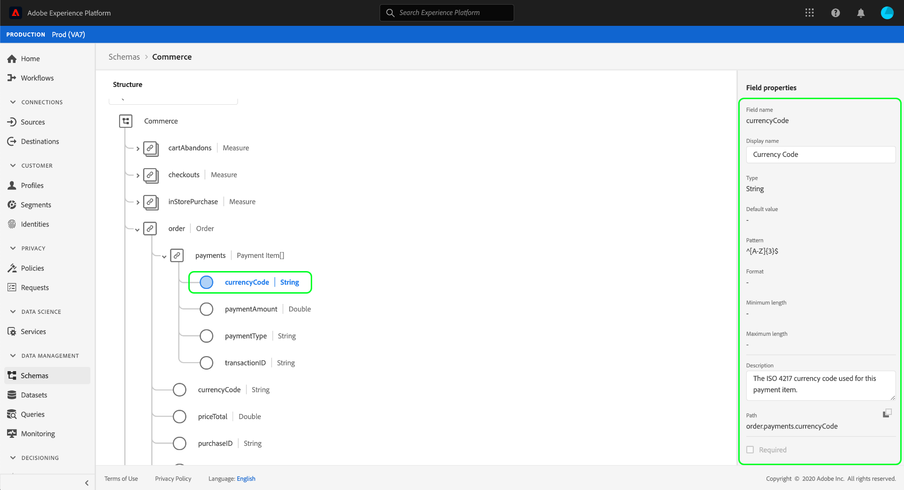

# XDM-Ressourcen in der Benutzeroberfläche

In Adobe Experience Platform werden alle XDM-Ressourcen (Experience Data Model) im Ordner gespeichert, [!DNL Schema Library]einschließlich Standardressourcen, die von Ihrer Adobe bereitgestellt werden, und benutzerdefinierte Ressourcen, die von Ihrem Unternehmen definiert werden. In der Benutzeroberfläche &quot;Experience Platform&quot;können Sie die Struktur und die Felder eines vorhandenen Schemas, einer vorhandenen Klasse, eines Mixins oder eines Datentyps im [!DNL Schema Library]Element Ansicht werden. Dies ist besonders bei der Planung und Vorbereitung der Datenerfassung nützlich, da die Benutzeroberfläche Informationen zu den erwarteten Datentypen und Anwendungsfällen der einzelnen Felder bereitstellt, die von diesen XDM-Ressourcen bereitgestellt werden.

Dieses Lernprogramm beschreibt die Schritte zum Erforschen vorhandener Schema, Klassen, Mixins und Datentypen in der Benutzeroberfläche der Experience Platform.

## XDM-Ressource suchen {#lookup}

In the Platform UI, select **[!UICONTROL Schemas]** in the left navigation. Der Arbeitsbereich [!UICONTROL Schemas] enthält eine Registerkarte &quot; **[!UICONTROL Durchsuchen]** &quot;, auf der Sie alle vorhandenen XDM-Ressourcen in Ihrem Unternehmen untersuchen können. Außerdem stehen zusätzliche Registerkarten zur Verfügung, auf denen Sie speziell **[!UICONTROL Klassen]**, **[!UICONTROL Mixins]** und **[!UICONTROL Datentypen]** erkunden können.

Auf der Registerkarte &quot; [!UICONTROL Durchsuchen] &quot;können Sie das Filtersymbol () verwenden, um Steuerelemente in der linken Leiste anzuzeigen, um die aufgelisteten Ergebnisse einzuschränken.

Um beispielsweise die Liste so zu filtern, dass nur die von der Adobe bereitgestellten Standarddatentypen angezeigt werden, wählen Sie unter den Abschnitten &quot; **[!UICONTROL Typ]** &quot;und &quot; **[!UICONTROL Inhaber]** &quot;die Option &quot;Datentyp **[!UICONTROL &quot;bzw. &quot;]** Adobe **** &quot;aus.

Mit dem Umschalter &quot; **[!UICONTROL Im Profil]** eingeschlossen&quot;können Sie die Ergebnisse filtern, um nur die Ressourcen anzuzeigen, die in Schemas verwendet werden, die für die Verwendung im [Echtzeit-Kunden-Profil](../../profile/home.md)aktiviert wurden.

Sie können die Suchleiste auch verwenden, um die Ergebnisse auf Ressourcen zu beschränken, deren Namen mit der Abfrage übereinstimmen.

Wenn Sie die Ressource gefunden haben, die Sie untersuchen möchten, wählen Sie deren Namen aus der Liste aus, um die Struktur auf der Arbeitsfläche Ansicht.

## XDM-Ressource auf der Arbeitsfläche {#explore}

Nachdem Sie eine Ressource ausgewählt haben, wird ihre Struktur in der Arbeitsfläche geöffnet.

Alle Objekttypfelder, die Untereigenschaften enthalten, werden standardmäßig ausgeblendet, wenn sie zum ersten Mal auf der Arbeitsfläche angezeigt werden. Um die Untereigenschaften eines Felds anzuzeigen, wählen Sie das Symbol neben dem Namen aus.

### Systemgenerierte Felder {#system-fields}

Einige Schema-Felder haben einen Unterstrich, z. B. `_repo` und `_id`. Diese stellen Platzhalter für Felder dar, die das System automatisch generiert und zuweist, wenn Daten erfasst werden.

Daher sollten die meisten dieser Felder bei der Eingabe in die Plattform von der Struktur Ihrer Daten ausgeschlossen werden, wobei die wichtigste Ausnahme das `_{TENANT_ID}` Feld ist, unter dem alle im Unternehmen erstellten XDM-Felder benannt werden müssen.

### Datentypen {#data-types}

Für jedes auf der Arbeitsfläche angezeigte Feld wird der zugehörige Datentyp neben dem Namen angezeigt, der auf einen Blick den Datentyp angibt, den das Feld für die Erfassung erwartet.

Jeder Datentyp, der mit eckigen Klammern (`[]`) angehängt wird, stellt ein Array dieses bestimmten Datentyps dar. Ein Datentyp von **[!UICONTROL String]\[]** gibt beispielsweise an, dass das Feld ein Array von Zeichenfolgenwerten erwartet. Ein Datentyp von **[!UICONTROL Zahlungselement]\[]** gibt ein Array von Objekten an, die dem [!UICONTROL Zahlungselement] -Datentyp entsprechen.

Wenn ein Array-Feld auf einem Objekttyp basiert, können Sie das zugehörige Symbol auf der Arbeitsfläche auswählen, um die erwarteten Attribute für jedes Array-Element anzuzeigen.

### [!UICONTROL Feldeigenschaften] {#field-properties}

Wenn Sie den Namen eines Felds auf der Arbeitsfläche auswählen, wird die rechte Leiste aktualisiert, um Details zu diesem Feld unter den **[!UICONTROL Feldeigenschaften]** anzuzeigen. Dies kann eine Beschreibung der Verwendungsart des Felds, Standardwerte, Muster, Formate, unabhängig davon, ob das Feld erforderlich ist oder nicht, usw. umfassen.

Wenn das geprüfte Feld ein Enum-Feld ist, zeigt die rechte Leiste auch die akzeptablen Werte an, die das Feld erwartet.

### Identitätsfelder {#identity}

Beim Prüfen von Schemas, die Identitätsfelder enthalten, werden diese Felder auf der Arbeitsfläche mit einem Fingerabdruck-Symbol () markiert. Wenn Sie den Namen des Identitätsfelds auswählen, können Sie zusätzliche Informationen wie den [Identitätsnamen](../../identity-service/namespaces.md) und die Angabe, ob das Feld die primäre Identität des Schemas ist, Ansicht geben.

### Beziehungsfelder {#relationship}

Die Beziehungsfelder werden auch auf der Arbeitsfläche eindeutig hervorgehoben und zeigen den Namen des Schemas an, auf das das Feld verweist. Wenn Sie den Namen des Beziehungsfelds auswählen, können Sie den Identitäts-Namensraum der primären Identität des Schemas Ansicht haben.

>[!NOTE]
>
>Weitere Informationen zur Verwendung von Beziehungen in XDM-Schemas finden Sie im Lernprogramm zum [Erstellen einer Beziehung in der Benutzeroberfläche](./create-schema-ui.md) .

## Nächste Schritte

In diesem Dokument wurde beschrieben, wie Sie vorhandene XDM-Ressourcen in der Benutzeroberfläche der Experience Platform untersuchen. Weitere Informationen zu den verschiedenen Funktionen des Arbeitsbereichs [!UICONTROL Schemas] und [!DNL Schema Editor]Informationen finden Sie im Lernprogramm zur Erstellung von [Schemas](./create-schema-ui.md).