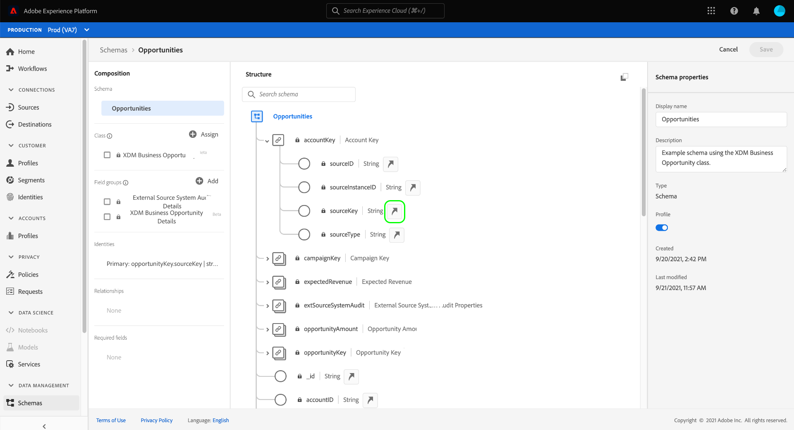
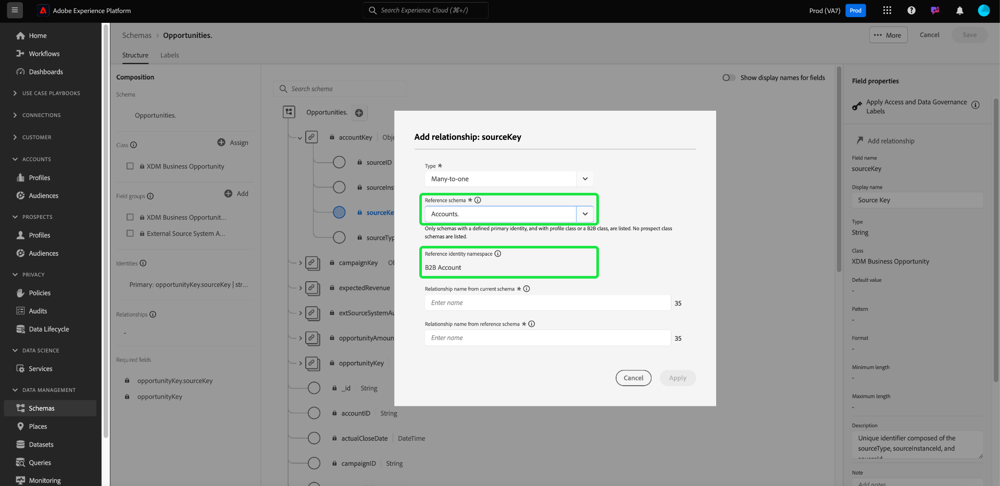

# Definieren einer n:1-Zuordnung zwischen zwei Schemata in der Real-time Customer Data Platform B2B Edition {#relationship-b2b}

>[!CONTEXTUALHELP]
>id="platform_xdm_b2b_reference_schema"
>title="Referenzschema"
>abstract="Wählen Sie das Schema aus, mit dem Sie eine Beziehung herstellen möchten. Abhängig von der Klasse des Schemas kann dieses auch vorhandene Beziehungen zu anderen Entitäten im B2B-Kontext besitzen. In der Dokumentation erfahren Sie, wie B2B-Schemaklassen miteinander in Beziehung stehen."

Adobe Real-time Customer Data Platform B2B Edition bietet mehrere Experience-Datenmodell (XDM)-Klassen, die grundlegende B2B-Datenentitäten erfassen, darunter auch [Konten](../classes/b2b/business-account.md), [Gelegenheiten](../classes/b2b/business-opportunity.md), [Kampagnen](../classes/b2b/business-campaign.md)und mehr. Indem Sie Schemas erstellen, die auf diesen Klassen basieren, und sie zur Verwendung in [Echtzeit-Kundenprofil](../../profile/home.md)können Sie Daten aus unterschiedlichen Quellen in einer einheitlichen Darstellung zusammenführen, die als Vereinigungsschema bezeichnet wird.

Vereinigungsschemata dürfen jedoch nur Felder enthalten, die von Schemas erfasst werden, die dieselbe Klasse verwenden. Hier kommen die Schemabeziehungen an. Durch die Implementierung von Beziehungen in Ihre B2B-Schemas können Sie beschreiben, wie sich diese Geschäftsentitäten gegenseitig beeinflussen, und Attribute aus mehreren Klassen in Anwendungsfällen für nachgelagerte Segmentierung einbeziehen.

Das folgende Diagramm zeigt ein Beispiel dafür, wie die verschiedenen B2B-Klassen in einer Basisimplementierung miteinander in Beziehung stehen können:

In diesem Tutorial werden die Schritte zum Definieren einer 1:1-Beziehung zwischen zwei Schemas in Real-Time CDP B2B Edition beschrieben.

>[!NOTE]
>
>Wenn Sie Real-time Customer Data Platform B2B Edition nicht verwenden oder eine Eins-zu-Eins-Beziehung erstellen möchten, lesen Sie das Handbuch unter [Erstellen einer Eins-zu-Eins-Beziehung](./relationship-ui.md) anstatt.
>
>In diesem Tutorial wird beschrieben, wie Sie in der Platform-Benutzeroberfläche manuell Beziehungen zwischen B2B-Schemas herstellen. Wenn Sie Daten aus einer B2B-Quellverbindung einbringen, können Sie stattdessen ein Dienstprogramm zur automatischen Generierung verwenden, um die erforderlichen Schemas, Identitäten und Beziehungen zu erstellen. Weitere Informationen zu B2B-Namespaces und -Schemata finden Sie in der Quelldokumentation zu B2B-Namespaces . [mit dem Dienstprogramm zur automatischen Erzeugung](../../sources/connectors/adobe-applications/marketo/marketo-namespaces.md).

## Erste Schritte

Dieses Tutorial setzt ein grundlegendes Verständnis von [!DNL XDM System] und dem Schema-Editor im [!DNL Experience Platform] Benutzeroberfläche. Bevor Sie mit dem Tutorial beginnen, lesen Sie die folgenden Dokumente:

* [XDM-System in Experience Platform](../home.md): Eine Übersicht über XDM und dessen Implementierung in [!DNL Experience Platform].
* [Grundlagen der Schemakomposition](../schema/composition.md): Eine Einführung in die Bausteine von XDM-Schemas.
* [Erstellen Sie ein Schema mit dem [!DNL Schema Editor]](create-schema-ui.md): Ein Tutorial, das die Grundlagen zum Erstellen und Bearbeiten von Schemas in der Benutzeroberfläche behandelt.

## Quell- und Referenzschema definieren

Wir gehen davon aus, dass Sie die beiden Schemas, die in der Beziehung definiert werden sollen, bereits erstellt haben. Zu Demonstrationszwecken wird in diesem Tutorial eine Beziehung zwischen Geschäftschancen (definiert in einem[!DNL Opportunities]&quot;-Schema) und dem zugehörigen Geschäftskonto (definiert in einem &quot;[!DNL Accounts]&quot; schema).

Schemabeziehungen werden durch ein dediziertes Feld in einer **Quellschema** , das auf das primäre Identitätsfeld eines **Referenzschema**. In den folgenden Schritten: &quot;[!DNL Opportunities]&quot; dient als Quellschema, während &quot;[!DNL Accounts]&quot; dient als Referenzschema.

### Grundlegendes über Identitäten in B2B-Beziehungen

>[!CONTEXTUALHELP]
>id="platform_xdm_b2b_identity_namespace"
>title="Referenz-Identity-Namespace"
>abstract="Der Namespace (Typ) für das primäre Identitätsfeld des Referenzschemas. Das Referenzschema muss über ein festgelegtes primäres Identitätsfeld verfügen, um Teil einer Beziehung sein zu können. Weitere Informationen zu Identitäten in B2B-Beziehungen finden Sie in der Dokumentation."

Um eine Beziehung herzustellen, muss das Referenzschema über eine definierte primäre Identität verfügen. Beachten Sie beim Festlegen einer primären Identität für eine B2B-Entität, dass sich die Zeichenfolgen-basierten Entitäts-IDs überschneiden können, wenn Sie sie über verschiedene Systeme oder Standorte hinweg erfassen. Dies könnte zu Datenkonflikten in Platform führen.

Dazu enthalten alle standardmäßigen B2B-Klassen &quot;key&quot;-Felder, die dem [[!UICONTROL B2B-Quelle] Datentyp](../data-types/b2b-source.md). Dieser Datentyp stellt Felder für eine Zeichenfolgenkennung für die B2B-Entität zusammen mit anderen Kontextinformationen zur Quelle der Kennung bereit. Eines dieser Felder, `sourceKey`verkettet die Werte der anderen Felder im Datentyp, um eine vollständig eindeutige Kennung für die Entität zu erhalten. Dieses Feld sollte immer als primäre Identität für B2B-Entitätsschemas verwendet werden.

>[!NOTE]
>
>Wann [Festlegen eines XDM-Felds als Identität](../ui/fields/identity.md)müssen Sie einen Identitäts-Namespace bereitstellen, unter dem die Identität definiert wird. Dabei kann es sich um einen Standard-Namespace handeln, der von Adobe bereitgestellt wird, oder um einen benutzerdefinierten Namespace, der von Ihrem Unternehmen definiert wird. In der Praxis ist der Namespace lediglich eine kontextbezogene Zeichenfolge und kann auf einen beliebigen Wert festgelegt werden, vorausgesetzt, er ist für Ihre Organisation für die Kategorisierung des Identitätstyps sinnvoll. Siehe Übersicht unter [Identitäts-Namespaces](../../identity-service/features/namespaces.md) für weitere Informationen.

Zu Referenzzwecken wird in den folgenden Abschnitten die Struktur der einzelnen Schemas beschrieben, die in diesem Tutorial vor der Definition einer Beziehung verwendet werden. Beachten Sie, wo die primären Identitäten in der Schemastruktur und in den von ihnen verwendeten benutzerdefinierten Namespaces definiert wurden.

### [!DNL Opportunities] schema

Das Quellschema &quot;[!DNL Opportunities]&quot; basiert auf der Variablen [!UICONTROL XDM-Geschäftschancen] -Klasse. Eines der von der Klasse bereitgestellten Felder, `opportunityKey`dient als Kennung für das Schema. Insbesondere wird die `sourceKey` Feld unter `opportunityKey` -Objekt wird als primäre Identität des Schemas unter einem benutzerdefinierten Namespace mit dem Namen [!DNL B2B Opportunity].

Siehe unter **[!UICONTROL Schemaeigenschaften]** wurde dieses Schema zur Verwendung in [!DNL Real-Time Customer Profile].

### [!DNL Accounts] schema

Das Referenzschema &quot;[!DNL Accounts]&quot; basiert auf der Variablen [!UICONTROL XDM-Konto] -Klasse. Die Stammebene `accountKey` -Feld enthält die `sourceKey` , die als primäre Identität unter einem benutzerdefinierten Namespace namens [!DNL B2B Account]. Dieses Schema wurde auch für die Verwendung in Profil aktiviert.

## Definieren eines Beziehungsfelds für das Quellschema {#relationship-field}

>[!CONTEXTUALHELP]
>id="platform_xdm_b2b_relationship_name_current"
>title="Beziehungsname aus aktuellem Schema"
>abstract="Eine Bezeichnung, die die Beziehung des aktuellen Schemas zum Referenzschema beschreibt (z. B. „Verknüpftes Konto“). Diese Bezeichnung wird im Abschnitt „Profil“ und „Segmentierung“ verwendet, um Kontextinformationen über Daten aus B2B-Entitäten bereitzustellen, zwischen denen eine Beziehung besteht. Weitere Informationen zum Erstellen von B2B-Schemabeziehungen finden Sie in der Dokumentation."

>[!CONTEXTUALHELP]
>id="platform_xdm_b2b_relationship_name_reference"
>title="Beziehungsname aus Referenzschema"
>abstract="Eine Bezeichnung, die die Beziehung des Referenzschemas zum aktuellen Schema beschreibt (z. B. „Verknüpfte Opportunities“). Diese Bezeichnung wird im Abschnitt „Profil“ und „Segmentierung“ verwendet, um Kontextinformationen über Daten aus B2B-Entitäten bereitzustellen, zwischen denen eine Beziehung besteht. Weitere Informationen zum Erstellen von B2B-Schemabeziehungen finden Sie in der Dokumentation."

Um eine Beziehung zwischen zwei Schemas zu definieren, muss das Quellschema über ein dediziertes Feld verfügen, das die primäre Identität des Referenzschemas angibt. Standard-B2B-Klassen enthalten dedizierte Quellschlüsselfelder für häufig verwandte Geschäftsentitäten. Beispiel: die [!UICONTROL XDM-Geschäftschancen] -Klasse enthält Quellschlüsselfelder für ein verwandtes Konto (`accountKey`) und einer damit verbundenen Kampagne (`campaignKey`). Sie können jedoch auch andere [!UICONTROL B2B-Quelle] -Felder durch Verwendung benutzerdefinierter Feldergruppen zum Schema hinzufügen, wenn Sie mehr als die Standardkomponenten benötigen.

>[!NOTE]
>
>Derzeit können von einem Quellschema zu einem Referenzschema nur n:1- und 1:1-Beziehungen definiert werden. Bei 1:n-Beziehungen müssen Sie das Beziehungsfeld im Schema definieren, das die &quot;viele&quot;darstellt.

Um ein Beziehungsfeld festzulegen, wählen Sie das Pfeilsymbol () neben dem entsprechenden Feld auf der Arbeitsfläche. Im Falle der [!DNL Opportunities] schema, dies ist das `accountKey.sourceKey` -Feld, da das Ziel darin besteht, eine Viele-zu-Eins-Beziehung zu einem Konto herzustellen.

Es wird ein Dialogfeld angezeigt, in dem Sie Details zur Beziehung angeben können. Der Beziehungstyp wird automatisch auf **[!UICONTROL Viele-zu-eins]**.

under **[!UICONTROL Referenzschema]** verwenden, suchen Sie in der Suchleiste nach dem Namen des Referenzschemas. Wenn Sie den Namen des Referenzschemas markieren, wird die **[!UICONTROL Referenz-Identitäts-Namespace]** -Feld aktualisiert automatisch den Namespace der primären Identität des Schemas.

under **[!UICONTROL Beziehungsname aus aktuellem Schema]** und **[!UICONTROL Beziehungsname aus Referenzschema]**, geben Anzeigenamen für die Beziehung im Kontext der Quell- bzw. Referenzschemas an. Wählen Sie zum Abschluss **[!UICONTROL Speichern]** , um die Änderungen anzuwenden und das Schema zu speichern.

Die Arbeitsfläche wird wieder angezeigt, wobei das Beziehungsfeld jetzt mit dem Anzeigenamen markiert ist, den Sie zuvor angegeben haben. Der Beziehungsname wird auch in der linken Leiste zur einfachen Referenz aufgeführt.

Wenn Sie die Struktur des Referenzschemas anzeigen, wird die Beziehungsmarke neben dem primären Identitätsfeld des Schemas und in der linken Leiste angezeigt.

## Nächste Schritte

In diesem Tutorial haben Sie mithilfe der Funktion [!DNL Schema Editor]. Sobald Daten mit Datensätzen erfasst wurden, die auf diesen Schemas basieren, und diese Daten im Profildatenspeicher aktiviert wurden, können Sie Attribute aus beiden Schemas für [Anwendungsfälle für die Segmentierung mehrerer Klassen](../../rtcdp/segmentation/b2b.md).
