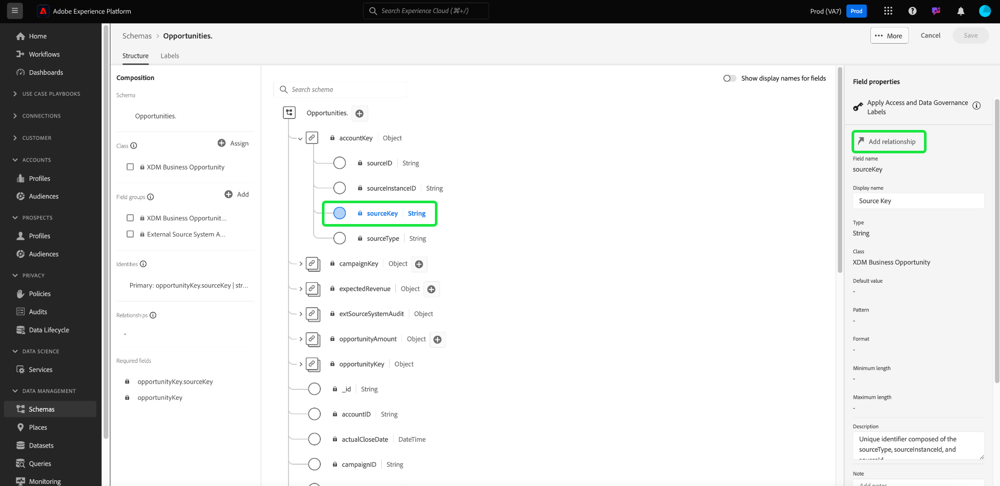
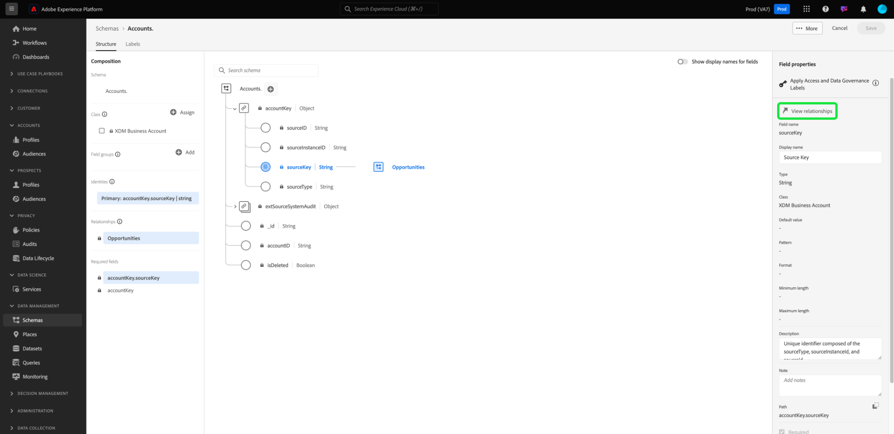
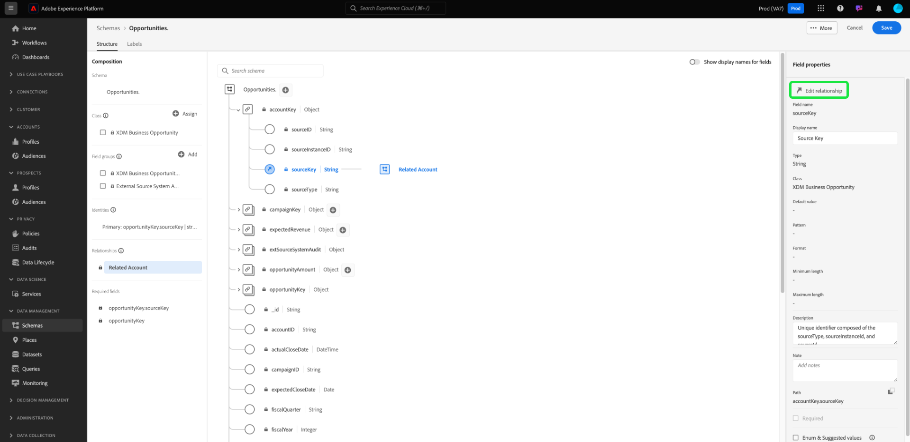
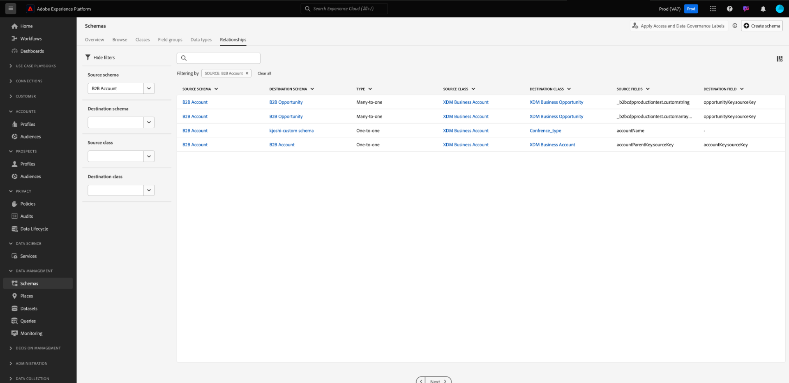

# Definieren einer n:1-Zuordnung zwischen zwei Schemata in der Real-time Customer Data Platform B2B Edition {#relationship-b2b}

>[!CONTEXTUALHELP]
>id="platform_xdm_b2b_reference_schema"
>title="Referenzschema"
>abstract="Wählen Sie das Schema aus, mit dem Sie eine Beziehung herstellen möchten. Abhängig von der Klasse des Schemas kann dieses auch vorhandene Beziehungen zu anderen Entitäten im B2B-Kontext besitzen. In der Dokumentation erfahren Sie, wie B2B-Schemaklassen miteinander in Beziehung stehen."

Adobe Real-time Customer Data Platform B2B Edition bietet mehrere Experience-Datenmodell (XDM)-Klassen, die grundlegende B2B-Datenentitäten erfassen, darunter [Konten](../classes/b2b/business-account.md), [Chancen](../classes/b2b/business-opportunity.md), [Kampagnen](../classes/b2b/business-campaign.md) und mehr. Wenn Sie Schemas erstellen, die auf diesen Klassen basieren, und sie für die Verwendung im [Echtzeit-Kundenprofil](../../profile/home.md) aktivieren, können Sie Daten aus unterschiedlichen Quellen zu einer einheitlichen Darstellung zusammenführen, die als Vereinigungsschema bezeichnet wird.

Vereinigungsschemata dürfen jedoch nur Felder enthalten, die von Schemas erfasst werden, die dieselbe Klasse verwenden. Hier kommen die Schemabeziehungen an. Durch die Implementierung von Beziehungen in Ihre B2B-Schemas können Sie beschreiben, wie sich diese Geschäftsentitäten gegenseitig beeinflussen, und Attribute aus mehreren Klassen in Anwendungsfällen für nachgelagerte Segmentierung einbeziehen.

Das folgende Diagramm zeigt ein Beispiel dafür, wie die verschiedenen B2B-Klassen in einer Basisimplementierung miteinander in Beziehung stehen können:

In diesem Tutorial werden die Schritte zum Definieren einer 1:1-Beziehung zwischen zwei Schemas in Real-Time CDP B2B Edition beschrieben.

>[!NOTE]
>
>Wenn Sie Real-time Customer Data Platform B2B Edition nicht verwenden oder eine Eins-zu-Eins-Beziehung erstellen möchten, lesen Sie stattdessen das Handbuch zum Erstellen einer Eins-zu-Eins-Beziehung](./relationship-ui.md) .[
>
>In diesem Tutorial wird beschrieben, wie Sie in der Platform-Benutzeroberfläche manuell Beziehungen zwischen B2B-Schemas herstellen. Wenn Sie Daten aus einer B2B-Quellverbindung einbringen, können Sie stattdessen ein Dienstprogramm zur automatischen Generierung verwenden, um die erforderlichen Schemas, Identitäten und Beziehungen zu erstellen. Weitere Informationen zu [Verwendung des Dienstprogramms zur automatischen Generierung](../../sources/connectors/adobe-applications/marketo/marketo-namespaces.md) finden Sie in der Quelldokumentation zu B2B-Namespaces und -Schemata .

## Erste Schritte

Für dieses Tutorial sind ein grundlegendes Verständnis von [!DNL XDM System] und des Schema-Editors in der Benutzeroberfläche von [!DNL Experience Platform] erforderlich. Bevor Sie mit dem Tutorial beginnen, lesen Sie die folgenden Dokumente:

* [XDM-System in Experience Platform](../home.md): Eine Übersicht über XDM und dessen Implementierung in [!DNL Experience Platform].
* [Grundlagen der Schemakomposition](../schema/composition.md): Eine Einführung in die Bausteine von XDM-Schemata.
* [Erstellen eines Schemas mit dem  [!DNL Schema Editor]](create-schema-ui.md): Ein Tutorial, das die Grundlagen zum Erstellen und Bearbeiten von Schemas in der Benutzeroberfläche behandelt.

## Quell- und Referenzschema definieren

Wir gehen davon aus, dass Sie die beiden Schemata, die in der Beziehung definiert werden sollen, bereits erstellt haben. Zu Demonstrationszwecken wird in diesem Tutorial eine Beziehung zwischen Geschäftschancen (definiert in einem &quot;[!DNL Opportunities]&quot;-Schema) und dem zugehörigen Geschäftskonto (definiert in einem &quot;[!DNL Accounts]&quot;-Schema) erstellt.

Schemabeziehungen werden durch ein dediziertes Feld innerhalb eines **Quellschemas** dargestellt, das auf das primäre Identitätsfeld eines **Referenzschemas** verweist. In den folgenden Schritten dient &quot;[!DNL Opportunities]&quot;als Quellschema, während &quot;[!DNL Accounts]&quot;als Referenzschema dient.

### Grundlegendes über Identitäten in B2B-Beziehungen

>[!CONTEXTUALHELP]
>id="platform_xdm_b2b_identity_namespace"
>title="Referenz-Identity-Namespace"
>abstract="Der Namespace (Typ) für das primäre Identitätsfeld des Referenzschemas. Das Referenzschema muss über ein festgelegtes primäres Identitätsfeld verfügen, um Teil einer Beziehung sein zu können. Weitere Informationen zu Identitäten in B2B-Beziehungen finden Sie in der Dokumentation."

Um eine Beziehung herzustellen, muss das Referenzschema über eine definierte primäre Identität verfügen. Beachten Sie beim Festlegen einer primären Identität für eine B2B-Entität, dass sich die Zeichenfolgen-basierten Entitäts-IDs überschneiden können, wenn Sie sie über verschiedene Systeme oder Standorte hinweg erfassen. Dies könnte zu Datenkonflikten in Platform führen.

Um dies zu berücksichtigen, enthalten alle standardmäßigen B2B-Klassen &quot;key&quot;-Felder, die dem [[!UICONTROL B2B Source] -Datentyp](../data-types/b2b-source.md) entsprechen. Dieser Datentyp stellt Felder für eine Zeichenfolgenkennung für die B2B-Entität zusammen mit anderen Kontextinformationen zur Quelle der Kennung bereit. Eines dieser Felder, `sourceKey`, verkettet die Werte der anderen Felder im Datentyp, um eine vollständig eindeutige Kennung für die Entität zu erhalten. Dieses Feld sollte immer als primäre Identität für B2B-Entitätsschemas verwendet werden.

>[!NOTE]
>
>Wenn [ein XDM-Feld als Identität festlegen](../ui/fields/identity.md), müssen Sie einen Identitäts-Namespace bereitstellen, unter dem die Identität definiert wird. Dabei kann es sich um einen Standard-Namespace handeln, der von Adobe bereitgestellt wird, oder um einen benutzerdefinierten Namespace, der von Ihrem Unternehmen definiert wird. In der Praxis ist der Namespace lediglich eine kontextbezogene Zeichenfolge und kann auf einen beliebigen Wert festgelegt werden, vorausgesetzt, er ist für Ihre Organisation für die Kategorisierung des Identitätstyps sinnvoll. Weitere Informationen finden Sie in der Übersicht zu [Identitäts-Namespaces](../../identity-service/features/namespaces.md) .

Zu Referenzzwecken wird in den folgenden Abschnitten die Struktur der einzelnen Schemas beschrieben, die in diesem Tutorial vor der Definition einer Beziehung verwendet werden. Beachten Sie, wo die primären Identitäten in der Schemastruktur und in den von ihnen verwendeten benutzerdefinierten Namespaces definiert wurden.

### Opportunities-Schema

Das Quellschema &quot;[!DNL Opportunities]&quot; basiert auf der Klasse [!UICONTROL XDM Business Opportunity] . Eines der von der Klasse bereitgestellten Felder, `opportunityKey`, dient als Kennung für das Schema. Insbesondere wird das Feld `sourceKey` unter dem Objekt `opportunityKey` als primäre Identität des Schemas unter einem benutzerdefinierten Namespace namens [!DNL B2B Opportunity] festgelegt.

Wie unter **[!UICONTROL Feldeigenschaften]** zu sehen ist, wurde dieses Schema für die Verwendung in [!DNL Real-Time Customer Profile] aktiviert.

### [!DNL Accounts] schema

Das Referenzschema &quot;[!DNL Accounts]&quot; basiert auf der Klasse [!UICONTROL XDM-Konto] . Das Feld `accountKey` auf der Stammebene enthält den `sourceKey` , der als primäre Identität unter einem benutzerdefinierten Namespace namens [!DNL B2B Account] fungiert. Dieses Schema wurde auch für die Verwendung in Profil aktiviert.

## Definieren eines Beziehungsfelds für das Quellschema {#relationship-field}

>[!CONTEXTUALHELP]
>id="platform_xdm_b2b_relationship_name_current"
>title="Beziehungsname aus aktuellem Schema"
>abstract="Eine Bezeichnung, die die Beziehung des aktuellen Schemas zum Referenzschema beschreibt (z. B. „Verknüpftes Konto“). Diese Bezeichnung wird im Abschnitt „Profil“ und „Segmentierung“ verwendet, um Kontextinformationen über Daten aus B2B-Entitäten bereitzustellen, zwischen denen eine Beziehung besteht. Weitere Informationen zum Erstellen von B2B-Schemabeziehungen finden Sie in der Dokumentation."

>[!CONTEXTUALHELP]
>id="platform_xdm_b2b_relationship_name_reference"
>title="Beziehungsname aus Referenzschema"
>abstract="Eine Bezeichnung, die die Beziehung des Referenzschemas zum aktuellen Schema beschreibt (z. B. „Verknüpfte Opportunities“). Diese Bezeichnung wird im Abschnitt „Profil“ und „Segmentierung“ verwendet, um Kontextinformationen über Daten aus B2B-Entitäten bereitzustellen, zwischen denen eine Beziehung besteht. Weitere Informationen zum Erstellen von B2B-Schemabeziehungen finden Sie in der Dokumentation."

Um eine Beziehung zwischen zwei Schemas zu definieren, muss das Quellschema über ein dediziertes Feld verfügen, das die primäre Identität des Referenzschemas angibt. Standard-B2B-Klassen enthalten dedizierte Quellschlüsselfelder für häufig verwandte Geschäftsentitäten. Beispielsweise enthält die Klasse [!UICONTROL XDM Business Opportunity] Quellschlüsselfelder für ein verwandtes Konto (`accountKey`) und eine zugehörige Kampagne (`campaignKey`). Sie können dem Schema jedoch auch andere [!UICONTROL B2B Source] -Felder hinzufügen, indem Sie benutzerdefinierte Feldergruppen verwenden, wenn Sie mehr als die Standardkomponenten benötigen.

>[!NOTE]
>
>Derzeit können von einem Quellschema zu einem Referenzschema nur n:1- und 1:1-Beziehungen definiert werden. Bei 1:n-Beziehungen müssen Sie das Beziehungsfeld im Schema definieren, das die &quot;viele&quot;darstellt.

Um ein Beziehungsfeld festzulegen, wählen Sie das betreffende Feld auf der Arbeitsfläche aus, gefolgt von **[!UICONTROL Beziehung hinzufügen]** in der Seitenleiste [!UICONTROL Schemaeigenschaften] . Im Fall des Schemas [!DNL Opportunities] ist dies das Feld `accountKey.sourceKey` , da das Ziel darin besteht, eine n:n-Beziehung zu einem Konto herzustellen.

Das Dialogfeld [!UICONTROL Beziehung hinzufügen] wird angezeigt. Verwenden Sie dieses Dialogfeld, um Beziehungsdetails anzugeben. Der Beziehungstyp ist standardmäßig auf **[!UICONTROL Viele-zu-eins]** eingestellt.

Verwenden Sie unter **[!UICONTROL Referenzschema]** die Suchleiste oder das Dropdown-Menü, um den Namen des Referenzschemas zu suchen. Wenn Sie den Namen des Referenzschemas markieren, wird das Feld **[!UICONTROL Referenz-Identitäts-Namespace]** automatisch auf den Namespace der primären Identität des Referenzschemas aktualisiert.

>[!NOTE]
>
>Die Liste der verfügbaren Referenzschemata wird so gefiltert, dass sie nur geeignete Schemata enthalten. Schemas **müssen** eine zugewiesene primäre Identität aufweisen und entweder eine B2B-Klasse oder die Klasse &quot;Individuelles Profil&quot;sein. Prospect-Klassenschemas können keine Beziehungen haben.

Geben Sie unter **[!UICONTROL Beziehungsname aus aktuellem Schema]** und **[!UICONTROL Beziehungsname aus Referenzschema]** Anzeigenamen für die Beziehung im Kontext der Quell- bzw. Referenzschemas an. Wählen Sie abschließend **[!UICONTROL Anwenden]** aus, um die Änderungen zu bestätigen und die Beziehung zu speichern.

>[!NOTE]
>
>Die Beziehungsnamen dürfen maximal 35 Zeichen lang sein.

Die Arbeitsfläche wird wieder angezeigt, wobei das Beziehungsfeld jetzt mit dem Anzeigenamen markiert ist, den Sie zuvor angegeben haben. Der Beziehungsname wird auch in der linken Leiste zur einfachen Referenz aufgeführt.

Wenn Sie die Struktur des Referenzschemas anzeigen, wird die Beziehungsmarke neben dem primären Identitätsfeld des Schemas und in der linken Leiste angezeigt.

## B2B-Schemabeziehung bearbeiten {#edit-schema-relationship}

Nachdem eine Schemabeziehung hergestellt wurde, wählen Sie das Beziehungsfeld im Quellschema gefolgt von **[!UICONTROL Beziehung bearbeiten]** aus.

>[!NOTE]
>
>Um alle zugehörigen Beziehungen anzuzeigen, wählen Sie das primäre Identitätsfeld im Referenzschema gefolgt von [!UICONTROL Beziehungen anzeigen] aus.
>{width="100" zoomable="yes"}

.

Das Dialogfeld [!UICONTROL Beziehung bearbeiten] wird angezeigt. In diesem Dialogfeld können Sie das Referenzschema und die Beziehungsnamen ändern oder die Beziehung löschen. Der Beziehungstyp von &quot;n:1&quot;kann nicht geändert werden.

Um die Datenintegrität zu wahren und Störungen bei der Segmentierung und anderen Prozessen zu vermeiden, sollten Sie beim Verwalten von Schemabeziehungen mit verknüpften Datensätzen die folgenden Richtlinien beachten:

* Vermeiden Sie das direkte Löschen von Beziehungen, wenn ein Schema mit einem Datensatz verknüpft ist, da dies die Segmentierung negativ beeinflussen kann. Löschen Sie stattdessen den zugehörigen Datensatz, bevor Sie die Beziehung entfernen.
* Sie können das Referenzschema nicht ändern, ohne zuerst die vorhandene Beziehung zu löschen. Dies sollte jedoch mit Vorsicht erfolgen, da das Löschen einer Beziehung mit einem zugehörigen Datensatz unbeabsichtigte Folgen haben kann.
* Das Hinzufügen neuer Beziehungen zu einem Schema mit vorhandenen verknüpften Datensätzen funktioniert möglicherweise nicht wie gewünscht und kann zu potenziellen Konflikten führen.

## Filtern und Suchen nach Beziehungen {#filter-and-search}

Sie können bestimmte Beziehungen innerhalb Ihrer Schemas über die Registerkarte [!UICONTROL Beziehungen] im Arbeitsbereich [!UICONTROL Schemas] filtern und nach ihnen suchen. Sie können diese Ansicht verwenden, um Ihre Beziehungen schnell zu finden und zu verwalten. Lesen Sie das Dokument unter [Erkunden von Schemaressourcen](../ui/explore.md#lookup) , um detaillierte Anweisungen zu den Filteroptionen zu erhalten.

## Nächste Schritte

Durch Befolgen dieses Tutorials haben Sie erfolgreich eine n:1-Beziehung zwischen zwei Schemas mit dem [!DNL Schema Editor] erstellt. Sobald Daten mit Datensätzen erfasst wurden, die auf diesen Schemas basieren, und diese Daten im Profildatenspeicher aktiviert wurden, können Sie Attribute aus beiden Schemas für [Anwendungsfälle für die Segmentierung mehrerer Klassen](../../rtcdp/segmentation/b2b.md) verwenden.
