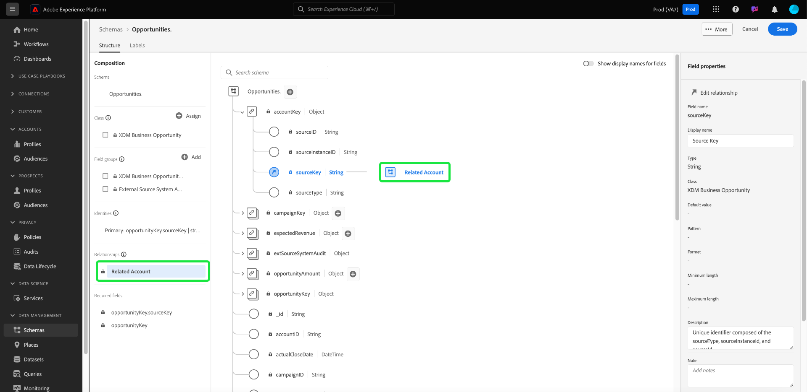

# Definieren einer n:1-Zuordnung zwischen zwei Schemata in der Real-time Customer Data Platform B2B Edition {#relationship-b2b}

>[!CONTEXTUALHELP]
>id="platform_xdm_b2b_reference_schema"
>title="Referenzschema"
>abstract="Wählen Sie das Schema aus, mit dem Sie eine Beziehung herstellen möchten. Abhängig von der Klasse des Schemas kann dieses auch vorhandene Beziehungen zu anderen Entitäten im B2B-Kontext besitzen. In der Dokumentation erfahren Sie, wie B2B-Schemaklassen miteinander in Beziehung stehen."

Adobe Real-Time Customer Data Platform B2B edition bietet mehrere Experience-Datenmodell (XDM)-Klassen, die grundlegende B2B-Datenentitäten erfassen, einschließlich [Konten](../classes/b2b/business-account.md), [Chancen](../classes/b2b/business-opportunity.md), [Kampagnen](../classes/b2b/business-campaign.md) und mehr. Indem Sie Schemata erstellen, die auf diesen Klassen basieren, und sie für die Verwendung im [Echtzeit-Kundenprofil](../../profile/home.md) aktivieren, können Sie Daten aus unterschiedlichen Quellen zu einer einheitlichen Darstellung zusammenführen, die als Vereinigungsschema bezeichnet wird.

Vereinigungsschemata können jedoch nur Felder enthalten, die von Schemata erfasst werden, die dieselbe Klasse aufweisen. Hier kommen die Schemabeziehungen ins Spiel. Durch die Implementierung von Beziehungen in Ihren B2B-Schemata können Sie beschreiben, wie diese Geschäftsentitäten miteinander in Beziehung stehen und Attribute aus mehreren Klassen in nachgelagerten Segmentierungsanwendungsfällen einschließen können.

Das folgende Diagramm zeigt ein Beispiel dafür, wie sich die verschiedenen B2B-Klassen in einer Basisimplementierung zueinander verhalten können:

In diesem Tutorial werden die Schritte zum Definieren einer Viele-zu-eins-Beziehung zwischen zwei Schemas in Real-Time CDP B2B edition beschrieben.

>[!NOTE]
>
>Wenn Sie Real-Time Customer Data Platform B2B edition nicht verwenden oder eine Eins-zu-eins-Beziehung erstellen möchten, lesen Sie stattdessen das Handbuch [Erstellen einer Eins-zu-eins-Beziehung](./relationship-ui.md).
>
>In diesem Tutorial wird beschrieben, wie Sie in der Experience Platform-Benutzeroberfläche manuell Beziehungen zwischen B2B-Schemas herstellen. Wenn Sie Daten aus einer B2B-Quellverbindung importieren, können Sie stattdessen ein Dienstprogramm zur automatischen Generierung verwenden, um die erforderlichen Schemas, Identitäten und Beziehungen zu erstellen. Weitere Informationen finden Sie in der Quelldokumentation zu B2B-Namespaces und -Schemata [Verwendung des Dienstprogramms zur automatischen Generierung](../../sources/connectors/adobe-applications/marketo/marketo-namespaces.md).

## Erste Schritte

Dieses Tutorial setzt Grundkenntnisse der [!DNL XDM System] und des Schema-Editors in der [!DNL Experience Platform]-Benutzeroberfläche voraus. Bevor Sie mit dem Tutorial beginnen, lesen Sie die folgenden Dokumente:

* [XDM-System in Experience Platform](../home.md): Ein Überblick über XDM und seine Implementierung in [!DNL Experience Platform].
* [Grundlagen der Schemakomposition](../schema/composition.md): Eine Einführung in die Bausteine von XDM-Schemata.
* [Erstellen eines Schemas mithilfe des [!DNL Schema Editor]](create-schema-ui.md): Ein Tutorial, in dem die Grundlagen zum Erstellen und Bearbeiten von Schemas in der Benutzeroberfläche behandelt werden.

## Definieren eines Quell- und Referenzschemas

Wir gehen davon aus, dass Sie die beiden Schemata, die in der Beziehung definiert werden sollen, bereits erstellt haben. Zu Demonstrationszwecken erstellt dieses Tutorial eine Beziehung zwischen Geschäftschancen (definiert in einem &quot;[!DNL Opportunities]&quot;-Schema) und ihrem zugehörigen Geschäftskonto (definiert in einem &quot;[!DNL Accounts]&quot;-Schema).

Schemabeziehungen werden durch ein dediziertes Feld innerhalb eines **Quellschemas** dargestellt, das auf das primäre Identitätsfeld eines **Referenzschemas** verweist. In den folgenden Schritten dient &quot;[!DNL Opportunities]&quot; als Quellschema, während &quot;[!DNL Accounts]&quot; als Referenzschema dient.

### Grundlegendes über Identitäten in B2B-Beziehungen

>[!CONTEXTUALHELP]
>id="platform_xdm_b2b_identity_namespace"
>title="Referenz-Identity-Namespace"
>abstract="Der Namespace (Typ) für das primäre Identitätsfeld des Referenzschemas. Das Referenzschema muss über ein festgelegtes primäres Identitätsfeld verfügen, um Teil einer Beziehung sein zu können. Weitere Informationen zu Identitäten in B2B-Beziehungen finden Sie in der Dokumentation."

Um eine Beziehung herzustellen, muss das Referenzschema über eine definierte primäre Identität verfügen. Beachten Sie beim Festlegen einer Primäridentität für eine B2B-Entität, dass sich zeichenfolgenbasierte Entitäts-IDs überschneiden können, wenn Sie sie über verschiedene Systeme oder Standorte hinweg erfassen, was zu Datenkonflikten in Experience Platform führen könnte.

Aus diesem Grund enthalten alle standardmäßigen B2B-Klassen „Schlüssel“-Felder, die dem Datentyp [[!UICONTROL B2B]Source&quot; ](../data-types/b2b-source.md). Dieser Datentyp stellt Felder für eine Zeichenfolgenkennung für die B2B-Entität zusammen mit anderen kontextuellen Informationen über die Quelle der Kennung bereit. Eines dieser Felder verkettet `sourceKey` die Werte der anderen Felder im Datentyp, um eine völlig eindeutige Kennung für die Entität zu erzeugen. Dieses Feld sollte immer als primäre Identität für B2B-Entitätsschemata verwendet werden.

>[!NOTE]
>
>Beim [Festlegen eines XDM-Felds als Identität](../ui/fields/identity.md) müssen Sie einen Identity-Namespace bereitstellen, unter dem die Identität definiert wird. Dabei kann es sich um einen von Adobe bereitgestellten Standard-Namespace oder um einen von Ihrem Unternehmen definierten benutzerdefinierten Namespace handeln. In der Praxis ist der Namespace einfach eine kontextuelle Zeichenfolge und kann auf einen beliebigen Wert festgelegt werden, sofern dies für Ihr Unternehmen für die Kategorisierung des Identitätstyps von Bedeutung ist. Weitere Informationen finden Sie in der Übersicht [Identity](../../identity-service/features/namespaces.md)Namespaces) .

Zu Referenzzwecken wird in den folgenden Abschnitten die Struktur der einzelnen Schemas beschrieben, die in diesem Tutorial verwendet werden, bevor eine Beziehung definiert wurde. Notieren Sie sich, wo die primären Identitäten in der Schemastruktur definiert wurden, und die benutzerdefinierten Namespaces, die sie verwenden.

### Opportunities-Schema

Das Quellschema &quot;[!DNL Opportunities]&quot; basiert auf der Klasse [!UICONTROL XDM Business Opportunity] . Eines der von der Klasse bereitgestellten Felder, `opportunityKey`, dient als Bezeichner für das Schema. Insbesondere wird das `sourceKey` unter dem `opportunityKey` als primäre Identität des Schemas unter einem benutzerdefinierten Namespace namens [!DNL B2B Opportunity] festgelegt.

Wie unter **[!UICONTROL Feldeigenschaften]** zu sehen, wurde dieses Schema für die Verwendung in [!DNL Real-Time Customer Profile] aktiviert.

### Schema [!DNL Accounts]

Das Referenzschema &quot;[!DNL Accounts]&quot; basiert auf der Klasse [!UICONTROL XDM-]&quot;. Das Feld `accountKey` auf der Stammebene enthält den `sourceKey`, der als primäre Identität unter einem benutzerdefinierten Namespace namens [!DNL B2B Account] fungiert. Dieses Schema wurde auch für die Verwendung im Profil aktiviert.

## Definieren eines Beziehungsfelds für das Quellschema {#relationship-field}

>[!CONTEXTUALHELP]
>id="platform_xdm_b2b_relationship_name_current"
>title="Beziehungsname aus aktuellem Schema"
>abstract="Eine Bezeichnung, die die Beziehung des aktuellen Schemas zum Referenzschema beschreibt (z. B. „Verknüpftes Konto“). Diese Bezeichnung wird im Abschnitt „Profil“ und „Segmentierung“ verwendet, um Kontextinformationen über Daten aus B2B-Entitäten bereitzustellen, zwischen denen eine Beziehung besteht. Weitere Informationen zum Erstellen von B2B-Schemabeziehungen finden Sie in der Dokumentation."

>[!CONTEXTUALHELP]
>id="platform_xdm_b2b_relationship_name_reference"
>title="Beziehungsname aus Referenzschema"
>abstract="Eine Bezeichnung, die die Beziehung des Referenzschemas zum aktuellen Schema beschreibt (z. B. „Verknüpfte Opportunities“). Diese Bezeichnung wird im Abschnitt „Profil“ und „Segmentierung“ verwendet, um Kontextinformationen über Daten aus B2B-Entitäten bereitzustellen, zwischen denen eine Beziehung besteht. Weitere Informationen zum Erstellen von B2B-Schemabeziehungen finden Sie in der Dokumentation."

Um eine Beziehung zwischen zwei Schemata zu definieren, muss das Quellschema über ein dediziertes Feld verfügen, das die primäre Identität des Referenzschemas angibt. Standard-B2B-Klassen enthalten dedizierte Quellschlüsselfelder für häufig verwandte Geschäftsbereiche. Beispielsweise enthält die Klasse [!UICONTROL XDM Business Opportunity] Quellschlüsselfelder für ein verwandtes Konto (`accountKey`) und eine verwandte Kampagne (`campaignKey`). Sie können jedoch auch andere B2B[!UICONTROL Source]-Felder mithilfe von benutzerdefinierten Feldergruppen zum Schema hinzufügen, wenn Sie mehr als die Standardkomponenten benötigen.

>[!NOTE]
>
>Derzeit können nur Viele-zu-Eins- und Eins-zu-eins-Beziehungen von einem Quellschema zu einem Referenzschema definiert werden. Für 1-zu-n-Beziehungen müssen Sie das Beziehungsfeld im Schema definieren, das für „viele“ steht.

Um ein Beziehungsfeld festzulegen, wählen Sie das betreffende Feld auf der Arbeitsfläche aus, gefolgt von **[!UICONTROL Beziehung hinzufügen]** in der Seitenleiste [!UICONTROL Schemaeigenschaften]. Im Fall des [!DNL Opportunities]-Schemas ist dies das `accountKey.sourceKey` Feld, da das Ziel darin besteht, eine Viele-zu-eins-Beziehung mit einem Konto herzustellen.

Das [!UICONTROL Beziehung hinzufügen] wird angezeigt. In diesem Dialogfeld können Sie Beziehungsdetails angeben. Der Beziehungstyp ist standardmäßig auf **[!UICONTROL Viele zu eins]** festgelegt.

Verwenden **[!UICONTROL unter &quot;]**&quot; die Suchleiste oder das Dropdown-Menü, um den Namen des Referenzschemas zu finden. Wenn Sie den Namen des Referenzschemas markieren, wird das Feld **[!UICONTROL Referenz-Identity-Namespace]** automatisch auf den Namespace der primären Identität des Referenzschemas aktualisiert.

>[!NOTE]
>
>Die Liste der verfügbaren Referenzschemata wird so gefiltert, dass sie nur geeignete Schemata enthalten. Schemata **müssen** eine zugewiesene primäre Identität aufweisen und entweder eine B2B-Klasse oder die Klasse „Individuelles Profil“ sein. Interessentenklassenschemata können keine Beziehungen haben.

Geben **[!UICONTROL unter „Beziehungsname aus aktuellem]**&quot; und **[!UICONTROL Beziehungsname aus Referenzschema]** benutzerfreundliche Namen für die Beziehung im Kontext des Quell- bzw. Referenzschemas an. Wenn Sie fertig sind, wählen **[!UICONTROL Übernehmen]** aus, um die Änderungen zu bestätigen und die Beziehung zu speichern.

>[!NOTE]
>
>Beziehungsnamen dürfen höchstens 35 Zeichen enthalten.

Die Arbeitsfläche wird erneut angezeigt, wobei das Feld Beziehung jetzt mit dem zuvor angegebenen Anzeigenamen markiert ist. Der Beziehungsname wird auch in der linken Leiste aufgeführt, um die Referenz zu erleichtern.

Wenn Sie die Struktur des Referenzschemas anzeigen, wird die Beziehungsmarkierung neben dem Feld der primären Identität des Schemas und in der linken Leiste angezeigt.

## Bearbeiten einer B2B-Schemabeziehung {#edit-schema-relationship}

Nachdem eine Schemabeziehung eingerichtet wurde, wählen Sie das Beziehungsfeld im Quellschema gefolgt von **[!UICONTROL Beziehung bearbeiten]** aus.

>[!NOTE]
>
>Um alle verknüpften Beziehungen anzuzeigen, wählen Sie im Referenzschema das Feld Primäre Identität und dann [!UICONTROL Beziehungen anzeigen].
>{width="100" zoomable="yes"}

Das [!UICONTROL Beziehung bearbeiten] wird angezeigt. In diesem Dialogfeld können Sie das Referenzschema und die Beziehungsnamen ändern oder die Beziehung löschen. Der Viele-zu-eins-Beziehungstyp kann nicht geändert werden.

Beachten Sie beim Verwalten von Schemabeziehungen mit verknüpften Datensätzen die folgenden Richtlinien, um die Datenintegrität aufrechtzuerhalten und Unterbrechungen bei der Segmentierung und anderen Prozessen zu vermeiden:

* Vermeiden Sie das direkte Löschen von Beziehungen, wenn ein Schema mit einem Datensatz verknüpft ist, da dies die Segmentierung beeinträchtigen kann. Löschen Sie stattdessen den zugehörigen Datensatz, bevor Sie die Beziehung entfernen.
* Sie können das Referenzschema nicht ändern, ohne zuvor die vorhandene Beziehung zu löschen. Dies sollte jedoch mit Vorsicht erfolgen, da das Löschen einer Beziehung zu einem zugehörigen Datensatz unbeabsichtigte Folgen haben kann.
* Das Hinzufügen neuer Beziehungen zu einem Schema mit vorhandenen verknüpften Datensätzen funktioniert möglicherweise nicht wie beabsichtigt und könnte zu potenziellen Konflikten führen.

## Filtern und Suchen nach Beziehungen {#filter-and-search}

Sie können über die Registerkarte „Beziehungen“ des Arbeitsbereichs [!UICONTROL Schemata] nach bestimmten [!UICONTROL  innerhalb Ihrer Schemata ] und suchen. Mithilfe dieser Ansicht können Sie Ihre Beziehungen schnell finden und verwalten. Ausführliche Anweisungen zu den Filteroptionen finden Sie [ Dokument unter ](../ui/explore.md#lookup) von Schemaressourcen .

## Nächste Schritte

In diesem Tutorial haben Sie mithilfe der [!DNL Schema Editor] erfolgreich eine Viele-zu-eins-Beziehung zwischen zwei Schemas erstellt. Sobald Daten mit Datensätzen aufgenommen wurden, die auf diesen Schemata basieren, und diese Daten im Profildatenspeicher aktiviert wurden, können Sie Attribute aus beiden Schemata für Anwendungsfälle [Segmentierung mehrerer Klassen“ ](../../rtcdp/segmentation/b2b.md).
