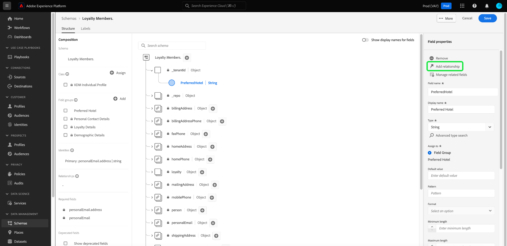
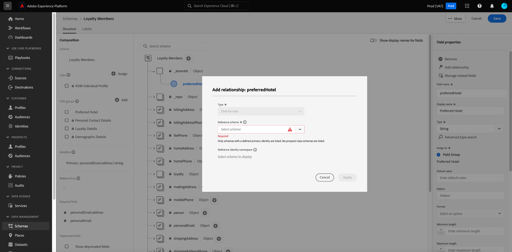

# Definieren einer 1:1-Beziehung zwischen zwei Schemata mithilfe des [!DNL Schema Editor] {#relationship-ui}

>[!CONTEXTUALHELP]
>id="platform_schemas_relationships"
>title="Schemabeziehungen"
>abstract="Schemata, die zu verschiedenen Klassen gehören, können über Beziehungsfelder kontextuell miteinander verknüpft werden und ermöglichen es Ihnen dadurch, komplexere Segmentierungsregeln zu erstellen. Weitere Informationen zu Schemabeziehungen finden Sie in der Dokumentation."

>[!CONTEXTUALHELP]
>id="platform_xdm_1to1_reference_schema"
>title="Referenzschema"
>abstract="Wählen Sie das Schema aus, mit dem Sie eine Beziehung herstellen möchten. Dieses Schema kann eine andere Klasse sein als das aktuelle Schema. Weitere Informationen zu Schemabeziehungen finden Sie in der Dokumentation."

>[!CONTEXTUALHELP]
>id="platform_xdm_1to1_identity_namespace"
>title="Referenz-Identity-Namespace"
>abstract="Der Namespace (Typ) für das primäre Identitätsfeld des Referenzschemas. Das Referenzschema muss über ein festgelegtes primäres Identitätsfeld verfügen, um Teil einer Beziehung sein zu können. Weitere Informationen zu Schemabeziehungen finden Sie in der Dokumentation."

Die Möglichkeit, Beziehungen zwischen Ihren Kunden und deren Interaktionen mit Ihrer Marke kanalübergreifend zu analysieren, ist ein wichtiger Bestandteil von Adobe Experience Platform. Durch die Definition dieser Beziehungen innerhalb der Struktur Ihrer [!DNL Experience Data Model] (XDM)-Schemata können Sie komplexe Einblicke in Ihre Kundendaten gewinnen.

Während Schemabeziehungen durch die Verwendung des Vereinigungsschemas und [!DNL Real-Time Customer Profile] abgeleitet werden können, gilt dies nur für Schemata einer gemeinsamen Klasse. Um eine Beziehung zwischen zwei Schemata herzustellen, die zu verschiedenen Klassen gehören, muss einem Quellschema ein dediziertes Beziehungsfeld hinzugefügt werden, das auf die Identität des anderen verwandten Schemas verweist.

>[!NOTE]
>
>Wenn sowohl das Quell- als auch das Zielschema derselben Klasse angehören, sollte ein dediziertes Beziehungsfeld **nicht** verwendet werden. In diesem Fall verwenden Sie die Benutzeroberfläche des Vereinigungsschemas , um die Beziehung anzuzeigen. Anweisungen dazu finden Sie im Abschnitt [Beziehungen anzeigen](../../profile/ui/union-schema.md#view-relationships) des Handbuchs zur Benutzeroberfläche des Vereinigungsschemas.

Dieses Dokument enthält ein Tutorial zum Definieren einer Beziehung zwischen zwei Schemas mithilfe des Schema-Editors in der [!DNL Experience Platform]-Benutzeroberfläche. Anweisungen zum Definieren von Schemabeziehungen mithilfe der API finden Sie in der Anleitung zum [Definieren einer Beziehung mithilfe der Schema Registry-API](relationship-api.md).

>[!NOTE]
>
>Anweisungen zum Erstellen einer Viele-zu-eins-Beziehung in Adobe Real-Time Customer Data Platform B2B edition finden Sie im Handbuch zum [ von B2B-Beziehungen](./relationship-b2b.md).

## Erste Schritte

Dieses Tutorial setzt Grundkenntnisse der [!DNL XDM System] und des Schema-Editors in der [!DNL Experience Platform]-Benutzeroberfläche voraus. Bevor Sie mit dem Tutorial beginnen, lesen Sie die folgenden Dokumente:

* [XDM-System in Experience Platform](../home.md): Ein Überblick über XDM und seine Implementierung in [!DNL Experience Platform].
* [Grundlagen der Schemakomposition](../schema/composition.md): Eine Einführung in die Bausteine von XDM-Schemata.
* [Erstellen eines Schemas mithilfe des [!DNL Schema Editor]](create-schema-ui.md): Ein Tutorial, das die Grundlagen der Arbeit mit dem [!DNL Schema Editor] behandelt.

## Definieren eines Quell- und Referenzschemas

Wir gehen davon aus, dass Sie die beiden Schemata, die in der Beziehung definiert werden sollen, bereits erstellt haben. Zu Demonstrationszwecken wird in diesem Tutorial eine Beziehung zwischen den Mitgliedern des Treueprogramms einer Organisation (definiert in einem &quot;[!DNL Loyalty Members]&quot;-Schema) und ihrem Lieblingshotel (definiert in einem &quot;[!DNL Hotels]&quot;-Schema) erstellt.

>[!IMPORTANT]
>
>Um eine Beziehung herzustellen, müssen beide Schemata über definierte primäre Identitäten verfügen und für die [!DNL Real-Time Customer Profile] aktiviert sein. Wenn Sie Anleitungen zur entsprechenden Konfiguration Ihrer Schemata benötigen[ lesen Sie im Tutorial zur Schemaerstellung den Abschnitt ](./create-schema-ui.md#profile)Aktivieren eines Schemas zur Verwendung im Profil“.

Schemabeziehungen werden durch ein dediziertes Feld innerhalb eines **Quellschemas** dargestellt, das auf ein anderes Feld innerhalb eines **Referenzschemas** verweist. In den folgenden Schritten ist &quot;[!DNL Loyalty Members]&quot; das Quellschema, während &quot;[!DNL Hotels]&quot; als Referenzschema dient.

In den folgenden Abschnitten wird die Struktur der einzelnen Schemas beschrieben, die in diesem Tutorial verwendet werden, bevor eine Beziehung definiert wurde.

### Schema [!DNL Loyalty Members]

Das Quellschema &quot;[!DNL Loyalty Members]&quot; basiert auf der [!DNL XDM Individual Profile]-Klasse und enthält Felder, die die Mitglieder eines Treueprogramms beschreiben. Eines dieser Felder, `personalEmail.addess`, dient als primäre Identität für das Schema unter dem [!UICONTROL Email] Namespace. Wie unter **[!UICONTROL Schema Properties]** zu sehen, wurde dieses Schema für die Verwendung in [!DNL Real-Time Customer Profile] aktiviert.

### Schema [!DNL Hotels]

Das Referenzschema &quot;[!DNL Hotels]&quot; basiert auf einer benutzerdefinierten Klasse &quot;[!DNL Hotels]&quot; und enthält Felder, die ein Hotel beschreiben. Um an einer Beziehung teilzunehmen, muss für das Referenzschema auch eine primäre Identität definiert und für [!UICONTROL Profile] aktiviert sein. In diesem Fall fungiert `_tenantId.hotelId`als primäre Identität für das Schema, wobei ein benutzerdefinierter Identity-Namespace &quot;[!DNL Hotel ID]&quot; verwendet wird.

>[!NOTE]
>
>Informationen zum Erstellen benutzerdefinierter Identity-Namespaces finden Sie in der [Identity Service-Dokumentation](../../identity-service/features/namespaces.md#manage-namespaces).

## Erstellen einer Feldergruppe für Beziehungen

>[!NOTE]
>
>Dieser Schritt ist nur erforderlich, wenn Ihr Quellschema kein dediziertes Feld vom Typ Zeichenfolge hat, das als Zeiger auf die primäre Identität des Referenzschemas verwendet werden kann. Wenn das Feld in Ihrem Quellschema bereits definiert ist, fahren Sie mit dem nächsten Schritt zum [Definieren eines Beziehungsfelds](#relationship-field) fort.

Um eine Beziehung zwischen zwei Schemata zu definieren, muss das Quellschema über ein dediziertes Feld verfügen, das die primäre Identität des Referenzschemas angibt. Sie können dieses Feld zum Quellschema hinzufügen, indem Sie eine neue Schemafeldgruppe erstellen oder eine vorhandene erweitern.

Im Falle des [!DNL Loyalty Members] Schemas wird ein neues `preferredHotel` hinzugefügt, das das bevorzugte Hotel des Mitglieds des Treueprogramms für Firmenbesuche angibt. Wählen Sie zunächst das Pluszeichen (**+**) neben dem Namen des Quellschemas aus.

Ein Platzhalter für ein neues Feld wird auf der Arbeitsfläche angezeigt. Geben Sie unter **[!UICONTROL Field properties]** einen Feldnamen und einen Anzeigenamen für das Feld an und legen Sie seinen Typ auf &quot;[!UICONTROL String]&quot; fest. Wählen Sie unter **[!UICONTROL Assign to]** eine vorhandene Feldergruppe aus, die erweitert werden soll, oder geben Sie einen eindeutigen Namen ein, um eine neue Feldergruppe zu erstellen. In diesem Fall wird eine neue Feldergruppe &quot;[!DNL Preferred Hotel]&quot; erstellt.

Wenn Sie fertig sind, wählen Sie **[!UICONTROL Apply]** aus.

Das aktualisierte `preferredHotel`-Feld wird auf der Arbeitsfläche unter einem `_tenantId`-Objekt angezeigt, da es ein benutzerdefiniertes Feld ist. Wählen Sie **[!UICONTROL Save]** aus, um Ihre Änderungen am Schema abzuschließen.

## Definieren eines Beziehungsfelds für das Quellschema {#relationship-field}

Sobald in Ihrem Quellschema ein dediziertes Referenzfeld definiert ist, können Sie es als Beziehungsfeld festlegen.

>[!NOTE]
>
>Beziehungen können nur für String- oder String-Array-Felder unterstützt werden.

Wählen Sie das Feld `preferredHotel` auf der Arbeitsfläche und dann **[!UICONTROL Add relationship]** in der **[!UICONTROL Field properties]** Seitenleiste aus.

Das Dialogfeld [!UICONTROL Add relationship] wird angezeigt. In diesem Dialogfeld können Sie die erforderlichen Parameter zum Konfigurieren eines Beziehungsfelds festlegen. Für Real-Time CDP B2C-Benutzer können **nur** eine Eins-zu-eins-Beziehung zwischen dem Quell- und Referenzschema festlegen.

>[!NOTE]
>
>Wenn Sie Zugriff auf Real-Time CDP B2B edition haben, können Sie die Steuerelemente der rechten Leiste der Arbeitsfläche verwenden, um ein Beziehungsfeld zu definieren und mithilfe [ Dialogfelds eine Viele-zu-eins-Beziehung ](./relationship-b2b.md#relationship-field).

Verwenden Sie das Dropdown-Menü für **[!UICONTROL Reference schema]** und wählen Sie das Referenzschema für die Beziehung aus (in diesem Beispiel &quot;[!DNL Hotels]„).

>[!NOTE]
>
>Nur Schemas, die eine primäre Identität enthalten, werden in das Dropdown-Menü Referenzschema aufgenommen. Diese Sicherung verhindert, dass Sie versehentlich eine Beziehung zu einem Schema erstellen, das noch nicht richtig konfiguriert ist.

Der Identity-Namespace des Referenzschemas (in diesem Fall &quot;[!DNL Hotel ID]„) wird automatisch unter **[!UICONTROL Reference identity namespace]** ausgefüllt. Wählen Sie **[!UICONTROL Apply]** aus, wenn Sie fertig sind.

Das `preferredHotel` Feld wird jetzt als Beziehung auf der Arbeitsfläche hervorgehoben und zeigt den Namen des Referenzschemas an. Wählen Sie **[!UICONTROL Save]** aus, um Ihre Änderungen zu speichern und den Workflow abzuschließen.

### Bearbeiten eines vorhandenen Beziehungsfelds {#edit-relationship}

Um das Referenzschema zu ändern, wählen Sie ein Feld mit einer vorhandenen Beziehung und dann in der **[!UICONTROL Edit relationship]** Seitenleiste **[!UICONTROL Field properties]** aus.

Das Dialogfeld [!UICONTROL Edit relationship] wird angezeigt. Von hier aus können Sie dem unter „Definieren eines Beziehungsfelds[ beschriebenen Prozess folgen ](#relationship-field) die Beziehung löschen. Wählen Sie **[!UICONTROL Delete relationship]** aus, um die Beziehung zum Referenzschema zu entfernen.

## Filtern und Suchen nach Beziehungen {#filter-and-search}

Sie können auf der Registerkarte [!UICONTROL Relationships] des Arbeitsbereichs [!UICONTROL Schemas] nach bestimmten Beziehungen innerhalb Ihrer Schemata filtern und suchen. Mithilfe dieser Ansicht können Sie Ihre Beziehungen schnell finden und verwalten. Ausführliche Anweisungen zu den Filteroptionen finden Sie [ Dokument unter ](../ui/explore.md#lookup) von Schemaressourcen .

## Nächste Schritte

In diesem Tutorial haben Sie mithilfe der [!DNL Schema Editor] erfolgreich eine Eins-zu-eins-Beziehung zwischen zwei Schemas erstellt. Anweisungen zum Definieren von Beziehungen mithilfe der API finden Sie in der Anleitung zum [Definieren einer Beziehung mithilfe der Schema Registry-API](relationship-api.md).
