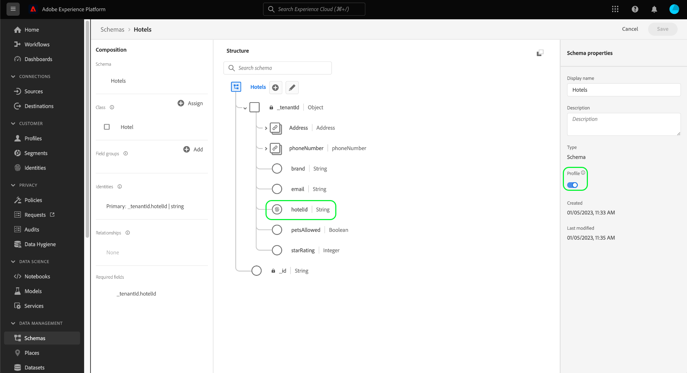

# Definieren einer Eins-zu-Eins-Beziehung zwischen zwei Schemas mithilfe der [!DNL Schema Editor] {#relationship-ui}

>[!CONTEXTUALHELP]
>id="platform_schemas_relationships"
>title="Schemabeziehungen"
>abstract="Schemas, die zu verschiedenen Klassen gehören, können kontextgebunden über Beziehungsfelder verknüpft werden, sodass Sie komplexere Segmentierungsregeln erstellen können. Weitere Informationen zu Schemabeziehungen finden Sie in der Dokumentation ."

>[!CONTEXTUALHELP]
>id="platform_xdm_1to1_reference_schema"
>title="Referenzschema"
>abstract="Wählen Sie das Schema aus, mit dem Sie eine Beziehung herstellen möchten. Dieses Schema kann eine andere Klasse sein als das aktuelle Schema. Weitere Informationen zu Schemabeziehungen finden Sie in der Dokumentation ."

>[!CONTEXTUALHELP]
>id="platform_xdm_1to1_identity_namespace"
>title="Referenz-Identitäts-Namespace"
>abstract="Der Namespace (Typ) für das primäre Identitätsfeld des Referenzschemas. Das Referenzschema muss über ein festgestelltes primäres Identitätsfeld verfügen, um an einer Beziehung teilnehmen zu können. Weitere Informationen zu Schemabeziehungen finden Sie in der Dokumentation ."

Die Möglichkeit, Beziehungen zwischen Ihren Kunden und deren Interaktionen mit Ihrer Marke kanalübergreifend zu analysieren, ist ein wichtiger Bestandteil von Adobe Experience Platform. Definieren dieser Beziehungen innerhalb der Struktur Ihrer [!DNL Experience Data Model] (XDM)-Schemas ermöglichen es Ihnen, komplexe Einblicke in Ihre Kundendaten zu erhalten.

Während Schemabeziehungen durch die Verwendung des Vereinigungsschemas und [!DNL Real-time Customer Profile], gilt dies nur für Schemas, die dieselbe Klasse teilen. Um eine Beziehung zwischen zwei Schemas herzustellen, die zu verschiedenen Klassen gehören, muss einem Quellschema ein dediziertes Beziehungsfeld hinzugefügt werden, das auf die Identität eines Zielschemas verweist.

Dieses Dokument enthält eine Anleitung zum Definieren einer Beziehung zwischen zwei Schemas mithilfe des Schema-Editors im [!DNL Experience Platform] -Benutzeroberfläche. Anweisungen zum Definieren von Schemabeziehungen mithilfe der API finden Sie in der Anleitung zum [Definieren einer Beziehung mithilfe der Schema Registry-API](relationship-api.md).

>[!NOTE]
>
>Anweisungen zum Erstellen einer n:1-Beziehung in Adobe Real-time Customer Data Platform B2B Edition finden Sie im Handbuch unter [Erstellen von B2B-Beziehungen](./relationship-b2b.md).

## Erste Schritte

Dieses Tutorial setzt ein grundlegendes Verständnis von [!DNL XDM System] und dem Schema-Editor im [!DNL Experience Platform] Benutzeroberfläche. Bevor Sie mit dem Tutorial beginnen, lesen Sie die folgenden Dokumente:

* [XDM-System in Experience Platform](../home.md): Eine Übersicht über XDM und dessen Implementierung in [!DNL Experience Platform].
* [Grundlagen der Schemakomposition](../schema/composition.md): Eine Einführung in die Bausteine von XDM-Schemas.
* [Erstellen Sie ein Schema mit dem [!DNL Schema Editor]](create-schema-ui.md): Ein Tutorial zu den Grundlagen der Arbeit mit dem [!DNL Schema Editor].

## Quell- und Zielschemas definieren

Wir gehen davon aus, dass Sie die beiden Schemas, die in der Beziehung definiert werden sollen, bereits erstellt haben. Zu Demonstrationszwecken erstellt dieses Tutorial eine Beziehung zwischen Mitgliedern des Treueprogramms einer Organisation (definiert in einem[!DNL Loyalty Members]&quot; schema) und deren Lieblingshotel (definiert in einem &quot;[!DNL Hotels]&quot; schema).

>[!IMPORTANT]
>
>Um eine Beziehung herzustellen, müssen beide Schemas definierte primäre Identitäten aufweisen und für [!DNL Real-time Customer Profile]. Siehe Abschnitt zu [Aktivieren eines Schemas zur Verwendung in Profil](./create-schema-ui.md#profile) im Tutorial zur Erstellung von Schemas , wenn Sie Anleitungen zur entsprechenden Konfiguration Ihrer Schemas benötigen.

Schemabeziehungen werden durch ein dediziertes Feld in einer **Quellschema** , das auf ein anderes Feld in einer **Zielschema**. In den folgenden Schritten: &quot;[!DNL Loyalty Members]&quot; wird das Quellschema sein, während &quot;[!DNL Hotels]&quot; dient als Zielschema.

Zu Referenzzwecken wird in den folgenden Abschnitten die Struktur der einzelnen Schemas beschrieben, die in dieser Anleitung verwendet werden, bevor eine Beziehung definiert wird.

### [!DNL Loyalty Members] schema

Das Quellschema &quot;[!DNL Loyalty Members]&quot; basiert auf der Variablen [!DNL XDM Individual Profile] und ist das Schema, das im Tutorial für [Erstellen eines Schemas in der Benutzeroberfläche](create-schema-ui.md). Er enthält `loyalty` Objekt unter `_tenantId` -Namespace, der mehrere loyalitätsspezifische Felder enthält. Eines dieser Felder, `loyaltyId`dient als primäre Identität für das Schema unter [!UICONTROL Email] Namespace. Siehe unter **[!UICONTROL Schemaeigenschaften]** wurde dieses Schema zur Verwendung in [!DNL Real-time Customer Profile].

### [!DNL Hotels] schema

Das Zielschema &quot;[!DNL Hotels]&quot; basiert auf einem benutzerdefinierten &quot;[!DNL Hotels]&quot; und enthält Felder, die ein Hotel beschreiben.

Um an einer Beziehung teilnehmen zu können, muss das Zielschema über eine primäre Identität verfügen. In diesem Beispiel wird die `hotelId` -Feld wird als primäre Identität mithilfe eines benutzerdefinierten Identitäts-Namespace &quot;Hotel-ID&quot;verwendet.

>[!NOTE]
>
>Informationen zum Erstellen benutzerdefinierter Identitäts-Namespaces finden Sie im Abschnitt [Dokumentation zu Identity Service](../../identity-service/namespaces.md#manage-namespaces).

Nachdem die primäre Identität festgelegt wurde, muss das Zielschema für [!DNL Real-time Customer Profile].

## Erstellen einer Beziehungsschemafeldgruppe

>[!NOTE]
>
>Dieser Schritt ist nur erforderlich, wenn Ihr Quellschema über kein dediziertes Zeichenfolgenfeld verfügt, das als Verweis auf das Zielschema verwendet werden kann. Wenn das Feld in Ihrem Quellschema bereits definiert ist, fahren Sie mit dem nächsten Schritt zum [Definieren eines Beziehungsfelds](#relationship-field) fort.

Um eine Beziehung zwischen zwei Schemas zu definieren, muss das Quellschema über ein dediziertes Feld verfügen, das als Verweis auf das Zielschema dient. Sie können dieses Feld zum Quellschema hinzufügen, indem Sie eine neue Schemafeldergruppe erstellen.

Starten durch Auswahl von **[!UICONTROL Hinzufügen]** im **[!UICONTROL Feldergruppen]** Abschnitt.

Die [!UICONTROL Feldergruppe hinzufügen] angezeigt. Wählen Sie von hier aus **[!UICONTROL Neue Feldergruppe erstellen]**. Geben Sie in den angezeigten Textfeldern einen Anzeigenamen und eine Beschreibung für die neue Feldergruppe ein. Auswählen **[!UICONTROL Feldergruppen hinzufügen]** wenn fertig.

Die Arbeitsfläche wird wieder mit &quot;[!DNL Favorite Hotel]&quot; in der **[!UICONTROL Feldergruppen]** Abschnitt. Wählen Sie den Feldergruppennamen aus und wählen Sie dann **[!UICONTROL Feld hinzufügen]** neben der Stammebene `Loyalty Members` -Feld.

Ein neues Feld wird auf der Arbeitsfläche unter der `_tenantId` Namespace. under **[!UICONTROL Feldeigenschaften]**, geben Sie einen Feldnamen und einen Anzeigenamen für das Feld ein und setzen Sie seinen Typ auf &quot;[!UICONTROL Zeichenfolge]&quot;.

Wenn Sie fertig sind, wählen Sie **[!UICONTROL Anwenden]**.

Die aktualisierten `favoriteHotel` auf der Arbeitsfläche angezeigt. Auswählen **[!UICONTROL Speichern]** um Ihre Schemaänderungen abzuschließen.

## Beziehungsfeld für das Quellschema definieren {#relationship-field}

Sobald in Ihrem Quellschema ein dediziertes Referenzfeld definiert ist, können Sie es als Beziehungsfeld festlegen.

>[!NOTE]
>
>Die folgenden Schritte beschreiben, wie Sie ein Beziehungsfeld mithilfe der Steuerelemente in der rechten Leiste auf der Arbeitsfläche definieren. Wenn Sie Zugriff auf Real-Time CDP B2B Edition haben, können Sie auch eine Eins-zu-Eins-Beziehung mithilfe der [Dialogfeld](./relationship-b2b.md#relationship-field) wie beim Erstellen von 1:1-Beziehungen.

Wählen Sie die `favoriteHotel` -Feld auf der Arbeitsfläche und scrollen Sie dann nach unten **[!UICONTROL Feldeigenschaften]** bis zum **[!UICONTROL Beziehung]** angezeigt. Aktivieren Sie das Kontrollkästchen, um die erforderlichen Parameter für die Konfiguration eines Beziehungsfelds anzuzeigen.

Wählen Sie das Dropdown-Menü für **[!UICONTROL Referenzschema]** und wählen Sie das Zielschema für die Beziehung (&quot;[!DNL Hotels]&quot; in diesem Beispiel). Wenn das Zielschema für [!DNL Profile], die **[!UICONTROL Referenz-Identitäts-Namespace]** wird automatisch auf den Namespace der primären Identität des Zielschemas gesetzt. Wenn für das Schema keine primäre Identität definiert ist, müssen Sie den zu verwendenden Namespace manuell aus dem Dropdown-Menü auswählen. Auswählen **[!UICONTROL Anwenden]** wenn fertig.

Die `favoriteHotel` -Feld wird nun als Beziehung auf der Arbeitsfläche markiert und zeigt den Namen- und Referenz-Identitäts-Namespace des Zielschemas an. Auswählen **[!UICONTROL Speichern]** , um Ihre Änderungen zu speichern und den Workflow abzuschließen.

## Nächste Schritte

In diesem Tutorial haben Sie mithilfe der Funktion [!DNL Schema Editor]. Anweisungen zum Definieren von Beziehungen mithilfe der API finden Sie in der Anleitung zum [Definieren einer Beziehung mithilfe der Schema Registry-API](relationship-api.md).
