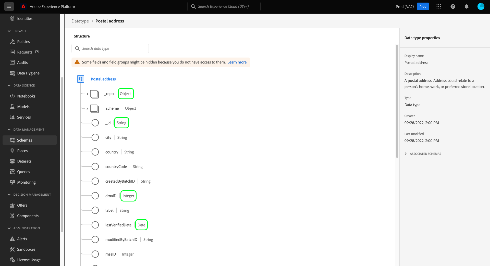
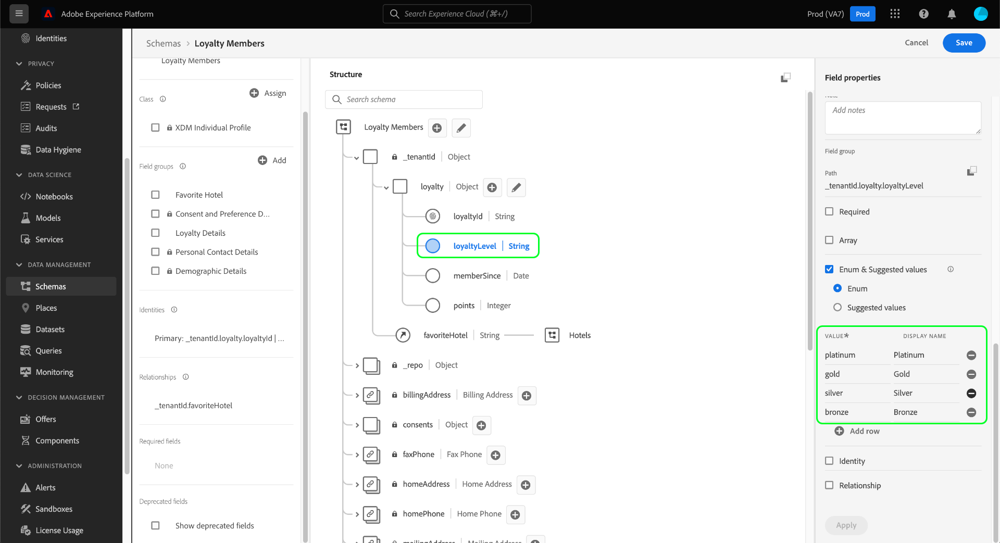

# Schema-Ressourcen in der Benutzeroberfläche

In Adobe Experience Platform werden alle Schemaressourcen des Experience-Datenmodells (XDM) im [!DNL Schema Library], einschließlich der von Adobe bereitgestellten Standardressourcen und der von Ihrem Unternehmen definierten benutzerdefinierten Ressourcen. Auf der Experience Platform-Benutzeroberfläche können Sie die Struktur und die Felder eines vorhandenen Schemas, einer vorhandenen Klasse, einer vorhandenen Feldergruppe oder eines vorhandenen Datentyps im [!DNL Schema Library]. Dies ist besonders nützlich bei der Planung und Vorbereitung der Datenerfassung, da die Benutzeroberfläche Informationen zu den erwarteten Datentypen und Anwendungsfällen der einzelnen Felder bereitstellt, die von diesen XDM-Ressourcen bereitgestellt werden.

In diesem Tutorial werden die Schritte zum Erkunden vorhandener Schemas, Klassen, Feldergruppen und Datentypen in der Experience Platform-Benutzeroberfläche beschrieben.

## Nach einer Schemaressource suchen {#lookup}

Wählen Sie in der Platform-Benutzeroberfläche die Option **[!UICONTROL Schemas]** in der linken Navigation. Die [!UICONTROL Schemas] Workspace bietet eine **[!UICONTROL Durchsuchen]** Registerkarte, um alle Schemas in Ihrer Organisation zu untersuchen, sowie zusätzliche spezielle Registerkarten zum Erkunden **[!UICONTROL Klassen]**, **[!UICONTROL Feldergruppen]**, und **[!UICONTROL Datentypen]** bzw.

Das Filtersymbol () zeigt Steuerelemente in der linken Leiste an, um die aufgelisteten Ergebnisse einzuschränken. Die angezeigten Steuerelemente variieren je nach Ressourcentyp.

Um beispielsweise die Liste so zu filtern, dass nur die von Adobe bereitgestellten Standarddatentypen angezeigt werden, wählen Sie **[!UICONTROL Datentyp]** und **[!UICONTROL Adobe]** unter **[!UICONTROL Typ]** und **[!UICONTROL Inhaber]** -Abschnitte.

Die **[!UICONTROL Im Profil enthalten]** Mit Umschalten können Sie Ergebnisse filtern, sodass nur Ressourcen angezeigt werden, die in Schemas verwendet werden, die für die Verwendung in [Echtzeit-Kundenprofil](../../profile/home.md). Die **[!UICONTROL Anzeigen von Ad-hoc-Schemata]** filtert die Liste der Schemas, die mit Feldern erstellt wurden, die nur für die Verwendung durch einen einzigen Datensatz benannt wurden, um einen Umschalter.

![Die [!UICONTROL Schemas] Arbeitsbereich [!UICONTROL Durchsuchen] Registerkarte mit hervorgehobenem Filterbereich.](../images/ui/explore/filter.png)

Beim Auflisten von Ressourcen auf der **[!UICONTROL Klassen]**, **[!UICONTROL Feldergruppen]** oder **[!UICONTROL Datentypen]** Registerkarten, können Sie **[!UICONTROL Adobe]** , um nur Standardressourcen anzuzeigen oder **[!UICONTROL Kunde]** , um nur die von Ihrer Organisation erstellten Ressourcen anzuzeigen.

Sie können die Suchleiste auch verwenden, um die Ergebnisse weiter einzugrenzen.

Die in den Suchergebnissen angezeigten Ressourcen werden zuerst nach Titel und dann nach Beschreibung geordnet. Je mehr Wörter in einer dieser Kategorien übereinstimmen, desto höher wird die Ressource in der Liste angezeigt.

Wenn Sie die Ressource gefunden haben, die Sie untersuchen möchten, wählen Sie deren Namen aus der Liste aus, um ihre Struktur auf der Arbeitsfläche anzuzeigen.

## XDM-Ressource auf der Arbeitsfläche durchsuchen {#explore}

Nachdem Sie eine Ressource ausgewählt haben, wird ihre Struktur auf der Arbeitsfläche geöffnet.

Alle Objekttypen, die Untereigenschaften enthalten, werden standardmäßig ausgeblendet, wenn sie zum ersten Mal auf der Arbeitsfläche angezeigt werden. Um die Untereigenschaften eines beliebigen Felds anzuzeigen, wählen Sie das Symbol neben seinem Namen aus.

### Standardklasse- und Feldergruppenanzeige {#standard-class-and-field-group-indicator}

Im Schema Editor werden Standardklassen (Adobe-generierte) und Feldgruppen mit dem Vorhängeschloss-Symbol (. Das Vorhängeschloss wird in der linken Leiste neben dem Namen der Klasse oder Feldergruppe sowie neben jedem Feld im Schemadiagramm angezeigt, das Teil einer systemgenerierten Ressource ist.

Siehe [Hinzufügen benutzerdefinierter Felder zu Standardfeldgruppen](./resources/schemas.md) Dokumentation für Anleitungen. Eine Standardklasse kann nicht bearbeitet werden.

### Systemgenerierte Felder {#system-fields}

Bei einigen Feldnamen wird ein Unterstrich vorangestellt, beispielsweise `_repo` und `_id`. Diese stellen Platzhalter für Felder dar, die das System automatisch generiert und zuweist, wenn Daten erfasst werden.

Daher sollten die meisten dieser Felder bei der Aufnahme in Platform aus der Datenstruktur ausgeschlossen werden. Die wichtigste Ausnahme für diese Regel ist die [`_{TENANT_ID}` field](../api/getting-started.md#know-your-tenant_id), unter dem alle unter Ihrem Unternehmen erstellten XDM-Felder im Namespace angegeben werden müssen.

### Datentypen {#data-types}

Für jedes auf der Arbeitsfläche angezeigte Feld wird der zugehörige Datentyp neben dem Namen angezeigt, der auf einen Blick den Datentyp angibt, den das Feld für die Aufnahme erwartet.

Jeder Datentyp, der mit eckigen Klammern (`[]`) stellt ein Array dieses bestimmten Datentyps dar. Ein Datentyp **[!UICONTROL Zeichenfolge]\[]** gibt an, dass das Feld ein Array von Zeichenfolgenwerten erwartet. Ein Datentyp von **[!UICONTROL Zahlungselement]\[]** gibt ein Array von Objekten an, die dem [!UICONTROL Zahlungselement] Datentyp.

Wenn ein Array-Feld auf einem Objekttyp basiert, können Sie das zugehörige Symbol auf der Arbeitsfläche auswählen, um die erwarteten Attribute für jedes Array-Element anzuzeigen.

### [!UICONTROL Feldeigenschaften] {#field-properties}

Wenn Sie den Namen eines Felds auf der Arbeitsfläche auswählen, wird die rechte Leiste aktualisiert und zeigt Details zu diesem Feld unter **[!UICONTROL Feldeigenschaften]**. Dies kann eine Beschreibung des Verwendungsfalls des Felds, Standardwerte, Muster, Formate, unabhängig davon, ob das Feld erforderlich ist oder nicht, und mehr enthalten.

Wenn es sich bei dem zu prüfenden Feld um ein Enum-Feld handelt, zeigt die rechte Leiste auch die akzeptablen Werte an, die das Feld erwartet.

### Identitätsfelder {#identity}

Beim Prüfen von Schemas, die Identitätsfelder enthalten, werden diese Felder in der linken Leiste unter der Klasse oder Feldergruppe aufgelistet, die sie für das Schema bereitstellt. Wählen Sie in der linken Leiste den Namen des Identitätsfelds aus, um das Feld auf der Arbeitsfläche anzuzeigen, unabhängig davon, wie tief es verschachtelt ist.

Identitätsfelder werden auf der Arbeitsfläche mit einem Fingerabdrucksymbol (). Wenn Sie den Namen des Identitätsfelds auswählen, können Sie zusätzliche Informationen anzeigen, z. B. die [Identitäts-Namespace](../../identity-service/features/namespaces.md) und ob das Feld die primäre Identität für das Schema ist.

>[!NOTE]
>
>Siehe Handbuch unter [Identitätsfelder definieren](./fields/identity.md) für weitere Informationen zu Identitätsfeldern und deren Beziehung zu nachgelagerten Platform-Diensten.

### Beziehungsfelder {#relationship}

Wenn Sie ein Schema überprüfen, das ein Beziehungsfeld enthält, wird das Feld in der linken Leiste unter **[!UICONTROL Beziehungen]**. Wählen Sie in der linken Leiste den Namen des Beziehungsfelds aus, um das Feld auf der Arbeitsfläche anzuzeigen, unabhängig davon, wie tief es verschachtelt ist.

Die Beziehungsfelder werden auch auf der Arbeitsfläche eindeutig hervorgehoben und zeigen den Namen des Referenzschemas an, mit dem das Feld verknüpft ist. Wenn Sie den Namen des Beziehungsfelds auswählen, können Sie den Identitäts-Namespace der primären Identität des Referenzschemas in der rechten Leiste anzeigen.

>[!NOTE]
>
>Siehe Tutorial zu [Erstellen einer Beziehung in der Benutzeroberfläche](../tutorials/relationship-ui.md) für weitere Informationen zur Verwendung von Beziehungen in XDM-Schemas.

## Nächste Schritte

In diesem Dokument wurde beschrieben, wie Sie vorhandene XDM-Ressourcen in der Experience Platform-Benutzeroberfläche untersuchen. Weitere Informationen zu den verschiedenen Funktionen der [!UICONTROL Schemas] Arbeitsbereich und [!DNL Schema Editor], siehe [[!UICONTROL Schemas] Arbeitsbereich - Übersicht](./overview.md).
