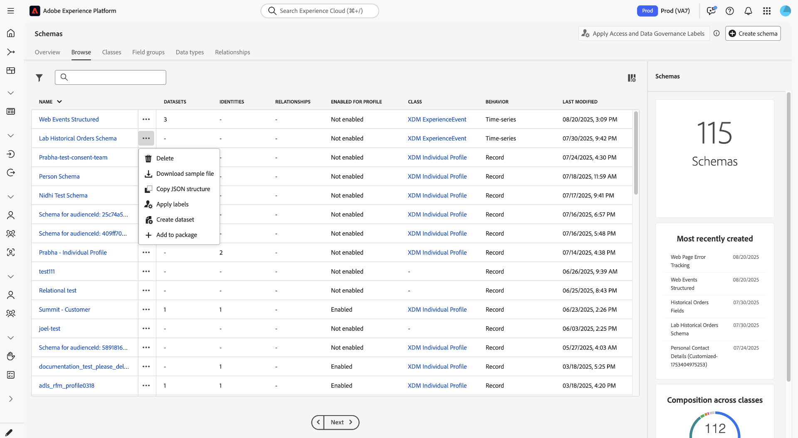
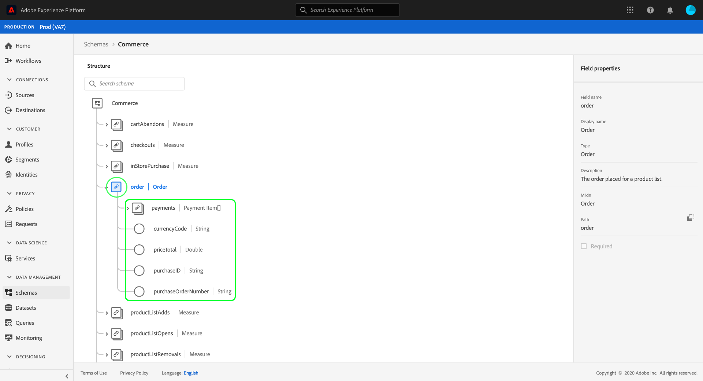
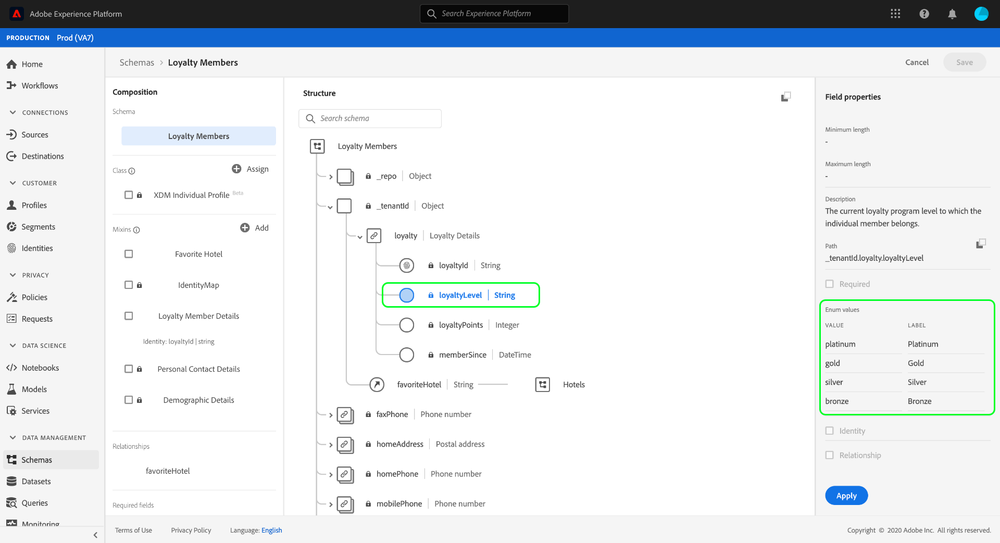

# Erkunden von Schema-Ressourcen in der Benutzeroberfläche

In Adobe Experience Platform werden alle Schema-Ressourcen des Experience-Datenmodells (XDM) im [!DNL Schema Library] gespeichert, einschließlich der von Adobe bereitgestellten Standardressourcen und der von Ihrem Unternehmen definierten benutzerdefinierten Ressourcen. In der Experience Platform-Benutzeroberfläche können Sie die Struktur und die Felder jedes vorhandenen Schemas, jeder vorhandenen Klasse, jeder vorhandenen Feldergruppe oder jedes vorhandenen Datentyps in der [!DNL Schema Library] anzeigen. Dies ist besonders bei der Planung und Vorbereitung der Datenaufnahme nützlich, da die Benutzeroberfläche Informationen zu den erwarteten Datentypen und Anwendungsfällen jedes Felds bereitstellt, das von diesen XDM-Ressourcen bereitgestellt wird.

In diesem Tutorial werden die Schritte zum Untersuchen vorhandener Schemata, Klassen, Feldergruppen und Datentypen in der Experience Platform-Benutzeroberfläche beschrieben.

## Suchen einer Schema-Ressource {#lookup}

Wählen Sie in der Benutzeroberfläche von Experience Platform im linken Navigationsbereich **[!UICONTROL Schemas]** aus. Der Arbeitsbereich [!UICONTROL Schemas] bietet eine **[!UICONTROL Browse]** Registerkarte, auf der alle Schemata in Ihrer Organisation untersucht werden können, sowie zusätzliche dedizierte Registerkarten zum Untersuchen von **[!UICONTROL Classes]**, **[!UICONTROL Field groups]**, **[!UICONTROL Data types]** bzw. **[!UICONTROL Relationships]**.

Das Filtersymbol () zeigt Steuerelemente in der linken Leiste an, um die aufgelisteten Ergebnisse einzugrenzen. Ressourcenfilter sind für Schemata und Beziehungen auf den Registerkarten **[!UICONTROL Browse]** bzw. **[!UICONTROL Relationships]** verfügbar.

Auf der Registerkarte [!UICONTROL Browse] des Arbeitsbereichs [!UICONTROL Schemas] können Sie Ihr Schema-Inventar filtern. Verwenden Sie den Umschalter **[!UICONTROL Included in Profile]** , um nur Schemas anzuzeigen, die für die Verwendung im [Echtzeit-Kundenprofil“ aktiviert &#x200B;](../../profile/home.md). Verwenden Sie den Umschalter **[!UICONTROL Show adhoc schemas]** , um die Liste der Schemata zu filtern, die mit Feldern erstellt wurden, die in einem Namespace enthalten sind und nur von einem einzigen Datensatz verwendet werden können.

![Die Registerkarte &quot;[!UICONTROL Schemas] Workspace-[!UICONTROL Browse]&quot; mit hervorgehobenem Bedienfeld „Filter“.](../images/ui/explore/filters.png)

Auf der Registerkarte [!UICONTROL Relationship] des Arbeitsbereichs [!UICONTROL Schemas] können Sie die Liste der Beziehungen nach vier Kriterien filtern. Zu den Filtern gehören [!UICONTROL Source schema], [!UICONTROL Destination schema], [!UICONTROL Source class] und die [!UICONTROL Destination class]. Die nachstehende Tabelle enthält eine Beschreibung der Filter.

| Filter | Beschreibung |
|-----------------------------------|------------|
| [!UICONTROL Source schema] | Um alle Beziehungen anzuzeigen, bei denen das ausgewählte Schema der Startpunkt oder „Quelle“ ist, wählen Sie ein Schema aus dem Dropdown-Menü [!UICONTROL Source schema] aus. |
| [!UICONTROL Destination schema] | Um alle Beziehungen anzuzeigen, bei denen das ausgewählte Schema das Ziel oder „Ziel“ ist, wählen Sie ein Schema aus dem Dropdown-Menü [!UICONTROL Destination schema] aus. |
| [!UICONTROL Source class] | Um Beziehungen nach der Klasse des initiierenden Schemas zu filtern, wählen Sie eine Klasse aus dem Dropdown-Menü [!UICONTROL Source class] aus. |
| [!UICONTROL Destination class] | Um Beziehungen anzuzeigen, die auf Schemata einer bestimmten Klasse enden, wählen Sie eine Klasse aus dem Dropdown-Menü [!UICONTROL Destination class] aus. |

{style="table-layout:auto"}

Sie können die Suchleiste auch verwenden, um die Ergebnisse weiter einzugrenzen.

Die in den Suchergebnissen angezeigten Ressourcen werden zuerst nach Übereinstimmungen mit dem Titel und dann nach der Beschreibung sortiert. Je mehr Wörter in einer dieser Kategorien übereinstimmen, desto höher wird die Ressource in der Liste angezeigt.

Wenn Sie die Ressource gefunden haben, die Sie untersuchen möchten, wählen Sie ihren Namen aus der Liste aus, um ihre Struktur auf der Arbeitsfläche anzuzeigen.

## Verwalten von Schemata, Klassen, Feldergruppen und Datentypen: Aktionen und Löschungen {#xdm-resource-actions}

Verwenden Sie diesen Abschnitt, wenn Sie XDM-Ressourcen verwalten oder löschen müssen oder wenn eine Aktion (z. B. Löschen) nicht verfügbar ist und Sie verstehen müssen, warum.

### Wo Sie Aktionen finden (Inline- vs. Detailseite) {#where-to-find-actions}

Verwenden Sie einen der folgenden Einstiegspunkte, um Aktionen wie das Löschen, Exportieren oder Kopieren einer Ressource auszuführen:

Auf den Registerkarten **[!UICONTROL Browse]**, **[!UICONTROL Classes]**, **[!UICONTROL Field groups]** und **[!UICONTROL Data types]** sind Verwaltungsaktionen an zwei Stellen verfügbar:

- **Inline in der Tabelle**: Jede Ressourcenzeile enthält ein Aktionsmenü (z. B. **[!UICONTROL …]**), das direkten Zugriff auf verfügbare Aktionen bietet.

- **Ressourcendetailansicht**: Um auf vollständige Aktionen in der Detailansicht zuzugreifen, müssen Sie eine **benutzerdefinierte (vom Mandanten definierte) Ressource**. Standardressourcen (von Adobe bereitgestellt) verfügen über eingeschränkte Aktionen und zeigen keine Optionen wie „Löschen“, „JSON-Struktur kopieren“ oder „Zum Paket hinzufügen“ an. Wählen Sie eine benutzerdefinierte Ressource aus dem Inventar aus, um ihre Detailansicht zu öffnen, und greifen Sie dann über das Menü **[!UICONTROL More]** in der Seitenkopfzeile auf dieselben verfügbaren Aktionen zu.

Diese Aktionen sind über beide Einstiegspunkte für unterstützte Ressourcentypen (Schemata, Klassen, Feldergruppen und Datentypen) hinweg konsistent.

### Verfügbare Aktionen {#available-actions}

Je nach Ressourcentyp und Ihren Berechtigungen sind möglicherweise die folgenden Aktionen verfügbar:

- **[!UICONTROL Delete]** - Eine benutzerdefinierte Ressource dauerhaft aus Ihrer Organisation entfernen (wenn Einschränkungen dies zulassen). Wenn der Löschvorgang blockiert ist, siehe [Einschränkungen](#delete-constraints).
- **[!UICONTROL Download sample file]** - Generieren Sie eine Beispieldatendatei basierend auf der Ressourcenstruktur. Schritt für Schritt: [Generieren von Beispiel-XDM-](./sample.md).
- **[!UICONTROL Copy JSON structure]** - Kopieren Sie die Ressourcendefinition im JSON-Format zur Wiederverwendung, zum Export oder zur Überprüfung. Schritt für Schritt: [XDM-Schemata exportieren](./export.md).
- **[!UICONTROL Add to package]** - Die Ressource wird in ein Sandbox-Paket für den Export oder Import in mehrere Sandboxes aufgenommen. Schritt für Schritt: [Objekte in ein Paket &#x200B;](../../sandboxes/ui/sandbox-tooling.md#export-objects).

Folgendes gilt für verschiedene Ressourcentypen:

- Für **benutzerdefinierte (Mandanten-definierte** Schemata, Klassen, Feldergruppen und Datentypen können alle oben genannten Aktionen verfügbar sein.
- Für **standardmäßige (Adobe-definierte)** Klassen, Feldergruppen und Datentypen:
   - Nur **[!UICONTROL Download sample file]** ist verfügbar.
   - **Löschen**, **JSON-Struktur kopieren** und **Zum Paket hinzufügen** sind nicht verfügbar.

### Löschverhalten {#delete-behavior}

Verwenden Sie die Aktion **[!UICONTROL Delete]** , wenn Sie eine benutzerdefinierte Ressource entfernen möchten, die nicht mehr benötigt wird.

>[!IMPORTANT]
>
> Wenn Sie eine Ressource löschen, wird sie dauerhaft aus Ihrer Organisation entfernt und kann nicht rückgängig gemacht werden. Einige Ressourcen können aufgrund von Nutzung, Berechtigungen oder Systembeschränkungen nicht gelöscht werden.

Löschen einer Ressource:

1. Suchen Sie die Ressource in der Tabelle oder öffnen Sie die Detailansicht.
2. Wählen Sie das Menü Aktionen (**[!UICONTROL …]** oder **[!UICONTROL More]**) aus.
3. Wählen Sie **[!UICONTROL Delete]** aus.
4. Bestätigen Sie die Aktion im Dialogfeld, indem Sie erneut **[!UICONTROL Delete]** auswählen.

Die Ressource wird nach der Bestätigung dauerhaft aus Ihrer Organisation entfernt.

Wenn für eine Ressource kein Löschen verfügbar ist, wird die Option mit einer QuickInfo deaktiviert, die erklärt, warum die Aktion nicht ausgeführt werden kann.

### Einschränkungen (Datensatz, Profil, RBAC, Mandant vs. global) {#delete-constraints}

Wenn eine Aktion wie **[!UICONTROL Delete]** nicht verfügbar oder deaktiviert ist, liegt dies in der Regel an einer der folgenden Bedingungen:

- **Berechtigungen (RBAC)**: Sie müssen über die erforderlichen Berechtigungen (z. B. **[!UICONTROL Manage Schemas]**) verfügen, um Verwaltungsaktionen durchzuführen. Wenn Berechtigungen fehlen, werden Aktionen mit QuickInfos deaktiviert angezeigt. Informationen zur Konfiguration von Berechtigungen finden Sie unter [Übersicht über die Benutzeroberfläche der Zugriffssteuerung](../../access-control/ui/overview.md).

- **Datensatzverknüpfung**: Ressourcen, die von einem oder mehreren Datensätzen verwendet werden (z. B. mit Datensätzen verknüpfte Schemata), können nicht gelöscht werden. Informationen zum Identifizieren und Entfernen von Datensatzabhängigkeiten finden Sie unter [Datensatz löschen](../../catalog/datasets/user-guide.md#delete).

- **Profilaktivierung**: Schemata, die für das Echtzeit-Kundenprofil aktiviert sind, können nicht gelöscht werden. Anleitungen dazu, wie sich die Profilaktivierung auf Ihr Schema auswirkt, finden Sie [Planen der Aktivierung von Echtzeit-Kundenprofilen](../schema/profile-enablement-planning.md).

- **Mandanten- und globale Ressourcen**: Mandantendefinierte (benutzerdefinierte) Ressourcen können (vorbehaltlich von Einschränkungen) gelöscht werden, während Standardklassen, Feldergruppen und Datentypen (von Adobe bereitgestellt) nicht gelöscht werden können.

Diese Einschränkungen spiegeln sich direkt in der Benutzeroberfläche wider. Wenn eine Aktion nicht verfügbar ist, wird sie deaktiviert angezeigt und enthält eine QuickInfo, die die spezifische Einschränkung erklärt.

Wenn Sie eine Ressource nicht löschen können, überprüfen Sie die oben genannten Bedingungen, um festzustellen, ob Sie Berechtigungen aktualisieren, Abhängigkeiten entfernen oder Ihr Datenmodell anpassen müssen.

Weitere Workflows zur Schemabearbeitung auf der Arbeitsfläche finden Sie unter [Erstellen und Bearbeiten von Schemas in der Benutzeroberfläche](./resources/schemas.md).

## Erkunden einer XDM-Ressource auf der Arbeitsfläche {#explore}

Wenn Sie eine Ressource auswählen, wird ihre Struktur auf der Arbeitsfläche geöffnet.

Alle Felder vom Typ „Objekt“, die Untereigenschaften enthalten, werden standardmäßig reduziert, wenn sie zum ersten Mal auf der Arbeitsfläche erscheinen. Um die Untereigenschaften eines Felds anzuzeigen, klicken Sie auf das Symbol neben dem Namen des Felds.

### Indikator für Standardklasse und Feldergruppe {#standard-class-and-field-group-indicator}

Innerhalb des Schema-Editors werden Standardklassen (Adobe-generiert) und Feldergruppen mit dem Schlosssymbol (. Das Vorhängeschloss wird in der linken Leiste neben dem Namen der Klasse oder Feldergruppe sowie neben einem beliebigen Feld im Schemadiagramm angezeigt, das Teil einer systemgenerierten Ressource ist.

Eine Anleitung [&#x200B; Sie in der Dokumentation zum Hinzufügen benutzerdefinierter Felder &#x200B;](./resources/schemas.md) Standardfeldgruppen . Eine Standardklasse kann nicht bearbeitet werden.

### Systemgenerierte Felder {#system-fields}

Einigen Feldnamen wird ein Unterstrich vorangestellt, z. B. `_repo` und `_id`. Diese stellen Platzhalter für Felder dar, die das System bei der Datenaufnahme automatisch generiert und zuweist.

Daher sollten die meisten dieser Felder bei der Aufnahme in Experience Platform aus der Datenstruktur ausgeschlossen werden. Die wichtigste Ausnahme von dieser Regel ist das [`_{TENANT_ID}` Feld](../api/getting-started.md#know-your-tenant_id) unter dem alle XDM-Felder, die unter Ihrer Organisation erstellt wurden, einen Namespace erhalten müssen.

### Datentypen {#data-types}

Für jedes auf der Arbeitsfläche angezeigte Feld wird der entsprechende Datentyp neben dem Namen angezeigt, was auf einen Blick den Datentyp angibt, den das Feld für die Aufnahme erwartet.

Jeder Datentyp, der mit eckigen Klammern (`[]`) angehängt wird, stellt ein Array dieses bestimmten Datentyps dar. Beispielsweise gibt ein Datentyp von **[!UICONTROL String]\[]** an, dass das Feld ein Array von Zeichenfolgenwerten erwartet. Der Datentyp **[!UICONTROL Payment Item]\[]** gibt ein Array von Objekten an, die dem [!UICONTROL Payment Item] Datentyp entsprechen.

Wenn ein Array-Feld auf einem Objekttyp basiert, können Sie auf der Arbeitsfläche auf sein Symbol klicken, um die erwarteten Attribute für jedes Array-Element anzuzeigen.

### [!UICONTROL Field properties] {#field-properties}

Wenn Sie den Namen eines Felds auf der Arbeitsfläche auswählen, wird die rechte Leiste aktualisiert, um Details zu diesem Feld unter **[!UICONTROL Field properties]** anzuzeigen. Dies kann eine Beschreibung des vorgesehenen Anwendungsfalls des Felds, Standardwerte, Muster, Formate, unabhängig davon, ob das Feld erforderlich ist oder nicht, und mehr umfassen.

Wenn es sich bei dem überprüften Feld um ein Aufzählungsfeld handelt, zeigt die rechte Leiste auch die akzeptablen Werte an, die das Feld erwartet.

### Identitätsfelder {#identity}

Beim Überprüfen von Schemata, die Identitätsfelder enthalten, werden diese Felder in der linken Leiste unter der Klasse oder Feldergruppe aufgeführt, die sie für das Schema bereitstellt. Wählen Sie den Namen des Identitätsfelds in der linken Leiste aus, um das Feld auf der Arbeitsfläche anzuzeigen, unabhängig davon, wie tief es verschachtelt ist.

Identitätsfelder werden auf der Arbeitsfläche mit einem Fingerabdrucksymbol (. Wenn Sie den Namen des Identitätsfelds auswählen, können Sie zusätzliche Informationen anzeigen, z. B. den [Identity-Namespace](../../identity-service/features/namespaces.md) und ob das Feld die primäre Identität für das Schema ist oder nicht.

>[!NOTE]
>
>Weitere Informationen zu Identitätsfeldern und [&#x200B; Beziehung zu nachgelagerten Experience Platform](./fields/identity.md)Services finden Sie im Handbuch unter „Definieren von Identitätsfeldern“.

### Beziehungsfelder {#relationship}

Wenn Sie ein Schema überprüfen, das ein Beziehungsfeld enthält, wird das Feld in der linken Leiste unter **[!UICONTROL Relationships]** aufgeführt. Wählen Sie den Namen des Beziehungsfelds in der linken Leiste aus, um das Feld auf der Arbeitsfläche anzuzeigen, unabhängig davon, wie tief es verschachtelt ist. Beziehungsfelder werden auch auf der Arbeitsfläche eindeutig hervorgehoben, sodass der Name des Referenzschemas angezeigt wird, auf das das Feld verweist. Für Organisationen mit B2B-Funktionen können benutzerdefinierte Beziehungsnamen geschrieben werden, die in diesen Fällen auf der Arbeitsfläche angezeigt werden.

Um den Identity-Namespace der primären Identität des Referenzschemas anzuzeigen, wählen Sie das Beziehungsfeld aus und **[!UICONTROL Edit relationship]** Sie dann in der [!UICONTROL Field properties] Seitenleiste. Die Parameter für die Beziehung werden im angezeigten [!UICONTROL Edit relationship]-Dialogfeld angezeigt.

Weitere Informationen zur Verwendung von [&#x200B; in XDM-Schemata finden Sie &#x200B;](../tutorials/relationship-ui.md) Tutorial zum Erstellen einer Beziehung in der Benutzeroberfläche .

## Nächste Schritte

In diesem Dokument wurde beschrieben, wie Sie vorhandene XDM-Ressourcen in der Experience Platform-Benutzeroberfläche erkunden. Weitere Informationen zu den verschiedenen Funktionen von [!UICONTROL Schemas] Workspace und [!DNL Schema Editor] finden Sie in der Übersicht über [[!UICONTROL Schemas] Workspace](./overview.md).
