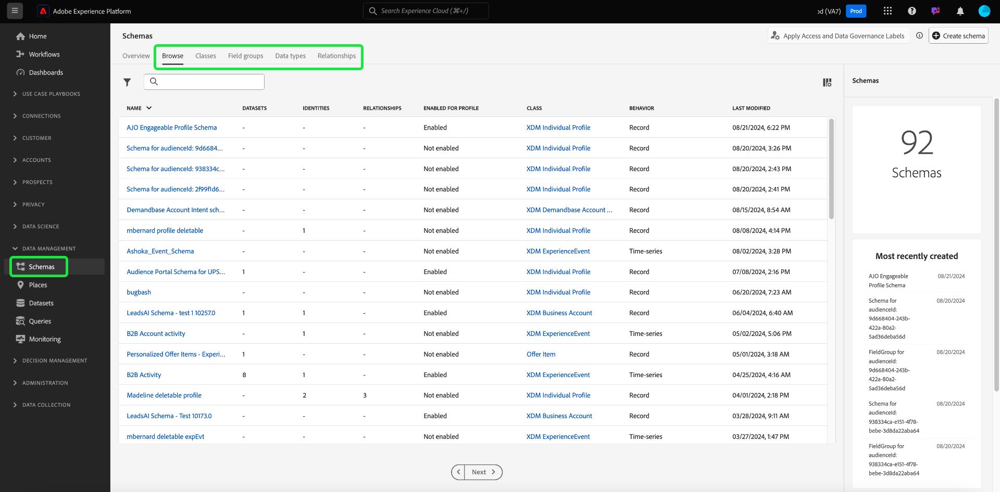

# Erkunden von XDM-Ressourcen in der Benutzeroberfläche

In Adobe Experience Platform werden alle XDM-Ressourcen (Experience-Datenmodell) im Ordner [!DNL Schema Library] gespeichert, einschließlich der Standardressourcen, die von der Adobe bereitgestellt werden, und der benutzerdefinierten Ressourcen, die von Ihrem Unternehmen definiert werden. In der Experience Platform-Benutzeroberfläche können Sie die Struktur und die Felder eines vorhandenen Schemas, einer vorhandenen Klasse, einer Schemafeldergruppe oder eines vorhandenen Datentyps im [!DNL Schema Library] anzeigen. Dies ist besonders nützlich bei der Planung und Vorbereitung der Datenerfassung, da die Benutzeroberfläche Informationen zu den erwarteten Datentypen und Anwendungsfällen der einzelnen Felder bereitstellt, die von diesen XDM-Ressourcen bereitgestellt werden.

In diesem Tutorial werden die Schritte zum Erkunden vorhandener Schemas, Klassen, Feldgruppen und Datentypen in der Experience Platform-Benutzeroberfläche beschrieben.

## XDM-Ressource nachschlagen {#lookup}

Wählen Sie in der Platform-Benutzeroberfläche im linken Navigationsbereich **[!UICONTROL Schemas]** aus. Der Arbeitsbereich [!UICONTROL Schemas] enthält eine Registerkarte **[!UICONTROL Durchsuchen]**, um alle vorhandenen XDM-Ressourcen in Ihrem Unternehmen zu untersuchen. Außerdem stehen zusätzliche spezielle Registerkarten zur Verfügung, auf denen Sie **[!UICONTROL Klassen]**, **[!UICONTROL Feldergruppen]** und **[!UICONTROL Datentypen]** genauer untersuchen können.

Auf der Registerkarte [!UICONTROL Durchsuchen] können Sie das Filtersymbol () verwenden, um Steuerelemente in der linken Leiste anzuzeigen und die aufgelisteten Ergebnisse einzugrenzen.

Um beispielsweise die Liste so zu filtern, dass nur die von Adobe bereitgestellten Standarddatentypen angezeigt werden, wählen Sie **[!UICONTROL Datentyp]** und **[!UICONTROL Adobe]** unter den Abschnitten **[!UICONTROL Typ]** bzw. **[!UICONTROL Inhaber]** aus.

Mit dem Umschalter **[!UICONTROL Eingeschlossen in Profil]** können Sie Ergebnisse filtern, um nur Ressourcen anzuzeigen, die in Schemas verwendet werden, die für die Verwendung in [Echtzeit-Kundenprofil](../../profile/home.md) aktiviert wurden.

Sie können die Suchleiste auch verwenden, um die Ergebnisse weiter einzugrenzen. Wenn Sie nach einem Begriff suchen, stellen die obersten Elemente Ressourcen dar, deren Namen mit der Suchabfrage übereinstimmen. Unter diesen Elementen werden unter **[!UICONTROL Standardfelder]** alle Ressourcen aufgelistet, die Felder enthalten, die mit der Abfrage übereinstimmen. Auf diese Weise können Sie nach XDM-Ressourcen suchen, die auf dem Datentyp basieren, den sie enthalten, ohne zuvor den Namen der Ressource kennen zu müssen.

Die in den Suchergebnissen angezeigten Ressourcen werden zuerst nach Titel und dann nach Beschreibung geordnet. Je mehr Wörter in einer dieser Kategorien übereinstimmen, desto höher wird die Ressource in der Liste angezeigt.

>[!NOTE]
>
>Bei Standard-XDM-Ressourcen gibt die Suchfunktion nur einzelne Felder zurück, die einen `xdm`-Namespace enthalten. Felder, die sich in einem anderen Namespace befinden (z. B. Ihre Mandanten-ID), werden nur zurückgegeben, wenn sie in einer benutzerdefinierten Ressource enthalten sind.

Wenn Sie die Ressource gefunden haben, die Sie untersuchen möchten, wählen Sie deren Namen aus der Liste aus, um ihre Struktur auf der Arbeitsfläche anzuzeigen.

## XDM-Ressource auf der Arbeitsfläche durchsuchen {#explore}

Nachdem Sie eine Ressource ausgewählt haben, wird ihre Struktur auf der Arbeitsfläche geöffnet.

Alle Objekttypen, die Untereigenschaften enthalten, werden standardmäßig ausgeblendet, wenn sie zum ersten Mal auf der Arbeitsfläche angezeigt werden. Um die Untereigenschaften eines beliebigen Felds anzuzeigen, wählen Sie das Symbol neben seinem Namen aus.

### Systemgenerierte Felder {#system-fields}

Einige Feldnamen enthalten einen Unterstrich, z. B. `_repo` und `_id`. Diese stellen Platzhalter für Felder dar, die das System automatisch generiert und zuweist, wenn Daten erfasst werden.

Daher sollten die meisten dieser Felder bei der Aufnahme in Platform aus der Datenstruktur ausgeschlossen werden. Die Hauptausnahme dieser Regel ist das [`_{TENANT_ID}`-Feld](../api/getting-started.md#know-your-tenant_id), unter dem alle unter Ihrem Unternehmen erstellten XDM-Felder im Namespace angegeben werden müssen.

### Datentypen {#data-types}

Für jedes auf der Arbeitsfläche angezeigte Feld wird der zugehörige Datentyp neben dem Namen angezeigt, der auf einen Blick den Datentyp angibt, den das Feld für die Aufnahme erwartet.

Jeder Datentyp, der mit eckigen Klammern (`[]`) angehängt wird, stellt ein Array dieses bestimmten Datentyps dar. Beispielsweise zeigt ein Datentyp von **[!UICONTROL String]\[]** an, dass das Feld ein Array von Zeichenfolgenwerten erwartet. Ein Datentyp von **[!UICONTROL Payment Item]\[]** gibt ein Array von Objekten an, die dem Datentyp [!UICONTROL Payment Item] entsprechen.

Wenn ein Array-Feld auf einem Objekttyp basiert, können Sie das zugehörige Symbol auf der Arbeitsfläche auswählen, um die erwarteten Attribute für jedes Array-Element anzuzeigen.

### [!UICONTROL Feldeigenschaften] {#field-properties}

Wenn Sie den Namen eines Felds auf der Arbeitsfläche auswählen, wird die rechte Leiste aktualisiert, um Details zu diesem Feld unter **[!UICONTROL Feldeigenschaften]** anzuzeigen. Dies kann eine Beschreibung des Verwendungsfalls des Felds, Standardwerte, Muster, Formate, unabhängig davon, ob das Feld erforderlich ist oder nicht, und mehr enthalten.

Wenn es sich bei dem zu prüfenden Feld um ein Enum-Feld handelt, zeigt die rechte Leiste auch die akzeptablen Werte an, die das Feld erwartet.

### Identitätsfelder {#identity}

Beim Prüfen von Schemas, die Identitätsfelder enthalten, werden diese Felder in der linken Leiste unter der Klasse oder Feldergruppe aufgelistet, die sie für das Schema bereitstellt. Wählen Sie in der linken Leiste den Namen des Identitätsfelds aus, um das Feld auf der Arbeitsfläche anzuzeigen, unabhängig davon, wie tief es verschachtelt ist.

Identitätsfelder werden auf der Arbeitsfläche mit einem Fingerabdrucksymbol () hervorgehoben. Wenn Sie den Namen des Identitätsfelds auswählen, können Sie zusätzliche Informationen wie den [Identitäts-Namespace](../../identity-service/namespaces.md) anzeigen und feststellen, ob das Feld die primäre Identität für das Schema ist.

>[!NOTE]
>
>Weitere Informationen zu Identitätsfeldern und deren Beziehung zu nachgelagerten Platform-Diensten finden Sie im Handbuch zu [Identitätsfelder definieren](./fields/identity.md) .

### Beziehungsfelder {#relationship}

Wenn Sie ein Schema überprüfen, das ein Beziehungsfeld enthält, wird das Feld in der linken Leiste unter **[!UICONTROL Relationships]** aufgeführt. Wählen Sie in der linken Leiste den Namen des Beziehungsfelds aus, um das Feld auf der Arbeitsfläche anzuzeigen, unabhängig davon, wie tief es verschachtelt ist.

Die Beziehungsfelder werden auch auf der Arbeitsfläche eindeutig hervorgehoben und zeigen den Namen des Zielschemas an, auf das das Feld verweist. Wenn Sie den Namen des Beziehungsfelds auswählen, können Sie den Identitäts-Namespace der primären Identität des Zielschemas in der rechten Leiste anzeigen.

>[!NOTE]
>
>Weitere Informationen zur Verwendung von Beziehungen in XDM-Schemas finden Sie im Tutorial zum Erstellen einer Beziehung in der Benutzeroberfläche](../tutorials/relationship-ui.md) .[

## Nächste Schritte

In diesem Dokument wurde beschrieben, wie Sie vorhandene XDM-Ressourcen in der Experience Platform-Benutzeroberfläche untersuchen. Weitere Informationen zu den verschiedenen Funktionen des Arbeitsbereichs [!UICONTROL Schemas] und des Arbeitsbereichs [!DNL Schema Editor] finden Sie unter [[!UICONTROL Schemas] Arbeitsbereichsübersicht](./overview.md).
