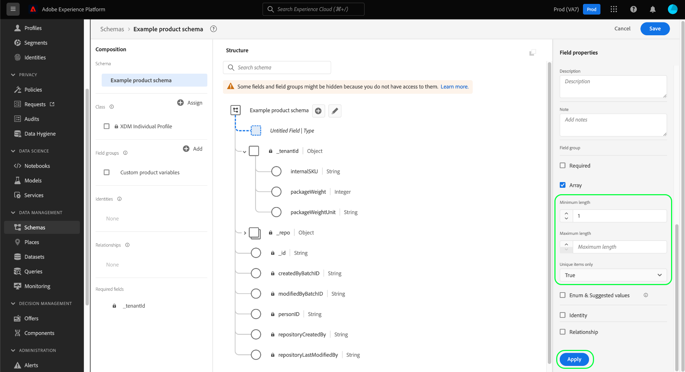

# Definieren von Array-Feldern in der Benutzeroberfläche

Beim Definieren eines XDM-Felds (Experience-Datenmodell) in der Benutzeroberfläche von Adobe Experience Platform können Sie dieses Feld als Array festlegen.

Der Inhalt des Arrays hängt von dem für dieses Feld ausgewählten [!UICONTROL Typ] ab. Wenn beispielsweise [!UICONTROL Typ] eines Felds auf &quot;[!UICONTROL String]&quot;gesetzt ist, wird das Feld durch Festlegen als Array als Array als Zeichenfolgen-Array gekennzeichnet. Wenn der [!UICONTROL Typ] des Felds auf einen Datentyp mit mehreren Feldern festgelegt ist, z. B. &quot;[!UICONTROL Postanschrift]&quot;, würde dies zu einem Array von Postadressobjekten werden, die dem Datentyp entsprechen.

Nachdem Sie [ein neues Feld in der Benutzeroberfläche](./overview.md#define) definiert haben, können Sie es als Array-Feld festlegen, indem Sie in der rechten Leiste das Kontrollkästchen **[!UICONTROL Array]** aktivieren.

Sobald das Kontrollkästchen aktiviert ist, werden in der rechten Leiste zusätzliche Steuerelemente angezeigt, mit denen Sie das Array optional weiter einschränken können. Wenn Sie eine bestimmte Einschränkung nicht erzwingen möchten, lassen Sie das Feld leer.

Die zusätzlichen Konfigurationssteuerelemente für Arrays lauten wie folgt:

| Feldeigenschaft | Beschreibung |
| --- | --- |
| [!UICONTROL Mindestlänge] | Die Mindestanzahl von Elementen, die das Array enthalten muss, damit die Aufnahme erfolgreich ist. |
| [!UICONTROL Maximale Länge] | Die maximale Anzahl von Elementen, die das Array enthalten muss, damit die Aufnahme erfolgreich ist. |
| [!UICONTROL Nur eindeutige Elemente] | Wenn auf &quot;[!UICONTROL True]&quot;gesetzt, muss jedes Element im Array eindeutig sein, damit die Aufnahme erfolgreich ist. |

{style=&quot;table-layout:auto&quot;}

Nachdem Sie die Konfiguration des Felds abgeschlossen haben, wählen Sie **[!UICONTROL Anwenden]** aus, um die Änderung auf das Schema anzuwenden.

Die Arbeitsfläche wird aktualisiert, um die am Feld vorgenommenen Änderungen widerzuspiegeln. Beachten Sie, dass der Datentyp, der neben dem Feldnamen auf der Arbeitsfläche angezeigt wird, mit einem Paar eckiger Klammern (`[]`) angehängt wird, was angibt, dass das Feld ein Array dieses Datentyps darstellt.

## Nächste Schritte

In diesem Handbuch wurde beschrieben, wie Sie ein Array-Feld in der Benutzeroberfläche definieren. Informationen zum Definieren anderer XDM-Feldtypen im [!DNL Schema Editor] finden Sie in der Übersicht zu [Definieren von Feldern in der Benutzeroberfläche](./overview.md#special).
