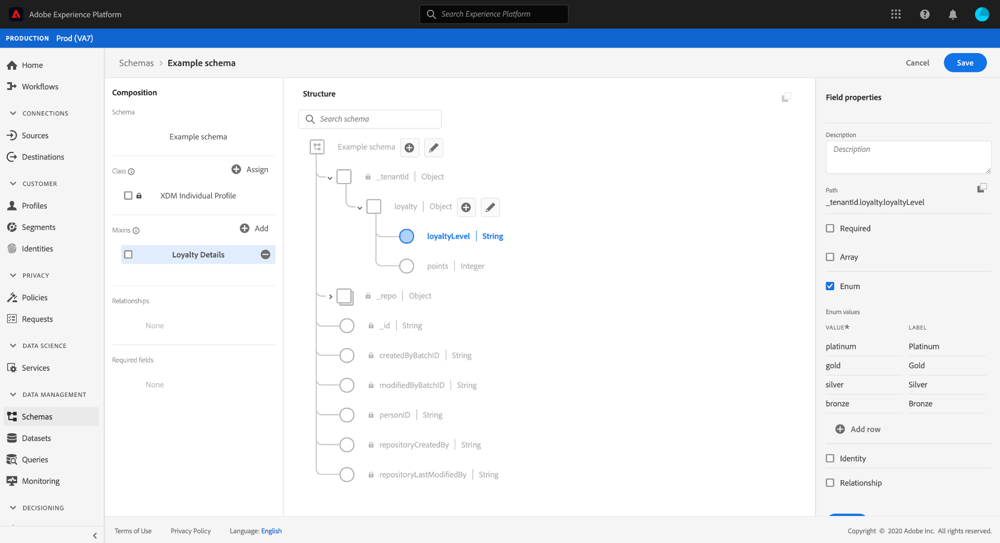

# Definieren von Aufzählungsfeldern in der Benutzeroberfläche {#enum}

>[!CONTEXTUALHELP]
>id="platform_xdm_enum_suggestedvalue"
>title="Aufzählungen und empfohlene Werte"
>abstract="Ein Enum beschränkt ein Zeichenfolgenfeld so, dass nur Daten erfasst werden können, die mit einem vordefinierten Satz von Werten übereinstimmen. Alternativ können Sie einen Satz von vorgeschlagenen Werten für das Feld definieren, die die Aufnahme nicht einschränken, sondern die Attribute definieren, aus denen Sie in der Segmentierung auswählen können. Weitere Informationen finden Sie in der Dokumentation."

Im Experience-Datenmodell (XDM) stellt ein Enum-Feld ein Feld dar, das auf eine vordefinierte Liste zulässiger Werte beschränkt ist.

Wann [Definieren eines neuen Felds](./overview.md#define) In der Benutzeroberfläche von Adobe Experience Platform können Sie sie als Enum-Feld festlegen, indem Sie die **[!UICONTROL Enum]** in der rechten Leiste.

Nach Auswahl des Kontrollkästchens werden zusätzliche Steuerelemente angezeigt, mit denen Sie die Wertbegrenzungen für die Aufzählung festlegen können. Unter dem **[!UICONTROL Wert]** -Spalte müssen Sie den genauen Wert angeben, auf den Sie das Feld beschränken möchten. Dieser Wert muss den [!UICONTROL Typ] Sie für das Enum-Feld ausgewählt haben. Sie können optional eine benutzerfreundliche **[!UICONTROL Titel]** auch für die Beschränkung.

Um der Auflistung zusätzliche Einschränkungen hinzuzufügen, wählen Sie **[!UICONTROL Zeile hinzufügen]**.

Fügen Sie der Enum weiterhin die gewünschten Einschränkungen und optionalen Beschriftungen hinzu. Wenn Sie fertig sind, wählen Sie **[!UICONTROL Anwenden]** , um die Änderungen auf das Schema anzuwenden.

Die Arbeitsfläche wird entsprechend den Änderungen aktualisiert. Wenn Sie dieses Schema zukünftig untersuchen, können Sie die Begrenzungen für das Enum-Feld in der rechten Leiste anzeigen und bearbeiten.

## Nächste Schritte

In diesem Handbuch wurde beschrieben, wie Sie in der Benutzeroberfläche ein Enum-Feld definieren. Siehe Übersicht unter [Definieren von Feldern in der Benutzeroberfläche](./overview.md#special) , um zu erfahren, wie Sie andere XDM-Feldtypen im [!DNL Schema Editor].
