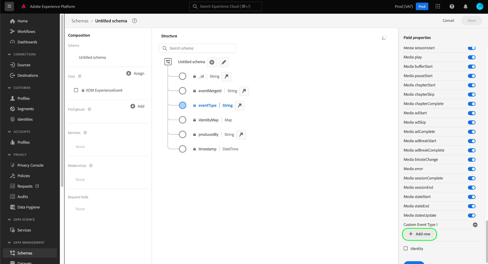
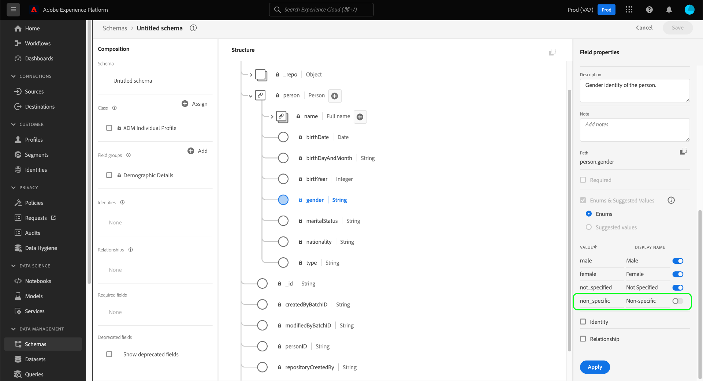

# Definieren von Auflistungen und vorgeschlagenen Werten in der Benutzeroberfläche {#enums-and-suggested-values}

>[!CONTEXTUALHELP]
>id="platform_xdm_enum_suggestedvalue"
>title="Auflistungen und empfohlene Werte"
>abstract="Ein **Enum** beschränkt ein Zeichenfolgenfeld so, dass nur Daten erfasst werden können, die mit einem vordefinierten Satz von Werten übereinstimmen. Jeder Enum-Einschränkung kann ein **Anzeigename** die Dropdown-Listen mit Attributen in der Segmentierungsbenutzeroberfläche füllt. **Vorgeschlagene Werte** für ein Feld die Erfassung nicht einschränken und nur die in der Segmentierung angezeigten Anzeigenamen bestimmen. Wenn Sie mehrere Schemas haben, die ein Feld teilen, das zu einer gemeinsamen Klasse oder Feldergruppe gehört, und Sie verschiedene Auflistungen oder vorgeschlagene Werte für dieses Feld zwischen den einzelnen Schemas definieren, werden diese Werte zusammengeführt und im Vereinigungsschema angehängt."

Im Experience-Datenmodell (XDM) kann einem Zeichenfolgenfeld ein vordefinierter Satz von akzeptierten oder vorgeschlagenen Werten zugewiesen werden, um besser steuern zu können, welche Werte in dieses Feld aufgenommen werden oder wie es sich bei der Segmentierung verhalten wird.

**[!UICONTROL Enums]** beschränken Sie die Werte, die für ein Zeichenfolgenfeld erfasst werden können, auf einen vordefinierten Satz. Wenn Sie versuchen, Daten in ein Enum-Feld zu erfassen und der Wert mit keinem der in der Konfiguration definierten Werte übereinstimmt, wird die Aufnahme verweigert.

Im Gegensatz zu Auflistungen wird die **[!UICONTROL Vorgeschlagene Werte]** -Option ermöglicht es, einen Satz empfohlener Werte für ein Zeichenfolgenfeld zu kennzeichnen, das die erfassten Werte nicht einschränkt. Stattdessen wirken sich die vorgeschlagenen Werte darauf aus, welche vordefinierten Werte im [Segmentierungsbenutzeroberfläche](../../../segmentation/ui/overview.md) , wenn das Zeichenfolgenfeld als Attribut eingefügt wird.

Wann [Definieren eines neuen Felds](./overview.md#define) in der Adobe Experience Platform-Benutzeroberfläche und legen Sie den Typ auf [!UICONTROL Zeichenfolge], erhalten Sie die Möglichkeit, eine [enum](#enum) oder [empfohlene Werte](#suggested-values) für dieses Feld.

## Definieren einer Enumeration {#enum}

Auswählen **[!UICONTROL Auflistungen und empfohlene Werte]**, wählen Sie **[!UICONTROL Enums]**. Es werden zusätzliche Steuerelemente angezeigt, mit denen Sie die Wertbegrenzungen für die Enumeration angeben können. Um eine Einschränkung hinzuzufügen, wählen Sie **[!UICONTROL Zeile hinzufügen]**.

Unter dem **[!UICONTROL Wert]** -Spalte müssen Sie den genauen Wert angeben, auf den Sie das Feld beschränken möchten. Sie können optional eine benutzerfreundliche **[!UICONTROL Anzeigename]** auch für die Beschränkung, was sich auf die Darstellung des Werts in der Segmentierung auswirkt.

Weitere Verwendung **[!UICONTROL Zeile hinzufügen]** , um die gewünschten Einschränkungen und optionalen Beschriftungen zur Enumeration hinzuzufügen, oder wählen Sie das Löschsymbol () neben einer zuvor hinzugefügten Zeile, um sie zu entfernen. Wenn Sie fertig sind, wählen Sie **[!UICONTROL Anwenden]** , um die Änderungen auf das Schema anzuwenden.

Die Arbeitsfläche wird entsprechend den Änderungen aktualisiert. Wenn Sie dieses Schema zukünftig untersuchen, können Sie die Begrenzungen für das Enum-Feld in der rechten Leiste anzeigen und bearbeiten.

## Definieren empfohlener Werte {#suggested-values}

Auswählen **[!UICONTROL Auflistungen und empfohlene Werte]**, wählen Sie **[!UICONTROL Vorgeschlagene Werte]** um zusätzliche Steuerelemente anzuzeigen. Wählen Sie von hier aus **[!UICONTROL Zeile hinzufügen]** , um die vorgeschlagenen Werte hinzuzufügen.

Unter dem **[!UICONTROL Anzeigename]** geben Sie einen benutzerfreundlichen Namen für den Wert ein, wie er in der Segmentierungsbenutzeroberfläche angezeigt werden soll. Um weitere empfohlene Werte hinzuzufügen, wählen Sie **[!UICONTROL Zeile hinzufügen]** und wiederholen Sie den Vorgang nach Bedarf. Um eine zuvor hinzugefügte Zeile zu entfernen, wählen Sie  neben der betreffenden Zeile.

Wenn Sie fertig sind, wählen Sie **[!UICONTROL Anwenden]** , um die Änderungen auf das Schema anzuwenden.

>[!NOTE]
>
>Es gibt eine ungefähre Verzögerung von fünf Minuten, bis die aktualisierten vorgeschlagenen Werte eines Felds in der Segmentierungsbenutzeroberfläche angezeigt werden.

### Verwalten von vorgeschlagenen Werten für Standardfelder

Einige Felder aus Standard-XDM-Komponenten enthalten ihre eigenen empfohlenen Werte, z. B. `eventType` von [[!UICONTROL XDM ExperienceEvent] class](../../classes/experienceevent.md). Sie können zwar zusätzliche empfohlene Werte für ein Standardfeld erstellen, jedoch keine von Ihrem Unternehmen nicht definierten vorgeschlagenen Werte ändern oder entfernen. Bei der Anzeige eines Standardfelds in der Benutzeroberfläche werden die vorgeschlagenen Werte angezeigt, sind jedoch schreibgeschützt.

Um neue empfohlene Werte für ein Standardfeld hinzuzufügen, wählen Sie **[!UICONTROL Zeile hinzufügen]**. Um einen vorgeschlagenen Wert zu entfernen, der zuvor von Ihrer Organisation hinzugefügt wurde, wählen Sie  neben der betreffenden Zeile.

<!-- ### Removing suggested values for standard fields

Only suggested values that you define can be removed from a standard field. Existing suggested values can be disabled so that they no longer appear in the segmentation dropdown, but they cannot be removed outright.

For example, consider a profile schema where the a suggested value for the standard `person.gender` field is disabled:

In this example, the display name "[!UICONTROL Non-specific]" is now disabled from being shown in the segmentation dropdown list. However, the value `non_specific` is still part of the list of enumerated fields and is therefore still allowed on ingestion. In other words, you cannot disable the actual enum value for the standard field as it would go against the principle of only allowing changes that make a field less restrictive.

See the [section below](#evolution) for more information on the rules for updating enums and suggested values for existing schema fields. -->

## Evolutionsregeln für Auflistungen und empfohlene Werte {#evolution}

Nachdem ein Schema mit einem Enum-Feld verwendet wurde, um Daten in Platform aufzunehmen, müssen alle weiteren Änderungen an der Schemadefinition den bereits im System vorhandenen Daten entsprechen. Im Allgemeinen können Änderungen an einem vorhandenen Feld nur dieses Feld betreffen **less** restriktiv sein. Ein Feld kann nicht restriktiver gestaltet werden als es bereits ist.

Bei Auflistungen und vorgeschlagenen Werten gelten die folgenden Regeln für die Nachaufnahme:

* You **CAN** Fügen Sie empfohlene Werte für Standard- und benutzerdefinierte Felder mit vorhandenen vorgeschlagenen Werten hinzu.
* You **CAN** Entfernen Sie vorgeschlagene Werte aus benutzerdefinierten Feldern mit vorhandenen vorgeschlagenen Werten.
* You **CAN** Fügen Sie neue Enum-Werte für ein vorhandenes benutzerdefiniertes Enum-Feld hinzu.
* You **CAN** Ändern Sie die Enum-Werte eines benutzerdefinierten Felds in empfohlene Werte oder konvertieren Sie sie in eine Zeichenfolge ohne Enum oder vorgeschlagene Werte. **Dieser Schalter kann nach der Anwendung nicht mehr rückgängig gemacht werden.**
* You **CANNOT** Entfernen Sie Auflistungen oder vorgeschlagene Werte aus Standardfeldern.
* You **CANNOT** Fügen Sie Enum-Werte zu einem Feld ohne vorhandene Enumeration hinzu.
* You **CANNOT** weniger als alle vorhandenen Enum-Werte für ein benutzerdefiniertes Feld entfernen.
* You **CANNOT** Wechsel von vorgeschlagenen Werten zu einer Enumeration.

## Zusammenführen von Regeln für Auflistungen und empfohlene Werte {#merging}

Wenn mehrere Schemas dasselbe Enum-Feld mit unterschiedlichen Konfigurationen verwenden und diese Schemas in einer Vereinigung enthalten sind, gelten bestimmte Regeln für die Abstimmung von Enum-Unterschieden. Die genauen Regeln hängen davon ab, ob die Schemas, die auf dasselbe Standardfeld verweisen (wie `eventType`) oder wenn sie in verschiedenen Feldergruppen auf denselben benutzerdefinierten Feldpfad verweisen.

Wenn auf dasselbe Standardfeld verwiesen wird:

* Alle weiteren empfohlenen Werte sind **ANGEHÄNGT** in der Union.
* An den vorgeschlagenen Werten für denselben Enum-Schlüssel werden folgende Aktualisierungen vorgenommen: **AKTUALISIERT** in der Union.

Wenn Sie in verschiedenen Feldgruppen auf denselben benutzerdefinierten Feldpfad verweisen:

* Alle weiteren empfohlenen Werte sind **ANGEHÄNGT** in der Union.
* Wenn derselbe zusätzliche empfohlene Wert in mehr als einem Schema definiert ist, werden diese Werte **ZUSAMMENGED** in der Union. Mit anderen Worten, derselbe vorgeschlagene Wert wird nach dem Zusammenführen nicht zweimal angezeigt.

## Validierungsbeschränkungen

Aufgrund der aktuellen Systembeschränkungen gibt es zwei Fälle, in denen eine Enumeration vom System während der Erfassung nicht validiert wird:

1. Die Enumeration wird auf einer [Array-Feld](./array.md).
1. Der Enum ist in der Schemahierarchie auf mehr als einer Ebene definiert.

## Nächste Schritte

In diesem Handbuch wurde beschrieben, wie Sie Auflistungen und empfohlene Werte für Zeichenfolgenfelder in der Benutzeroberfläche definieren. Informationen zum Verwalten von Auflistungen und empfohlenen Werten mithilfe der Schema Registry-API finden Sie in den folgenden [Tutorial](../../tutorials/suggested-values.md).

Erfahren Sie, wie Sie andere XDM-Feldtypen im [!DNL Schema Editor], siehe Übersicht unter [Definieren von Feldern in der Benutzeroberfläche](./overview.md#special).
