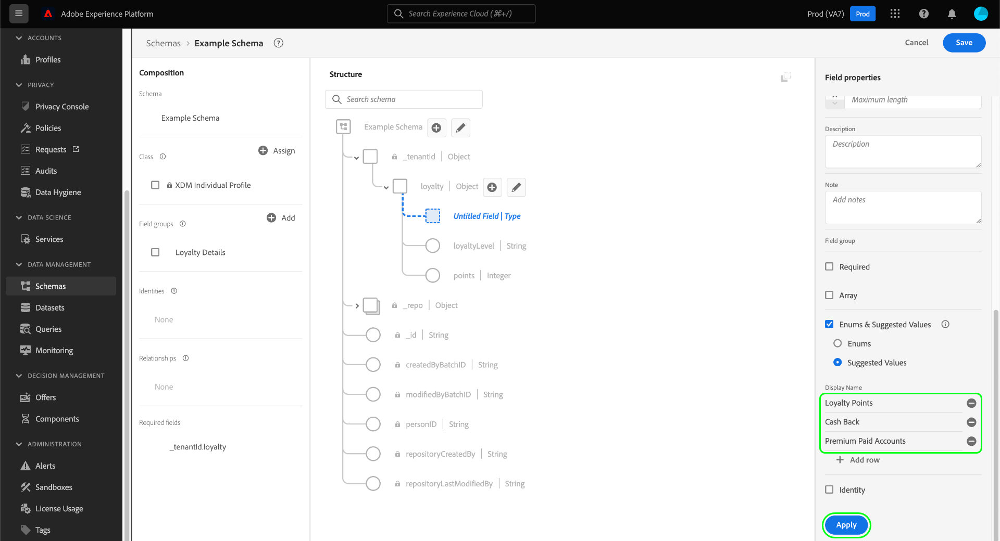

# Definieren von Aufzählungen und vorgeschlagenen Werten in der Benutzeroberfläche {#enums-and-suggested-values}

>[!CONTEXTUALHELP]
>id="platform_xdm_enum_suggestedvalue"
>title="Aufzählungen und empfohlene Werte"
>abstract="Eine **Aufzählung** beschränkt ein Zeichenfolgen-Feld so, dass nur Daten aufgenommen werden können, die mit einem vordefinierten Satz von Werten übereinstimmen. Jeder Aufzählungs-Beschränkung kann ein **Anzeigename** zugewiesen werden, mit dem in der Segmentierungs-Benutzeroberfläche Attribut-Dropdown-Listen befüllt werden. **Vorgeschlagene Werte** für ein Feld schränken die Aufnahme nicht ein, sondern bestimmen nur die in der Segmentierung dargestellten Anzeigenamen. Wenn Sie mehrere Schemata haben, die ein Feld gemeinsam nutzen, das zu einer gemeinsamen Klasse oder Feldergruppe gehört, und Sie zwischen den einzelnen Schemata unterschiedliche Aufzählungen oder vorgeschlagene Werte für dieses Feld definieren, werden diese Werte zusammengeführt und im Vereinigungsschema angefügt."

Im Experience-Datenmodell (XDM) kann einem Zeichenfolgenfeld ein vordefinierter Satz von akzeptierten oder empfohlenen Werten zugewiesen werden, um besser steuern zu können, welche Werte in dieses Feld aufgenommen werden oder wie es sich bei der Segmentierung verhält.

**[!UICONTROL Auflistungen]** beschränken die Werte, die für ein Zeichenfolgenfeld aufgenommen werden können, auf einen vordefinierten Satz. Wenn Sie versuchen, Daten in ein Aufzählungsfeld aufzunehmen, und der Wert mit keinem der in der Konfiguration definierten übereinstimmt, wird die Aufnahme verweigert.

Im Gegensatz zu Auflistungen ermöglicht die Option **[!UICONTROL Vorgeschlagene Werte]**, einen Satz empfohlener Werte für ein Zeichenfolgenfeld zu kennzeichnen, die die Werte, die es aufnehmen kann, nicht einschränken. Stattdessen beeinflussen vorgeschlagene Werte, welche vordefinierten Werte in der [Segmentierungsbenutzeroberfläche) verfügbar sind](../../../segmentation/ui/overview.md) wenn das Zeichenfolgenfeld als Attribut einbezogen wird.

Beim [Definieren eines neuen Felds](./overview.md#define) in der Benutzeroberfläche von Adobe Experience Platform und Festlegen des Typs auf [!UICONTROL Zeichenfolge] haben Sie die Möglichkeit, für dieses Feld [Aufzählung](#enum) oder [empfohlene Werte](#suggested-values) zu definieren.

In diesem Dokument wird beschrieben, wie Sie Aufzählungen und empfohlene Werte im Arbeitsbereich [!UICONTROL Schemata] der Benutzeroberfläche definieren. Sehen Sie sich das folgende Video an, um einen schnellen Überblick über Auflistungen und empfohlene Werte zu erhalten, einschließlich ihrer Konfiguration in der Benutzeroberfläche und ihrer Auswirkungen auf nachgelagerte Bereiche:

>[!VIDEO](https://video.tv.adobe.com/v/3409501/?quality=12&learn=on)

## Aufzählung definieren {#enum}

Wählen Sie **[!UICONTROL Auflistungen und empfohlene Werte]** und dann **[!UICONTROL Auflistungen]** aus. Es werden zusätzliche Steuerelemente angezeigt, mit denen Sie die Werteeinschränkungen für die Aufzählung angeben können. Um eine Einschränkung hinzuzufügen, wählen Sie **[!UICONTROL Zeile hinzufügen]** aus.

Unter der Spalte **[!UICONTROL Wert]** müssen Sie den genauen Wert angeben, auf den Sie das Feld beschränken möchten. Optional können Sie auch einen benutzerfreundlichen **[!UICONTROL Anzeigenamen]** für die Einschränkung angeben, der sich darauf auswirkt, wie der Wert in der Segmentierung dargestellt wird.

Verwenden Sie weiterhin **[!UICONTROL Zeile hinzufügen]**, um der Aufzählung die gewünschten Einschränkungen und optionalen Beschriftungen hinzuzufügen, oder wählen Sie das Löschsymbol () neben einer zuvor hinzugefügten Zeile aus, um sie zu entfernen. Wenn Sie fertig sind, wählen **[!UICONTROL Anwenden]** aus, um die Änderungen auf das Schema anzuwenden.

Die Arbeitsfläche wird mit den Änderungen aktualisiert. Wenn Sie dieses Schema in Zukunft untersuchen, können Sie die Einschränkungen für das Aufzählungsfeld in der rechten Leiste anzeigen und bearbeiten.

## Vorgeschlagene Werte definieren {#suggested-values}

Wählen Sie **[!UICONTROL Aufzählungen und vorgeschlagene Werte]** und dann **[!UICONTROL Vorgeschlagene Werte]** aus, um zusätzliche Steuerelemente anzuzeigen. Wählen Sie hier **[!UICONTROL Zeile hinzufügen]**, um vorgeschlagene Werte hinzuzufügen.

Geben **[!UICONTROL in der]** „Anzeigename“ einen benutzerfreundlichen Namen für den Wert ein, wie er in der Segmentierungs-Benutzeroberfläche angezeigt werden soll. Um weitere vorgeschlagene Werte hinzuzufügen, wählen Sie **[!UICONTROL Zeile hinzufügen]** erneut aus und wiederholen Sie den Vorgang nach Bedarf. Um eine zuvor hinzugefügte Zeile zu entfernen, klicken Sie  neben der betreffenden Zeile.

Wenn Sie fertig sind, wählen **[!UICONTROL Anwenden]** aus, um die Änderungen auf das Schema anzuwenden.

>[!NOTE]
>
>Die aktualisierten empfohlenen Werte eines Felds, die in der Segmentierungs-Benutzeroberfläche angezeigt werden sollen, vergehen ungefähr fünf Minuten.

### Vorgeschlagene Werte für Standardfelder verwalten

Einige Felder aus standardmäßigen XDM-Komponenten enthalten eigene vorgeschlagene Werte, z. B. `eventType` aus der Klasse [[!UICONTROL XDM ExperienceEvent] ](../../classes/experienceevent.md). Sie können zwar zusätzliche vorgeschlagene Werte für ein Standardfeld erstellen, Sie können jedoch keine vorgeschlagenen Werte, die nicht von Ihrem Unternehmen definiert wurden, ändern oder entfernen. Beim Anzeigen eines Standardfelds in der Benutzeroberfläche werden die vorgeschlagenen Werte angezeigt, sind aber schreibgeschützt.

Um neue vorgeschlagene Werte für ein Standardfeld hinzuzufügen, wählen Sie **[!UICONTROL Zeile hinzufügen]** aus. Um einen vorgeschlagenen Wert zu entfernen, der zuvor von Ihrer Organisation hinzugefügt wurde, wählen Sie  neben der betreffenden Zeile aus.

<!-- ### Removing suggested values for standard fields

Only suggested values that you define can be removed from a standard field. Existing suggested values can be disabled so that they no longer appear in the segmentation dropdown, but they cannot be removed outright.

For example, consider a profile schema where the a suggested value for the standard `person.gender` field is disabled:

In this example, the display name "[!UICONTROL Non-specific]" is now disabled from being shown in the segmentation dropdown list. However, the value `non_specific` is still part of the list of enumerated fields and is therefore still allowed on ingestion. In other words, you cannot disable the actual enum value for the standard field as it would go against the principle of only allowing changes that make a field less restrictive.

See the [section below](#evolution) for more information on the rules for updating enums and suggested values for existing schema fields. -->

## Evolutionsregeln für Aufzählungen und empfohlene Werte {#evolution}

Nachdem ein Schema mit einem Aufzählungsfeld verwendet wurde, um Daten in Experience Platform aufzunehmen, müssen alle weiteren Änderungen an der Schemadefinition den bereits im System vorhandenen Daten entsprechen. Im Allgemeinen können Änderungen, die an einem vorhandenen Feld vorgenommen werden, dieses Feld nur **weniger** einschränkend machen. Ein Feld kann nicht restriktiver gestaltet werden, als es bereits ist.

Bei Auflistungen und empfohlenen Werten gelten nach der Aufnahme die folgenden Regeln:

* Sie **vorgeschlagene** für standardmäßige und benutzerdefinierte Felder mit vorhandenen vorgeschlagenen Werten hinzufügen (KÖNNEN).
* Sie **vorgeschlagene** aus benutzerdefinierten Feldern mit vorhandenen vorgeschlagenen Werten entfernen (KANN).
* Sie **KÖNNEN** neue Aufzählungswerte für ein vorhandenes benutzerdefiniertes Aufzählungsfeld hinzufügen.
* Sie **** die Aufzählungswerte eines benutzerdefinierten Felds nur auf vorgeschlagene Werte umschalten oder es in eine Zeichenfolge ohne Aufzählung oder vorgeschlagene Werte konvertieren. **Dieser Schalter kann nach der Anwendung nicht mehr rückgängig gemacht werden.**
* Aufzählungen **empfohlene Werte können** aus Standardfeldern entfernt werden.
* Sie **AUFZÄHLUNGSWERTE NICHT** einem Feld ohne vorhandene AUFZÄHLUNG hinzufügen.
* Sie **KÖNNEN** weniger als alle vorhandenen Aufzählungswerte für ein benutzerdefiniertes Feld entfernen.
* Sie **NICHT** von vorgeschlagenen Werten zu einer Aufzählung wechseln.

## Zusammenführungsregeln für Auflistungen und empfohlene Werte {#merging}

Wenn mehrere Schemata dasselbe Aufzählungsfeld mit unterschiedlichen Konfigurationen verwenden und diese Schemata in einer Vereinigung enthalten sind, gelten bestimmte Regeln für die Abstimmung der Aufzählungsunterschiede. Die genauen Regeln hängen davon ab, ob die Schemas dasselbe Standardfeld referenzieren (z. B. `eventType`) oder ob sie in verschiedenen Feldergruppen auf denselben benutzerdefinierten Feldpfad verweisen.

Wenn auf dasselbe Standardfeld verwiesen wird:

* Alle weiteren vorgeschlagenen Werte sind **ANGEHÄNGT** in der Vereinigung.
* Aktualisierungen der vorgeschlagenen Werte für denselben Aufzählungsschlüssel werden in **Vereinigung** AKTUALISIERT).

Wenn in verschiedenen Feldergruppen auf denselben benutzerdefinierten Feldpfad verwiesen wird:

* Alle weiteren vorgeschlagenen Werte sind **ANGEHÄNGT** in der Vereinigung.
* Wenn derselbe zusätzliche vorgeschlagene Wert in mehr als einem Schema definiert ist, werden diese Werte **ZUSAMMENGEFÜHRT** in der Vereinigung gespeichert. Mit anderen Worten, derselbe vorgeschlagene Wert wird nach der Zusammenführung nicht zweimal angezeigt.

## Validierungsbeschränkungen

Aufgrund der aktuellen Systembeschränkungen gibt es zwei Fälle, in denen eine Aufzählung vom System während der Aufnahme nicht validiert wird:

1. Die Aufzählung wird in einem „Array[Feld“ ](./array.md).
1. Die Aufzählung ist mehr als eine Ebene tief in der Schemahierarchie definiert.

## Nächste Schritte

In diesem Handbuch wurde beschrieben, wie Sie Aufzählungen und empfohlene Werte für Zeichenfolgenfelder in der Benutzeroberfläche definieren. Informationen zum Verwalten von Auflistungen und empfohlenen Werten mithilfe der Schema Registry-API finden Sie im folgenden [Tutorial](../../tutorials/suggested-values.md).

Informationen zum Definieren anderer XDM-Feldtypen in der [!DNL Schema Editor] finden Sie in der Übersicht unter [Definieren von Feldern in der Benutzeroberfläche](./overview.md#special).
