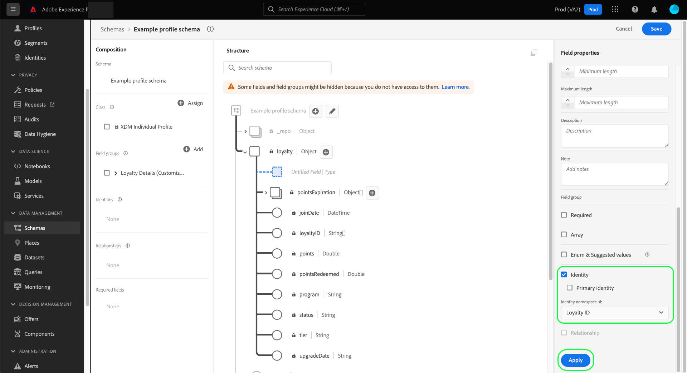

# Definieren von Identitätsfeldern in der Benutzeroberfläche

Im Experience-Datenmodell (XDM) stellt ein Identitätsfeld ein Feld dar, das zur Identifizierung einer einzelnen Person verwendet werden kann, die mit einem Datensatz- oder Zeitreihenereignis verbunden ist. In diesem Dokument wird beschrieben, wie Sie ein Identitätsfeld in der Adobe Experience Platform-Benutzeroberfläche definieren.

## Voraussetzungen

Identitätsfelder sind eine entscheidende Komponente bei der Erstellung von Identitätsdiagrammen für Kunden in Platform. Dies hat letztendlich Auswirkungen darauf, wie Echtzeit-Kundenprofil verschiedene Datenfragmente zusammenführt, um eine vollständige Ansicht des Kunden zu erhalten. Bevor Sie Identitätsfelder in Ihren Schemas definieren, lesen Sie die folgende Dokumentation, um mehr über die wichtigsten Dienste und Konzepte im Zusammenhang mit Identitätsfeldern zu erfahren:

* [Adobe Experience Platform Identity Service](../../../identity-service/home.md): Führt Identitäten zwischen Geräten und Systemen zusammen und verknüpft Datensätze anhand der Identitätsfelder, die von den entsprechenden XDM-Schemas definiert werden.
   * [Identity-Namespaces](../../../identity-service/namespaces.md): In Identity-Namespaces werden die verschiedenen Arten von Identitätsinformationen definiert, die sich auf eine einzelne Person beziehen können. Sie sind eine erforderliche Komponente für jedes Identitätsfeld.
* [Echtzeit-Kundenprofil](../../../profile/home.md): Nutzen von Identitätsdiagrammen für Kunden, um ein einheitliches Verbraucherprofil basierend auf aggregierten Daten aus mehreren Quellen bereitzustellen, die nahezu in Echtzeit aktualisiert werden.

## Identitätsfeld definieren {#define-a-identity-field}

>[!CONTEXTUALHELP]
>id="platform_schemas_identityField_primaryIdentityRestriction"
>title="Einschränkungen der primären Identität"
>abstract="Dieses Schema verwendet eine Feldergruppe, die zur Verwendung in einer bestimmten Quellverbindung vorgesehen ist. Für diese Verbindung muss identityMap als primäre Identität verwendet werden, weshalb sie automatisch festgelegt ist."

Wann [Definieren eines neuen Felds](./overview.md#define) in der Benutzeroberfläche können Sie es als Identitätsfeld festlegen, indem Sie die **[!UICONTROL Identität]** in der rechten Leiste.

Zusätzliche Steuerelemente werden angezeigt, nachdem Sie das Kontrollkästchen aktiviert haben. Wenn dieses Feld die primäre Identität für das Schema sein soll, wählen Sie die **[!UICONTROL Primäre Identität]** aktivieren.

>[!NOTE]
>
>Für ein einzelnes Schema können viele Identitätsfelder definiert sein, es kann jedoch nur eine primäre Identität geben. Alle Identitätsfelder (primär oder anderweitig) tragen zum Identitätsdiagramm für einen einzelnen Kunden bei, aber das Echtzeit-Kundenprofil verwendet beim Zusammenführen von Datenfragmenten nur die primäre Identität als &quot;Source of Truth&quot;. Wenn Sie ein Schema zur Verwendung im Profil aktivieren möchten, muss das Schema über eine primäre Identität verfügen.

under **[!UICONTROL Identitäts-Namespace]** verwenden, wählen Sie im Dropdown-Menü den entsprechenden Namespace für das Identitätsfeld aus. Von Adobe bereitgestellte Standard-Namespaces sowie alle benutzerdefinierten Namespaces, die von Ihrem Unternehmen definiert wurden, werden aufgelistet.

Wenn Sie fertig sind, wählen Sie **[!UICONTROL Anwenden]** , um die Änderung auf das Schema anzuwenden.

Die Arbeitsfläche wird aktualisiert, um die Änderungen widerzuspiegeln, wobei das ausgewählte Feld ein Fingerabdrucksymbol (), um sie als Identität zu kennzeichnen. In der linken Leiste wird das Identitätsfeld jetzt unter dem Namen der Klasse oder Schemafeldgruppe aufgeführt, die das Feld für das Schema bereitstellt.

Wenn das Feld auch als primäre Identität festgelegt wurde, wird es auch unter **[!UICONTROL Erforderliche Felder]** in der linken Leiste. Wenn das Identitätsfeld innerhalb der Schemastruktur verschachtelt ist, werden auch alle übergeordneten Felder nach Bedarf aufgelistet.

Wenn Sie eine primäre Identität für das Schema definiert haben, können Sie jetzt mit dem [Aktivieren des Schemas zur Verwendung im Echtzeit-Kundenprofil](../resources/schemas.md#profile).

## Nächste Schritte

In diesem Handbuch wurde beschrieben, wie Sie ein Identitätsfeld in der Benutzeroberfläche definieren. Da Daten mit diesem Schema erfasst werden, werden Ihre Identitätsdiagramme aktualisiert, um die Identitätsfelder des Schemas widerzuspiegeln. Siehe Handbuch im [Identitätsdiagramm-Viewer](../../../identity-service/ui/identity-graph-viewer.md) , um zu erfahren, wie Sie das private Diagramm Ihres Unternehmens in der Benutzeroberfläche untersuchen.

Siehe Übersicht unter [Definieren von Feldern in der Benutzeroberfläche](./overview.md#special) , um zu erfahren, wie Sie andere XDM-Feldtypen im [!DNL Schema Editor].
