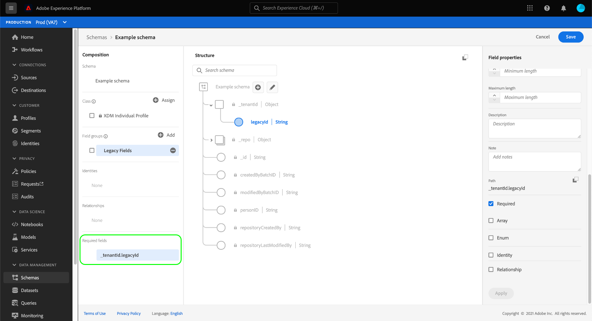

# Definieren erforderlicher Felder in der Benutzeroberfläche

Im Experience-Datenmodell (XDM) gibt ein erforderliches Feld an, dass ein gültiger Wert angegeben werden muss, damit ein bestimmter Datensatz oder ein Zeitreihenereignis bei der Datenerfassung akzeptiert werden kann. Häufige Anwendungsfälle für erforderliche Felder umfassen Informationen zur Benutzeridentität und Zeitstempel.

>[!IMPORTANT]
>
>Unabhängig davon, ob ein Schemafeld erforderlich ist oder nicht, akzeptiert Platform nicht `null` oder leere Werte für alle erfassten Felder. Wenn in einem Datensatz oder Ereignis kein Wert für ein bestimmtes Feld vorhanden ist, sollte der Schlüssel für dieses Feld aus der Aufnahme-Payload ausgeschlossen werden.

Wann [Definieren eines neuen Felds](./overview.md#define) In der Benutzeroberfläche von Adobe Experience Platform können Sie sie als erforderliches Feld festlegen, indem Sie die **[!UICONTROL Erforderlich]** in der rechten Leiste. Auswählen **[!UICONTROL Anwenden]** , um die Änderung auf das Schema anzuwenden.

Wenn das Feld ein Attribut auf der Stammebene unter dem Mandanten-ID-Objekt ist, wird sein Pfad sofort unter **[!UICONTROL Erforderliche Felder]** in der linken Leiste.

Wenn ein erforderliches Feld jedoch innerhalb eines Objekts verschachtelt ist, das selbst nicht als erforderlich markiert ist, wird das verschachtelte Feld nicht unter **[!UICONTROL Erforderliche Felder]** in der linken Leiste.

Im folgenden Beispiel wird die Variable `internalSKU` -Feld ist wie erforderlich festgelegt, aber sein übergeordnetes Objekt `SKUs` ist nicht. In diesem Fall würden keine Validierungsfehler auftreten, wenn `SKUs` wird bei der Aufnahme von Daten ausgeschlossen, auch wenn das untergeordnete Feld `internalSKU` als erforderlich markiert ist. Mit anderen Worten, während `SKUs` ist optional und muss eine `internalSKU` -Feld in das -Ereignis ein.

Wenn ein verschachteltes Feld in einem Schema immer erforderlich sein soll, müssen Sie auch alle übergeordneten Felder nach Bedarf festlegen (mit Ausnahme des Mandanten-ID-Objekts).

## Nächste Schritte

In diesem Handbuch wurde beschrieben, wie Sie ein erforderliches Feld in der Benutzeroberfläche definieren. Siehe Übersicht unter [Definieren von Feldern in der Benutzeroberfläche](./overview.md#special) Informationen zum Definieren anderer XDM-Feldtypen im [!DNL Schema Editor].
