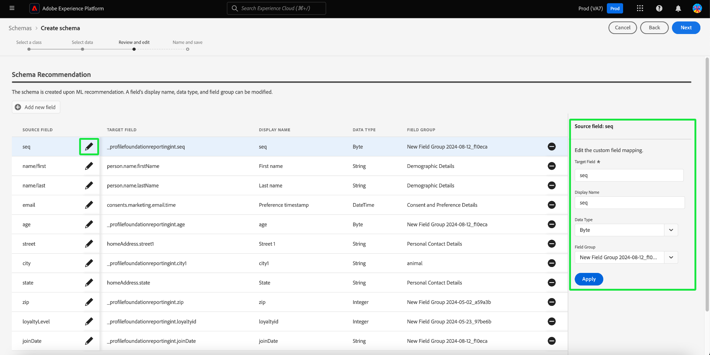

# Durch maschinelles Lernen unterstützte Schemaerstellung

>[!AVAILABILITY]
>
>* Die durch maschinelles Lernen unterstützte Schemaerstellung befindet sich derzeit in der Beta-Phase. Dokumentation und Funktionalitäten können sich ändern.

Verwenden Sie ML-Algorithmen, um ein Schema aus Beispieldaten zu generieren. Dieser Prozess spart Zeit und erhöht die Genauigkeit bei der Definition der Struktur, Felder und Datentypen für große komplexe Datensätze.

Mit der ML-Schemagenerierung können Sie schnell neue Datenquellen integrieren und die Fehler bei der manuellen Erstellung reduzieren. Nicht-technische Benutzende können es ohne zusätzlichen Aufwand verwenden, um Schemata zu generieren oder große und komplexe Datensätze zu verwalten. Diese Unterstützung beschleunigt den Prozess vom Abrufen von Daten zum Erhalten von Einblicken, da so neue Datenquellen einfacher kombiniert und Datenanalysen durchgeführt werden können.

## Erste Schritte

Dieses Tutorial setzt ein Grundverständnis der Anforderungen für die Schemaerstellung voraus. Bevor Sie mit diesem Handbuch fortfahren, sollten Sie das [Handbuch zur Benutzeroberfläche zum Erstellen und Bearbeiten von Schemata“ &#x200B;](./resources/schemas.md).

In diesem Handbuch wird erläutert, wie Sie Schemas mithilfe von Machine-Learning-Algorithmen (ML) erstellen, um ein Schema aus Beispieldaten zu generieren. Informationen [&#x200B; Erstellen von Schemata finden Sie im Handbuch zum &#x200B;](https://experienceleague.adobe.com/de/docs/experience-platform/xdm/ui/resources/schemas#add-field-groups) des Schemas oder im Dokument zu [feldbasierten Workflows im Schema-Editor](https://experienceleague.adobe.com/de/docs/experience-platform/xdm/ui/field-based-workflows) um Ihr Verständnis des Prozesses zur Schemaerstellung zu verbessern.

>[!NOTE]
>
>Sie können ein Schema auch mithilfe der [!DNL Schema Registry]-API erstellen. Um ein Schema manuell mit der API zu erstellen, lesen Sie zunächst das [[!DNL Schema Registry] Entwicklerhandbuch](../api/getting-started.md) bevor Sie das Tutorial zum [Erstellen eines Schemas mithilfe der API“ &#x200B;](../tutorials/create-schema-api.md).

## Navigieren Sie zum Workflow Schema erstellen . {#navigate-to-schema-creation-workflow}

Wählen Sie in der linken Navigation der Experience Platform-Benutzeroberfläche den Arbeitsbereich **[!UICONTROL Schemata]** aus. Der Arbeitsbereich **[!UICONTROL Schemata]** wird angezeigt. Wählen Sie **[!UICONTROL Schema erstellen]** aus, um ein neues Schema hinzuzufügen und einen Workflow zur Schemaerstellung zu starten.

## Erstellen eines Schemas {#create-a-schema}

Das [!UICONTROL Erstellen eines Schemas] wird angezeigt. Wählen Sie die Option **[ML-Assisted]** Schemaerstellung und dann **[!UICONTROL Select]** aus, um Ihre Auswahl zu bestätigen.

![Das Dialogfeld [!UICONTROL Schema erstellen] mit [!UICONTROL ML- Unterstützt] hervorgehoben.](../images/ui/ml-schema-creation/use-sample-csv.png)

### Basisklasse auswählen {#select-base-class}

Der [!UICONTROL Schema erstellen] wird angezeigt. Wählen Sie eine Basisklasse für Ihr Schema und dann **[!UICONTROL Weiter]** aus.

### CSV-Datei hochladen {#upload-csv}

Der **[!UICONTROL Daten auswählen]** des Erstellungs-Workflows wird angezeigt. Wählen Sie im Abschnitt **[!UICONTROL Dateien hochladen]** die Option **[!UICONTROL Dateien auswählen]** oder den Abschnitt **[!UICONTROL Dateien ziehen und ablegen]** aus. CSV-Datei vom Computer auswählen, um ein Schema zu generieren.

### Vorschau der Daten {#preview-data}

Im Abschnitt [!UICONTROL Datei hochladen] wird der Name der von Ihnen importierten CSV-Datei und im Abschnitt **[!UICONTROL Vorschau]** werden Beispieldatenzeilen aus der hochgeladenen Datei angezeigt. Wählen Sie **[!UICONTROL Weiter]**, um den Workflow fortzusetzen.

### Prüfen und Bearbeiten eines Schemas {#review-schema}

Der **[!UICONTROL „Überprüfen und Bearbeiten]** des Erstellungs-Workflows wird jetzt angezeigt, wobei die durch maschinelles Lernen unterstützte **[!UICONTROL Schemaempfehlung]** in einer tabellarischen Ansicht angezeigt wird. In dieser Phase können Sie Felder aus dem empfohlenen Schema, das vom Modell für maschinelles Lernen generiert wurde, bearbeiten, hinzufügen oder entfernen. Die Tabelle enthält die folgenden Felder:

| Feldname | Beschreibung |
|------------------|---------------------------------------------------------|
| [!UICONTROL Datentabelle] | Der Datensatz oder die Datenbank, aus dem/der das Feld stammt. |
| [!UICONTROL Source-Feld] | Der ursprüngliche Feldname aus dem Quellsystem. |
| [!UICONTROL Zielfeld] | Der Feldname im Zielsystem, auf dem die Daten zugeordnet werden. |
| [!UICONTROL Anzeigename] | Der Name, der zum Anzeigen des Felds in der Benutzeroberfläche verwendet wird. Dieser Name sollte benutzerfreundlicher oder beschreibender sein. |
| [!UICONTROL Datentyp] | Der Typ der im Feld gespeicherten Daten (z. B. `String`, `Date`). |
| [!UICONTROL Feldergruppe] | Eine Kategorisierung des Felds basierend auf seiner Verwendung oder seinem Kontext (z. B. [!UICONTROL Demografische Details], [!UICONTROL Commerce-]). |

#### Feld hinzufügen {#add-field}

Um ein Feld zum Schema hinzuzufügen, wählen Sie **[!UICONTROL Neues Feld hinzufügen]** aus.

Das [!UICONTROL Feld auswählen] wird angezeigt. Das Dialogfeld enthält ein Diagramm des Schemas in seiner aktuellen Form. Wählen Sie das gewünschte Feld aus und klicken **[auf]** , um dem Schema ein neues Feld hinzuzufügen. Klicken Sie **[Abbrechen]**, um das Dialogfeld bei Bedarf zu schließen.

Im empfohlenen Schema wird eine neue Zeile angezeigt. Sie können das Feld jetzt bearbeiten.

#### Bearbeiten eines Felds {#edit-field}

Um ein Feld zu bearbeiten, klicken Sie auf das Stiftsymbol der Zeile, die Sie bearbeiten möchten. Rechts wird ein Detailbereich angezeigt, in dem Sie die Zuordnung benutzerdefinierter Felder bearbeiten können. Das Detailbedienfeld enthält die [!UICONTROL Zielfeld], [!UICONTROL Anzeigename], [!UICONTROL Datentyp] und [!UICONTROL Feldergruppe]. Nehmen Sie die erforderlichen Änderungen vor und wählen Sie **[!UICONTROL Übernehmen]** zur Bestätigung aus. Klicken Sie erneut auf das Stiftsymbol, um das Detailbedienfeld zu schließen.

#### Entfernen eines Felds {#remove-field}

Um ein Feld zu entfernen, klicken Sie auf das Minussymbol in einer Zeile, die Sie löschen möchten.

>[!CAUTION]
>
>Beim Entfernen dieses Elements wird kein Bestätigungsdialogfeld angezeigt.

#### Genehmigen des empfohlenen Schemas {#approve}

Um Ihr empfohlenes Schema zu genehmigen und den Workflow **[!UICONTROL Schema erstellen]** fortzusetzen, wählen Sie **[Weiter]** aus.

### Benennen und speichern des Schemas {#name-and-save}

Der **[!UICONTROL Name und Speichern]** des Erstellungs-Workflows wird angezeigt. Geben Sie einen **[Anzeigenamen des Schemas]** und eine optionale Beschreibung ein. Der Abschnitt **[Schema generiert]** enthält ein Diagramm zum ML-generierten Schema. Wählen Sie **[Beenden]** aus, um den Workflow zur Schemaerstellung abzuschließen.

### Im Schema-Editor anzeigen {#view-in-editor}

Der Schema-Editor wird mit dem neu erstellten Schema auf der Arbeitsfläche angezeigt. Wählen Sie **[!UICONTROL Speichern]** aus, um zum Arbeitsbereich [!UICONTROL Schemata] zurückzukehren.

## Nächste Schritte

Nachdem Sie Ihr Schema erstellt haben, können Sie den Schema-Editor verwenden, um bei Bedarf weitere Änderungen vorzunehmen. Ihr neues Schema kann jetzt in Ihre Datenquellen integriert und für die Datenanalyse verwendet werden.

Weitere Informationen zur Verwendung [&#x200B; Schema-Editors finden &#x200B;](https://experienceleague.adobe.com/de/docs/experience-platform/xdm/ui/resources/schemas#edit) im Handbuch zum Bearbeiten eines vorhandenen Schemas .
