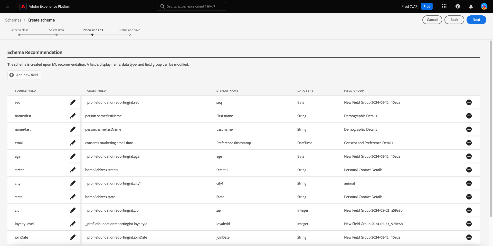

# Erstellung von Schemata, die durch maschinelles Lernen unterstützt werden

>[!AVAILABILITY]
>
>* Die Erstellung von Schemas, die durch maschinelles Lernen unterstützt werden, befindet sich derzeit in der Betaphase. Dokumentation und Funktionalitäten können sich ändern.

Verwenden Sie ML-Algorithmen, um ein Schema aus Beispieldaten zu generieren. Dieser Prozess spart Zeit und erhöht die Genauigkeit beim Definieren der Struktur, Felder und Datentypen für große komplexe Datensätze.

Mit der ML-Schemaerstellung können Sie neue Datenquellen schnell integrieren und die Fehler durch manuelle Erstellung reduzieren. Nicht-technische Benutzer können sie verwenden, um Schemas zu generieren oder große und komplexe Datensätze ohne zusätzlichen Aufwand zu verwalten. Diese Unterstützung beschleunigt den Prozess vom Abrufen von Daten bis hin zum Erlangen von Einblicken, da sie die Kombination neuer Datenquellen und die Durchführung von Datenanalysen erleichtert.

## Erste Schritte

Dieses Tutorial setzt ein Verständnis der Anforderungen für die Schemaerstellung voraus. Bevor Sie mit diesem Handbuch fortfahren, sollten Sie das [UI-Handbuch zum Erstellen und Bearbeiten von Schemas](./resources/schemas.md) lesen.

In diesem Handbuch wird erläutert, wie Sie Schemas mithilfe von ML-Algorithmen (Machine Learning) erstellen, um ein Schema aus Beispieldaten zu generieren. Informationen zum Erstellen von Schemas oder zum Dokument zu felderbasierten Workflows im Schema-Editor ](https://experienceleague.adobe.com/en/docs/experience-platform/xdm/ui/field-based-workflows) finden Sie im [Handbuch zum Workflow für die manuelle Schemaerstellung](https://experienceleague.adobe.com/en/docs/experience-platform/xdm/ui/resources/schemas#add-field-groups) , um das Verständnis für den Erstellungsprozess von Schemas zu verbessern.[

>[!NOTE]
>
>Sie können ein Schema auch mithilfe der [!DNL Schema Registry] -API erstellen. Um ein Schema manuell mithilfe der API zu erstellen, lesen Sie zunächst das [[!DNL Schema Registry] Entwicklerhandbuch](../api/getting-started.md) , bevor Sie das Tutorial zum Erstellen eines Schemas mit der API](../tutorials/create-schema-api.md) ausführen.[

## Navigieren Sie zum Workflow Schema erstellen . {#navigate-to-schema-creation-workflow}

Wählen Sie im linken Navigationsbereich der Platform-Benutzeroberfläche den Arbeitsbereich **[!UICONTROL Schemas]** aus. Der Arbeitsbereich **[!UICONTROL Schemas]** wird angezeigt. Wählen Sie **[!UICONTROL Schema erstellen]** aus, um ein neues Schema hinzuzufügen und damit einen Workflow zur Schemaerstellung zu starten.

## Erstellen eines Schemas {#create-a-schema}

Das Dialogfeld [!UICONTROL Schema erstellen] wird angezeigt. Wählen Sie die Schemaerstellungsoption **[ML-Assisted]** und danach **[!UICONTROL Select]** aus, um Ihre Auswahl zu bestätigen.

![Das Dialogfeld [!UICONTROL Schema erstellen] mit der Markierung [!UICONTROL ML- Assisted]](../images/ui/ml-schema-creation/use-sample-csv.png).

### Basisklasse auswählen {#select-base-class}

Der Workflow [!UICONTROL Schema erstellen] wird angezeigt. Wählen Sie eine Basisklasse für Ihr Schema aus, gefolgt von **[!UICONTROL Weiter]**.

### CSV-Datei hochladen {#upload-csv}

Die Phase **[!UICONTROL Daten auswählen]** des Erstellungs-Workflows wird angezeigt. Wählen Sie im Abschnitt **[!UICONTROL Dateien hochladen]** die Option **[!UICONTROL Dateien auswählen]** oder den Abschnitt **[!UICONTROL Dateien ziehen und ablegen]** aus. Wählen Sie eine .csv -Datei von Ihrem Computer aus, um ein Schema zu generieren.

### Vorschau der Daten {#preview-data}

Im Abschnitt [!UICONTROL Datei hochladen] wird der Name der von Ihnen importierten CSV-Datei und im Abschnitt **[!UICONTROL Vorschau]** werden Zeilen mit Beispieldaten aus der hochgeladenen Datei angezeigt. Wählen Sie **[!UICONTROL Weiter]** aus, um den Workflow fortzusetzen.

### Schema überprüfen und bearbeiten {#review-schema}

Die Phase **[!UICONTROL Überprüfen und Bearbeiten]** des Erstellungs-Workflows wird jetzt angezeigt und zeigt die durch maschinelles Lernen unterstützte **[!UICONTROL Schema-Empfehlung]** in einer tabellarischen Ansicht an. In dieser Phase können Sie Felder bearbeiten, hinzufügen oder aus dem vom maschinellen Lernmodell generierten empfohlenen Schema entfernen. Die Tabelle enthält die folgenden Felder:

| Feldname | Beschreibung |
|------------------|---------------------------------------------------------|
| [!UICONTROL Datentabelle] | Der Datensatz oder die Datenbank, aus dem/der das Feld stammt. |
| [!UICONTROL Source-Feld] | Der ursprüngliche Feldname aus dem Quellsystem. |
| [!UICONTROL Zielfeld] | Der Feldname im Zielsystem, dem die Daten zugeordnet werden. |
| [!UICONTROL Anzeigename] | Der Name, mit dem das Feld in der Benutzeroberfläche angezeigt wird. Dieser Name sollte benutzerfreundlicher oder beschreibender sein. |
| [!UICONTROL Datentyp] | Der Typ der im Feld gespeicherten Daten (z. B. `String`, `Date`). |
| [!UICONTROL Feldergruppe] | Eine Kategorisierung des Felds basierend auf seiner Verwendung oder seinem Kontext (z. B. [!UICONTROL Demografische Details], [!UICONTROL Commerce-Details]). |

#### Feld hinzufügen {#add-field}

Um dem Schema ein Feld hinzuzufügen, wählen Sie **[!UICONTROL Neues Feld hinzufügen]** aus.

.

Das Dialogfeld [!UICONTROL Feld auswählen] wird angezeigt. Das Dialogfeld enthält ein Diagramm des Schemas, wie es derzeit existiert. Wählen Sie das gewünschte Feld aus und wählen Sie **[Auswählen]** aus, um dem Schema ein neues Feld hinzuzufügen. Wählen Sie **[Abbrechen]** aus, um das Dialogfeld bei Bedarf zu schließen.

Eine neue Zeile wird auf Ihrem empfohlenen Schema angezeigt. Sie können das Feld jetzt bearbeiten.

#### Feld bearbeiten {#edit-field}

Um ein Feld zu bearbeiten, wählen Sie das Stiftsymbol der Zeile aus, die Sie bearbeiten möchten. Rechts wird ein Detailbereich angezeigt, in dem Sie das benutzerdefinierte Feld-Mapping bearbeiten können. Das Detailbedienfeld enthält das Feld [!UICONTROL Ziel ], den Anzeigenamen ], den Datentyp ] und die Feldergruppe [!UICONTROL 7}. [!UICONTROL  Nehmen Sie die erforderlichen Änderungen vor und wählen Sie zur Bestätigung **[!UICONTROL Anwenden]** aus. Wählen Sie das Stiftsymbol erneut aus, um das Detailbedienfeld zu schließen.

#### Entfernen von Feldern {#remove-field}

Um ein Feld zu entfernen, wählen Sie das Minussymbol in einer Zeile aus, die Sie löschen möchten.

>[!CAUTION]
>
>Beim Entfernen dieses Elements wird kein Bestätigungsdialogfeld angezeigt.

#### Genehmigen des empfohlenen Schemas {#approve}

Um das empfohlene Schema zu genehmigen und den Workflow **[!UICONTROL Schema erstellen]** fortzusetzen, wählen Sie **[Weiter]** aus.

### Schema benennen und speichern {#name-and-save}

Die Phase **[!UICONTROL Name und Speichern]** des Erstellungs-Workflows wird angezeigt. Geben Sie einen **[Anzeigenamen des Schemas]** und eine optionale Beschreibung ein. Der Abschnitt **[Schema generated]** enthält ein Diagramm des ML-generierten Schemas. Wählen Sie **[Beenden]** aus, um den Workflow für die Schemaerstellung abzuschließen.

### Anzeigen im Schema-Editor {#view-in-editor}

Der Schema Editor wird angezeigt, wobei Ihr neu erstelltes Schema auf der Arbeitsfläche angezeigt wird. Wählen Sie **[!UICONTROL Speichern]** aus, um zum Arbeitsbereich [!UICONTROL Schemas] zurückzukehren.

## Nächste Schritte

Nach der Erstellung Ihres Schemas können Sie den Schema Editor verwenden, um bei Bedarf weitere Änderungen vorzunehmen. Ihr neues Schema kann jetzt in Ihre Datenquellen integriert und für die Datenanalyse verwendet werden.

Weitere Informationen zur Verwendung des Schema-Editors finden Sie im Leitfaden [Vorhandenes Schema bearbeiten](https://experienceleague.adobe.com/en/docs/experience-platform/xdm/ui/resources/schemas#edit) .
