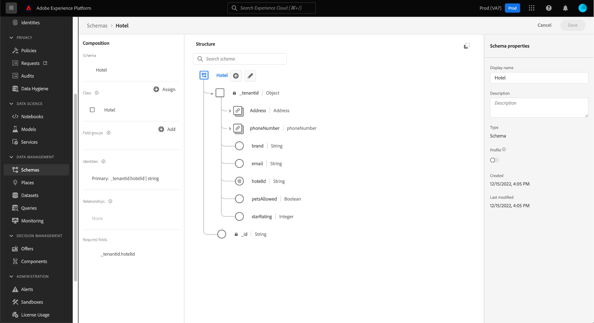

# Erstellen und Bearbeiten von Klassen in der Benutzeroberfläche {#ui-create-and-edit}

>[!CONTEXTUALHELP]
>id="platform_schemas_class_filter"
>title="Standardfilter oder benutzerdefinierte Klassenfilter"
>abstract="Die Liste der verfügbaren Klassen wird je nach ihrer Erstellung vorab gefiltert. Wählen Sie das Optionsfeld aus, um zwischen den Optionen Standard und Benutzerdefiniert zu wählen. Die Standardoption zeigt von Adobe erstellte Entitäten an und umfasst sowohl XDM Individual Profile- als auch XDM Experience Event-Klassen. Die Option Benutzerdefiniert zeigt Entitäten an, die innerhalb Ihres Unternehmens erstellt wurden. Weitere Informationen zum Erstellen und Bearbeiten von Klassen finden Sie in der Dokumentation ."

In Adobe Experience Platform definiert die Klasse eines Schemas die Verhaltensaspekte der Daten, die das Schema enthalten wird (Datensatz oder Zeitreihen). Darüber hinaus beschreiben Klassen die kleinste Anzahl gemeinsamer Eigenschaften, die alle Schemas, die auf dieser Klasse basieren, beinhalten müssen, und bieten eine Möglichkeit zum Zusammenführen mehrerer kompatibler Datensätze.

Adobe bietet mehrere standardmäßige (&quot;Core&quot;) Experience-Datenmodell (XDM)-Klassen, darunter [!DNL XDM Individual Profile] und [!DNL XDM ExperienceEvent]. Zusätzlich zu diesen Core-Klassen können Sie auch eigene benutzerdefinierte Klassen erstellen, um spezifischere Anwendungsfälle für Ihr Unternehmen zu beschreiben.

Dieses Dokument bietet einen Überblick darüber, wie benutzerdefinierte Klassen in der Experience Platform-Benutzeroberfläche erstellt, bearbeitet und verwaltet werden.

## Voraussetzungen

Dieses Handbuch setzt ein Verständnis des XDM-Systems voraus. Siehe Abschnitt [XDM-Übersicht](../../home.md) für eine Einführung in die Rolle von XDM im Experience Platform-Ökosystem und [Grundlagen der Schemakomposition](../../schema/composition.md) , um zu erfahren, wie Klassen zu XDM-Schemas beitragen.

Für dieses Handbuch ist zwar nicht erforderlich, es wird jedoch empfohlen, auch das Tutorial zu [Erstellen eines Schemas in der Benutzeroberfläche](../../tutorials/create-schema-ui.md) sich mit den verschiedenen Fähigkeiten der [!DNL Schema Editor].

## Erstellen einer neuen Klasse {#create}

Im **[!UICONTROL Schemas]** Arbeitsbereich auswählen **[!UICONTROL Schema erstellen]**, wählen Sie **[!UICONTROL Durchsuchen]** aus dem Dropdown-Menü aus.

Es wird ein Dialogfeld angezeigt, in dem Sie aus einer Liste verfügbarer Klassen auswählen können. Wählen Sie oben im Dialogfeld **[!UICONTROL Neue Klasse erstellen]**. Anschließend können Sie Ihrer neuen Klasse einen Anzeigenamen (einen kurzen, beschreibenden, eindeutigen und benutzerfreundlichen Namen für die Klasse), eine Beschreibung und ein Verhalten für die Daten geben, die das Schema definieren wird (**[!UICONTROL Datensatz]** oder **[!UICONTROL Zeitreihen]**).

Wählen Sie zum Abschluss **[!UICONTROL Klasse zuweisen]**.

Die [!DNL Schema Editor] angezeigt wird, wird ein neues Schema auf der Arbeitsfläche angezeigt, das auf der soeben erstellten benutzerdefinierten Klasse basiert. Da der Klasse noch keine Felder hinzugefügt wurden, enthält das Schema nur eine `_id` -Feld, das die systemgenerierte eindeutige Kennung darstellt, die automatisch auf alle Ressourcen im [!DNL Schema Registry].

>[!IMPORTANT]
>
>Denken Sie beim Erstellen eines Schemas, das eine von Ihrem Unternehmen definierte Klasse implementiert, daran, dass Schemafeldgruppen nur für kompatible Klassen verfügbar sind. Da die von Ihnen definierte Klasse neu ist, sind keine kompatiblen Feldergruppen in der **[!UICONTROL Feldergruppe hinzufügen]** angezeigt. Stattdessen müssen Sie [Erstellen neuer Feldergruppen](./field-groups.md#create) zur Verwendung mit dieser Klasse. Wenn Sie das nächste Mal ein Schema erstellen, das die neue Klasse implementiert, werden die von Ihnen definierten Feldergruppen aufgelistet und zur Verwendung verfügbar.

Sie können jetzt beginnen [Hinzufügen von Feldern zur Klasse](#add-fields), das von allen Schemas gemeinsam genutzt wird, die die Klasse verwenden.

## Vorhandene Klasse bearbeiten {#edit}

>[!NOTE]
>
>Nur benutzerdefinierte Klassen, die von Ihrem Unternehmen definiert wurden, können vollständig bearbeitet und angepasst werden. Für von Adobe definierte Kernklassen können nur die Anzeigenamen für ihre Felder im Kontext einzelner Schemas bearbeitet werden. Siehe Abschnitt zu [Bearbeiten von Anzeigenamen für Schemafelder](./schemas.md#display-names) für Details.
>
>Sobald eine benutzerdefinierte Klasse gespeichert und bei der Datenerfassung verwendet wurde, können danach nur noch additive Änderungen daran vorgenommen werden. Siehe [Regeln der Schemaentwicklung](../../schema/composition.md#evolution) für weitere Informationen.

Um eine vorhandene Klasse zu bearbeiten, wählen Sie die **[!UICONTROL Durchsuchen]** und wählen Sie dann den Namen eines Schemas aus, das die zu bearbeitende Klasse verwendet.

>[!TIP]
>
>Sie können die Such- und Filterfunktionen des Arbeitsbereichs verwenden, um das Schema leichter zu finden. Siehe Handbuch unter [Erkunden von XDM-Ressourcen](../explore.md) für weitere Informationen.

Die [!DNL Schema Editor] angezeigt, wobei die Struktur des Schemas auf der Arbeitsfläche angezeigt wird. Sie können jetzt beginnen [Hinzufügen von Feldern zur Klasse](#add-fields).

## Felder zu einer Klasse hinzufügen {#add-fields}

Sobald Sie über ein Schema verfügen, das eine benutzerdefinierte Klasse verwendet, öffnen Sie im [!UICONTROL Schema Editor]können Sie damit beginnen, der Klasse Felder hinzuzufügen. Um ein neues Feld hinzuzufügen, wählen Sie die **plus (+)** neben dem Namen des Schemas.

>[!IMPORTANT]
>
>Beachten Sie, dass alle Felder, die Sie zu einer Klasse hinzufügen, in allen Schemas verwendet werden, die diese Klasse verwenden. Daher sollten Sie sorgfältig überlegen, welche Felder in allen Anwendungsfällen des Schemas nützlich sein werden. Wenn Sie erwägen, ein Feld hinzuzufügen, das möglicherweise nur in einigen Schemas unter dieser Klasse verwendet wird, sollten Sie erwägen, es diesen Schemas durch [Erstellen einer Feldergruppe](./field-groups.md#create) anstatt.

Ein **[!UICONTROL Unbenanntes Feld]** Platzhalter wird in der Arbeitsfläche angezeigt und die rechte Leiste aktualisiert, um Steuerelemente zum Konfigurieren der Feldeigenschaften anzuzeigen. under **[!UICONTROL Zuweisen zu]** auswählen **[!UICONTROL Klasse]**.

Siehe Handbuch unter [Definieren von Feldern in der Benutzeroberfläche](../fields/overview.md#define) für spezifische Schritte zum Konfigurieren und Hinzufügen des Felds zur Klasse. Fügen Sie der Klasse weiterhin beliebig viele Felder hinzu. Wählen Sie zum Abschluss **[!UICONTROL Speichern]** , um sowohl das Schema als auch die Klasse zu speichern.

Wenn Sie zuvor Schemas erstellt haben, die diese Klasse verwenden, werden die neu hinzugefügten Felder automatisch in diesen Schemata angezeigt.

## Ändern der Klasse eines Schemas {#schema}

Sie können die Klasse des Schemas jederzeit während des anfänglichen Erstellungsprozesses ändern, bevor es gespeichert wurde. Siehe Handbuch unter [Erstellen und Bearbeiten von Schemata](./schemas.md#change-class) für weitere Informationen.

## Nächste Schritte

In diesem Dokument wurde beschrieben, wie Klassen mithilfe der Platform-Benutzeroberfläche erstellt und bearbeitet werden. Weitere Informationen zu den Funktionen der [!UICONTROL Schemas] Arbeitsbereich, siehe [[!UICONTROL Schemas] Arbeitsbereich - Übersicht](../overview.md).

Erfahren Sie, wie Sie Klassen mit dem [!DNL Schema Registry] API, siehe [Endpunktleitfaden für Klassen](../../api/classes.md).
