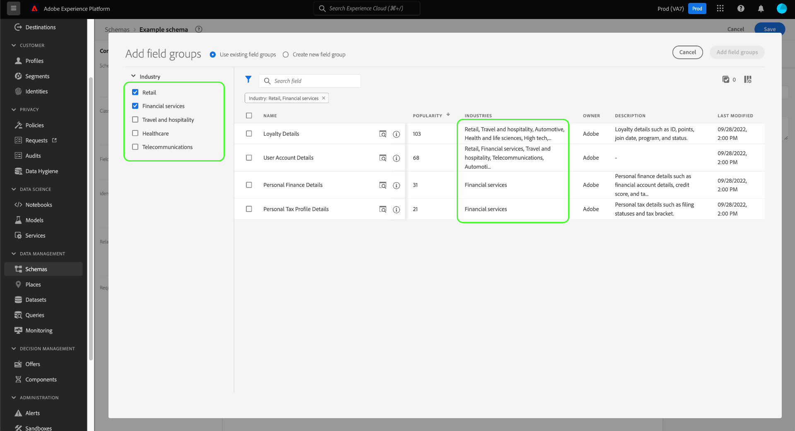
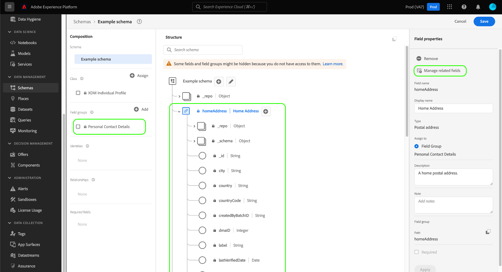
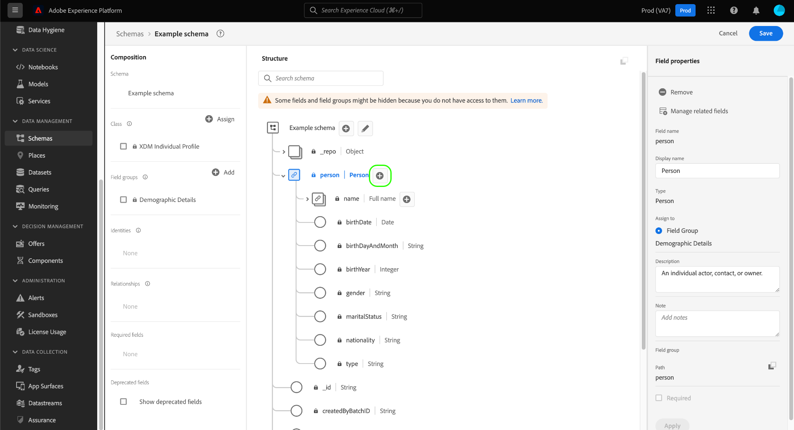
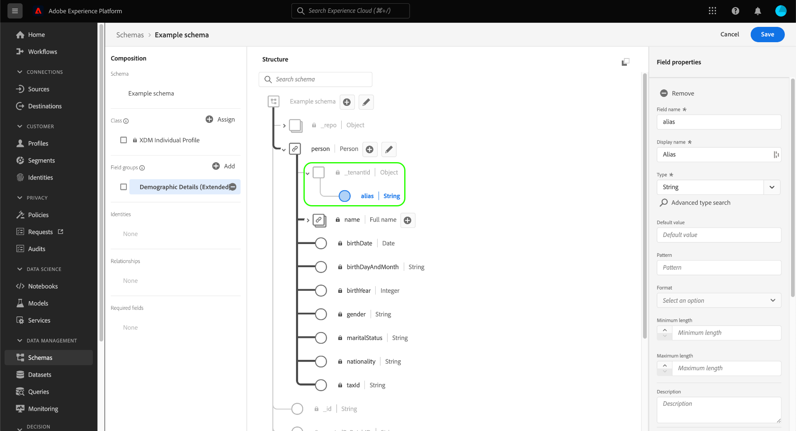
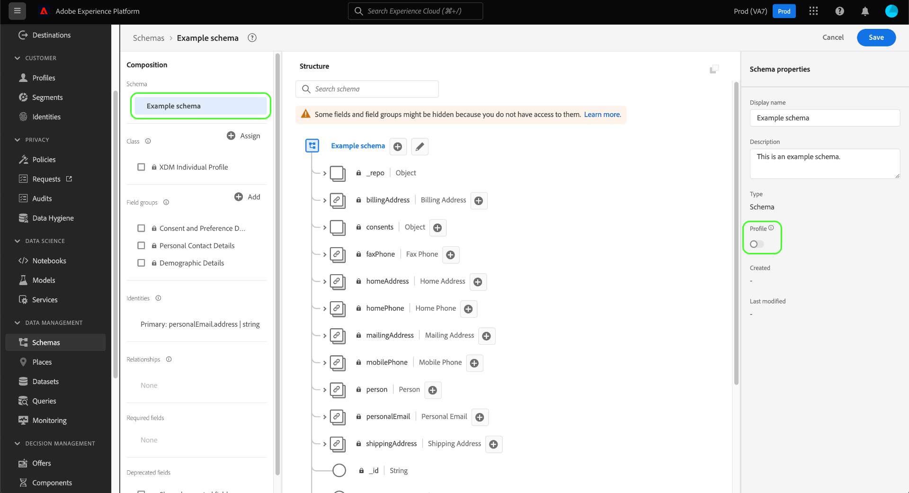

# Erstellen und Bearbeiten von Schemata in der Benutzeroberfläche

Dieses Handbuch bietet einen Überblick darüber, wie Sie Experience-Datenmodell (XDM)-Schemas für Ihr Unternehmen in der Adobe Experience Platform-Benutzeroberfläche erstellen, bearbeiten und verwalten.

>[!IMPORTANT]
>
>XDM-Schemata sind extrem anpassbar, sodass die Schritte zum Erstellen eines Schemas variieren können, je nachdem, welche Art von Daten das Schema erfassen soll. Daher behandelt dieses Dokument nur die grundlegenden Interaktionen, die Sie mit Schemas in der Benutzeroberfläche durchführen können, und schließt verwandte Schritte wie das Anpassen von Klassen, Schemafeldergruppen, Datentypen und Feldern aus.
>
>Eine vollständige Übersicht über den Schema-Erstellungsprozess erhalten Sie, wenn Sie mit dem [Tutorial zur Schemaerstellung](../../tutorials/create-schema-ui.md) , um ein vollständiges Beispielschema zu erstellen und sich mit den zahlreichen Funktionen der [!DNL Schema Editor].

## Voraussetzungen

Dieses Handbuch setzt ein Verständnis des XDM-Systems voraus. Siehe Abschnitt [XDM-Übersicht](../../home.md) für eine Einführung in die Rolle von XDM im Experience Platform-Ökosystem und die [Grundlagen der Schemakomposition](../../schema/composition.md) für einen Überblick darüber, wie Schemas erstellt werden.

## Erstellen eines neuen Schemas {#create}

Im [!UICONTROL Schemas] Arbeitsbereich, wählen Sie **[!UICONTROL Schema erstellen]** in der oberen rechten Ecke. Im angezeigten Dropdown-Menü können Sie zwischen **[!UICONTROL XDM Individual Profile]** und **[!UICONTROL XDM ExperienceEvent]** als Basisklasse für das Schema. Alternativ können Sie **[!UICONTROL Durchsuchen]** aus der vollständigen Liste der verfügbaren Klassen auszuwählen oder [eine neue benutzerdefinierte Klasse erstellen](./classes.md#create) anstatt.

Sobald Sie eine Klasse auswählen, wird die [!DNL Schema Editor] angezeigt und die (von der Klasse bereitgestellte) Basisstruktur des Schemas wird auf der Arbeitsfläche angezeigt. Von hier aus können Sie die rechte Leiste verwenden, um eine **[!UICONTROL Anzeigename]** und **[!UICONTROL Beschreibung]** für das Schema.

Sie können jetzt mit der Erstellung der Schemastruktur beginnen, indem Sie [Schemafeldgruppen hinzufügen](#add-field-groups).

## Vorhandenes Schema bearbeiten {#edit}

>[!NOTE]
>
>Sobald ein Schema gespeichert und in der Datenerfassung verwendet wurde, können nur noch additive Änderungen daran vorgenommen werden. Siehe [Regeln der Schemaentwicklung](../../schema/composition.md#evolution) für weitere Informationen.

Um ein vorhandenes Schema zu bearbeiten, wählen Sie die **[!UICONTROL Durchsuchen]** und wählen Sie dann den Namen des Schemas aus, das Sie bearbeiten möchten.

>[!TIP]
>
>Sie können die Such- und Filterfunktionen des Arbeitsbereichs verwenden, um das Schema leichter zu finden. Siehe Handbuch unter [Erkunden von XDM-Ressourcen](../explore.md) für weitere Informationen.

Sobald Sie ein Schema auswählen, wird die [!DNL Schema Editor] angezeigt, wobei die Struktur des Schemas auf der Arbeitsfläche angezeigt wird. Sie können jetzt [Feldergruppen hinzufügen](#add-field-groups) zum Schema (oder [Hinzufügen einzelner Felder](#add-individual-fields) aus diesen Gruppen), [Anzeigenamen von Feldern bearbeiten](#display-names)oder [Bearbeiten vorhandener benutzerdefinierter Feldergruppen](./field-groups.md#edit) , wenn das Schema eine verwendet.

## Hinzufügen von Feldergruppen zu einem Schema {#add-field-groups}

>[!NOTE]
>
>In diesem Abschnitt wird beschrieben, wie Sie einem Schema vorhandene Feldergruppen hinzufügen. Wenn Sie eine neue benutzerdefinierte Feldergruppe erstellen möchten, lesen Sie das Handbuch unter [Erstellen und Bearbeiten von Feldergruppen](./field-groups.md#create) anstatt.

Nachdem Sie ein Schema im [!DNL Schema Editor]können Sie dem Schema mithilfe von Feldergruppen Felder hinzufügen. Wählen Sie zunächst **[!UICONTROL Hinzufügen]** neben **[!UICONTROL Feldergruppen]** in der linken Leiste.

Es wird ein Dialogfeld mit einer Liste von Feldergruppen angezeigt, die Sie für das Schema auswählen können. Da Feldergruppen nur mit einer Klasse kompatibel sind, werden nur die Feldergruppen aufgelistet, die mit der ausgewählten Klasse des Schemas verknüpft sind. Standardmäßig werden die aufgelisteten Feldergruppen nach ihrer Nutzungspersönlichkeit in Ihrem Unternehmen sortiert.

Wenn Sie die allgemeine Aktivität oder den Geschäftsbereich der Felder kennen, die Sie hinzufügen möchten, wählen Sie in der linken Leiste mindestens eine der vertikalen Branchen-Kategorien aus, um die angezeigte Liste der Feldergruppen zu filtern.

>[!NOTE]
>
>Weitere Informationen zu Best Practices für branchenspezifische Datenmodellierung in XDM finden Sie in der Dokumentation zu [Branchendatenmodelle](../../schema/industries/overview.md).

Sie können auch die Suchleiste verwenden, um Ihre gewünschte Feldergruppe zu finden. Feldergruppen, deren Name mit der Abfrage übereinstimmt, werden oben in der Liste angezeigt. under **[!UICONTROL Standardfelder]**, werden Feldergruppen mit Feldern angezeigt, die die gewünschten Datenattribute beschreiben.

Aktivieren Sie das Kontrollkästchen neben dem Namen der Feldergruppe, die Sie zum Schema hinzufügen möchten. Sie können mehrere Feldergruppen aus der Liste auswählen, wobei jede ausgewählte Feldergruppe in der rechten Leiste angezeigt wird.

>[!TIP]
>
>Für alle aufgelisteten Feldergruppen können Sie den Mauszeiger über das Informationssymbol (), um eine kurze Beschreibung der Art der von der Feldergruppe erfassten Daten anzuzeigen. Sie können auch das Vorschausymbol (), um die Struktur der Felder anzuzeigen, die die Feldergruppe bereitstellt, bevor Sie sie zum Schema hinzufügen.

Nachdem Sie die Feldergruppen ausgewählt haben, wählen Sie **[!UICONTROL Feldergruppen hinzufügen]** , um sie dem Schema hinzuzufügen.

Die [!DNL Schema Editor] wird mit den von der Feldergruppe bereitgestellten Feldern auf der Arbeitsfläche erneut angezeigt.

Nachdem Sie eine Feldergruppe zu einem Schema hinzugefügt haben, können Sie optional [vorhandene Felder entfernen](#remove-fields) oder [Hinzufügen neuer benutzerdefinierter Felder](#add-fields) auf diese Gruppen, je nach Ihren Bedürfnissen.

### Felder, die zu Feldergruppen hinzugefügt wurden, entfernen {#remove-fields}

Nachdem Sie einem Schema eine Feldergruppe hinzugefügt haben, können Sie alle Felder entfernen, die Sie nicht benötigen.

>[!NOTE]
>
>Das Entfernen von Feldern aus einer Feldergruppe wirkt sich nur auf das bearbeitete Schema aus und hat keine Auswirkungen auf die Feldergruppe selbst. Wenn Sie Felder in einem Schema entfernen, sind diese Felder weiterhin in allen anderen Schemas verfügbar, die dieselbe Feldergruppe verwenden.

Im folgenden Beispiel wird die Standardfeldgruppe **[!UICONTROL Demografische Details]** wurde einem Schema hinzugefügt. So entfernen Sie ein einzelnes Feld, z. B. `taxId`, wählen Sie das Feld auf der Arbeitsfläche aus und klicken Sie auf **[!UICONTROL Entfernen]** in der rechten Leiste.

Wenn Sie mehrere Felder entfernen möchten, können Sie die Feldergruppe als Ganzes verwalten. Wählen Sie auf der Arbeitsfläche ein Feld aus, das zur Gruppe gehört, und wählen Sie dann **[!UICONTROL Zugehörige Felder verwalten]** in der rechten Leiste.

Es wird ein Dialogfeld mit der Struktur der betreffenden Feldergruppe angezeigt. Hier können Sie die Kontrollkästchen verwenden, um die erforderlichen Felder auszuwählen oder die Auswahl aufzuheben. Wenn Sie zufrieden sind, wählen Sie **[!UICONTROL Bestätigen]**.

Die Arbeitsfläche wird nur mit den in der Schemastruktur ausgewählten Feldern wieder angezeigt.

### Hinzufügen benutzerdefinierter Felder zu Feldergruppen {#add-fields}

Nachdem Sie einem Schema eine Feldergruppe hinzugefügt haben, können Sie zusätzliche Felder für diese Gruppe definieren. Alle Felder, die einer Feldergruppe in einem Schema hinzugefügt werden, werden jedoch auch in allen anderen Schemas angezeigt, die dieselbe Feldergruppe verwenden.

Wenn ein benutzerdefiniertes Feld zu einer Standardfeldgruppe hinzugefügt wird, wird diese Feldergruppe in eine benutzerdefinierte Feldergruppe konvertiert und die ursprüngliche Standardfeldgruppe ist nicht mehr verfügbar.

Wenn Sie ein benutzerdefiniertes Feld zu einer Standardfeldgruppe hinzufügen möchten, lesen Sie den Abschnitt [Abschnitt unten](#custom-fields-for-standard-groups) für spezifische Anweisungen. Wenn Sie Felder zu einer benutzerdefinierten Feldergruppe hinzufügen, lesen Sie den Abschnitt unter [Bearbeiten benutzerdefinierter Feldergruppen](./field-groups.md) im Benutzerhandbuch für Feldergruppen.

Wenn Sie keine vorhandenen Feldergruppen ändern möchten, können Sie [eine neue benutzerdefinierte Feldergruppe erstellen](./field-groups.md#create) , um stattdessen zusätzliche Felder zu definieren.

## Hinzufügen einzelner Felder zu einem Schema {#add-individual-fields}

Mit dem Schema Editor können Sie einzelne Felder direkt zu einem Schema hinzufügen, wenn Sie vermeiden möchten, eine ganze Feldergruppe für einen bestimmten Anwendungsfall hinzuzufügen. Sie können [Hinzufügen einzelner Felder aus Standardfeldgruppen](#add-standard-fields) oder [eigene benutzerdefinierte Felder hinzufügen](#add-custom-fields) anstatt.

>[!IMPORTANT]
>
>Auch wenn Sie im Schema Editor mit Funktionen einzelne Felder direkt zu einem Schema hinzufügen können, ändert dies nichts daran, dass alle Felder in einem XDM-Schema von seiner Klasse oder einer Feldergruppe bereitgestellt werden müssen, die mit dieser Klasse kompatibel ist. Wie in den folgenden Abschnitten erläutert, sind alle einzelnen Felder weiterhin einer Klasse oder Feldergruppe als wichtigen Schritt zugeordnet, wenn sie einem Schema hinzugefügt werden.

### Standardfelder hinzufügen {#add-standard-fields}

Sie können Felder aus Standardfeldgruppen direkt zu einem Schema hinzufügen, ohne zuvor die entsprechende Feldergruppe kennen zu müssen. Um einem Schema ein Standardfeld hinzuzufügen, wählen Sie das Pluszeichen (**+**) neben dem Namen des Schemas in der Arbeitsfläche. Ein **[!UICONTROL Unbenanntes Feld]** Platzhalter wird in der Schemastruktur angezeigt und die rechte Leiste wird aktualisiert, um Steuerelemente zum Konfigurieren des Felds anzuzeigen.

under **[!UICONTROL Feldname]**, geben Sie den Namen des Felds ein, das Sie hinzufügen möchten. Das System sucht automatisch nach Standardfeldern, die mit der Abfrage übereinstimmen, und listet sie unter **[!UICONTROL Empfohlene Standardfelder]**, einschließlich der Feldergruppen, denen sie angehören.

Einige Standardfelder weisen denselben Namen auf, ihre Struktur kann jedoch je nach der Feldergruppe, aus der sie stammen, variieren. Wenn ein Standardfeld innerhalb eines übergeordneten Objekts in der Feldergruppenstruktur verschachtelt ist, wird das übergeordnete Feld auch im Schema enthalten sein, wenn das untergeordnete Feld hinzugefügt wird.

Wählen Sie das Vorschausymbol () neben einem Standardfeld klicken, um die Struktur seiner Feldergruppe anzuzeigen und besser zu verstehen, wie sie verschachtelt sein könnte. Um das Standardfeld zum Schema hinzuzufügen, wählen Sie das Pluszeichen ().

Die Arbeitsfläche wird aktualisiert und zeigt das Standardfeld an, das dem Schema hinzugefügt wurde, einschließlich der übergeordneten Felder, unter denen es innerhalb der Feldergruppenstruktur verschachtelt ist. Der Name der Feldergruppe wird auch unter **[!UICONTROL Feldergruppen]** in der linken Leiste. Wenn Sie weitere Felder aus derselben Feldergruppe hinzufügen möchten, wählen Sie **[!UICONTROL Zugehörige Felder verwalten]** in der rechten Leiste.

### Benutzerdefinierte Felder hinzufügen        {#add-custom-fields}

Ähnlich wie beim Workflow für Standardfelder können Sie auch eigene benutzerdefinierte Felder direkt zu einem Schema hinzufügen.

Um Felder zur Stammebene eines Schemas hinzuzufügen, wählen Sie das Pluszeichen (**+**) neben dem Namen des Schemas in der Arbeitsfläche. Ein **[!UICONTROL Unbenanntes Feld]** Platzhalter wird in der Schemastruktur angezeigt und die rechte Leiste wird aktualisiert, um Steuerelemente zum Konfigurieren des Felds anzuzeigen.

Beginnen Sie mit der Eingabe des Namens des Felds, das Sie hinzufügen möchten, und das System beginnt automatisch mit der Suche nach entsprechenden Standardfeldern. Um stattdessen ein neues benutzerdefiniertes Feld zu erstellen, wählen Sie die obere Option, die an **([!UICONTROL Neues Feld])**.

Nachdem Sie einen Anzeigenamen und einen Datentyp für das Feld bereitgestellt haben, besteht der nächste Schritt darin, das Feld einer übergeordneten XDM-Ressource zuzuweisen. Wenn Ihr Schema eine benutzerdefinierte Klasse verwendet, können Sie auswählen, [das Feld zur zugewiesenen Klasse hinzufügen](#add-to-class) oder [Feldergruppe](#add-to-field-group) anstatt. Wenn Ihr Schema jedoch eine Standardklasse verwendet, können Sie das benutzerdefinierte Feld nur einer Feldergruppe zuweisen.

#### Weisen Sie das Feld einer benutzerdefinierten Feldergruppe zu {#add-to-field-group}

>[!NOTE]
>
>In diesem Abschnitt wird nur beschrieben, wie Sie das Feld einer benutzerdefinierten Feldergruppe zuweisen. Wenn Sie stattdessen eine Standardfeldgruppe mit dem neuen benutzerdefinierten Feld erweitern möchten, lesen Sie den Abschnitt unter [Hinzufügen benutzerdefinierter Felder zu Standardfeldgruppen](#custom-fields-for-standard-groups).

under **[!UICONTROL Zuweisen zu]** auswählen **[!UICONTROL Feldergruppe]**. Wenn Ihr Schema eine Standardklasse verwendet, ist dies die einzige verfügbare Option und standardmäßig ausgewählt.

Als Nächstes müssen Sie eine Feldergruppe auswählen, mit der das neue Feld verknüpft werden soll. Beginnen Sie mit der Eingabe des Namens der Feldergruppe in der bereitgestellten Texteingabe. Wenn bereits benutzerdefinierte Feldergruppen vorhanden sind, die mit der Eingabe übereinstimmen, werden diese in der Dropdown-Liste angezeigt. Alternativ können Sie einen eindeutigen Namen eingeben, um stattdessen eine neue Feldergruppe zu erstellen.

>[!WARNING]
>
>Wenn Sie eine vorhandene benutzerdefinierte Feldergruppe auswählen, übernehmen alle anderen Schemas, die diese Feldergruppe verwenden, auch das neu hinzugefügte Feld, nachdem Sie Ihre Änderungen gespeichert haben. Wählen Sie daher nur dann eine existierende Feldergruppe aus, wenn Sie diese Art von Vermehrung wünschen. Andernfalls sollten Sie stattdessen eine neue benutzerdefinierte Feldergruppe erstellen.

Nachdem Sie die Feldergruppe aus der Liste ausgewählt haben, wählen Sie **[!UICONTROL Anwenden]**.

Das neue Feld wird der Arbeitsfläche hinzugefügt und unter Ihrem [Mandanten-ID](../../api/getting-started.md#know-your-tenant_id) um Konflikte mit Standard-XDM-Feldern zu vermeiden. Die Feldergruppe, mit der Sie das neue Feld verknüpft haben, wird ebenfalls unter **[!UICONTROL Feldergruppen]** in der linken Leiste.

>[!NOTE]
>
>Die übrigen von der ausgewählten benutzerdefinierten Feldergruppe bereitgestellten Felder werden standardmäßig aus dem Schema entfernt. Wenn Sie einige dieser Felder zum Schema hinzufügen möchten, wählen Sie ein Feld aus, das zur Gruppe gehört, und wählen Sie dann **[!UICONTROL Zugehörige Felder verwalten]** in der rechten Leiste.

#### Weisen Sie das Feld einer benutzerdefinierten Klasse zu {#add-to-class}

under **[!UICONTROL Zuweisen zu]** auswählen **[!UICONTROL Klasse]**. Das nachstehende Eingabefeld wird durch den Namen der benutzerdefinierten Klasse des aktuellen Schemas ersetzt und gibt an, dass das neue Feld dieser Klasse zugewiesen wird.

![Die [!UICONTROL Klasse] für die neue Feldzuweisung ausgewählt wurde.](../../images/ui/resources/schemas/assign-field-to-class.png)

Fahren Sie mit der Konfiguration des Felds fort und wählen Sie **[!UICONTROL Anwenden]** wenn fertig.

![[!UICONTROL Anwenden] für das neue Feld ausgewählt werden.](../../images/ui/resources/schemas/assign-field-to-class-apply.png)

Das neue Feld wird der Arbeitsfläche hinzugefügt und unter Ihrem [Mandanten-ID](../../api/getting-started.md#know-your-tenant_id) um Konflikte mit Standard-XDM-Feldern zu vermeiden. Wenn Sie den Klassennamen in der linken Leiste auswählen, wird das neue Feld als Teil der Klassenstruktur angezeigt.

### Fügen Sie benutzerdefinierte Felder zur Struktur von Standardfeldgruppen hinzu {#custom-fields-for-standard-groups}

Wenn das Schema, mit dem Sie arbeiten, ein Objekt enthält, das von einer Standardfeldgruppe bereitgestellt wird, können Sie diesem Standardobjekt eigene benutzerdefinierte Felder hinzufügen.

>[!WARNING]
>
>Alle Felder, die einer Feldergruppe in einem Schema hinzugefügt werden, werden auch in allen anderen Schemas angezeigt, die dieselbe Feldergruppe verwenden. Wenn ein benutzerdefiniertes Feld zu einer Standardfeldgruppe hinzugefügt wird, wird diese Feldergruppe in eine benutzerdefinierte Feldergruppe konvertiert und die ursprüngliche Standardfeldgruppe ist nicht mehr verfügbar.
>
>Wenn Sie an der Beta-Version für diese Funktion teilgenommen haben, erhalten Sie einen Dialog, in dem Sie über die Standardfeldgruppen informiert werden, die Sie zuvor angepasst haben. Nachdem Sie **[!UICONTROL Bestätigung]**, werden die aufgelisteten Ressourcen in benutzerdefinierte Feldergruppen konvertiert.
>
>

Wählen Sie zunächst das Pluszeichen (**+**) neben dem Stamm des Objekts, das von der Standardfeldgruppe bereitgestellt wird.

Es wird eine Warnmeldung angezeigt, in der Sie aufgefordert werden zu bestätigen, ob Sie die Standardfeldgruppe konvertieren möchten. Auswählen **[!UICONTROL Feldgruppe weiterhin erstellen]** um fortzufahren.

Die Arbeitsfläche wird mit einem unbenannten Platzhalter für das neue Feld erneut angezeigt. Beachten Sie, dass der Name der Standardfeldgruppe mit &quot;([!UICONTROL Erweitert])&quot;, um anzugeben, dass es von der Originalversion geändert wurde. Verwenden Sie von hier aus die Steuerelemente in der rechten Leiste, um die Eigenschaften des Felds zu definieren.

Nachdem Sie Ihre Änderungen angewendet haben, wird das neue Feld unter Ihrem Mandanten-ID-Namespace innerhalb des Standardobjekts angezeigt. Dieser verschachtelte Namespace verhindert Konflikte mit Feldnamen innerhalb der Feldergruppe selbst, um Änderungen in anderen Schemas zu vermeiden, die dieselbe Feldergruppe verwenden.

## Aktivieren eines Schemas für das Echtzeit-Kundenprofil {#profile}

>[!CONTEXTUALHELP]
>id="platform_schemas_enableforprofile"
>title="Aktivieren eines Schemas für Profil"
>abstract="Wenn ein Schema für Profil aktiviert ist, beteiligen sich alle Datensätze, die aus diesem Schema erstellt wurden, an Echtzeit-Kundenprofil, das Daten aus unterschiedlichen Quellen zusammenführt, um eine vollständige Ansicht jedes Kunden zu erstellen. Sobald ein Schema zur Aufnahme von Daten in das Profil verwendet wird, kann es nicht mehr deaktiviert werden. Weitere Informationen finden Sie in der Dokumentation."

[Echtzeit-Kundenprofil](../../../profile/home.md) führt Daten aus unterschiedlichen Quellen zusammen, um eine vollständige Ansicht jedes einzelnen Kunden zu erhalten. Wenn die von einem Schema erfassten Daten an diesem Prozess teilnehmen sollen, müssen Sie das Schema zur Verwendung in [!DNL Profile].

>[!IMPORTANT]
>
>So aktivieren Sie ein Schema für [!DNL Profile]muss ein primäres Identitätsfeld definiert sein. Siehe Handbuch unter [Identitätsfelder definieren](../fields/identity.md) für weitere Informationen.

Um das Schema zu aktivieren, wählen Sie zunächst den Namen des Schemas in der linken Leiste aus und wählen Sie dann die **[!UICONTROL Profil]** in der rechten Leiste ein-/ausschalten.

Es wird ein Popup angezeigt, in dem Sie darauf hingewiesen werden, dass ein Schema nach seiner Aktivierung und Speicherung nicht mehr deaktiviert werden kann. Auswählen **[!UICONTROL Aktivieren]** , um fortzufahren.

Die Arbeitsfläche wird mit der [!UICONTROL Profil] Umschalten aktiviert.

>[!IMPORTANT]
>
>Da das Schema noch nicht gespeichert wurde, ist dies der Punkt, an dem es nicht zurückgegeben wird, wenn Sie Ihre Meinung ändern, das Schema im Echtzeit-Kundenprofil teilnehmen zu lassen: Wenn Sie ein aktiviertes Schema speichern, kann es nicht mehr deaktiviert werden. Wählen Sie die **[!UICONTROL Profil]** Schalten Sie erneut um, um das Schema zu deaktivieren.

Um den Prozess abzuschließen, wählen Sie **[!UICONTROL Speichern]** , um das Schema zu speichern.

Das Schema ist jetzt für die Verwendung im Echtzeit-Kundenprofil aktiviert. Wenn Platform Daten in Datensätze erfasst, die auf diesem Schema basieren, werden diese Daten in Ihre aggregierten Profildaten integriert.

## Anzeigenamen für Schemafelder bearbeiten {#display-names}

Nachdem Sie einem Schema eine Klasse zugewiesen und Feldergruppen hinzugefügt haben, können Sie die Anzeigenamen der Felder des Schemas bearbeiten, unabhängig davon, ob diese Felder von standardmäßigen oder benutzerdefinierten XDM-Ressourcen bereitgestellt wurden.

>[!NOTE]
>
>Beachten Sie, dass die Anzeigenamen von Feldern, die zu Standardklassen oder Feldgruppen gehören, nur im Kontext eines bestimmten Schemas bearbeitet werden können. Das heißt, dass die Änderung des Anzeigenamens eines Standardfelds in einem Schema keine Auswirkungen auf andere Schemas hat, die dieselbe zugeordnete Klasse oder Feldergruppe verwenden.
>
>Sobald Sie die Anzeigenamen für die Felder eines Schemas ändern, werden diese Änderungen sofort in allen vorhandenen Datensätzen übernommen, die auf diesem Schema basieren.

Um den Anzeigenamen eines Schemafelds zu bearbeiten, wählen Sie das Feld auf der Arbeitsfläche aus. Geben Sie in der rechten Leiste den neuen Namen unter ein. **[!UICONTROL Anzeigename]**.

Auswählen **[!UICONTROL Anwenden]** in der rechten Leiste angezeigt wird, wird die Arbeitsfläche aktualisiert, um den neuen Anzeigenamen des Felds anzuzeigen. Auswählen **[!UICONTROL Speichern]** , um die Änderungen auf das Schema anzuwenden.

## Klasse eines Schemas ändern {#change-class}

Sie können die Klasse eines Schemas jederzeit während des anfänglichen Kompositionsprozesses ändern, bevor das Schema gespeichert wurde.

>[!WARNING]
>
>Die Neuzuweisung der Klasse für ein Schema sollte mit äußerster Vorsicht erfolgen. Feldergruppen sind nur mit bestimmten Klassen kompatibel. Daher werden die Arbeitsfläche und alle von Ihnen hinzugefügten Felder durch Ändern der Klasse zurückgesetzt.

Um eine Klasse neu zuzuweisen, wählen Sie **[!UICONTROL Zuweisen]** auf der linken Seite der Arbeitsfläche.

Es wird ein Dialogfeld angezeigt, in dem eine Liste aller verfügbaren Klassen angezeigt wird, einschließlich aller von Ihrer Organisation definierten Klassen (der Inhaber ist der[!UICONTROL Kunde]&quot;) sowie durch die Adobe definierten Standardklassen.

Wählen Sie eine Klasse aus der Liste aus, um ihre Beschreibung auf der rechten Seite des Dialogfelds anzuzeigen. Sie können auch **[!UICONTROL Vorschau der Klassenstruktur]** , um die mit der Klasse verknüpften Felder und Metadaten anzuzeigen. Auswählen **[!UICONTROL Klasse zuweisen]** , um fortzufahren.

Es wird ein neues Dialogfeld geöffnet, in dem Sie aufgefordert werden zu bestätigen, dass Sie eine neue Klasse zuweisen möchten. Auswählen **[!UICONTROL Zuweisen]** zur Bestätigung.

Nach Bestätigung der Klassenänderung wird die Arbeitsfläche zurückgesetzt und der gesamte Kompositionsprozess geht verloren.

## Nächste Schritte

In diesem Dokument wurden die Grundlagen zum Erstellen und Bearbeiten von Schemas in der Platform-Benutzeroberfläche beschrieben. Es wird dringend empfohlen, die [Tutorial zur Schemaerstellung](../../tutorials/create-schema-ui.md) für einen umfassenden Workflow zum Erstellen eines vollständigen Schemas in der Benutzeroberfläche, einschließlich der Erstellung benutzerdefinierter Feldergruppen und Datentypen für eindeutige Anwendungsfälle.

Weitere Informationen zu den Funktionen der [!UICONTROL Schemas] Arbeitsbereich, siehe [[!UICONTROL Schemas] Arbeitsbereich - Übersicht](../overview.md).

Informationen zum Verwalten von Schemata finden Sie im Abschnitt [!DNL Schema Registry] API, siehe [Endpunktleitfaden für Schemata](../../api/schemas.md).
