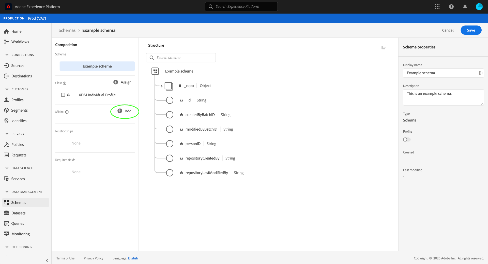
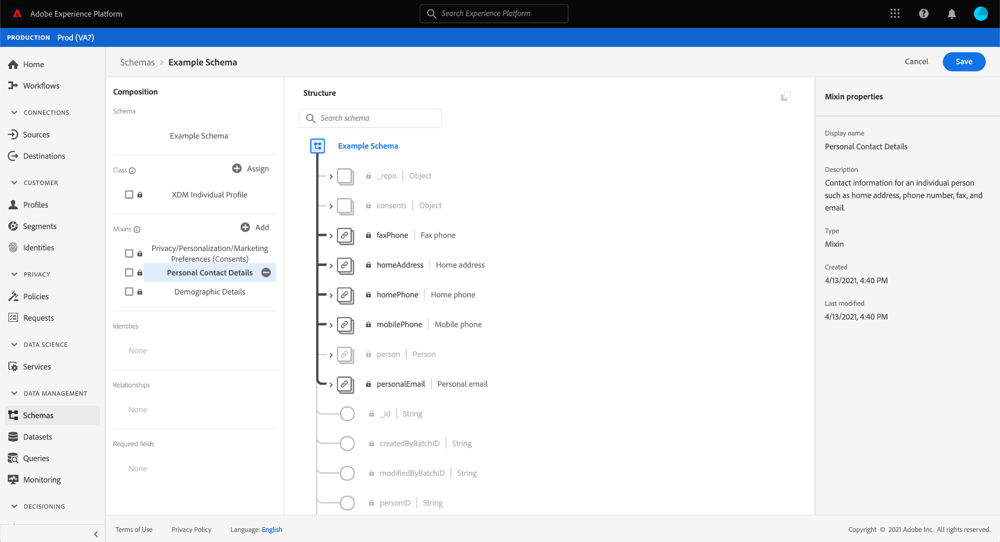

# Schemas in der Benutzeroberfläche erstellen und bearbeiten

Dieses Handbuch bietet einen Überblick darüber, wie Sie XDM-Schema (Experience Data Model) für Ihr Unternehmen in der Adobe Experience Platform-Benutzeroberfläche erstellen, bearbeiten und verwalten.

>[!IMPORTANT]
>
>XDM-Schema sind extrem anpassbar. Daher können die Schritte zum Erstellen eines Schemas je nach Art der Daten, die das Schema erfassen soll, variieren. Daher umfasst dieses Dokument nur die grundlegenden Interaktionen, die Sie mit Schemas in der Benutzeroberfläche durchführen können, und schließt zugehörige Schritte wie das Anpassen von Klassen, Mixins, Datentypen und Feldern aus.
>
>Um eine vollständige Übersicht über den Erstellungsprozess für Schemas zu erhalten, folgen Sie dem [Tutorial zur Erstellung von Schemas](../../tutorials/create-schema-ui.md), um ein vollständiges Beispielbeispiel zu erstellen und sich mit den zahlreichen Funktionen von [!DNL Schema Editor] vertraut zu machen.

## Voraussetzungen

Dieses Handbuch erfordert ein funktionierendes Verständnis des XDM-Systems. Eine Einführung in die Rolle von XDM innerhalb des Experience Platform-Ökosystems finden Sie in der [XDM-Übersicht](../../home.md) und in den [Grundlagen der Schema-Komposition](../../schema/composition.md), um einen Überblick darüber zu erhalten, wie Schema aufgebaut werden.

## Neues Schema {#create} erstellen

Wählen Sie im Arbeitsbereich [!UICONTROL Schemas] **[!UICONTROL Schema erstellen]** oben rechts aus. In der Dropdown-Liste, die angezeigt wird, können Sie zwischen **[!UICONTROL XDM Individuelles Profil]** und **[!UICONTROL XDM ExperienceEvent]** als Basisklasse für das Schema wählen. Alternativ können Sie **[!UICONTROL Browse]** auswählen, um aus der vollständigen Liste der verfügbaren Klassen auszuwählen, oder [stattdessen eine neue benutzerspezifische Klasse ](./classes.md#create) erstellen.

Wenn Sie eine Klasse auswählen, wird [!DNL Schema Editor] angezeigt und die (von der Klasse bereitgestellte) Basisstruktur des Schemas wird auf der Arbeitsfläche angezeigt. Von hier aus können Sie mit der rechten Leiste einen **[!UICONTROL Anzeigenamen]** und **[!UICONTROL Beschreibung]** für das Schema hinzufügen.

Sie können jetzt Beginn zum Erstellen der Struktur des Schemas mit [mixins](#add-mixins) hinzufügen.

## Bearbeiten eines vorhandenen Schemas {#edit}

>[!NOTE]
>
>Nachdem ein Schema gespeichert und bei der Datenerfassung verwendet wurde, können nur noch zusätzliche Änderungen daran vorgenommen werden. Weitere Informationen finden Sie unter [Regeln der Schema-Evolution](../../schema/composition.md#evolution).

Um ein vorhandenes Schema zu bearbeiten, wählen Sie die Registerkarte **[!UICONTROL Durchsuchen]** und wählen Sie dann den Namen des Schemas aus, das Sie bearbeiten möchten.

>[!TIP]
>
>Sie können die Such- und Filterfunktionen des Arbeitsbereichs verwenden, um das Schema leichter zu finden. Weitere Informationen finden Sie im Handbuch [XDM-Ressourcen](../explore.md) zu erkunden.

Wenn Sie ein Schema auswählen, wird [!DNL Schema Editor] mit der auf der Arbeitsfläche angezeigten Struktur des Schemas angezeigt. Sie können nun [Mixins](#add-mixins) zum Schema, [Anzeigenamen für Felder bearbeiten](#display-names) oder [vorhandene benutzerdefinierte Mixins bearbeiten](./mixins.md#edit), wenn das Schema solche verwendet.

## Hinzufügen von Mixins zu einem Schema {#add-mixins}

>[!NOTE]
>
>In diesem Abschnitt wird beschrieben, wie Sie einem Schema vorhandene Mixins hinzufügen. Wenn Sie ein neues benutzerdefiniertes Mixin erstellen möchten, lesen Sie stattdessen das Handbuch [Erstellen und Bearbeiten von Mixins](./mixins.md#create).

Nachdem Sie ein Schema innerhalb von [!DNL Schema Editor] geöffnet haben, können Sie dem Schema Felder mithilfe von mixins hinzufügen. Wählen Sie zum Beginn **[!UICONTROL Hinzufügen]** neben **[!UICONTROL Mixins]** in der linken Leiste aus.

Es wird ein Dialogfeld mit einer Liste von Mixins angezeigt, die Sie für das Schema auswählen können. Da Mixins nur mit einer Klasse kompatibel sind, werden nur die Mixins aufgelistet, die mit der ausgewählten Klasse des Schemas verknüpft sind. Standardmäßig werden die aufgelisteten Mixins nach ihrer Beliebtheit bei der Verwendung innerhalb Ihres Unternehmens sortiert.

Wenn Sie die allgemeine Aktivität oder den Geschäftsbereich der Mixin-Felder kennen, die Sie hinzufügen möchten, wählen Sie in der linken Leiste eine oder mehrere der vertikalen Kategorien aus, um die angezeigte Liste der Mixins zu filtern.

>[!NOTE]
>
>Weitere Informationen zu Best Practices für die branchenspezifische Datenmodellierung in XDM finden Sie in der Dokumentation zu [Industrie-Datenmodellen](../../schema/industries/overview.md).

Sie können auch die Suchleiste verwenden, um die gewünschte Mischung zu finden. Mixins, deren Name mit der Abfrage übereinstimmt, werden oben in der Liste angezeigt. Unter **[!UICONTROL Standardfelder]** werden Mixins angezeigt, die Felder enthalten, die die gewünschten Datenattribute beschreiben.

Aktivieren Sie das Kontrollkästchen neben dem Namen der Mischung, die Sie dem Schema hinzufügen möchten. Sie können mehrere Mixins aus der Liste auswählen, wobei jedes ausgewählte Mixin in der rechten Leiste angezeigt wird.

>[!TIP]
>
>Für alle aufgelisteten Mixins können Sie den Mauszeiger über das Informationssymbol () halten oder sich auf das Informationssymbol () konzentrieren, um eine kurze Beschreibung der Art der von dem Mixin erfassten Daten Ansicht. Sie können auch das Symbol &quot;Vorschau&quot;() auswählen, um die Feldstruktur des Mixins Ansicht, bevor Sie es dem Schema hinzufügen.

Nachdem Sie Ihre Mixins ausgewählt haben, wählen Sie **[!UICONTROL Hinzufügen mixin]** aus, um sie dem Schema hinzuzufügen.

Die Felder [!DNL Schema Editor] werden mit den von Mixin bereitgestellten Feldern auf der Arbeitsfläche erneut angezeigt.

## Aktivieren eines Schemas für das Echtzeit-Kundenprofil {#profile}

[Echtzeit-Kundenprofile ](../../../profile/home.md) führen Daten aus unterschiedlichen Quellen zusammen, um eine vollständige Ansicht der einzelnen Kunden zu erstellen. Wenn die von einem Schema erfassten Daten an diesem Prozess teilnehmen sollen, müssen Sie das Schema für die Verwendung in [!DNL Profile] aktivieren.

>[!IMPORTANT]
>
>Um ein Schema für [!DNL Profile] zu aktivieren, muss ein primäres Identitätsfeld definiert sein. Weitere Informationen finden Sie im Handbuch [Identitätsfelder definieren](../fields/identity.md).

Um das Schema zu aktivieren, wählen Sie in Beginn in der linken Leiste den Namen des Schemas und dann in der rechten Leiste den Umschalter **[!UICONTROL Profil]**.

Es wird ein Popup angezeigt, in dem Sie darauf hingewiesen werden, dass ein Schema, sobald es aktiviert und gespeichert wurde, nicht deaktiviert werden kann. Wählen Sie **[!UICONTROL Aktivieren]**, um fortzufahren.

Die Arbeitsfläche wird wieder angezeigt, wenn der Umschalter [!UICONTROL Profil] aktiviert ist.

>[!IMPORTANT]
>
>Da das Schema noch nicht gespeichert wurde, ist dies der Grund für keine Rückkehr, wenn Sie Ihre Meinung ändern, dass das Schema am Echtzeit-Kunden-Profil teilnehmen soll: Wenn Sie ein aktiviertes Schema speichern, kann es nicht mehr deaktiviert werden. Wählen Sie erneut den Umschalter **[!UICONTROL Profil]**, um das Schema zu deaktivieren.

Um den Vorgang abzuschließen, wählen Sie **[!UICONTROL Speichern]**, um das Schema zu speichern.

Das Schema ist jetzt für die Verwendung im Echtzeit-Kundenkonto-Profil aktiviert. Wenn Platform Daten in Datasets auf der Grundlage dieses Schemas einfügt, werden diese Daten in Ihre zusammengesetzten Profil-Daten eingebunden.

## Anzeigenamen für Schema-Felder {#display-names} bearbeiten

Nachdem Sie einem Schema eine Klasse zugewiesen und Mixins hinzugefügt haben, können Sie die Anzeigenamen der Felder eines Schemas bearbeiten, unabhängig davon, ob diese Felder von Standard- oder benutzerdefinierten XDM-Ressourcen bereitgestellt wurden.

>[!NOTE]
>
>Beachten Sie, dass die Anzeigenamen von Feldern, die zu Standardklassen oder Mixins gehören, nur im Kontext eines bestimmten Schemas bearbeitet werden können. Das heißt, dass eine Änderung des Anzeigenamens eines Standardfelds in einem Schema keine Auswirkungen auf andere Schema hat, die dieselbe Klasse oder dasselbe Mixin verwenden.

Um den Anzeigenamen eines Schemas zu bearbeiten, wählen Sie das Feld auf der Arbeitsfläche aus. Geben Sie in der rechten Leiste unter **[!UICONTROL Anzeigename]** den neuen Namen ein.

Wählen Sie **[!UICONTROL Apply]** in der rechten Leiste und die Arbeitsfläche wird aktualisiert, um den neuen Anzeigenamen des Felds anzuzeigen. Wählen Sie **[!UICONTROL Speichern]**, um die Änderungen auf das Schema anzuwenden.

## Ändern der Klasse eines Schemas {#change-class}

Sie können die Klasse eines Schemas jederzeit während des anfänglichen Kompositionsprozesses ändern, bevor das Schema gespeichert wurde.

>[!WARNING]
>
>Die erneute Zuweisung der Klasse zu einem Schema sollte mit größter Vorsicht erfolgen. Mixins sind nur mit bestimmten Klassen kompatibel. Wenn Sie die Klasse ändern, werden die Arbeitsfläche und alle hinzugefügten Felder zurückgesetzt.

Um eine Klasse neu zuzuweisen, wählen Sie auf der linken Seite der Arbeitsfläche **[!UICONTROL Zuweisen]** aus.

Es wird ein Dialogfeld angezeigt, in dem eine Liste aller verfügbaren Klassen, einschließlich aller von Ihrem Unternehmen definierten Klassen (der Inhaber ist &quot;[!UICONTROL Customer]&quot;) sowie der von der Adobe definierten Standardklassen angezeigt wird.

Wählen Sie eine Liste aus, um die zugehörige Beschreibung auf der rechten Seite des Dialogfelds anzuzeigen. Sie können auch **[!UICONTROL Vorschau-Klassenstruktur]** auswählen, um die mit der  verknüpften Felder und Metadaten anzuzeigen. Wählen Sie **[!UICONTROL Klasse zuweisen]**, um fortzufahren.

Es wird ein neues Dialogfeld geöffnet, in dem Sie gefragt werden, ob Sie eine neue Klasse zuweisen möchten. Wählen Sie **[!UICONTROL Zuweisen]** zur Bestätigung.

Nachdem Sie die Klassenänderung bestätigt haben, wird die Arbeitsfläche zurückgesetzt und der gesamte Kompositionsfortschritt geht verloren.

## Nächste Schritte

In diesem Dokument wurden die Grundlagen zum Erstellen und Bearbeiten von Schemas in der Plattform-Benutzeroberfläche behandelt. Es wird dringend empfohlen, das Lernprogramm [Erstellung von Schemas](../../tutorials/create-schema-ui.md) für einen umfassenden Arbeitsablauf zum Erstellen eines vollständigen Schemas in der Benutzeroberfläche zu überprüfen, einschließlich der Erstellung benutzerdefinierter Mixins und Datentypen für individuelle Anwendungsfälle.

Weitere Informationen zu den Funktionen des Arbeitsbereichs [!UICONTROL Schema] finden Sie unter [[!UICONTROL Schema] Arbeitsbereichsübersicht](../overview.md).

Informationen zum Verwalten von Schemas in der API finden Sie im [!DNL Schema Registry]-Endpunktleitfaden [Schema](../../api/schemas.md).
