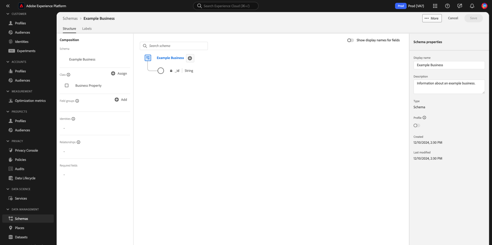

# Erstellen und Bearbeiten von Schemata in der Benutzeroberfläche {#create-edit-schemas-in-ui}

Dieses Handbuch bietet einen Überblick darüber, wie Sie Experience-Datenmodell(XDM)-Schemas für Ihr Unternehmen in der Adobe Experience Platform-Benutzeroberfläche erstellen, bearbeiten und verwalten.

>[!IMPORTANT]
>
>XDM-Schemata sind extrem anpassbar, sodass die Schritte, die zum Erstellen eines Schemas erforderlich sind, je nachdem, welche Art von Daten das Schema erfassen soll, variieren können. Daher behandelt dieses Dokument nur die grundlegenden Interaktionen, die Sie mit Schemata in der Benutzeroberfläche durchführen können, und schließt zugehörige Schritte wie das Anpassen von Klassen, Schemafeldern, Datentypen und Feldern aus.
>
>Eine vollständige Übersicht über den Prozess der Schemaerstellung finden Sie im Abschnitt [Tutorial zur Schemaerstellung](../../tutorials/create-schema-ui.md) , um ein vollständiges Beispielschema zu erstellen und sich mit den vielen Funktionen der [!DNL Schema Editor] vertraut zu machen.

## Voraussetzungen {#prerequisites}

Dieses Handbuch setzt ein Grundverständnis des XDM-Systems voraus. Unter [XDM-Übersicht](../../home.md) finden Sie eine Einführung in die Rolle von XDM im Experience Platform-Ökosystem und unter [Grundlagen der Schemakomposition](../../schema/composition.md) finden Sie einen Überblick über die Erstellung von Schemas.

## Erstellen eines neuen Schemas {#create}

>[!NOTE]
>
>In diesem Abschnitt wird beschrieben, wie Sie ein neues Schema in der Benutzeroberfläche manuell erstellen. Wenn Sie CSV-Daten in Experience Platform aufnehmen, können Sie mithilfe von ML-Algorithmen (maschinelles Lernen) **aus CSV-Beispieldaten ein Schema generieren**. Dieser Workflow stimmt mit Ihrem Datenformat überein und erstellt automatisch ein neues Schema, das auf der Struktur und dem Inhalt Ihrer CSV-Datei basiert. Weitere Informationen zu [ Workflow finden Sie ](../ml-assisted-schema-creation.md) Handbuch zur Erstellung von XML-unterstützten Schemata .

Wählen [!UICONTROL &#x200B; Arbeitsbereich Schemata &#x200B;] oben **[!UICONTROL rechts die Option]** Schema erstellen“ aus.

![Der Arbeitsbereich „Schemata“ mit [!UICONTROL &#x200B; hervorgehobenen Option &quot;] erstellen“](../../images/ui/resources/schemas/create-schema.png)

Das [!UICONTROL Erstellen eines Schemas] wird angezeigt. In diesem Dialogfeld können Sie entweder manuell ein Schema erstellen, indem Sie Felder und Feldergruppen hinzufügen, oder Sie können eine CSV-Datei hochladen und ML-Algorithmen verwenden, um ein Schema zu generieren. Wählen Sie im Dialogfeld einen Workflow zur Schemaerstellung aus.

### [!BADGE Beta]{type=Informative} Manuelle oder ML-unterstützte Schemaerstellung {#manual-or-assisted}

Informationen dazu, wie Sie einen ML-Algorithmus verwenden können, um eine Schemastruktur basierend auf einer CSV-Datei zu empfehlen, finden Sie [ Handbuch zur Erstellung von Schemata durch maschinelles Lernen](../ml-assisted-schema-creation.md). Dieses Handbuch für die Benutzeroberfläche konzentriert sich auf den Workflow zur manuellen Erstellung.

### Manuelle Schemaerstellung {#manual-creation}

Der [!UICONTROL Schema erstellen] wird angezeigt. Sie können eine Basisklasse für das Schema auswählen, indem Sie entweder **[!UICONTROL Individuelles Profil]**, **[!UICONTROL Erlebnisereignis]** oder **[!UICONTROL Andere]** und dann **[!UICONTROL Weiter]** auswählen. Weitere Informationen zu diesen Klassen finden Sie in [[!UICONTROL &#x200B; Dokumentation &#x200B;]](../../classes/individual-profile.md)XDM Individual Profile[&#128279;](../../classes/experienceevent.md) und XDM ExperienceEvent .

![Workflow [!UICONTROL Schema erstellen] mit den drei Klassenoptionen und [!UICONTROL Weiter] hervorgehoben.](../../images/ui/resources/schemas/schema-class-options.png)

Bei Auswahl **[!UICONTROL Sonstige]** wird eine Liste der verfügbaren Klassen angezeigt. Hier können Sie bereits vorhandene Klassen durchsuchen und filtern.

![Der Workflow [!UICONTROL Schema erstellen] mit [!UICONTROL Sonstige] hervorgehoben im Abschnitt [!UICONTROL Schemadetails].](../../images/ui/resources/schemas/other-schema-details.png)

Wählen Sie ein Optionsfeld aus, um die Klassen danach zu filtern, ob es sich um benutzerdefinierte oder Standardklassen handelt. Sie können die verfügbaren Ergebnisse auch nach ihrer Branche filtern oder mithilfe des Suchfelds nach einer bestimmten Klasse suchen.

![Der Workflow [!UICONTROL Schema erstellen] mit Suchleiste, [!UICONTROL Benutzerdefiniert] und [!UICONTROL Branchen] hervorgehoben.](../../images/ui/resources/schemas/filter-and-search.png)

Um Ihnen bei der Entscheidung über die entsprechende Klasse zu helfen, gibt es Informations- und Vorschausymbole für jede Klasse. Das Infosymbol () Öffnet ein Dialogfeld, das eine Beschreibung der Klasse und der Branche enthält, mit der sie verknüpft ist.

Das Vorschausymbol () Öffnet ein Vorschaudialogfeld für die Klasse, die ein Schemadiagramm und dessen Eigenschaften enthält.

Wählen Sie eine beliebige Zeile aus, um eine Klasse auszuwählen, und klicken Sie dann **[!UICONTROL Weiter]**, um Ihre Auswahl zu bestätigen.

![Der Workflow [!UICONTROL Schema erstellen] mit einer Klasse, die aus der Tabelle der verfügbaren Klassen ausgewählt wurde, und [!UICONTROL Weiter] hervorgehoben.](../../images/ui/resources/schemas/select-class.png)

Nachdem Sie eine Klasse ausgewählt haben, wird der Abschnitt [!UICONTROL Name und Überprüfung] angezeigt. In diesem Abschnitt geben Sie einen Namen und eine Beschreibung ein, um Ihr Schema zu identifizieren. &#x200B;Die Basisstruktur des Schemas (bereitgestellt von der -Klasse) wird auf der Arbeitsfläche angezeigt, damit Sie Ihre ausgewählte Klassen- und Schemastruktur überprüfen und überprüfen können.

Geben Sie im Textfeld einen benutzerfreundlichen [!UICONTROL Anzeigenamen &#x200B;] Schemas“ ein. Geben Sie als Nächstes eine geeignete Beschreibung ein, um Ihr Schema zu identifizieren. Wenn Sie Ihre Schemastruktur überprüft haben und mit Ihren Einstellungen zufrieden sind, wählen Sie **[!UICONTROL Beenden]** aus, um Ihr Schema zu erstellen.

![Der [!UICONTROL Name und Überprüfung] des Workflows [!UICONTROL Schema erstellen] mit den hervorgehobenen [!UICONTROL Anzeigename des Schemas], [!UICONTROL Beschreibung] und [!UICONTROL Beenden].](../../images/ui/resources/schemas/name-and-review.png)

Der Schema-Editor wird angezeigt, wobei die Schemastruktur auf der Arbeitsfläche angezeigt wird. Falls gewünscht, können Sie jetzt [Felder zur Klasse hinzufügen](../../ui/resources/classes.md#add-fields).

## Bearbeiten eines vorhandenen Schemas {#edit}

>[!NOTE]
>
>Nachdem ein Schema gespeichert und bei der Datenaufnahme verwendet wurde, können nur additive Änderungen daran vorgenommen werden. Weitere Informationen finden [ unter „Regeln ](../../schema/composition.md#evolution) Schemaentwicklung“.

Um ein vorhandenes Schema zu bearbeiten, klicken Sie auf **[!UICONTROL Registerkarte]** Durchsuchen“ und wählen Sie dann den Namen des Schemas aus, das Sie bearbeiten möchten. Sie können auch die Suchleiste verwenden, um die Liste der verfügbaren Optionen einzugrenzen.

>[!TIP]
>
>Sie können die Such- und Filterfunktionen des Arbeitsbereichs verwenden, um das Schema leichter zu finden. Weitere Informationen finden Sie im Handbuch [Erkunden von XDM](../explore.md)Ressourcen“.

Nachdem Sie ein Schema ausgewählt haben, wird das [!DNL Schema Editor] mit der Schemastruktur auf der Arbeitsfläche angezeigt. Sie können jetzt [Feldergruppen hinzufügen](#add-field-groups) zum Schema (oder [einzelne Felder hinzufügen](#add-individual-fields) aus diesen Gruppen), [Anzeigenamen von Feldern bearbeiten](#display-names) oder [vorhandene benutzerdefinierte Feldergruppen bearbeiten](./field-groups.md#edit) wenn das Schema eine verwendet.

## Mehr Aktionen {#more}

Im Schema-Editor können Sie auch Schnellaktionen durchführen, um die JSON-Struktur des Schemas zu kopieren oder das Schema zu löschen, wenn es nicht für das Echtzeit-Kundenprofil aktiviert wurde oder über verknüpfte Datensätze verfügt. Wählen Sie [!UICONTROL Mehr] oben in der Ansicht aus, um eine Dropdown-Liste mit Schnellaktionen anzuzeigen.

Mit der Funktion JSON-Struktur kopieren können Sie sehen, wie eine Beispiel-Payload aussehen würde, während Sie noch das Schema und Ihre Daten-Pipelines erstellen. Dies ist besonders hilfreich in Situationen, in denen es komplexe Objektzuordnungsstrukturen im Schema gibt, z. B. eine Identitätszuordnung.

## Umschalten zwischen Anzeigenamen {#display-name-toggle}

Der Einfachheit halber bietet der Schema-Editor einen Umschalter zum Wechseln zwischen den ursprünglichen Feldnamen und den für Menschen besser lesbaren Anzeigenamen. Diese Flexibilität ermöglicht eine verbesserte Erkennung und Bearbeitung von Feldern Ihrer Schemata. Der Umschalter befindet sich oben rechts in der Ansicht des Schema-Editors.

>[!NOTE]
>
>Die Änderung von Feldnamen in Anzeigenamen ist rein kosmetischer Natur und ändert keine nachgelagerten Ressourcen.

![Der Schema-Editor mit [!UICONTROL Anzeigenamen für Felder anzeigen] hervorgehoben.](../../images/ui/resources/schemas/display-name-toggle.png)

Die Anzeigenamen für Standardfeldgruppen werden vom System generiert, können jedoch angepasst werden, wie im Abschnitt [Anzeigenamen](#display-names) beschrieben. Anzeigenamen werden in mehreren Benutzeroberflächenansichten angezeigt, einschließlich Zuordnungs- und Datensatzvorschauen. Die Standardeinstellung ist deaktiviert und zeigt Feldnamen anhand ihrer ursprünglichen Werte an.

## Hinzufügen von Feldergruppen zu einem Schema {#add-field-groups}

>[!NOTE]
>
>In diesem Abschnitt wird beschrieben, wie Sie einem Schema vorhandene Feldergruppen hinzufügen. Wenn Sie eine neue benutzerdefinierte Feldergruppe erstellen möchten, lesen Sie stattdessen das Handbuch unter [Erstellen und Bearbeiten von Feldergruppen](./field-groups.md#create) .

Nachdem Sie ein Schema in der [!DNL Schema Editor] geöffnet haben, können Sie dem Schema mithilfe von Feldergruppen Felder hinzufügen. Wählen Sie zunächst **[!UICONTROL Hinzufügen]** neben **[!UICONTROL Feldergruppen]** in der linken Leiste.

![Der Schema-Editor mit dem hervorgehobenen [!UICONTROL Hinzufügen] im [!UICONTROL Feldergruppen] Abschnitt.](../../images/ui/resources/schemas/add-field-group-button.png)

Es wird ein Dialogfeld mit einer Liste von Feldergruppen angezeigt, die Sie für das Schema auswählen können. Da Feldergruppen nur mit einer Klasse kompatibel sind, werden nur die Feldergruppen aufgelistet, die mit der ausgewählten Klasse des Schemas verknüpft sind. Standardmäßig werden die aufgelisteten Feldergruppen nach ihrer Verwendungspopularität in Ihrer Organisation sortiert.

![Das Dialogfeld [!UICONTROL Feldergruppen hinzufügen] mit der hervorgehobenen Spalte [!UICONTROL Beliebtheit].](../../images/ui/resources/schemas/field-group-popularity.png)

Wenn Sie den allgemeinen Aktivitäts- oder Geschäftsbereich der Felder kennen, die Sie hinzufügen möchten, wählen Sie in der linken Leiste mindestens eine der branchenvertikalen Kategorien aus, um die angezeigte Liste der Feldergruppen zu filtern.

![Das Dialogfeld [!UICONTROL Feldergruppen hinzufügen] mit hervorgehobenen [!UICONTROL Industry]-Filtern und der hervorgehobenen Spalte [!UICONTROL Industry].](../../images/ui/resources/schemas/industry-filter.png)

>[!NOTE]
>
>Weitere Informationen zu Best Practices für die branchenspezifische Datenmodellierung in XDM finden Sie in der Dokumentation zu [branchenspezifischen Datenmodellen](../../schema/industries/overview.md).

Sie können auch die Suchleiste verwenden, um Ihre gewünschte Feldergruppe zu finden. Feldergruppen, deren Name mit der Abfrage übereinstimmt, werden oben in der Liste angezeigt. Unter **[!UICONTROL Standardfelder]** werden Feldergruppen angezeigt, die Felder enthalten, die die gewünschten Datenattribute beschreiben.

![Der [!UICONTROL Feldergruppen hinzufügen] Dialog mit der hervorgehobenen [!UICONTROL Standardfelder]-Suchfunktion.](../../images/ui/resources/schemas/field-group-search.png)

Aktivieren Sie das Kontrollkästchen neben dem Namen der Feldergruppe, die Sie dem Schema hinzufügen möchten. Sie können mehrere Feldergruppen aus der Liste auswählen, wobei jede ausgewählte Feldergruppe in der rechten Leiste angezeigt wird.

![Das Dialogfeld [!UICONTROL Feldergruppen hinzufügen] mit hervorgehobener Kontrollkästchenauswahl-Funktion.](../../images/ui/resources/schemas/add-field-group.png)

>[!TIP]
>
>Für jede aufgelistete Feldergruppe können Sie den Mauszeiger über das Informationssymbol () bewegen oder den Fokus darauf legen, um eine kurze Beschreibung der Art von Daten anzuzeigen, die die Feldergruppe erfasst. Sie können auch auf das Vorschausymbol () klicken, um die Struktur der Felder anzuzeigen, die die Feldergruppe bereitstellt, bevor Sie sie zum Schema hinzufügen.

Nachdem Sie Ihre Feldergruppen ausgewählt haben, wählen Sie **[!UICONTROL Feldergruppen hinzufügen]** aus, um sie zum Schema hinzuzufügen.

![Das Dialogfeld [!UICONTROL Feldergruppen hinzufügen] mit ausgewählten Feldergruppen und [!UICONTROL Feldergruppen hinzufügen] hervorgehoben.](../../images/ui/resources/schemas/add-field-group-finish.png)

Der [!DNL Schema Editor] wird erneut mit den von den Feldergruppen bereitgestellten Feldern angezeigt, die auf der Arbeitsfläche dargestellt werden.

![Die [!DNL Schema Editor] mit einem angezeigten Beispielschema.](../../images/ui/resources/schemas/field-groups-added.png)

>[!NOTE]
>
>Innerhalb des Schema-Editors werden Standardklassen (Adobe-generiert) und Feldergruppen mit dem Schlosssymbol (. Das Vorhängeschloss wird in der linken Leiste neben dem Namen der Klasse oder Feldergruppe sowie neben einem beliebigen Feld im Schemadiagramm angezeigt, das Teil einer systemgenerierten Ressource ist.
>
>

Nachdem Sie eine Feldergruppe zu einem Schema hinzugefügt haben, können Sie optional [vorhandene Felder entfernen](#remove-fields) oder [neue benutzerdefinierte Felder hinzufügen](#add-fields) zu diesen Gruppen hinzufügen, je nach Ihren Anforderungen.

### Entfernen hinzugefügter Felder aus Feldergruppen {#remove-fields}

Nachdem Sie eine Feldergruppe zu einem Schema hinzugefügt haben, können Sie alle Felder entfernen, die Sie nicht benötigen.

>[!NOTE]
>
>Das Entfernen von Feldern aus einer Feldergruppe wirkt sich nur auf das bearbeitete Schema aus und nicht auf die Feldergruppe selbst. Wenn Sie Felder in einem Schema entfernen, sind diese Felder weiterhin in allen anderen Schemata verfügbar, die dieselbe Feldergruppe verwenden.

Im folgenden Beispiel wurde die Standardfeldgruppe **[!UICONTROL Demografische Details]** zu einem Schema hinzugefügt. Um ein einzelnes Feld, z. B. `taxId`, zu entfernen, wählen Sie das Feld auf der Arbeitsfläche und dann **[!UICONTROL Entfernen]** in der rechten Leiste aus.

![Die [!DNL Schema Editor] mit [!UICONTROL &#x200B; hervorgehobenen &#x200B;]. Diese Aktion entfernt ein einzelnes Feld.](../../images/ui/resources/schemas/remove-single-field.png)

Wenn mehrere Felder entfernt werden sollen, können Sie die Feldergruppe als Ganzes verwalten. Wählen Sie auf der Arbeitsfläche ein Feld aus, das zur Gruppe gehört, und wählen Sie dann **[!UICONTROL Verknüpfte Felder verwalten]** in der rechten Leiste aus.

![Der [!DNL Schema Editor] mit [!UICONTROL Verwalten verwandter Felder] hervorgehoben.](../../images/ui/resources/schemas/manage-related-fields.png)

Es wird ein Dialogfeld mit der Struktur der betreffenden Feldergruppe angezeigt. Von hier aus können Sie die bereitgestellten Kontrollkästchen verwenden, um die erforderlichen Felder zu aktivieren oder die Auswahl aufzuheben. Wenn Sie fertig sind, wählen Sie **[!UICONTROL Bestätigen]** aus.

![Das Dialogfeld [!UICONTROL Verwandte Felder verwalten] mit ausgewählten Feldern und [!UICONTROL Bestätigen] hervorgehoben.](../../images/ui/resources/schemas/select-fields.png)

Die Arbeitsfläche wird erneut angezeigt, wobei nur die ausgewählten Felder in der Schemastruktur vorhanden sind.

### Hinzufügen benutzerdefinierter Felder zu Feldergruppen {#add-fields}

Nachdem Sie eine Feldergruppe zu einem Schema hinzugefügt haben, können Sie zusätzliche Felder für diese Gruppe definieren. Alle Felder, die einer Feldergruppe in einem Schema hinzugefügt wurden, werden jedoch auch in allen anderen Schemata angezeigt, die dieselbe Feldergruppe verwenden.

Wenn ein benutzerdefiniertes Feld zu einer Standardfeldgruppe hinzugefügt wird, wird diese Feldgruppe außerdem in eine benutzerdefinierte Feldgruppe konvertiert, und die ursprüngliche Standardfeldgruppe ist nicht mehr verfügbar.

Wenn Sie ein benutzerdefiniertes Feld zu einer Standardfeldgruppe hinzufügen möchten, finden Sie im [ Abschnitt unten ](#custom-fields-for-standard-groups) spezifische Anweisungen. Wenn Sie Felder zu einer benutzerdefinierten Feldergruppe hinzufügen, lesen Sie den Abschnitt [Bearbeiten benutzerdefinierter Feldergruppen](./field-groups.md) im Handbuch zur Benutzeroberfläche für Feldergruppen.

Wenn Sie keine vorhandenen Feldergruppen ändern möchten, können Sie stattdessen [neue benutzerdefinierte Feldergruppe erstellen](./field-groups.md#create) um zusätzliche Felder zu definieren.

## Hinzufügen einzelner Felder zu einem Schema {#add-individual-fields}

Mit dem Schema-Editor können Sie einzelne Felder direkt zu einem Schema hinzufügen, wenn Sie nicht eine ganze Feldergruppe für einen bestimmten Anwendungsfall hinzufügen möchten. Sie können stattdessen [einzelne Felder aus Standardfeldgruppen hinzufügen](#add-standard-fields) oder [eigene benutzerdefinierte Felder hinzufügen](#add-custom-fields).

>[!IMPORTANT]
>
>Obwohl Sie mit dem Schema-Editor einzelne Felder direkt zu einem Schema hinzufügen können, ändert dies nichts an der Tatsache, dass alle Felder in einem XDM-Schema von der Klasse oder einer Feldergruppe bereitgestellt werden müssen, die mit dieser Klasse kompatibel ist. Wie in den folgenden Abschnitten erläutert, werden alle einzelnen Felder als wichtiger Schritt weiterhin einer Klasse oder Feldergruppe zugeordnet, wenn sie einem Schema hinzugefügt werden.

### Standardfelder hinzufügen {#add-standard-fields}

Sie können Felder aus Standardfeldgruppen direkt zu einem Schema hinzufügen, ohne die entsprechende Feldgruppe zuvor kennen zu müssen. Um ein Standardfeld zu einem Schema hinzuzufügen, klicken Sie auf das Pluszeichen (**+**) neben dem Namen des Schemas auf der Arbeitsfläche. Ein Platzhalter **[!UICONTROL Nicht benanntes Feld]** wird in der Schemastruktur angezeigt, und die rechte Leiste wird aktualisiert, um Steuerelemente zum Konfigurieren des Felds anzuzeigen.

Geben **[!UICONTROL unter]** den Namen des Felds ein, das Sie hinzufügen möchten. Das System sucht automatisch nach Standardfeldern, die mit der Abfrage übereinstimmen, und listet sie unter **[!UICONTROL Empfohlene Standardfelder]** auf, einschließlich der Feldergruppen, zu denen sie gehören.

Während einige Standardfelder denselben Namen haben, kann ihre Struktur je nach der Feldergruppe, aus der sie stammen, variieren. Wenn ein Standardfeld in einem übergeordneten Objekt in der Feldergruppenstruktur verschachtelt ist, wird das übergeordnete Feld ebenfalls in das Schema aufgenommen, wenn das untergeordnete Feld hinzugefügt wird.

Wählen Sie das Vorschausymbol () neben einem Standardfeld aus, um die Struktur seiner Feldergruppe anzuzeigen und besser zu verstehen, wie sie verschachtelt werden könnte. Um das Standardfeld zum Schema hinzuzufügen, wählen Sie das Pluszeichen () aus.

Die Arbeitsfläche wird aktualisiert und zeigt das zum Schema hinzugefügte Standardfeld an, einschließlich aller übergeordneten Felder, unter denen es in der Feldergruppenstruktur verschachtelt ist. Der Name der Feldergruppe wird auch unter **[!UICONTROL Feldergruppen]** in der linken Leiste aufgeführt. Wenn Sie mehr Felder aus derselben Feldergruppe hinzufügen möchten, wählen Sie **[!UICONTROL Verwandte Felder verwalten]** in der rechten Leiste aus.

### Benutzerdefinierte Felder hinzufügen        {#add-custom-fields}

Ähnlich wie beim Workflow für Standardfelder können Sie auch Ihre eigenen benutzerdefinierten Felder direkt zu einem Schema hinzufügen.

Um Felder zur Stammebene eines Schemas hinzuzufügen, klicken Sie auf das Pluszeichen (**+**) neben dem Namen des Schemas auf der Arbeitsfläche. Ein Platzhalter **[!UICONTROL Nicht benanntes Feld]** wird in der Schemastruktur angezeigt, und die rechte Leiste wird aktualisiert, um Steuerelemente zum Konfigurieren des Felds anzuzeigen.

Beginnen Sie mit der Eingabe des Namens des Felds, das Sie hinzufügen möchten, und das System beginnt automatisch mit der Suche nach übereinstimmenden Standardfeldern. Um stattdessen ein neues benutzerdefiniertes Feld zu erstellen, wählen Sie die obere Option aus, an die **angehängt ist ([!UICONTROL Neues Feld])**.

Nachdem Sie einen Anzeigenamen und Datentyp für das Feld angegeben haben, besteht der nächste Schritt darin, das Feld einer übergeordneten XDM-Ressource zuzuweisen. Wenn Ihr Schema eine benutzerdefinierte Klasse verwendet, können Sie stattdessen [das Feld zur zugewiesenen Klasse hinzufügen](#add-to-class) oder eine [Feldergruppe](#add-to-field-group) auswählen. Wenn Ihr Schema jedoch eine Standardklasse verwendet, können Sie das benutzerdefinierte Feld nur einer Feldergruppe zuweisen.

#### Zuweisen des Felds zu einer benutzerdefinierten Feldergruppe {#add-to-field-group}

>[!NOTE]
>
>In diesem Abschnitt wird nur beschrieben, wie Sie das Feld einer benutzerdefinierten Feldergruppe zuweisen. Wenn Sie stattdessen eine Standardfeldgruppe um das neue benutzerdefinierte Feld erweitern möchten, finden Sie weitere Informationen im Abschnitt zum [Hinzufügen benutzerdefinierter Felder zu Standardfeldgruppen](#custom-fields-for-standard-groups).

Wählen **[!UICONTROL unter „Zuweisen zu]** die Option **[!UICONTROL Feldergruppe]**. Wenn Ihr Schema eine Standardklasse verwendet, ist dies die einzige verfügbare Option und ist standardmäßig ausgewählt.

Als Nächstes müssen Sie eine Feldergruppe auswählen, mit der das neue Feld verknüpft werden soll. Beginnen Sie, den Namen der Feldergruppe in die bereitgestellte Texteingabe einzugeben. Wenn Sie über benutzerdefinierte Feldergruppen verfügen, die mit der Eingabe übereinstimmen, werden diese in der Dropdown-Liste angezeigt. Alternativ können Sie einen eindeutigen Namen eingeben, um stattdessen eine neue Feldergruppe zu erstellen.

>[!WARNING]
>
>Wenn Sie eine vorhandene benutzerdefinierte Feldergruppe auswählen, erben alle anderen Schemata, die diese Feldergruppe verwenden, das neu hinzugefügte Feld ebenfalls, nachdem Sie Ihre Änderungen gespeichert haben. Wählen Sie daher nur dann eine vorhandene Feldergruppe aus, wenn Sie diese Art der Verbreitung wünschen. Andernfalls sollten Sie stattdessen eine neue benutzerdefinierte Feldergruppe erstellen.

Wählen Sie nach Auswahl der Feldergruppe aus der Liste die Option **[!UICONTROL Anwenden]** aus.

Das neue Feld wird der Arbeitsfläche hinzugefügt und erhält einen Namespace unter Ihrer [Mandanten-ID](../../api/getting-started.md#know-your-tenant_id), um Konflikte mit standardmäßigen XDM-Feldern zu vermeiden. Die Feldergruppe, mit der Sie das neue Feld verknüpft haben, wird auch unter **[!UICONTROL Feldergruppen]** in der linken Leiste angezeigt.

>[!NOTE]
>
>Die übrigen Felder, die von der ausgewählten benutzerdefinierten Feldergruppe bereitgestellt werden, werden standardmäßig aus dem Schema entfernt. Wenn Sie einige dieser Felder zum Schema hinzufügen möchten, wählen Sie ein Feld aus der Gruppe aus und wählen Sie dann **[!UICONTROL Verwandte Felder verwalten]** in der rechten Leiste aus.

#### Zuweisen des Felds zu einer benutzerdefinierten Klasse {#add-to-class}

Wählen **[!UICONTROL unter „Zuweisen zu]** die Option **[!UICONTROL Klasse]** aus. Das Eingabefeld unten wird durch den Namen der benutzerdefinierten Klasse des aktuellen Schemas ersetzt, was angibt, dass das neue Feld dieser Klasse zugewiesen wird.

![Die Option [!UICONTROL Klasse], die für die neue Feldzuweisung ausgewählt wird.](../../images/ui/resources/schemas/assign-field-to-class.png)

Fahren Sie mit der Konfiguration des Felds wie gewünscht fort und wählen Sie **[!UICONTROL Anwenden]**, wenn Sie fertig sind.

![[!UICONTROL Übernehmen] wird für das neue Feld ausgewählt.](../../images/ui/resources/schemas/assign-field-to-class-apply.png)

Das neue Feld wird der Arbeitsfläche hinzugefügt und erhält einen Namespace unter Ihrer [Mandanten-ID](../../api/getting-started.md#know-your-tenant_id), um Konflikte mit standardmäßigen XDM-Feldern zu vermeiden. Wenn Sie den Klassennamen in der linken Leiste auswählen, wird das neue Feld als Teil der Klassenstruktur angezeigt.

### Hinzufügen benutzerdefinierter Felder zur Struktur von Standardfeldgruppen {#custom-fields-for-standard-groups}

Wenn das Schema, an dem Sie arbeiten, ein Feld vom Typ „Objekt“ hat, das von einer Standardfeldgruppe bereitgestellt wird, können Sie diesem Standardobjekt Ihre eigenen benutzerdefinierten Felder hinzufügen.

>[!WARNING]
>
>Alle Felder, die einer Feldergruppe in einem Schema hinzugefügt wurden, werden auch in allen anderen Schemata angezeigt, die dieselbe Feldergruppe verwenden. Wenn ein benutzerdefiniertes Feld zu einer Standardfeldgruppe hinzugefügt wird, wird diese Feldgruppe außerdem in eine benutzerdefinierte Feldgruppe konvertiert, und die ursprüngliche Standardfeldgruppe ist nicht mehr verfügbar.
>
>Wenn Sie an der Beta-Version für diese Funktion teilgenommen haben, erhalten Sie ein Dialogfeld, in dem Sie über die Standardfeldgruppen informiert werden, die Sie zuvor angepasst haben. Wenn Sie **[!UICONTROL Bestätigen]** auswählen, werden die aufgelisteten Ressourcen in benutzerdefinierte Feldergruppen konvertiert.
>
>

Wählen Sie zunächst das Pluszeichen (**+**) neben dem Stamm des -Objekts aus, das von der Standardfeldgruppe bereitgestellt wird.

Es wird eine Warnmeldung angezeigt, in der Sie aufgefordert werden zu bestätigen, ob Sie die Standardfeldgruppe konvertieren möchten. Wählen Sie **[!UICONTROL Feldergruppe weiter erstellen]** um fortzufahren.

Die Arbeitsfläche wird erneut mit einem unbenannten Platzhalter für das neue Feld angezeigt. Beachten Sie, dass an den Namen der Standardfeldgruppe „([!UICONTROL Extended])“ angehängt wurde, um anzugeben, dass sie von der Originalversion geändert wurde. Verwenden Sie von hier aus die Steuerelemente in der rechten Leiste, um die Eigenschaften des Felds zu definieren.

Nachdem Sie Ihre Änderungen angewendet haben, wird das neue Feld unter dem Namespace Ihrer Mandanten-ID im Standardobjekt angezeigt. Dieser verschachtelte Namespace verhindert Konflikte mit Feldnamen innerhalb der Feldergruppe selbst, um Unterbrechungen von Änderungen in anderen Schemas zu vermeiden, die dieselbe Feldergruppe verwenden.

## Aktivieren eines Schemas für das Echtzeit-Kundenprofil {#profile}

>[!CONTEXTUALHELP]
>id="platform_schemas_enableforprofile"
>title="Aktivieren eines Schemas für das Echtzeit-Kundenprofil"
>abstract="Wenn ein Schema für das Echtzeit-Kundenprofil aktiviert ist, werden alle Datensätze, die aus diesem Schema erstellt werden, für das Echtzeit-Kundenprofil verwendet. Dieses führt Daten aus unterschiedlichen Quellen zusammen und erstellt eine vollständige Ansicht jedes Kunden. Nachdem ein Schema verwendet wurde, um Daten in das Echtzeit-Kundenprofil aufzunehmen, kann es nicht mehr deaktiviert werden. Weitere Informationen finden Sie in der Dokumentation."

[Echtzeit-Kundenprofil](../../../profile/home.md) führt Daten aus unterschiedlichen Quellen zusammen, um eine vollständige Ansicht jedes einzelnen Kunden zu erstellen. Wenn Sie möchten, dass die von einem Schema erfassten Daten in diesen Prozess einbezogen werden, müssen Sie das Schema für die Verwendung in [!DNL Profile] aktivieren.

>[!IMPORTANT]
>
>Um ein Schema für die [!DNL Profile] zu aktivieren, muss ein primäres Identitätsfeld definiert sein. Weitere Informationen finden Sie im Handbuch [Definieren ](../fields/identity.md) Identitätsfeldern“.

Um das Schema zu aktivieren, wählen Sie zunächst den Namen des Schemas in der linken Leiste und dann den **[!UICONTROL Profil]** in der rechten Leiste aus.

Es wird ein Pop-up mit einer Warnung angezeigt, dass ein Schema nach dem Aktivieren und Speichern nicht mehr deaktiviert werden kann. Wählen Sie **[!UICONTROL Aktivieren]** aus, um fortzufahren.

Die Arbeitsfläche wird erneut mit aktiviertem Umschalter [!UICONTROL Profil] angezeigt.

>[!IMPORTANT]
>
>Da das Schema noch nicht gespeichert wurde, ist dies der Punkt, an dem es nicht mehr zurückgegeben wird, wenn Sie es sich anders überlegen, das Schema dem Echtzeit-Kundenprofil zuzulassen: Nachdem Sie ein aktiviertes Schema gespeichert haben, kann es nicht mehr deaktiviert werden. Wählen Sie erneut **[!UICONTROL Umschalter]** Profil“ aus, um das Schema zu deaktivieren.

Um den Vorgang abzuschließen, klicken Sie auf **[!UICONTROL Speichern]**, um das Schema zu speichern.

Das Schema ist jetzt für die Verwendung im Echtzeit-Kundenprofil aktiviert. Wenn Experience Platform Daten basierend auf diesem Schema in Datensätze aufnimmt, werden diese Daten in Ihre zusammengefassten Profildaten integriert.

## Anzeigenamen für Schemafelder bearbeiten {#display-names}

Nachdem Sie eine Klasse zugewiesen und einem Schema Feldergruppen hinzugefügt haben, können Sie die Anzeigenamen der Felder des Schemas bearbeiten, unabhängig davon, ob diese Felder von standardmäßigen oder benutzerdefinierten XDM-Ressourcen bereitgestellt wurden.

>[!NOTE]
>
>Beachten Sie, dass die Anzeigenamen von Feldern, die zu Standardklassen oder Feldergruppen gehören, nur im Kontext eines bestimmten Schemas bearbeitet werden können. Mit anderen Worten: Die Änderung des Anzeigenamens eines Standardfelds in einem Schema wirkt sich nicht auf andere Schemata aus, die dieselbe verknüpfte Klasse oder Feldergruppe verwenden.
>
>Sobald Sie Änderungen an den Anzeigenamen für die Felder eines Schemas vornehmen, werden diese Änderungen sofort in allen vorhandenen Datensätzen widergespiegelt, die auf diesem Schema basieren.

Ändern Sie die Feldnamen in die Anzeigenamen, indem Sie die Option **[!UICONTROL Anzeigenamen für Felder anzeigen]** aktivieren. Um den Anzeigenamen eines Schemafelds zu bearbeiten, wählen Sie das Feld auf der Arbeitsfläche aus. Geben Sie in der rechten Leiste den neuen Namen unter **[!UICONTROL Anzeigename]** ein.

Wählen **[!UICONTROL Anwenden]** in der rechten Leiste aus. Die Arbeitsfläche wird aktualisiert, um den neuen Anzeigenamen des Felds anzuzeigen. Wählen **[!UICONTROL Speichern]**, um die Änderungen auf das Schema anzuwenden.

## Ändern der Klasse eines Schemas {#change-class}

Sie können die Klasse eines Schemas während des anfänglichen Kompositionsprozesses jederzeit ändern, bevor das Schema gespeichert wurde.

>[!WARNING]
>
>Die Neuzuweisung der Klasse für ein Schema sollte mit äußerster Vorsicht erfolgen. Feldergruppen sind nur mit bestimmten Klassen kompatibel. Daher werden die Arbeitsfläche und alle von Ihnen hinzugefügten Felder beim Ändern der Klasse zurückgesetzt.

Um eine Klasse neu zuzuweisen, wählen **[!UICONTROL auf]** linken Seite der Arbeitsfläche die Option „Zuweisen“ aus.

Es wird ein Dialogfeld mit einer Liste aller verfügbaren Klassen angezeigt, einschließlich der von Ihrem Unternehmen definierten Klassen (der Eigentümer ist &quot;[!UICONTROL Kunde]) sowie der von Adobe definierten Standardklassen.

Wählen Sie eine Klasse aus der Liste aus, um ihre Beschreibung auf der rechten Seite des Dialogfelds anzuzeigen. Sie können auch **[!UICONTROL Vorschau der Klassenstruktur]** auswählen, um die mit der Klasse verknüpften Felder und Metadaten anzuzeigen. Wählen Sie **[!UICONTROL Klasse zuweisen]** aus, um fortzufahren.

Ein neues Dialogfeld wird geöffnet, in dem Sie bestätigen müssen, dass Sie eine neue Klasse zuweisen möchten. Wählen Sie **[!UICONTROL Zuweisen]** aus, um zu bestätigen.

Nach Bestätigung der Klassenänderung wird die Arbeitsfläche zurückgesetzt und der gesamte Kompositionsfortschritt geht verloren.

## Nächste Schritte {#next-steps}

In diesem Dokument wurden die Grundlagen zum Erstellen und Bearbeiten von Schemata in der Experience Platform-Benutzeroberfläche behandelt. Es wird dringend empfohlen, das [Tutorial zur Schemaerstellung](../../tutorials/create-schema-ui.md) durchzugehen, um einen umfassenden Workflow zum Erstellen eines vollständigen Schemas in der Benutzeroberfläche zu erhalten, einschließlich der Erstellung benutzerdefinierter Feldergruppen und Datentypen für individuelle Anwendungsfälle.

Weitere Informationen zu den Funktionen des Arbeitsbereichs [!UICONTROL Schemata] finden Sie unter [[!UICONTROL Schemata] Arbeitsbereich - Übersicht](../overview.md).

Informationen zum Verwalten von Schemas in der [!DNL Schema Registry]-API finden Sie im [Handbuch zu Schemas-Endpunkten](../../api/schemas.md).
