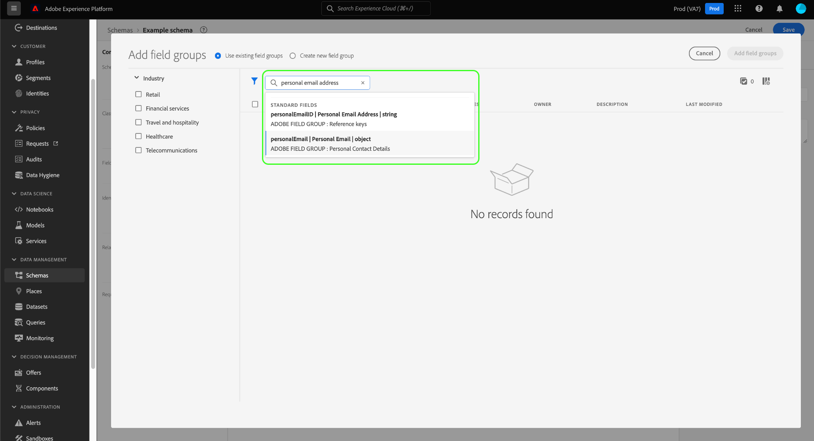

# Erstellen und Bearbeiten von Schemata in der Benutzeroberfläche

Dieses Handbuch bietet einen Überblick darüber, wie Sie Experience-Datenmodell (XDM)-Schemas für Ihr Unternehmen in der Adobe Experience Platform-Benutzeroberfläche erstellen, bearbeiten und verwalten.

>[!IMPORTANT]
>
>XDM-Schemata sind extrem anpassbar, sodass die Schritte zum Erstellen eines Schemas variieren können, je nachdem, welche Art von Daten das Schema erfassen soll. As a result, this document only covers the basic interactions you can make with schemas in the UI, and excludes related steps such as customizing classes, schema field groups, data types, and fields.
>
>Um einen umfassenden Überblick über den Erstellungsprozess von Schemas zu erhalten, folgen Sie dem [Tutorial zur Schemaerstellung](../../tutorials/create-schema-ui.md) , um ein vollständiges Beispielschema zu erstellen und sich mit den zahlreichen Funktionen von [!DNL Schema Editor] vertraut zu machen.

## Voraussetzungen

Dieses Handbuch setzt ein Verständnis des XDM-Systems voraus. Refer to the [XDM overview](../../home.md) for an introduction to the role of XDM within the Experience Platform ecosystem, and the [basics of schema composition](../../schema/composition.md) for an overview of how schemas are constructed.

## Erstellen eines neuen Schemas {#create}

Wählen Sie im Arbeitsbereich [!UICONTROL Schemas] in der oberen rechten Ecke **[!UICONTROL Schema erstellen]** aus. Im angezeigten Dropdown-Menü können Sie zwischen **[!UICONTROL XDM Individual Profile]** und **[!UICONTROL XDM ExperienceEvent]** als Basisklasse für das Schema wählen. Alternativ können Sie **[!UICONTROL Browse]** auswählen, um aus der vollständigen Liste der verfügbaren Klassen auszuwählen, oder [stattdessen eine neue benutzerdefinierte Klasse](./classes.md#create) erstellen.

Nachdem Sie eine Klasse ausgewählt haben, wird [!DNL Schema Editor] angezeigt und die (von der Klasse bereitgestellte) Basisstruktur des Schemas wird auf der Arbeitsfläche angezeigt. Von hier aus können Sie die rechte Leiste verwenden, um einen **[!UICONTROL Anzeigenamen]** und **[!UICONTROL Beschreibung]** für das Schema hinzuzufügen.

Sie können nun mit der Erstellung der Schemastruktur beginnen, indem Sie [Schemafeldgruppen](#add-field-groups) hinzufügen.

## Vorhandenes Schema bearbeiten {#edit}

>[!NOTE]
>
>Sobald ein Schema gespeichert und in der Datenerfassung verwendet wurde, können nur noch additive Änderungen daran vorgenommen werden. Weitere Informationen finden Sie unter [Regeln der Schemaentwicklung](../../schema/composition.md#evolution) .

Um ein vorhandenes Schema zu bearbeiten, wählen Sie die Registerkarte **[!UICONTROL Durchsuchen]** und dann den Namen des Schemas aus, das Sie bearbeiten möchten.

>[!TIP]
>
>Sie können die Such- und Filterfunktionen des Arbeitsbereichs verwenden, um das Schema leichter zu finden. Weitere Informationen finden Sie im Handbuch [Erkunden von XDM-Ressourcen](../explore.md) .

Nachdem Sie ein Schema ausgewählt haben, wird das [!DNL Schema Editor] mit der Struktur des Schemas auf der Arbeitsfläche angezeigt. Sie können nun [Feldergruppen](#add-field-groups) zum Schema hinzufügen, [Anzeigenamen von Feldern bearbeiten](#display-names) oder [vorhandene benutzerdefinierte Feldergruppen bearbeiten](./field-groups.md#edit), wenn das Schema irgendwelche verwendet.

## Hinzufügen von Feldergruppen zu einem Schema {#add-field-groups}

>[!NOTE]
>
>In diesem Abschnitt wird beschrieben, wie Sie einem Schema vorhandene Feldergruppen hinzufügen. Wenn Sie eine neue benutzerdefinierte Feldergruppe erstellen möchten, lesen Sie stattdessen das Handbuch zu [Erstellen und Bearbeiten von Feldergruppen](./field-groups.md#create) .

Nachdem Sie ein Schema im Ordner [!DNL Schema Editor] geöffnet haben, können Sie dem Schema mithilfe von Feldergruppen Felder hinzufügen. Wählen Sie zunächst **[!UICONTROL Hinzufügen]** neben **[!UICONTROL Feldergruppen]** in der linken Leiste.

Es wird ein Dialogfeld mit einer Liste von Feldergruppen angezeigt, die Sie für das Schema auswählen können. Da Feldergruppen nur mit einer Klasse kompatibel sind, werden nur die Feldergruppen aufgelistet, die mit der ausgewählten Klasse des Schemas verknüpft sind. By default, listed field groups are sorted based on their usage popularity within your organization.

Wenn Sie die allgemeine Aktivität oder den Geschäftsbereich der Felder kennen, die Sie hinzufügen möchten, wählen Sie in der linken Leiste eine oder mehrere der vertikalen Industriekategorien aus, um die angezeigte Liste der Feldergruppen zu filtern.

>[!NOTE]
>
>Weitere Informationen zu Best Practices für branchenspezifische Datenmodellierung in XDM finden Sie in der Dokumentation zu [Industriedatenmodellen](../../schema/industries/overview.md).

You can also use the search bar to help locate your desired field group. Feldergruppen, deren Name mit der Abfrage übereinstimmt, werden oben in der Liste angezeigt. Unter **[!UICONTROL Standardfelder]** werden Feldergruppen angezeigt, die Felder enthalten, die die gewünschten Datenattribute beschreiben.

Aktivieren Sie das Kontrollkästchen neben dem Namen der Feldergruppe, die Sie zum Schema hinzufügen möchten. Sie können mehrere Feldergruppen aus der Liste auswählen, wobei jede ausgewählte Feldergruppe in der rechten Leiste angezeigt wird.

>[!TIP]
>
>Für jede aufgelistete Feldergruppe können Sie den Mauszeiger über das Informationssymbol () bewegen oder sich auf dieses konzentrieren, um eine kurze Beschreibung der Art der Daten anzuzeigen, die von der Feldergruppe erfasst werden. Sie können auch das Vorschausymbol () auswählen, um die Struktur der von der Feldergruppe bereitgestellten Felder anzuzeigen, bevor Sie sie zum Schema hinzufügen.

Nachdem Sie Ihre Feldergruppen ausgewählt haben, wählen Sie **[!UICONTROL Feldergruppen hinzufügen]** aus, um sie dem Schema hinzuzufügen.

Das [!DNL Schema Editor] wird mit den von der Feldergruppe bereitgestellten Feldern wieder angezeigt, die auf der Arbeitsfläche dargestellt werden.

## Aktivieren eines Schemas für das Echtzeit-Kundenprofil {#profile}

[Echtzeit-Kundenprofil ](../../../profile/home.md) führt Daten aus unterschiedlichen Quellen zusammen, um eine vollständige Ansicht jedes einzelnen Kunden zu erstellen. Wenn die von einem Schema erfassten Daten an diesem Prozess teilnehmen sollen, müssen Sie das Schema zur Verwendung in [!DNL Profile] aktivieren.

>[!IMPORTANT]
>
>Um ein Schema für [!DNL Profile] zu aktivieren, muss ein primäres Identitätsfeld definiert sein. Weitere Informationen finden Sie im Handbuch zum Definieren von Identitätsfeldern](../fields/identity.md) .[

Um das Schema zu aktivieren, wählen Sie zunächst den Namen des Schemas in der linken Leiste aus und klicken Sie dann in der rechten Leiste auf den Umschalter **[!UICONTROL Profil]** .

Es wird ein Popup angezeigt, in dem Sie darauf hingewiesen werden, dass ein Schema nach seiner Aktivierung und Speicherung nicht mehr deaktiviert werden kann. Wählen Sie **[!UICONTROL Aktivieren]** aus, um fortzufahren.

Die Arbeitsfläche wird wieder angezeigt, wenn der Umschalter [!UICONTROL Profil] aktiviert ist.

>[!IMPORTANT]
>
>Da das Schema noch nicht gespeichert wurde, ist dies der Punkt, an dem es nicht zurückgegeben wird, wenn Sie Ihre Meinung ändern, das Schema im Echtzeit-Kundenprofil teilnehmen zu lassen: Wenn Sie ein aktiviertes Schema speichern, kann es nicht mehr deaktiviert werden. Wählen Sie erneut den Umschalter **[!UICONTROL Profil]** aus, um das Schema zu deaktivieren.

Um den Prozess abzuschließen, wählen Sie **[!UICONTROL Speichern]** aus, um das Schema zu speichern.

Das Schema ist jetzt für die Verwendung im Echtzeit-Kundenprofil aktiviert. Wenn Platform Daten in Datensätze erfasst, die auf diesem Schema basieren, werden diese Daten in Ihre aggregierten Profildaten integriert.

## Anzeigenamen für Schemafelder bearbeiten {#display-names}

Nachdem Sie einem Schema eine Klasse zugewiesen und Feldergruppen hinzugefügt haben, können Sie die Anzeigenamen der Felder des Schemas bearbeiten, unabhängig davon, ob diese Felder von standardmäßigen oder benutzerdefinierten XDM-Ressourcen bereitgestellt wurden.

>[!NOTE]
>
>Beachten Sie, dass die Anzeigenamen von Feldern, die zu Standardklassen oder Feldgruppen gehören, nur im Kontext eines bestimmten Schemas bearbeitet werden können. Das heißt, dass eine Änderung des Anzeigenamens eines Standardfelds in einem Schema keine Auswirkungen auf andere Schemas hat, die dieselbe zugehörige Klasse oder Feldergruppe verwenden.
>
>Sobald Sie die Anzeigenamen für die Felder eines Schemas ändern, werden diese Änderungen sofort in allen vorhandenen Datensätzen übernommen, die auf diesem Schema basieren.

Um den Anzeigenamen eines Schemafelds zu bearbeiten, wählen Sie das Feld auf der Arbeitsfläche aus. Geben Sie in der rechten Leiste unter **[!UICONTROL Anzeigename]** den neuen Namen ein.

Wählen Sie **[!UICONTROL Anwenden]** in der rechten Leiste und die Arbeitsfläche wird aktualisiert, um den neuen Anzeigenamen des Felds anzuzeigen. Wählen Sie **[!UICONTROL Save]** aus, um die Änderungen auf das Schema anzuwenden.

## Klasse eines Schemas ändern {#change-class}

Sie können die Klasse eines Schemas jederzeit während des anfänglichen Kompositionsprozesses ändern, bevor das Schema gespeichert wurde.

>[!WARNING]
>
>Die Neuzuweisung der Klasse für ein Schema sollte mit äußerster Vorsicht erfolgen. Feldergruppen sind nur mit bestimmten Klassen kompatibel. Daher werden die Arbeitsfläche und alle von Ihnen hinzugefügten Felder durch Ändern der Klasse zurückgesetzt.

Um eine Klasse neu zuzuweisen, wählen Sie **[!UICONTROL Zuweisen]** auf der linken Seite der Arbeitsfläche aus.

Es wird ein Dialogfeld angezeigt, in dem eine Liste aller verfügbaren Klassen angezeigt wird, einschließlich aller von Ihrem Unternehmen definierten Klassen (der Inhaber ist &quot;[!UICONTROL Customer]&quot;) sowie der von Adobe definierten Standardklassen.

Wählen Sie eine Klasse aus der Liste aus, um ihre Beschreibung auf der rechten Seite des Dialogfelds anzuzeigen. Sie können auch **[!UICONTROL Vorschauklassenstruktur]** auswählen, um die mit der Klasse verknüpften Felder und Metadaten anzuzeigen. Wählen Sie **[!UICONTROL Klasse zuweisen]** aus, um fortzufahren.

Es wird ein neues Dialogfeld geöffnet, in dem Sie aufgefordert werden zu bestätigen, dass Sie eine neue Klasse zuweisen möchten. Wählen Sie zur Bestätigung **[!UICONTROL Zuweisen]** aus.

After confirming the class change, the canvas will be reset and all composition progress will be lost.

## Nächste Schritte

This document covered the basics of creating and editing schemas in the Platform UI. It is strongly recommended that you review the [schema creation tutorial](../../tutorials/create-schema-ui.md) for a comprehensive workflow for building a complete schema in the UI, including creating custom field groups and data types for unique use cases.

For more information on the capabilities of the [!UICONTROL Schemas] workspace, see the [[!UICONTROL Schemas] workspace overview](../overview.md).

Informationen zum Verwalten von Schemas in der [!DNL Schema Registry]-API finden Sie im [Handbuch zu Schemas-Endpunkten](../../api/schemas.md).
